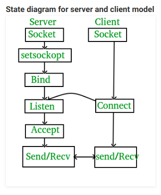

# Thread dan IPC

## Objectives
1. To develop knowledge about thread
2. To understand how thread works
3. To understand how to make thread

- [Thread dan IPC](#thread-dan-ipc)
  - [Objectives](#objectives)
  - [1. Thread](#1-thread)
    - [1.1 Thread](#11-thread)
    - [1.2 Multiprocess Vs Multithread](#12-multiprocess-vs-multithread)
    - [1.3 Join Thread](#13-join-thread)
    - [1.4 Mutual Exclusion](#14-mutual-exclusion)
  - [2. IPC (Interprocess Communication)](#2-ipc-interprocess-communication)
    - [2.1 IPC](#21-ipc)
    - [2.2 Pipes](#22-pipes)
    - [2.3 Sockets](#23-sockets)
    - [2.4 Message Queues](#24-message-queues)
    - [2.5 Semaphores](#25-semaphores)
    - [2.6 Shared Memory](#26-shared-memory)
  - [3. Asynchronous Programming](#3-asynchronous-programming)
    - [3.1 select](#31-select)
    - [3.2 poll](#32-poll)
    - [3.3 epoll](#33-epoll)
  - [Appendix](#appendix)
    - [Libraries documentation (and functions)](#libraries-documentation-and-functions)
  - [Exercise](#exercise)
    - [References](#references)


## 1. Thread 
### 1.1 Thread
Thread is smallest unit in a process that are scheduled by the operating system. Thread are usually made by `fork` that runs in a script or program. There is at least 1 thread running for each process, but you can also have multiple thread run for one process. Thread will share their memory and use information (value) of variables in that process. You can picture thread as follows.


To see running thread, we can use the command :
```bash
top -H
```

Thread can be made by calling a function in C Language :
```c
#include <pthread.h> //library thread

int pthread_create(pthread_t *restrict tidp,
                   const pthread_attr_t *restrict attr,
                   void *(*start_rtn)(void *),
                   void *restrict arg);

/* If thread creation succeeds it will return 0, otherwise it will return 1 */
```
Syntax:
- Pointer `tidp` points to memory address with thread id of the new thread.
- Argumen `attr` is used to pass attributes of the thread. the value `attr` is set to `NULL` when the thread uses the *default* attribute .
- The new thread will start on the `start_rtn` function.
- Pointer `arg` is used to pass any argument to the `start_rtn` function, if no argument is needed, then `arg` is set to `NULL`.

Example of a program not using thread [playtanpathread.c](playtanpathread.c):

```c
#include<stdio.h>
#include<unistd.h>
#include<stdlib.h>
#include<sys/types.h>
#include<sys/wait.h>

int main()
{
	pid_t child;
	int i, stat;
	char *argv1[] = {"clear", NULL};
	char *argv2[] = {"xlogo", NULL};
	child = fork();
	if (child==0) {
		execv("/usr/bin/clear", argv1);
	}
	else
	{
		for(i=0;i<6;i++)
		{
			printf("%d\n",i);
			fflush(stdout);
			sleep(1);
		}
		execv("/usr/bin/xlogo", argv2);
	}
	
}

```

Example f a program using thread [playthread.c](playthread.c) :
> use this command to compile : `gcc -pthread -o [output] input.c`

```c
#include<stdio.h>
#include<string.h>
#include<pthread.h>
#include<stdlib.h>
#include<unistd.h>
#include<sys/types.h>
#include<sys/wait.h>

pthread_t tid[3]; //array initialization to save the threads, there are 2 in this case
pid_t child;

int length=5; //Loop length initialization
void* playandcount(void *arg)
{
	char *argv1[] = {"clear", NULL};
	char *argv2[] = {"xlogo", NULL};
	unsigned long i=0;
	pthread_t id=pthread_self();
	int iter;
	if(pthread_equal(id,tid[0])) //Thread to clear the screen
	{
		child = fork();
		if (child==0) {
		    execv("/usr/bin/clear", argv1);
	    	}
	}
	else if(pthread_equal(id,tid[1])) // Thread to show a counter
	{
        for(iter=0;iter<6;iter++)
		{
			printf("%d\n",iter);
			fflush(stdout);
			sleep(1);
		}
	}
	else if(pthread_equal(id,tid[2])) // Thread to show an image
	{
        child = fork();
        if (child==0) {
		    execv("/usr/bin/xlogo", argv2);
	    }
	}

	return NULL;
}

int main(void)
{
	int i=0;
	int err;
	while(i<3) // loop all threads
	{
		err=pthread_create(&(tid[i]),NULL,&playandcount,NULL); //making a thread
		if(err!=0) //error check
		{
			printf("\n can't create thread : [%s]",strerror(err));
		}
		else
		{
			printf("\n create thread success\n");
		}
		i++;
	}
	pthread_join(tid[0],NULL);
	pthread_join(tid[1],NULL);
	exit(0);
	return 0;
}


```

**Conclusion** :
It is shown that the use of thread allows two task to run simultaneously (image task and counter task).


### 1.2 Multiprocess Vs Multithread


The differences between multiprocess and multithread
No | Multiprocess | Multithread
--- | --- | ---
1 | multiple process executed concurently | multiple thread in 1 process executed concurently
2 | using more CPU to improve computation power | making multiple thread in a process to improve computation power
3 | the creation process used a lot of time and resources | the thread creation used less time and resources
4 | dependency on other object in the memory to send data to other process| no dependency to other object
5 | most child process is interruptible / killable | multithreading is not interruptible / killable


### 1.3 Join Thread
Join thread is a function to join other threads that have stopped (*terminated*). If the thread that you want to join has not been stopped, this function will wait until the desired thread has a status of **`Terminated`**. The `pthread_join ()` function can be said to be the `wait ()` function of the process, because the main program (*task*) will wait for the thread to be joined in the main program. We do not know wether the main program or thread that completed the work first.

Example C program Join_Thread [thread_join.c](thread_join.c):

```c
#include <stdio.h>
#include <stdlib.h>
#include <pthread.h> //library thread

void *print_message_function( void *ptr );

int main()
{
    pthread_t thread1, thread2;//initial initialization

    const char *message1 = "Thread 1";
    const char *message2 = "Thread 2";
    int  iret1, iret2;

    iret1 = pthread_create( &thread1, NULL, print_message_function, (void*) message1); //making the first thread
    if(iret1) //if error
    {
        fprintf(stderr,"Error - pthread_create() return code: %d\n",iret1);
        exit(EXIT_FAILURE);
    }


    iret2 = pthread_create( &thread2, NULL, print_message_function, (void*) message2);//making the second thread
    if(iret2)//if it fails
    {
        fprintf(stderr,"Error - pthread_create() return code: %d\n",iret2);
        exit(EXIT_FAILURE);
    }

    printf("pthread_create() for thread 1 returns: %d\n",iret1);
    printf("pthread_create() for thread 2 returns: %d\n",iret2);

    // pthread_join( thread1, NULL);
    // pthread_join( thread2, NULL); 

    exit(EXIT_SUCCESS);
}

void *print_message_function( void *ptr )
{
    char *message;
    message = (char *) ptr;
    printf("%s \n", message);

    for(int i=0;i<10;i++){
        printf("%s %d \n", message, i);
    }
}

```

Explanation :
- In the above program, if we *comment* the line `pthread_join`, the result will not show the words **Thread 1** and **Thread 2**.
- If the `pthread_join` function call is uncommented, then the program we create will display the words **Thread 1** and **Thread 2**.

**Conclusion** :
The first program does not run the `print_message_function` function because before the second thread is scheduled, the main program (possibly) has finished executing so it doesn't run the default function on the thread. In the second experiment, the `pthread_join ()` function is used to make the main program wait for the thread to *join* until the target thread has finished executing, with this function the main program is suspended until the target thread has finished executing.
- Function for thread termination

  ```c
  #include <pthread.h>
  void pthread_exit(void *rval_ptr);
  ```
  The `rval_ptr` argument is a pointer that can be accessed by the `pthread_join ()` function in order to know the status of the thread

- Function to join thread
  ```c
  int pthread_join(pthread_t thread, void **rval_ptr);
  /* If successful returns value 0, if error returns value 1 */
  ```
 The function will pause the job until the `rval_ptr` pointer state of the` pthread_exit () `function returns its value.

### 1.4 Mutual Exclusion
Also known as ** Mutex **, which is a way to ensure that if a job that uses variables or files is also used by another job, the other job will output the value of the previous job.

Example of Simple Mutual_Exclusion program [threadmutex.c](threadmutex.c):

```c
#include<stdio.h>
#include<string.h>
#include<pthread.h>
#include<stdlib.h>
#include<unistd.h>
 
pthread_t tid1, tid2;
int status;

int number;
 
void* write(void *arg)
{
    status = 0;
 
    printf("Input number : ");
    scanf("%d", &number);
 
    status = 1;
 
    return NULL;
}

void* read(void *arg)
{
    while(status != 1)
    {

    }

    printf("Number %d\n", number);

}
 
int main(void)
{
    pthread_create(&(tid1), NULL, write, NULL);
    pthread_create(&(tid2), NULL, read, NULL);
 
    pthread_join(tid1, NULL);
    pthread_join(tid2, NULL);
 
    return 0;
}

```


Explanation :
- There are 2 threads running with different functions.
- The resources (variables) that both threads use to execute their jobs **are the same**.
- The `status` variable is a simple example of controlling the running of a thread.

**Conclusion** :
Since we don't know which *thread* executes a variable or resource in the program first, the purpose of **Mutex** is to keep the resources of a thread from being used by other threads before it finishes its work.

## 2. IPC (Interprocess Communication)
### 2.1 IPC
IPC (*Interprocess Communication*) is a method to exchange data between one process and another, either on the same computer or remote computers connected through a network.

### 2.2 Pipes
Pipes are a sequential method of communication between interrelated processes. The weakness of pipes is that they are only for interconnected, sequential processes.
There are two types of pipes:
- unnamed pipe: Communication between parent and child processes.
- named pipes: Commonly referred to as FIFO, used for communication that runs independently. **Can only be used if both processes are using the same *filesystem***

```
$ ls | less
```
Diagram :

  

Syntax in C languange :
```
int pipe(int fds[2]);

Parameters :
fd[0] will be the fd(file descriptor) for the 
read end of pipe.
fd[1] will be the fd for the write end of pipe.
Returns : 0 on Success.
-1 on error.
```
Example :  
[pipe1.c](pipe1.c)

```c
// C program to illustrate 
// pipe system call in C 
#include <stdio.h> 
#include <unistd.h> 
#include <stdlib.h>

#define MSGSIZE 16 
char* msg1 = "hello, world #1"; 
char* msg2 = "hello, world #2"; 
char* msg3 = "hello, world #3"; 

int main() 
{ 
	char inbuf[MSGSIZE]; 
	int p[2], i; 

	if (pipe(p) < 0) 
		exit(1); 

	/* continued */
	/* write pipe */

	write(p[1], msg1, MSGSIZE); 
	write(p[1], msg2, MSGSIZE); 
	write(p[1], msg3, MSGSIZE); 

	for (i = 0; i < 3; i++) { 
		/* read pipe */
		read(p[0], inbuf, MSGSIZE); 
		printf("%s\n", inbuf); 
	} 
	return 0; 
} 

```  
Output :  
```
hello, world #1
hello, world #2
hello, world #3
```  

Pipe with fork  

Diagram :  
  

Example :  
[pipe-fork](pipe-fork.c)  
```c
// C program to demonstrate use of fork() and pipe() 
#include<stdio.h> 
#include<stdlib.h> 
#include<unistd.h> 
#include<sys/types.h> 
#include<string.h> 
#include<sys/wait.h> 

int main() 
{ 
	// We use two pipes 
	// First pipe to send input string from parent 
	// Second pipe to send concatenated string from child 

	int fd1[2]; // Used to store two ends of first pipe 
	int fd2[2]; // Used to store two ends of second pipe 

	char fixed_str[] = "forgeeks.org"; 
	char input_str[100]; 
	pid_t p; 

	if (pipe(fd1)==-1) 
	{ 
		fprintf(stderr, "Pipe Failed" ); 
		return 1; 
	} 
	if (pipe(fd2)==-1) 
	{ 
		fprintf(stderr, "Pipe Failed" ); 
		return 1; 
	} 

	scanf("%s", input_str); 
	p = fork(); 

	if (p < 0) 
	{ 
		fprintf(stderr, "fork Failed" ); 
		return 1; 
	} 

	// Parent process 
	else if (p > 0) 
	{ 
		char concat_str[100]; 

		close(fd1[0]); // Close reading end of first pipe 

		// Write input string and close writing end of first 
		// pipe. 
		write(fd1[1], input_str, strlen(input_str)+1); 
		close(fd1[1]); 

		// Wait for child to send a string 
		wait(NULL); 

		close(fd2[1]); // Close writing end of second pipe 

		// Read string from child, print it and close 
		// reading end. 
		read(fd2[0], concat_str, 100); 
		printf("Concatenated string %s\n", concat_str); 
		close(fd2[0]); 
	} 

	// child process 
	else
	{ 
		close(fd1[1]); // Close writing end of first pipe 

		// Read a string using first pipe 
		char concat_str[100]; 
		read(fd1[0], concat_str, 100); 

		// Concatenate a fixed string with it 
		int k = strlen(concat_str); 
		int i; 
		for (i=0; i<strlen(fixed_str); i++) 
			concat_str[k++] = fixed_str[i]; 

		concat_str[k] = '\0'; // string ends with '\0' 

		// Close both reading ends 
		close(fd1[0]); 
		close(fd2[0]); 

		// Write concatenated string and close writing end 
		write(fd2[1], concat_str, strlen(concat_str)+1); 
		close(fd2[1]); 

		exit(0); 
	} 
} 

```


### 2.3 Sockets
*Socket* is an *end-point* in a process that communicates with each other. Usually *socket* is used for communication betwwen processes on different computers, but can also be used in the same computer 

Diagram :   


Example : [socket-server.c](socket-server.c) [socket-client.c](socket-client.c)

Server
```c
#include <stdio.h>
#include <sys/socket.h>
#include <stdlib.h>
#include <netinet/in.h>
#include <string.h>
#include <unistd.h>
#define PORT 8080

int main(int argc, char const *argv[]) {
    int server_fd, new_socket, valread;
    struct sockaddr_in address;
    int opt = 1;
    int addrlen = sizeof(address);
    char buffer[1024] = {0};
    char *hello = "Hello from server";
      
    if ((server_fd = socket(AF_INET, SOCK_STREAM, 0)) == 0) {
        perror("socket failed");
        exit(EXIT_FAILURE);
    }
      
    if (setsockopt(server_fd, SOL_SOCKET, SO_REUSEADDR | SO_REUSEPORT, &opt, sizeof(opt))) {
        perror("setsockopt");
        exit(EXIT_FAILURE);
    }

    address.sin_family = AF_INET;
    address.sin_addr.s_addr = INADDR_ANY;
    address.sin_port = htons( PORT );
      
    if (bind(server_fd, (struct sockaddr *)&address, sizeof(address))<0) {
        perror("bind failed");
        exit(EXIT_FAILURE);
    }

    if (listen(server_fd, 3) < 0) {
        perror("listen");
        exit(EXIT_FAILURE);
    }

    if ((new_socket = accept(server_fd, (struct sockaddr *)&address, (socklen_t*)&addrlen))<0) {
        perror("accept");
        exit(EXIT_FAILURE);
    }

    valread = read( new_socket , buffer, 1024);
    printf("%s\n",buffer );
    send(new_socket , hello , strlen(hello) , 0 );
    printf("Hello message sent\n");
    return 0;
}
```
Client
```c
#include <stdio.h>
#include <sys/socket.h>
#include <stdlib.h>
#include <netinet/in.h>
#include <string.h>
#include <unistd.h>
#include <arpa/inet.h>
#define PORT 8080
  
int main(int argc, char const *argv[]) {
    struct sockaddr_in address;
    int sock = 0, valread;
    struct sockaddr_in serv_addr;
    char *hello = "Hello from client";
    char buffer[1024] = {0};
    if ((sock = socket(AF_INET, SOCK_STREAM, 0)) < 0) {
        printf("\n Socket creation error \n");
        return -1;
    }
  
    memset(&serv_addr, '0', sizeof(serv_addr));
  
    serv_addr.sin_family = AF_INET;
    serv_addr.sin_port = htons(PORT);
      
    if(inet_pton(AF_INET, "127.0.0.1", &serv_addr.sin_addr)<=0) {
        printf("\nInvalid address/ Address not supported \n");
        return -1;
    }
  
    if (connect(sock, (struct sockaddr *)&serv_addr, sizeof(serv_addr)) < 0) {
        printf("\nConnection Failed \n");
        return -1;
    }

    send(sock , hello , strlen(hello) , 0 );
    printf("Hello message sent\n");
    valread = read( sock , buffer, 1024);
    printf("%s\n",buffer );
    return 0;
}
```

Run the server process then run the client. Observe.

### 2.4 Message Queues
Is a communication between processes where the process creates an internal linked-list at the address of the Operating System kernel. The message is referred to as *queue* while the identifier is called *queue* ID. *Queue* ID is used as a *key* to indicate which message will be sent and the destination of the message.

### 2.5 Semaphores
Semaphores are different from other types of IPC. In its application, semaphore is a counter that is used for controlling resources by several processes simultaneously.
- If a memory block counter has a positive value, the semaphore can consume resources for the process, and reduce the counter block value by 1 to indicate that a memory block is being used.
- Conversely, if the semaphore is 0, the process will go into sleep mode until the semaphore is greater than 0.

### 2.6 Shared Memory
A mechanism for mapping the area (segments) of a block of memory to be shared by several processes. A process will create a memory segment, then other permitted processes can access that memory. Shared memory is an effective way to exchange data between programs.

Example: [Proses 1](proses1.c) [Proses 2](proses2.c)

Process 1
```c
#include <stdio.h>
#include <sys/ipc.h>
#include <sys/shm.h>
#include <unistd.h>

void main()
{
        key_t key = 1234;
        int *value;

        int shmid = shmget(key, sizeof(int), IPC_CREAT | 0666);
        value = shmat(shmid, NULL, 0);

        *value = 10;

        printf("Program 1 : %d\n", *value);

        sleep(5);

        printf("Program 1: %d\n", *value);
        shmdt(value);
        shmctl(shmid, IPC_RMID, NULL);
}
```
Process 2
```c
#include <stdio.h>
#include <sys/ipc.h>
#include <sys/shm.h>
#include <unistd.h>

void main()
{
        key_t key = 1234;
        int *value;

        int shmid = shmget(key, sizeof(int), IPC_CREAT | 0666);
        value = shmat(shmid, NULL, 0);

        printf("Program 1 : %d\n", *value);
        *value = 30;

        sleep(5);

        printf("Program 1: %d\n", *value);
        shmdt(value);
        shmctl(shmid, IPC_RMID, NULL);
}
```
Run process 1 first, then process 2.
The result
Process 1
```
Program 1 : 10
Program 1 : 30
```
Process 2
```
Program 1 : 10
Program 1 : 30
```

## 3. Asynchronous Programming
We already know how to use thread and process commands separately and simultaneously. Next, we will learn how a process receives a command without being blocked by another process. This is where we will learn about Asynchronous Programming where we don't have to wait for something too long and we let other tasks be done by other processor cores. Here are some commands that can be used to implement Asynchronous Programming in C.

### 3.1 select
Select gives us the ability to monitor a large number of sockets, and each socket is not blocked by any other sockets. Maybe we can use threads, but if the number of sockets is very large like 1024, having 1024 threads is not the right solution and using select will make the job easier.

`select()` function
```c
int select(int nfds, fd_set *readfds, fd_set *writefds, fd_set *exceptfds, struct timeval *timeout);

struct timeval {
    long int tv_sec;    /* Value in seconds */
    long int tv_usec;   /* Value in milli-seconds */
};
```

Explanation of the parameters used :
- nfds  :   The highest number of file descriptors + 1, we can use `FD_SETSIZE` which contains the number 1024
- readfds : File descriptor for reading
- writefds : File descriptor for writing
- exceptfds :   File descriptor for exception
- timeout   :   Time until timeout

Examples of use can be seen at [server File](select-server.c) and [client file](select-client.c) in the module. Do as in [Section 2.3 Sockets](#23-sockets) for testing.

### 3.2 poll
`poll ()` does the same thing as `select ()` which waits for one of the file descriptors to be ready to perform the operation. But `poll ()` was created to solve the pending problems that `select ()` has

`poll()` function
```c
#include <poll.h> 

int poll(struct pollfd *fds, int nfds, int timeout);

struct pollfd {
    int   fd;         /* file descriptor */
    short events;     /* requested events */
    short revents;    /* returned events */
};
```

Explanation of the parameters used :
- fds   :   Array dari file descriptor
- nfds  :   Jumlah file descriptor
- timeout   :    Timeout untuk program
- events & revents : Bisa membaca sumber yang ada di referensi karena cukup banyak dan beragam
- fds: An array of file descriptors
- nfds: Number of file descriptors
- timeout: Time until timeout
- events & revents: For a more complete explanation, you can read the reference source because it is quite diverse

Examples of usage can be seen in the [server file](poll-server.c) and [client file](poll-client.c) in the module. Do as in [Section 2.3 Sockets](#23-sockets) for testing.

### 3.3 epoll
`epoll` is a variant of` poll() `which scales well for a large number of file descriptors. Three system calls are provided to set up and control epoll set: `epoll_create()`, `epoll_ctl()`, `epoll_wait()`.

Functions for `epoll`
```c
int epoll_create(int size); // creates an epoll() instance

int epoll_ctl(int epfd, int op, int fd, struct epoll_event *event); // performs control operations on the epoll() instance referred to by the file descriptor epfd.

int epoll_wait(int epfd, struct epoll_event *events,int maxevents, int timeout); // waits for events on the epoll() instance referred to by the file descriptor epfd

typedef union epoll_data {
    void        *ptr;
    int          fd;
    uint32_t     u32;
    uint64_t     u64;
} epoll_data_t;

struct epoll_event {
    uint32_t     events;      /* Epoll events */
    epoll_data_t data;        /* User data variable */
};
```

Examples of usage can be seen in the [server file](epoll-server.c) and [client file](epoll-client.c) in the module. Do as in [Section 2.3 Sockets](#23-sockets) for testing.

## Appendix
### Libraries documentation (and functions)
```
$ man {anything-you-want-to-know}
$ man mkfifo
$ man fcntl
```

## Exercise
1. Create a C program that can calculate factorials in parallel and then display the results sequentially.
Contoh: 
```bash
## input
./faktorial 5 3 4
```
```bash
### output
3! = 6  
4! = 24  
5! = 120
```

2. Create a program to display files in the third order of a directory, using the pipe and the command ls, head, and tail.

3. Create a program using a socket which consists of the client and server. When the client types "add" then the number on the server increases by 1 and the server automatically sends a message to the client that says "The addition was successful" and when typing the command "subtract" then the number on the server decreases by 1 and the server automatically sends a message to client containing "Subtraction was successful". Another command on the client is "check", then the server will send a message containing the most recent number, other than that command the server will send a message "command does not match". This program can run without stopping. (The initial value of the number on the server is 5).

### References 
- https://notes.shichao.io/apue/  
- https://www.gta.ufrj.br/ensino/eel878/sockets/index.html  
- http://advancedlinuxprogramming.com/alp-folder/alp-ch05-ipc.pdf  
- https://www.geeksforgeeks.org/socket-programming-cc/  
- https://www.geeksforgeeks.org/pipe-system-call/  
- https://developer.mozilla.org/en-US/docs/Learn/JavaScript/Asynchronous/Concepts
- http://codingbison.com/c/c-sockets-select.html
- https://www.tutorialspoint.com/unix_system_calls/poll.htm
- https://pubs.opengroup.org/onlinepubs/009696799/functions/poll.html
- https://linux.die.net/man/4/epoll
- https://programmer.ink/think/epoll-for-linux-programming.html