# Module 1 - Introduction to Linux

## Learning Outcomes

1. Students are able to understand the basics command in Linux
2. Students are able to create simple shell script
3. Students are able to automate script using cron job

## Prerequisites

1. Install Linux OS (Ubuntu preferred)
2. Have basic understanding of Linux OS

## Module Content

- [i. Learning Outcomes](#learning-outcomes)
- [ii. Prerequisites](#prerequisites)
- [iii. Module Content](#module-content)
- [1. Introduction](#introduction)
  - [1.1 Command and Navigation](#command-and-navigation)
  - [1.2 User and Permission Concept](#user-and-permission-concept)
  - [1.3 Text Editor in CLI](#text-editor-in-cli)
- [2. Shell Scripting](#shell-scripting)
  - [2.1 What is Shell Scripting?](#what-is-shell-scripting)
  - [2.2 Shell Programming](#shell-programming)
  - [2.3 Basic Shell Command](#basic-shell-command)
  - [2.4 Simple Shell Script](#simple-shell-script)
  - [2.5 Variable](#variable)
  - [2.6 Input and Output](#input-and-output)
  - [2.7 Quoting](#quoting)
  - [2.8 Operators](#operators)
  - [2.9 Conditional Statement](#conditional-statement)
  - [2.10 Looping](#looping)
  - [2.11 Function](#function)
- [3. Cron Jobs](#cron-jobs)
  - [3.1 What are Cron Job?](#what-are-cron-job)
  - [3.2 Scheduling Task Using Cron](#scheduling-task-using-cron)
- [4. AWK](#awk)
  - [4.1 What is AWK?](#what-is-awk)
  - [4.2 Running AWK Program](#running-awk-program)
  - [4.3 BEGIN and END Rule](#begin-and-end-rule)

## Introduction

### Command and Navigation

In Linux operating system, there are several commonly used commands as follows.

#### **File and Directory Navigation**

| Command           | Purpose                              |
| ----------------- | ------------------------------------ |
| `cd`              | change directory                     |
| `ls`              | list directory contents              |
| `ll`              | list directory contents with details |
| `pwd`             | print working directory              |
| `find <filename>` | search for a file                    |
| `locate`          | locate a file                        |

#### **File and Directory Management**

| Command                     | Purpose                |
| --------------------------- | ---------------------- |
| `cp <source> <destination>` | copy file              |
| `mv <source> <destination>` | move file              |
| `rm <file>`                 | delete file            |
| `touch <file>`              | create file            |
| `mkdir <folder name>`       | create folder          |
| `cat`                       | view file contents     |
| `echo`                      | display text           |
| `sed`                       | perform text filtering |
| `awk`                       | text operations        |

#### **User and Permission Commands**

| Command          | Purpose                               |
| ---------------- | ------------------------------------- |
| `sudo <command>` | execute another command as super user |
| `su`             | switch user                           |
| `passwd`         | change password                       |
| `who`            | display logged in user                |
| `chmod`          | change file permissions               |
| `chown`          | change file ownership                 |
| `chgrp`          | change group ownership                |

#### **Other Commands**

| Command                      | Purpose                      |
| ---------------------------- | ---------------------------- |
| `history`                    | view command history         |
| `grep`                       | search for a word            |
| `sort`                       | sort data                    |
| `ps`                         | display running processes    |
| `kill`                       | terminate a program          |
| `tar`                        | archive files                |
| `zip`                        | compress files               |
| `unzip`                      | extract files                |
| `ssh`                        | remote access                |
| `fdisk`                      | display partitions           |
| `mount`                      | mount a file                 |
| `umount`                     | unmount a file               |
| `du`                         | display file size            |
| `df`                         | display disk space           |
| `quota`                      | display remaining disk space |
| `jobs <program id>`          | display process identities   |
| `ifconfig`                   | view IP address              |
| `date`                       | display date                 |
| `top`                        | view processes in order      |
| `clear`                      | clear the terminal           |
| `dpkg -i <package name>.deb` | package installation         |
| `uname`                      | view kernel version          |

### User and Permission Concept

In the Linux operating system, the user and permission concept is crucial for system security and allows users to access and manipulate various files and directories on the system.

#### **User**

In the Linux operating system, every action is performed by a specific user. Each user is assigned a unique username and user ID (UID). Users can have passwords, and they can be configured to have specific access rights to files and directories on the system.

When users log into the system, they need to enter their username and password to authenticate themselves. Once users successfully log in, they will enter a shell session or a graphical interface that corresponds to the access rights defined for their user account.

#### **Permission**

Every file and directory in the Linux system has its own set of permissions. These permissions determine who can read, write, and execute the file or directory.

When an action is performed on a file or directory, the operating system checks the permissions of the user and user group associated with the file or directory. If the user or user group does not have the appropriate permissions, the system will deny the action.

The following are the types of permissions that can be assigned to a file or directory.

- Read (r) - Allows the user to read the file or directory
- Write (w) - Allows the user to write or modify the file or directory
- Execute (x) - Allows the user to execute the file or enter the directory

The system administrator (or root) has full access rights to all files and directories on the system. This allows the administrator to manage users and user groups, as well as configure permissions for each file and directory on the system.

#### **User and Permission Related Commands**

- `ll` or `ls -l` to view file and directory permissions

  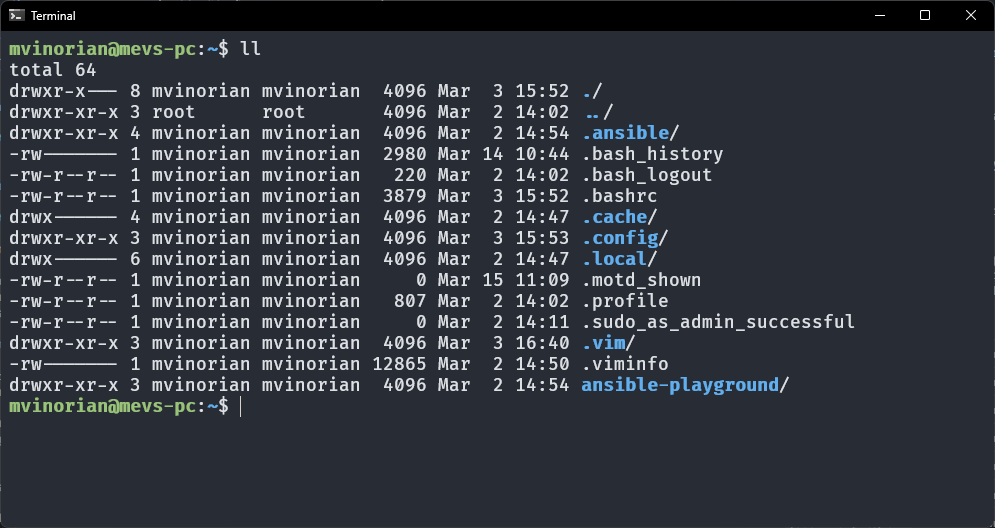

  Explanation for the `./` directory

  - `d`: indicates that this is a directory
  - `rwx`: the owner of the directory has read, write, and execute permissions
  - `r-x`: the group owner has read and execute permissions
  - `---`: other users do not have any access permissions

- `chmod` to change file and directory permissions

  Command `chmod` can be used as follows.

  ```sh
  chmod <mode> <file/directory>
  ```

  The `mode` parameter consists of 3 digits, each representing the permissions for the owner, group users, and other users. Each digit is a decimal representation of the desired permissions.

  An example of changing file permissions `file.txt` to `rw-r--r--` is as follows.

  | Scope       | Permissions | Binary Representation | Decimal Representation |
  | ----------- | :---------: | :-------------------: | :--------------------: |
  | User Owner  |    `rwx`    |          111          |           7            |
  | Group Owner |    `r-x`    |          101          |           5            |
  | Others      |    `r--`    |          100          |           4            |

  ```sh
  chmod 754 file.txt
  ```

- `chown` to change file and directory ownership

  Command `chown` can be used as follows.

  ```sh
  chown <user>:<group> <file/directory>
  ```

  The `user` parameter is the new owner of the file or directory, and the `group` parameter is the new group owner of the file or directory.

  An example of changing file ownership `file.txt` to `user1` and group ownership to `group1` is as follows.

  ```sh
  chown user1:group1 file.txt
  ```

  An example of changing file ownership `file.txt` to `user1` is as follows.

  ```sh
  chown user1 file.txt
  ```

- sudo to execute commands as super user

  Command `sudo` can be used as follows.

  ```sh
  sudo <command>
  ```

  An example of executing `apt-get update` as super user is as follows.

  ```sh
  sudo apt-get update
  ```

### Text Editor in CLI

In the Linux operating system, there are several text editors that can be used in the command line interface (CLI). The following are some of the commonly used text editors.

#### **Nano**

Nano is a simple text editor that is easy to use for beginners. It is a command line text editor that is included in most Linux distributions.

To open a file using nano, use the following command.

```sh
nano <file>
```

In the following example, the file `contoh.txt` is opened using nano.

```sh
nano contoh.txt
```

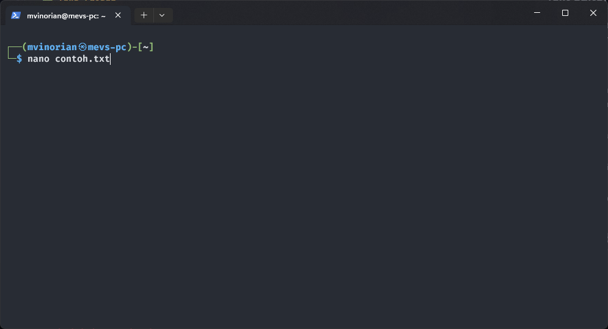


In the shortcut display interface, the `^` symbol is the same as the `Ctrl` key and the `M-` symbol is the same as the `Alt` key. An example of use is to see a list of shortcuts that can be used on nano using the shortcut `Ctrl + G`.


To exit the help display, you can use the `Q` button. After changing the contents of the file you want to change, the file can be saved using the shortcut `Ctrl + O`.


If you want to exit the text editor directly without saving the file, you can use the shortcut `Ctrl + X`. Press `N` if you don't want to save the changes or `Y` to save the changes.

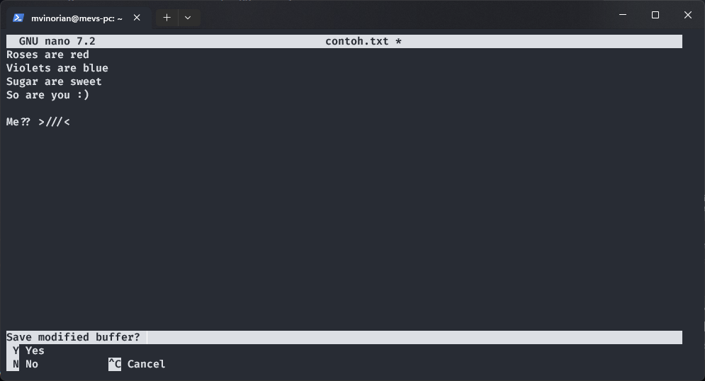

#### **Vim**

Vim is a text editor that has complete features for editing files. However, this text editor has a display and shortcuts that are quite complicated for beginners to understand.

To open a file using vim, use the following command.

```sh
vim <file>
```

In the following example, the file `contoh.txt` is opened using vim.

```sh
vim contoh.txt
```


At the start screen, vim will enter `normal` mode. To enter `insert` mode, you can do this by pressing the `i` button. In `insert` mode, characters or text can be written. To return to `normal` mode, you can do this by pressing the `Esc` button.


In `normal` mode, the cursor can be moved using the `h` keys to go left, `j` to go down, `k` to go up, and `l` to go right.

To undo, you can press `u` in `normal` mode or `Alt + U` in `insert` mode. Redoing can be done by pressing `Ctrl + R` in `normal` mode.

To save the edited file, you can type `:w` in `normal` mode. Or if you want to exit after saving the file, you can type `:wq` in `normal` mode. However, if you want to exit without saving changes, you can do this by typing `:q!` in `normal` mode.

Further exploration of the vim text editor can be done by accessing the vim tutorial from the terminal with the following command.

```sh
vimtutor
```


## Shell Scripting

### What is Shell Scripting?

The operating system is divided into three important components, namely Kernel, Shell, and Utility Program which can be shown as the following illustration.


- **Kernel** is the core of the computer. This component allows communication between software and hardware. If the Kernel is the innermost part of an operating system, then the Shell is the outermost part.

- **Shell** is a command translator program that bridges the user with the Kernel. Generally, the Shell provides a prompt as a user interface where the user inputs the desired commands, both internal and external commands. After receiving input from the user and executing a program or command based on that input, the Shell will produce output. The shell can be accessed via Terminal.

- **Program Utility** is system software that carries out maintenance tasks. This utility program was created specifically to perform certain functions in a specific computing area, such as formatting a hard disk, checking network connectivity, and others.

### Shell Programming

Shell scripting or shell programming is compiling several shell commands into a single file that performs a specific set of tasks. Shell programming on Linux is similar to other interpreter-based programming languages such as Python and Javascript.

### Basic Shell Command

The following are some basic shell commands that can be used in shell scripting.

#### **Redirection**

There are several types of redirection in the shell as follows.

- The contents of file b will be replaced with the output of command a with the operation `a > b`

  ```sh
  ls -l > dir.txt
  # ls -l output results will be sent to the dir.txt file
  # will create a dir.txt file if it doesn't already exist
  ```

- The output of command a is added to file b with the operation `a >> b`

  ```sh
  ls -la >> dir.txt
  # the output from ls -la will be added to the end of the dir.txt file
  ```

- The input of command a is file b with the operation `a < b`

  ```sh
  sort < dir.txt
  # input from sort is the dir.txt file
  ```

- The contents of file b will be replaced with the error from command a with the operation `a 2> b`

  ```sh
  rm testfile.txt 2> error.log
  # errors from the command will be sent to the error.log file
  # will create an error.log file if it doesn't already exist
  ```

- Error from command a added to file b with operation `a 2>> b`

  ```sh
  rm anotherfile.txt 2>> error.log
  # errors from the command will be added to the end of the error.log file
  ```

#### **Pipe**

The output of command a can be used as input for command b using the pipe operator `a | b`.

```sh
ls -l | sort | heads -5
# the output of ls -l will be used as input for sort
# the output of sort will be used as input for head -5
# output from head -5 will be shown in the terminal
```


#### **Wild card**

Commands in the shell can also use wildcards or arbitrary characters that can fill strings. The following are the types of wildcards that can be used in the shell.

- To replace all strings you can use `*`

  ```sh
  ls *.txt
  # will display a list of files with the .txt extension
  ```

- To replace just one letter, you can use `?`

  ```sh
  ls a?a.txt
  # will display a list of files with the initial file name a
  # then any letter and then the letter a
  ```

- To replace one letter with a certain letter, you can use `[]`

  ```sh
  ls a[dp]a.txt
  # will display a list of files with the initial file name a
  # then the letter d or p and then the letter a
  ```

  ```sh
  ls a[p-s].txt
  # will display a list of files with the initial file name a
  # then the letters between p and s, then the letter a
  ```

Following are the results of the command with the wildcard above.


### Simple Shell Script

To create a simple shell script, you can create a file with the extension `.sh`.

```sh
nano hello.sh
```

In the `hello.sh` script, you can write several shell commands. But before that, on the very first line you can write the shebang `#!/bin/bash`.

The shebang is useful for letting the system know that the `hello.sh` file must be executed by `/bin/bash` or a bash program. Because the file created has the extension `.sh`, so using the shebang doesn't really matter. If the file created does not have any extension, then you need to add a shebang to the very first line.

```sh
#!/bin/bash

echo "Hello, world!"
```

Save changes to the file and change the permissions of the file so that it can be executed.

```sh
chmod +x hello.sh
```

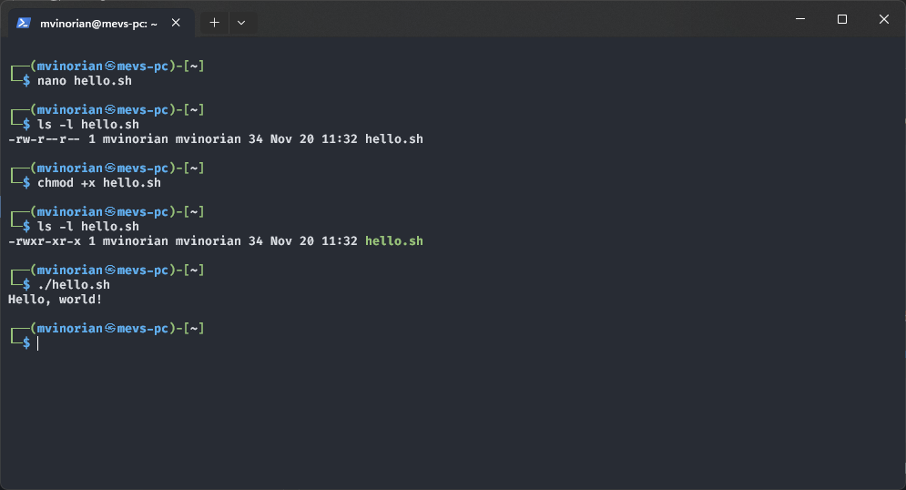

### Variable

Just like other programming languages, the shell also has variables. There are several things that need to be considered when defining variables.

- Variable names can only contain the following characters
  - Letters (a-z and A-Z)
  - Numbers (0-9)
  - Underscore character (-)
- Variable names start with a letter or underscore
- Case sensitive (uppercase and lowercase letters are different)

Declaring variables can be done with the `=` operator.

```sh
var_name=value
```

Please note that there should be no spaces between `var_name` and `=` nor `=` and `value`. Because in the shell, space characters are not ignored like in any other programming languages.

To access variables, you can use the `$` symbol before the variable name as follows.

```sh
$var_name
```

Variables in the shell are not strongly typed, meaning there is no need to specify the variable data type. Below are some variable declarations with their data types.

- Strings

  ```sh
  str1="this is a string"
  str2='this is also a string'
  ```

- Numbers

  ```sh
  num1=19
  num2=12.5
  ```

- Arrays

  ```sh
  arr1=('one' 'two' 'three')
  arr2=(1 2 3)
  arr3=('one' 2 'three')
  ```

  Array variable access can be done using the following syntax.

  ```sh
  ${arr1[0]} # access 0th index of arr1
  ${arr2[*]} # displays all elements of arr2
  ${#arr3[*]} # access the number of elements of arr3
  ```

The following is an example of using variables and also their output.

```sh
#!/bin/bash

str1="this is a string"
str2='this is also a string'

echo $str1
echo $str2

num1=19
num2=12.5

echo $num1
echo $num2

arr1=('one' 'two' 'three')
arr2=(1 2 3)
arr3=('one' 2 'three')

echo ${arr1[0]}
echo ${arr2[*]}
echo ${#arr3[*]}
```

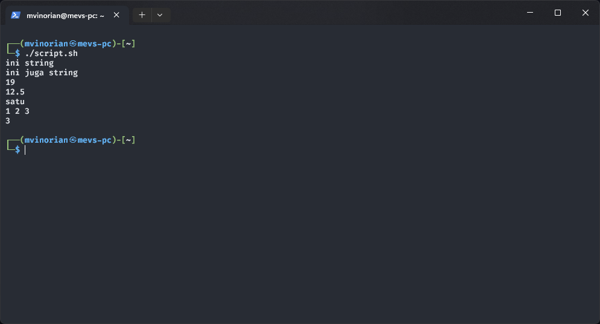

There are special variables in the shell. The following variables can be accessed without needing to be declared first.

| Variable | Description                                   |
| :------: | :-------------------------------------------- |
|    $0    | Contains the name of the file being executed  |
|    $n    | Contains the nth argument of the script call  |
|    $#    | The number of arguments of the script call    |
|   $\*    | Contains all the arguments of the script call |
|    $?    | Exit status of the last command executed      |
|    $$    | Process ID (PID) of the current shell         |

The following is an example of using these variables and their output.

```sh
#!/bin/bash

echo "Script name : $0"
echo "1st Argument : $1"
echo "2n Argument : $2"
echo "Hi $1, welcome to $2 class!"
echo "Number of arguments : $#"
echo "All arguments : $*"
echo "PID : $$"
```


### Input and Output

To perform input, you can use the `read` command with the following syntax.

```sh
read var_name
```

To perform output, you can use the `echo` command with the following syntax.

```sh
echo $var_name
```

The following is an example of using `read` and `echo` along with the output.

```sh
#!/bin/bash

class='linux'

echo 'What is your name?'
read name
echo -e "Hello $name!\nWelcome to $class class!\n"
```

In order for echo to render `\n` as a new line character, you need to add the argument `-e`.

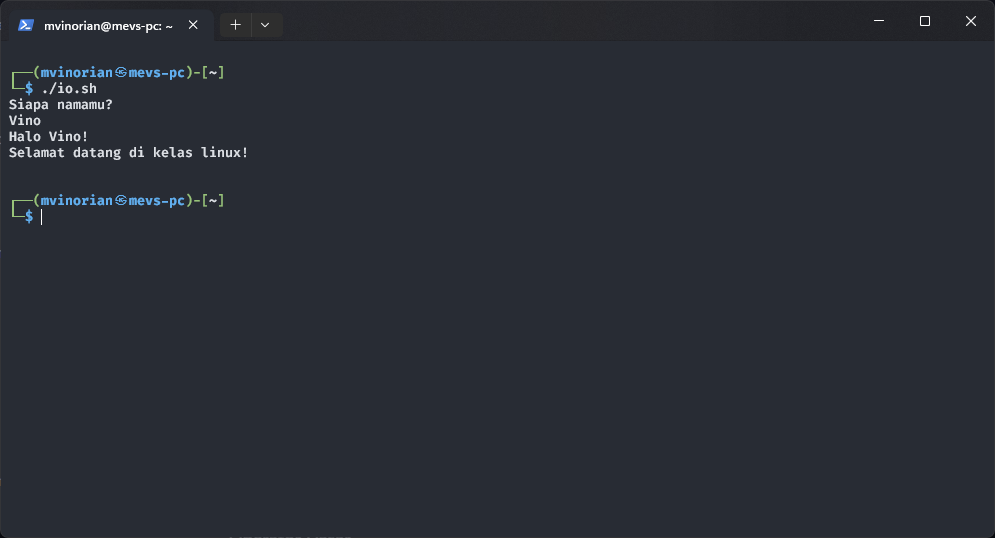

Apart from using `echo`, output in the shell can also use `printf` as in C language.

```sh
#!/bin/bash

str='This is a string'
num1=12,956
num2=512

printf "str: %s\n" "$str"
printf "num1: %.2f\n" $num1
printf "num2: %d\n" $num2
```

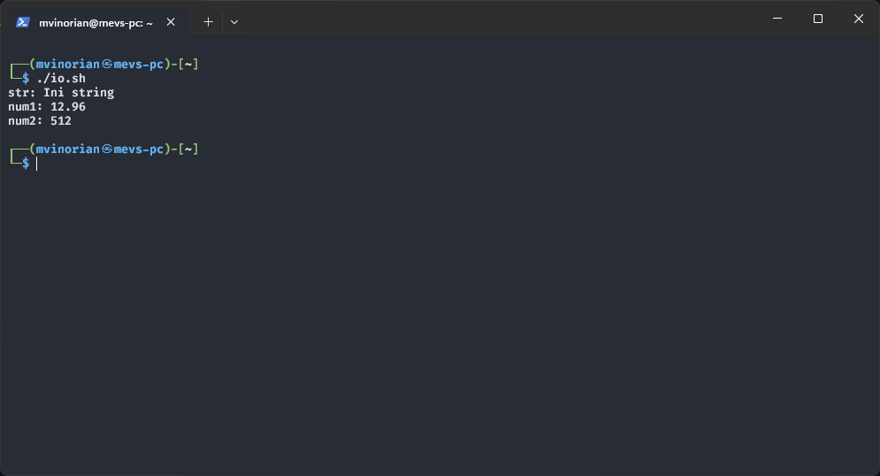

### Quoting

There are several quoting and escaping methods in the shell as follows.

| Quoting            | Description                                                                               |
| ------------------ | ----------------------------------------------------------------------------------------- |
| Single quote (`'`) | All characters inside a single quote will be treated as a string                          |
| Double quote (`"`) | The characters `$`, `` ` ``, and `\` in double quote can be used as they are in the shell |
| Backslash (`\`)    | Characters preceded by a backslash will be treated as the string                          |
| Backtick(`` ` ``)  | The command placed in the backtick will be executed                                       |

The following is an example of using quoting and also the output.

```sh
str='this is a string'

echo '$str = "$str"'
echo "\$str = $str"
echo "pwd = `pwd`"
```


### Operators

Some operators that can be used in the shell are as follows.

1. Arithmetic Operators
2. Relational Operators
3. Logical Operators
4. Bitwise Operators
5. Test File Operator

However, what will be discussed further are only **arimatic** and **relational** operators.

#### **Arithmetic Operators**

| Operator | Description           |
| -------- | --------------------- |
| +        | Addition              |
| -        | Subtraction           |
| \*       | Multiplication        |
| /        | Division              |
| %        | Remainder of division |
| ++       | Increments            |
| --       | Decrement             |

To perform arithmetic operations, you can use the syntax `$((10 + 2))` or with the `expr` command.

```sh
a=10
b=4

echo "a + b = $(($a + $b))"
echo "a - b = $(($a - $b))"
echo "a * b = $(($a * $b))"
echo "a / b = $(($a / $b))"
echo "a % b = $(($a % $b))"
echo "++a = $((++a))"
echo "a++ = $((a++))"
echo "--b = $((--b))"
echo "b-- = $((b--))"
```


#### **Relational Operator**

| Operator | Equivalent Flag | Description        |
| :------: | :-------------: | ------------------ |
|    ==    |       -eq       | Same as            |
|    !=    |       -ne       | Not the same as    |
|    <     |       -lt       | Less than          |
|    <=    |       -le       | Less than equal to |
|    >     |       -gt       | More than          |
|    >=    |       -ge       | More than equal to |

Relational operators can be used with the `$(( $a > $b ))` syntax or using the `` `[[ $a -gt $b ]]` `` syntax if with flags.

```sh
#!/bin/bash

a=10
b=4

echo "a == b : $(($a == $b))"
echo "a != b : `[[ $a -ne $b ]] && echo '1' || echo '0'`"
echo "a < b : $(($a < $b))"
echo "a <= b : `[[ $a -le $b ]] && echo '1' || echo '0'`"
echo "a > b : $(($a > $b))"
echo "a >= b : `[[ $a -ge $b ]] && echo '1' || echo '0'`"
```


#### **Logical Operators**

| Operator | Description |
| -------- | ----------- |
| &&       | AND Logic   |
| \|\|     | OR Logic    |
| !        | NOT Logic   |

#### **Bitwise Operators**

| Operator | Description         |
| -------- | ------------------- |
| &        | Bitwise AND         |
| \|       | Bitwise OR          |
| ^        | Bitwise XOR         |
| ~        | Bitwise NOT         |
| <<       | Bitwise Shift left  |
| >>       | Bitwise Shift right |

#### **Test File Operator**

| Operator | Description                  |
| -------- | ---------------------------- |
| -e       | Check if file exists         |
| -f       | Check if item is a file      |
| -d       | Check if item is a directory |
| -s       | Check if file is not empty   |
| -r       | Check if file readable       |
| -w       | Check if file writable       |
| -x       | Check if file executable     |

### Conditional Statement

In the shell there are also branching like in other programming languages.

Here is an example of branching in the shell and its output.

```sh
#!/bin/bash

a=10
b=10

if [[ $a -gt $b ]]
then
  echo 'a > b'
elif [[ $a -lt $b ]]
then
  echo 'a < b'
else
  echo 'a == b'
fi
```


### Looping

Following are several types of loops that can be used in the shell.

#### **While Loop**

To use the while loop in the shell, you can use the following syntax example.

```sh
#!/bin/bash

i=0

while [[ $i -lt 5 ]]
do
  echo $((i++))
done
```

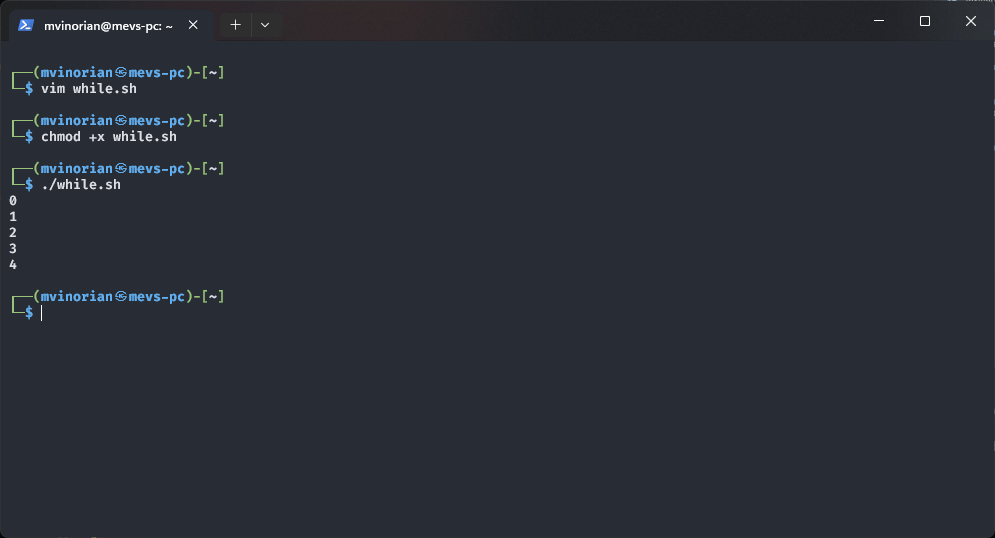

#### **For Loop**

To use the for loop in the shell, you can use the following syntax examples.

```sh
#!/bin/bash

for i in 1 2 3 4 5
do
  echo $i
done
```

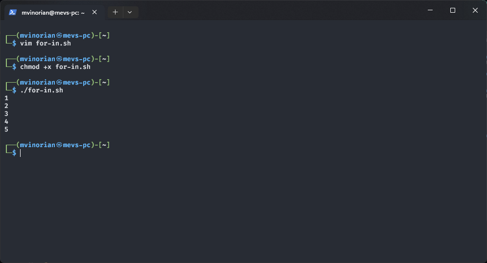

```sh
#!/bin/bash

for (( i = 0; i < 5; i++ ))
do
  echo $i
done
```

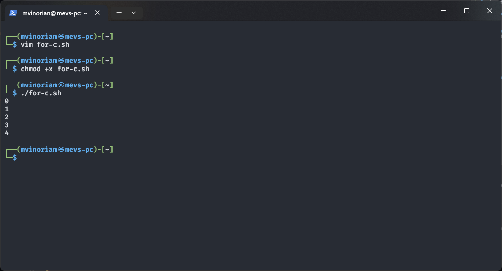

### Function

Functions are used to break down the overall functionality of a script into smaller sub-parts. These sub-sections can be called upon to carry out their respective tasks if necessary. Here is an example of using the function in the shell.

```sh
#!/bin/bash

# function declaration
function ask_name() {
  echo "What's your name?"
}

say_hello() {
  read name
  echo "Hi $name, welcome to operating systems lab!"
}

# function call
ask_name
say_hello
```

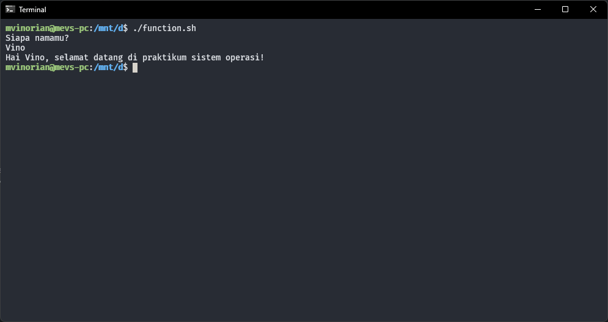

## Cron Jobs

### What are Cron Jobs?

Cron jobs are processes that run in the background that allow Linux users to run commands or shell scripts at certain times automatically. Commands or scripts run by cron are cron jobs.

To manage cron jobs, you can use the following crontab command.

```sh
crontab [-u user] [-l | -r | -e] [-i]
```

Information:

- `-u` to create a crontab for a specific user
- `-l` to display the contents of the crontab file
- `-r` to delete crontab files
- `-e` to change or create a crontab file if it doesn't already exist
- `-i` to provide confirmation before deleting crontab files

### Scheduling Task Using Cron

To create or change cron jobs, you can open crontab using the following command.

```sh
crontab -e
```

The following is the contents of the crontab.

```
* * * * * command to be executed
- - - - -
| | | | |
| | | | +- Days [0 - 6] (0 = Sunday)
| | | +--- Month [1 - 12]
| | +----- Date [1 - 31]
| +------- Hours [0 - 23]
+--------- Minutes [0 - 59]
```

To see the list of cron jobs in crontab, you can use the following command.

```sh
crontab -l
```

The following is an example of crontab results.


The cron job written in the crontab is to run the following command.

- Every hour 0 and minute 0 will insert the results from `ls ~` into `~/list-files`
- Every week runs `~/hello.sh`

For further references regarding the crontab command, you can access the site [crontab.guru] (https://crontab.guru).

## AWK

### What is AWK?

AWK is a program that can be used to retrieve certain notes/records in a file and perform one/several operations on those notes/records.

The basic function of AWK is to check a file per line (or other unit of text) that contains a certain pattern. When a row matches one of the patterns, AWK will perform a specific action on that row. AWK continues the process until it reaches the end of file in the file that was input earlier.

AWK is a scripting language used to manipulate data and generate reports. The AWK command programming language does not require compilation, and allows users to use variables, numeric functions, string functions, and logical operators. AWK is mostly used for pattern scanning and processing.

### Running AWK Program

The following is the syntax to run AWK.

```sh
awk options 'pattern { actions }' input-file > output-file
```

- `options` are options that can be used in AWK
  - `-f` to provide a file containing an AWK program
  - `-F` to specify a field separator
  - `-v` to declare a variable
- `pattern` is the criteria used to select the rows to operate on
- `actions` are operations to be performed on the selected rows

For example, there is a `kerajaan.txt` file with the following contents.

```
mataram sanjaya 732 760
kutai mulawarman  400 446
singasari ken 1222 1227
majapahit gajahmada 1334 1364
tarumanegara sanjaya 732 754
sriwijaya balaputradewa 792 835
```

By default, AWK will output all lines in the input file.

```sh
awk '{print}' kerajaan.txt
```

To output lines containing certain patterns, you can use the following command.

```sh
awk '/sanjaya/ {print}' kerajaan.txt
```

Then it will produce the following output.

```
mataram sanjaya 732 760
tarumanegara sanjaya 732 754
```

In each line, AWK will divide each word separated by spaces (or a separator defined in `-F` option) and store it in the variable `$n`. If there are 4 words on one line, the first word will be stored in the variable `$1`, the second word in the variable `$2`, and so on. `$0` represents all the words on a line.

The following is an example of using variables in AWK.

```sh
awk '/ken/ {print $1,$2}' kerajaan.txt
```

Then it will produce the following output.

```
singasari ken
```

> In the AWK program rules you can remove only one of the actions or patterns. If the pattern is omitted, the action will be applied to all rows. Meanwhile, if the action is omitted, then each line containing the pattern will by default be displayed in full.

### BEGIN and END Rule

BEGIN and END are special rules in AWK. The BEGIN rule will be executed before the input is read, while the END rule will be executed after the input has been read. The following is an example of using BEGIN and END in AWK.

```sh
awk'
BEGIN { print "How many \"732\" are there?" }
/732/ { ++n }
END { print "\"732\" appeared", n, "times." }' kingdom.txt
```

Then it will produce the following output.

```
How many "732" are there?
"732" appears 3 times.
```

> In the example above, the second rule only has an action to calculate the number of lines containing "732", but there is no action to display (print).
