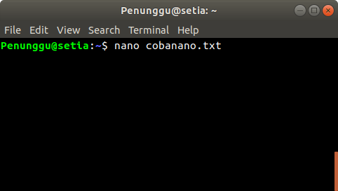
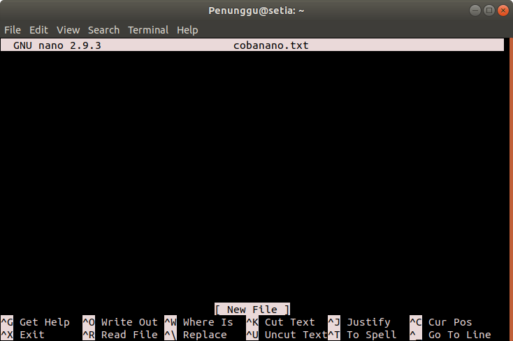
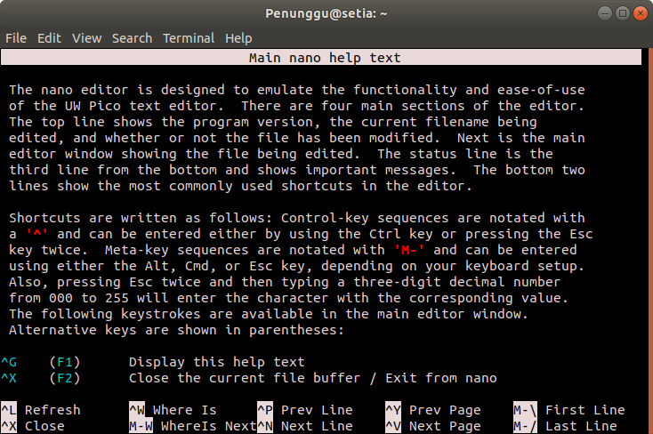
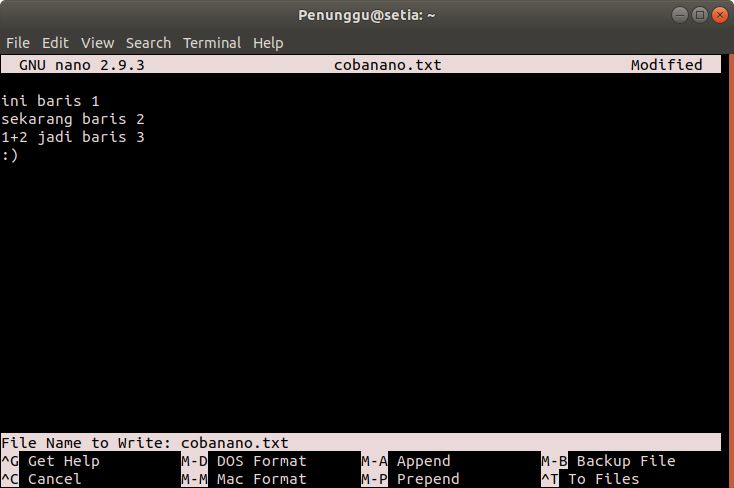
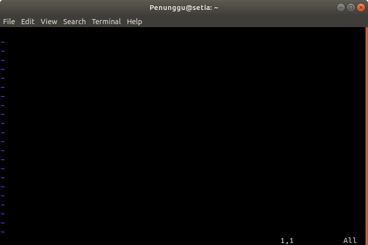
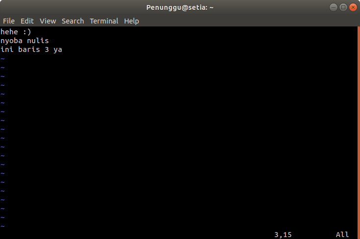

## Module 1 Operating System
# Shell Scripting, Cron, and AWK
## Precondition

1. Perform a Linux OS installation.
2. Get to know Linux OS in general, including the various distros that exist today and their directory structure in the [Linux OS Introduction Module](https://github.com/arsitektur-jaringan-komputer/lbe-ajk-2022/tree/master/Modul%201).
3. Understand the CLI *(Command Line Interface)* in the CLI [Introduction Module](https://github.com/AZakyH/Modul-Pelatihan-Linux-2018/tree/master/CLI).

</br>

## List of Content

- [Shell Scripting, Cron, and AWK](#shell-scripting-cron-and-awk)
  - [Precondition](#precondition)
  - [List of Content](#list-of-content)
- [Intermezzo](#intermezzo)
  - [Commands and Navigation in Linux](#commands-and-navigation-in-linux)
  - [The concept of *User* and *Permission* in Linux](#the-concept-of-user-and-permission-in-linux)
    - [User](#user)
    - [Permission](#permission)
    - [Settings Related to Users and Permissions](#settings-related-to-users-and-permissions)
  - [Introduction to Text Editors (Nano and Vim)](#introduction-to-text-editors-nano-and-vim)
    - [1. Nano](#1-nano)
    - [2. Vim](#2-vim)
      - [Install Vim Teks Editor](#install-vim-teks-editor)
      - [Create and Insert Text](#create-and-insert-text)
      - [Exit Vim Text Editor](#exit-vim-text-editor)
- [1. Shell Scripting](#1-shell-scripting)
  - [1.1 Shell](#11-shell)
  - [1.2 Shell Programming](#12-shell-programming)
  - [1.3 Basic Shell Command](#13-basic-shell-command)
  - [1.4 Simple Shell Script](#14-simple-shell-script)
  - [1.5 Variable](#15-variable)
  - [1.5.1 Special Variable](#151-special-variable)
- [1.6 Input Output](#16-input-output)
- [1.7 Quoting](#17-quoting)
  - [1.8 Basic Operators](#18-basic-operators)
    - [Arithmetic Operators](#arithmetic-operators)
    - [1.8.2 Relational Operators](#182-relational-operators)
  - [1.9 Conditional Statements](#19-conditional-statements)
    - [1.9.1 If...Else](#191-ifelse)
    - [1.9.2 Case](#192-case)
  - [1.10 Loop](#110-loop)
    - [1.10.1 While loop](#1101-while-loop)
    - [1.10.2 For loop](#1102-for-loop)
    - [1.10.3 Until loop](#1103-until-loop)
    - [1.10.4 Select loop](#1104-select-loop)
    - [1.10.5 Nesting Loops](#1105-nesting-loops)
  - [1.11 Function](#111-function)
    - [1.11.1 Nested Functions](#1111-nested-functions)
    - [1.11.2 Local Variable](#1112-local-variable)
- [2. Cron Jobs](#2-cron-jobs)
  - [2.1 What is Cron Jobs?](#21-what-is-cron-jobs)
  - [2.2 Create or Modify a Cron Jobs](#22-create-or-modify-a-cron-jobs)
- [3. AWK](#3-awk)
  - [3.1 What is AWK?](#31-what-is-awk)
  - [3.2 Running AWK Program](#32-running-awk-program)
    - [How the AWK Works](#how-the-awk-works)
  - [3.2 Special Rules](#32-special-rules)
- [Extras](#extras)
  - [Ranger](#ranger)
    - [How to Install](#how-to-install)
    - [How to Use](#how-to-use)
  - [References](#references)
  - [Exercise](#exercise)


</br>

# Intermezzo
## Commands and Navigation in Linux

In Linux, there are some commonly used commands and navigation as follows.

**File and Directory Navigation Command:**

| Command | Description
| ----------- | ----------- |
| cd | to enter a directory
| ls | to view the directory
| ll | to view the directory in detail |
| pwd | to view the active directory
| find `<file name>` | to search for files |
| locate | to search for files |

**File Operation Command (Delete, Create, Edit File):**

| Command | Description
| ----------- | ----------- |
| cp `<source> <destination>` | to copy a file |
| mv `<source> <destination>` | to move a folder |
| rm `<file>` | to delete files |
| mkdir `<folder name>` | to create a folder |
| cat | to view the contents of a file
| echo | to display a line of text
| sed | to perform a text filter
| awk | to move text

**Command for User and Permission:**

| Command | Description
| ----------- | ----------- |
| sudo | for super user |
| su | to change user id
| passwd | to change password
| who | to show user
| chmod | to change permissions
| chown | to change property rights
| chgrp | to override group privileges |

**Other Command Advance:**

| Command | Description
| ----------- | ----------- |
| history to view history
| grep | to search for words
| sort | to sort
| ps | to display a snapshot
| kill | to stop the program |
| tar | to collect files
| zip | to compress files |
| unzip | to extract files |
| ssh | for remote access |
| fdisk | to display partitions
| mount | to attach files
| umount | to perform an unmount
| du | to display file size
| df | to display disk space
| quota | to display the remaining disk space
| jobs `<program id>` | display the process identity |
| ifconfig | to view ip
| date | to display the date |
| top | view processes in order
| clear | clean the terminal
| dpkg -i `<namapackage>.deb` | package installation |
| uname | view kernel version

## The concept of *User* and *Permission* in Linux

In Linux, the concept of users and permissions is essential for system security and to allow users to access and manipulate various files and directories on the system.

### User

In Linux, each action is executed by a specific user. Each user is assigned a username and a unique user ID (UID). Users can have passwords, and they can be configured to have certain access rights to files and directories on the system.

When users log into the system, they must enter their username and password to authenticate themselves. Once the user has successfully logged in, they will enter a shell session or graphical interface that corresponds to the access rights that have been defined for that user account.

### Permission 

Every file and directory in Linux has three types of permissions: read, write, and execute. These permissions can be configured for each user and user group on the system.

When an action is performed on a file or directory, the operating system will check the permissions of the users and user groups associated with the file or directory. If the user or user group does not have the appropriate permissions, the system will reject the action.

Some examples of actions that require permissions are:

- Read: read the contents of a file or directory
- Write: write or make changes to a file or directory
- Execute: run or start a file or directory

Permissions can also be granted at the system level, such as in the kernel or modules, and can be configured using certain commands in the terminal.

In Linux, the system administrator (or root) has full access rights to all files and directories on the system. This allows the administrator to manage users and user groups, as well as configure access rights for every file and directory on the system.

### Settings Related to Users and Permissions

**chmod**

`chmod` stands for "change mode" and is a Linux command used to change the permissions of a file or directory. This command allows users to assign owner, group, and other permissions to a file or directory.

The format of the chmod command is as follows:

``` bash
chmod [mode] [file/directory]
```

Where mode is a combination of three digits that represent read, write, and execute permissions. The first digit represents permission for owner, the second digit for group, and the third digit for other.

To grant access rights to a file or directory, you can add digits 4, 2, and/or 1 to mode, representing read, write, and execute permissions, respectively. For example, chmod 755 file.txt will grant read, write, and execute for owner and read and execute for group and other.

**chown**

`chown` is a Linux command used to change the owner of a file or directory. When you want to change the access rights of a file or directory, you need to know who the owner is, so the chown command is very important.

The format of the chown command is as follows:

``` bash
chown [owner]:[group] [file/directory]
```

Where owner is the new owner username and group is the new owner group. If you don't want to change the owner group, simply ignore this section. For example, chown john:staff file.txt will change the owner of file.txt to john and the owner group to staff.

**su dan sudo**

su (short for "switch user") and sudo (short for "superuser do") are Linux commands used to switch to another user with certain access rights.

The su command is used to switch to another user with root privileges. When this command is executed, the user will be prompted to enter the root password. After successfully entering the password, the user will switch to the root user.

The sudo command is used to run commands as a superuser (root) with certain access rights. Users must enter their own password (not the root password) to run this command. For example, sudo apt-get update will run the apt-get update command with root privileges.

## Introduction to Text Editors (Nano and Vim)

### 1. Nano
Nano or *Nano's ANOther editor* is a text editor developed similar to the *Pico* text editor which is the default editor of Pine. Nano is a *user-friendly* text editor because there are *shortcuts* at the bottom of the editor, making it easier for users to use this text editor.

The commonly used syntax is as follows.

```sh
$ nano [nama-file]
```  



The command will bring up the default nano-screen.



To see the list of shortcuts press `Ctrl+G`.



When `Ctrl+X` is pressed to exit the editor, at the bottom on the third line from the bottom the question *Save modified buffer?* Press `Y` to save the changes to the file, and `N` to exit the nano text editor without saving the changes. 

Also before actually exiting the nano text editor, we can also rename the file we just created. Simply change the previous file name listed at the bottom of the text editor where it says *File name to write: ...* then press Enter.



### 2. Vim
Vim stands for "Vi IMprovised" and is a text editor on Linux OS that can be used to edit any type of text, including a computer program. Vim is an upgrade of the vi text editor, which has several improvements over vi, including syntax highlighting, on-line help, multi-windows and buffers, etc. For more details on the differences between vim and vi https://github.com/vim/vim/blob/master/runtime/doc/vi_diff.txt.
#### Install Vim Teks Editor

```sh
$ sudo apt update
```
```sh
$ sudo apt install -y vim
```

#### Create and Insert Text 
The usual syntax is `vim [file-name]`. After the command is executed, you will see the symbol `~` on each empty line.

```sh
$ vim nyoba.txt
```



Vim is now in *normal mode*. To insert text, type `i` to enter *insert mode* and then type the desired text.

When we press `i` to insert text, the character we input will be typed according to the current cursor position. To have the character we input typed to the right of the cursor position, then return vim to normal mode, and press `a`. Then the character we input will be typed to the right of the current cursor position.

When you have finished inputting text, press `esc` and vim will return to normal mode. In normal mode, press `h` to move left, `l` to move right, `j` to move up and `k` to move down.




#### Exit Vim Text Editor

1. Exit while in insert mode without saving any changes by typing `:q!`
2. Exit when in insert mode with changes saved by typing `:wq`
3. Exit and save changes made in normal mode by typing `ZZ`

To explore more about the vim text editor, there is a vim tutorial that can be accessed through the terminal.

```sh
$ vimtutor
```


</br>

# 1. Shell Scripting
## 1.1 Shell

Operating system have 3 major component. They are Kernel, Shell, and Program.


- __Kernel__ is the core of the computer. This component allows communication between software and hardware. If kernel is the inner layer of an Operating System, then __shell__ is the outer layer of it.
- __Shell__ is a command translator program which connects user and kernel. Generally, shell provides __prompt__ as user interface which is how user input the commands, eiter internal command or external command. After receiving input from the user and executing it according to the inputs, shell will outputs something. Shell can be accessed from the __Terminal__.
- __Program Utility__ is software system which execute maintenence tasks. Utility Program is made spesifically to do special task on spesific computer aread, Such as formatting harddisk, or network connectifity check, etc.

> Note : Try open a terminal on Linux, the you can find prompt shell (generally $). There, you can enter input such as commands, then execute it using "Enter" key . Output will be shown on the terminal.

There are 2 types of shell in Unix/Linux, That is:

1. Bourne Shell - Prompt for this shell is $ 
    - Bourne Shell (sh)
    - POSIX Shell (sh)
    - Korn Shell (ksh)
    - Bourne Again SHell (bash)
2. C Shell - Prompt for this shell is %
    - C Shell (csh)
    - TENEX/TOPS C Shell (tcsh)
## 1.2 Shell Programming
Shell Programming is constructing some shell command (internal or external ) to become a series of command which does spesific task. Some advantage of linux shell is it allows user to arrange a series of command like intrepeter programming language i.e input output, decision making, looping, fucntions, etc.

Shell programming Unix/Linux can also be called shell scripting. For ease of use, you can save shell script as a file and execute it as you wish.
    
Benefit of learning shell scripting:

- Can work effectively and efficiently because you don't have to type commands over and over, you can write it once and seave it to a file.

- Can run multiple command as one command

- Can run commands automatically
## 1.3 Basic Shell Command
On this module, we will use Bash as our shell (_Bourne Again SHell_) because bash is the most widely used shell in linux distros. You can check what shell you are using by typing the following command. 

```bash
$ echo $SHELL
```

Shell has internal commands (*built*-*in* Shell) and external commands. For more details, they are:
- Internal commands (*built-in* Shell), which are commands built into the Shell. Execution does not have to search for commands from the `PATH` variable in the Shell. Examples of internal commands are `cd`, `pwd`, `times`, `alias`, `umask`, `exit`, `logout`, `fg`, `bg`, `ls`, `mkdir`, `rmdir`, `mv`, `cp`, `rm`, `clear`, and so on.
- External commands, which are commands that do not exist in Shell. When the command is executed, Shell will look for the command in `PATH` variables such as `/usr/bin` and `/bin`. Examples of external commands are `cat`, `cut`, `paste`, `chmod`, `lpr`, and so on.

To check if a command is internal or external, use the type command.

```bash
$ type cd
cd is a shell builtin
$ type bash
bash is /bin/bash
$ type read
read is a shell builtin 
$ type chmod
chmod is /bin/chmod
```

Other than that, there are a few characters that are important to use in a shell:

- __Redirection__ (Sends output to a file or read inputs from a file) uses redirect operator >, >>, <, 2>> example:

```bash
ls /home/Documents > test.txt
#the output of ls command is /home/Documents is sent to to file test.txt. If there are no such file, then the file will be created. If such file exist, it will be overwritten

ls /home/Documents >> test.txt
#similar to >, the difference is if the test.txt exist, the output will be appended to the end of the file.

sort < test.txt
#file test.txt will become the input of the command sort

bash script.sh 2>> error.log
#If there are errors when running script.sh, the error message will be written to error.log
```

- __Pipe__ (output of one command will become the input of the other command) uses pipe operator |, example:
```bash
ls -l | sort -s
#ouput of ls -l command became the input of sort -s command (sort descendingly)
```
- __Wildcard__ uses wildcard characters *, ?, [ ], example:
```bash
ls a*
#output all files that begins with the letter a

ls a?a
#output all files that begins with the character a then any character then ends with the character a

ls [re]*
#output all files that begin with the character r or e
```
To see detail about bash shell, please open the bash manual using the following command.

```bash
$ man bash
```

## 1.4 Simple Shell Script
Create a shell script file (.sh) using any editor, for example nano, vi, or gedit.

```
$ nano file_name.sh
```
For example :
`$ nano hello.sh`

Write a few lines of command in the file, starting with shebang `#!/bin/bash`.

Shebang is used to tell the system that the commands in the file must be executed by Bash.

```
#!/bin/bash
echo "Hello, world!"
```

Save and change the script file permissions so that it can be executed.

```
$ chmod +x hello
```

Execute the script by means of `./nama_file.sh` or simply `bash nama_file.sh`.


## 1.5 Variable
- There are some things that need to be considered in defining variables:

    i. The variable name can only consist of:
	    - Letter (a-z and A-Z)
	    - Numbers (0-9)
	    - Underscore character ( _ )

    ii. Variable names begin with a letter or an underscore

    iii. You cannot use any special characters like !, *, $, #, -, etc because these characters have special meaning for the shell

    iv. Is in fact case sensitive, so it distinguishes upper and lowercase letters

- Syntax
    - Defines a variable
    ```
    var_name=value
    ```

    - Access variable
    ```
    $var_name
    ```

- Variable Types
    - String
    ```
    var_name="string"
    ```

    - Integer
    ```
    var_name=value
    ```

    - Array

    If the contents of the array are strings
    ```
    var_name=("string0" "string1" "string2" ... "stringN")
    ```
    If the contents of the array are integers
    ```
    var_name=(val0 val1 val2 ... valN)
    ```

Example :
```
#!/bin/bash

course="Operating System"
semester=12
student=("Jamal" "Taufik" "Dobleh" "Kabur")

echo " String variable:" $course
echo "Integer variable:" $semester
echo "3rd in array:" ${student[2]}
```

Output:


## 1.5.1 Special Variable
Some of the special variable that usually used:
| Variable | Description |
| --- | --- |
| $0 | Contains the name of the script file being executed |
| $n | n here is a positive decimal number that corresponds to the position of the argument (the first argument is $ 1, the second argument is $ 2, etc.) |
| $# | The number of arguments which is inputted in the script |
| $* | All $n arguments |
| $? | The exit status of the last command executed |
| $$ | Current shell process ID (PID) |

Example:
```
#!/bin/bash

echo "Script name : $0"
echo "1st argument : $1"
echo "2nd argument : $2"
echo "Hello $1, welcome to $2 operating class!"
echo "Total argument : $#"
echo "All argument : $*"
echo "PID : $$"
```

Output:


# 1.6 Input Output
- Read is used to take input from the keyboard with the following syntax:
```
read var_name
```

- Echo is used to display output with the following syntax:
    - Display plain text
    ```
    echo "text
    ```

    - Show the contents of a variable
    ```
    echo $var_name
    ```

Note :
If you want to use a new line character (\ n) in echo, use echo -e "text \ n text"

Example:
```
#!/bin/bash

course="Operating System"

echo "Who is your name?"
read name
echo -e "\nHi $name!\nWelcome to the class of $course ! ;)"
```

Output:


Beside echo, bash also provides a builtin printf command to display output in a specific format, similar to C language. 
For example:
```
#!/bin/bash

course="Operating System";
number=12;

printf "This is an enter\n\tin bash\n";
printf "What course, again? %s\n" $course;
printf "%d decimal in float = %.2f\n" $number $number;
```

Output:


# 1.7 Quoting
The Unix/Linux shell has several special characters called metacharacters. These characters have special meaning when used in a shell script. Several kinds of metacharacters:
```
* ? [ ] ' " \ $ ; & ( ) | ^ < > new-line space tab
```

There are 4 types of quoting, namely:
| No | Quoting | Description |
| --- | --- | --- |
| 1 | Single Quote (') | All metacharacters between single quotes lose their special meaning |
| 2 | Double Quote (") | Most of the metacharacters between double quotes will lose their special meaning, except `$, backquote, \ $, \ ', \ ", \\` |
| 3 | Backslash ( \ ) | Any character after the backslash will lose its special meaning |
| 4 | Backquote (`) | Anything between the back quotes will be treated as a command and will be executed |


Example:
```
#!/bin/bash

single=3

#Single quote
echo '$single'

#Double quote
echo "$single"

#Backslash
echo \<-\$1500.\*\*\>\; \(update\?\) \[y\|n\]

#Backquote
dmn=`pwd`
echo "Where are we rn? " $dmn
```

Output:


To see more about this, do `man bash`

## 1.8 Basic Operators

There are several types of operators supported by the shell, namely:

   1. Arithmetic Operators
   2. Relational Operators
   3. Boolean operators
   4. String operator
   5. File Test Operators

However, we will focus on **arithmetic** and **relational** operators.

### Arithmetic Operators

| No | Operators | Description |
| --- | --- | --- |
| 1 | + | Addition |
| 2 | - | Deduction |
| 3 | * | Multiplication |
| 4 | / | Division |
| 5 | % | Modulus (remainder of division) |
| 6 | = | Assigns a value from the right to a variable on the left |
| 7 | == | Compares 2 equal values |
| 8 | != | Compares 2 unequal values |

There are 3 ways that may be used to perform mathematical operations, namely:

1. Using the built-in command **let**
2. Using external command **expr**
3. Using the substitution command `$((expression))`

Example:

```bash
#!/bin/bash

a=15
b=7

#let
let add=$a+$b
let subtract=$a-$b
let multiply=$a*$b

#expr
divide=`expr $a / $b`

#using a substitute command $((ekspresi))
mod=$(($a % $b)) 

echo "a + b = $add"
echo "a - b = $subtract"
echo "a * b = $multiply"
echo "a / b = $divide"
echo "a % b = $mod"

b=$a

echo "a = $a"
echo "b = $b"
```

Output:


### 1.8.2 Relational Operators

| No | Operators | Description |
| --- | --- | --- |
| 1 | -eq | Checks whether the values of both operands are equal (==) |
| 2 | -ne | Checks whether the values of both operands are not equal (! =) |
| 3 | -gt | Checks whether the value of the left operand is greater than the right operand (>) |
| 4 | -lt | Checks whether the value of the left operand is less than the right operand (<) |
| 5 | -ge | Checks whether the value of the left operand is greater than or equal to the right operand (> =) |
| 6 | -le | Checks whether the value of the left operand is less than or equal to the right operand (<=) |

Relational operators are usually used in conjunction with conditional statements, for example:

```bash
#!/bin/bash

a=15
b=7

if [ $a -eq $b ]
then
   echo "$a -eq $b: a equals b"
else
   echo "$a -eq $b: a does not equal b"
fi
```

Output:

```bash
15 -eq 7: a are not equal to b
```

## 1.9 Conditional Statements

**Conditional statements** are used to allow the program to make correct decisions by selecting certain actions based on certain terms/conditions.
There are 2 types of conditional statements in the Unix shell, namely:

1. **if...else**
2. **case**
  
### 1.9.1 If...Else

Syntax:

```bash
if [ condition1 ]
then 
  command1 
elif [ condition2 ]
then
  command2 
else
  alternative_command
fi
```

Example:

```bash
#!/bin/bash

my_love=100
their_love=88

if [ $my_love == $their_love ]
then
  echo "my love is equal to their love"
elif [ $my love -gt $their_love ]
then
  echo "my love is greater than their love"
elif [ $a -lt $their_love ]
then
  echo "my love is less than their love"
else
  echo "None of the conditions returned true"
fi
```

Output:

```bash
my_love is greater than their_love
```

### 1.9.2 Case

Syntax:

```bash
case var in
  pattern1)
    command1 
    ;;
  pattern2)
    command2 
    ;;
  *)
    alternative_command
    ;;
esac
```

Example:

```bash
#!/bin/bash

echo "I've liked you for a long time, will you be my girlfriend?"
echo "1. Yes"
echo "2. No"
echo "3. I can't answer now"
echo -n "answer:"
read answer

case "$answer" in
  "1")
    echo "Really?"
    ;;
  "2")
    echo "Okay, sorry for taking up your time"
    ;;
  "3")
    echo "Alexa, play comethru by Jeremy Zucker"
    ;;
  *)
    echo "Wut?"
    ;;
esac
```

Output:


## 1.10 Loop

**Loop** is used to execute a series of commands over and over. There are several types of shell loops:

  1. While loop
  2. For loop
  3. Until loop
  4. Select loop

### 1.10.1 While loop

**While loop** is used to execute a series of commands repeatedly **as long as** a condition is met. **While** may be used for when we want to repeatedly manipulate a variable.
Syntax:

```bash
while condition
do
  command
done
```

Example:

```bash
#!/bin/bash

a=0

while [ $a -lt 10 ]
do
echo $a
  a=$((a + 2))
done
```

Output:

```bash
0
2
4
6
8
```

### 1.10.2 For loop

**For loop** is used to repeat a series of commands for each item on the list.

Syntax:

```bash
for var in item_list
do
  command
done
```

Example:

```bash
#!/bin/bash

for num in 1 2 3 4 5
do
  echo $num
done
```

Apart from that, it could be written like this:

```bash
#!/bin/bash

for ((num=1; num<=5; num=num+1))
do
  echo $num
done
```

Output:

```bash
1
2
3
4
5
```

### 1.10.3 Until loop

Unlike while, **until loop** is used to execute a series of commands repeatedly **until** a condition is met.
Syntax:

```bash
until condition
do
  command
done
```

Example:

```bash
#!/bin/bash

a=0

until [ ! $a -lt 10 ]
do
  echo $a
  a=$((a + 2))
done
```

Output:

```bash
0
2
4
6
8
```

### 1.10.4 Select loop

**Select loop** is used when we want to create a program with several lists of options that can be selected by the user, for example, a menu list.
Syntax:

```bash
select var in daftar_item
do
  command
done
```

Example:

```bash
#!/bin/bash

select drinks in tea coffee water juice milk all nothing
do
  case $drinks in
    tea|coffee|water|all)
      echo "Sorry, we're out of them"
      ;;
    juice|milk)
      echo "Available"
    ;;
    nothing)
      break
    ;;
    *) echo "Does not exist in the menu"
    ;;
  esac
done
```

Output:


### 1.10.5 Nesting Loops

All the types of loops above support the concept of nesting, meaning that we can place one loop into another, whether it is a similar loop or a different type.
Contoh:

```bash
#!/bin/sh

a=0

while [ "$a" -lt 10 ]  #loop1
do
  b="$a"
  while [ "$b" -ge 0 ]  #loop2
  do
    echo -n "$b "
    b=`expr $b - 1`
  done
  echo ""
  a=`expr $a + 1`
done
```

Output:

```bash
0
1 0
2 1 0
3 2 1 0
4 3 2 1 0
5 4 3 2 1 0
6 5 4 3 2 1 0
7 6 5 4 3 2 1 0
8 7 6 5 4 3 2 1 0
9 8 7 6 5 4 3 2 1 0
```

## 1.11 Function
**Function** is used to divide the functionality of a script into a smaller subsection. These subsection can be called to do their job if needed.

Syntax:
```bash
function_name () { 
  command1
  command2
  ...
  commandN
}
```
Example:
```bash
#!/bin/bash
#define functions
ask_name() {
  echo "What's your name?"
}
reply() {
  read name
  echo "Hi $name, welcome to operating system's practice!"  
}

#call functions
ask_name
reply
```
Output:   


### 1.11.1 Nested Functions
Similar to loop, the concept of nested is also applied in function, where we can call a function inside a function.
```bash
#!/bin/bash

#define functions
ask_name() {
  echo "What's your name?"
  reply   #call reply function inside ask_name function
}
reply() {
  read name
  echo "Hi $name, welcome to operating system's practice!"
}

#call functions
ask_name
```
Output:   


### 1.11.2 Local Variable

When using bash, the variable will automatically become a global variable if you assign it directly like month = 6. But we can create local variables for the function in bash using the local keyword. The created local variable will not be a global variable.

Example:
```
#!/bin/bash

fac_func() {
    number=2
    local tmp=10
    echo "The global var in this function : $number"
    echo "The local var in this function : $tmp"
}

fac_func

echo "The global var outside the function : $number"
echo "The local var outside the function : $tmp"
```

Output:


From the picture, it can be seen that when we try to print local variables to the terminal it can't get out.

</br>

# 2. Cron Jobs

## 2.1 What is Cron Jobs?
Cron is a daemon service which allows Linux and Unix user to run a certain command or _script_ at a any given time automatically. Commands or scripts which is executed is called cron jobs.

Crontab syntax :
`crontab [-u user] [-l | -r | -e] [-i]`
Penjelasan :
* `-l` to display the content of a crontab file
* `-r` to delete a crontab file
* `-e` to modify or create a crontab file if it does not already exist
* `-i` to give a confirmation before deleting a crontab file

## 2.2 Create or Modify a Cron Jobs
1. Type `crontab -e`
2. Type the crontab command according to crontab's parameter rules

3. To see the list of cron jobs, type `crontab -l`

Example of commands that crontab runs
   
Penjelasan :
* every 00.00, enter the result from `ls /home/tamtama` to file `/home/tamtama/list_files`
* every week, run the file `script.sh` in folder `/home/tamtama`

To learn more about crontab's commands, you can access this website [crontab guru](https://crontab.guru/).   


</br>

# 3. AWK

## 3.1 What is AWK?
__awk__ is a program that can be used to retrive certain records in a file and perform one or several operation on those records.

The basic function of awk is examine a file line by line (or other unit of text) that contains a certain pattern. When a line matches a pattern, awk will perform certain action on that line. Awk continues the process until it meets the end of line in the inputed file.

FYI: the new version of awk is called gawk, but is usually still called awk.

awk is a scripting language used to process data and generate reports. The awk language does not required compilation, and allows user to use variables, numeric function, string function, and logical operator. awk is mostly used for scanning and pattern processing.

## 3.2 Running AWK Program
Syntax:
```bash
awk options 'selection _criteria {action }' input-file > output-file
```
### How the AWK Works
- Awk read the lines in a file.

- Awk matches patterns to lines in the file. If the patterns matches, the next action can be made, such a printing the line.

- If no pattern matches, then no action will be made.

- Providing pattern or action is not required.

- If no pattern is created, then the default output is every line in the input file.

- If no action is created, then the default output is displaying the search result on your display.

- Curly braces without action means no decision, but it won't display the default output.

- Every statement in an action must be separated with a semicolon `(;)`.

For example, we have the following kingdom's data
```
mataram sanjaya 732 760
kutai mulawarman  400 446
singasari ken 1222 1227
majapahit gajahmada 1334 1364
tarumanegara sanjaya 732 754
sriwijaya balaputradewa 792 835
```
By default, awk will print all lines in the input file:
`awk '{print}' kerajaan.txt`  

Print the line containing the entered pattern:
`awk '/sanjaya/ {print}' kerajaan.txt`  
The result are as follows:
```
mataram sanjaya 732 760
tarumanegara sanjaya 732 754
```
Within each line, awk will divide each word separated by a space and store it in the variable `$n`. If there exists 4 words in a line, then the first word will be stored in variable `$1`, the second will be stored in `$2`, and so on. `$0` represents all the words in a line.

`awk '/ken/ {print $1,$2}' kerajaan.txt`  
The result are as follows:
```
singasari ken
```
Note: In the awk program rule, it is only allowed to omit one of the action or the patters. If the pattern is omitted, the action will be applied to all rows. Meanwhile, if the action is omitted, every line containing the pattern will be displayed by default.

## 3.2 Special Rules
awk has rules that have special behavior. Among them are `BEGIN` and `END`. The `BEGIN` rule is executed only once, that is, before the input is read. The END rule is also executed once, only after reading all the inputs. For example:
```bash
awk '
BEGIN { print "How many \"732\" are there?" }
/732/  { ++n }
END   { print "\"732\" appear", n, "time(s)." }' kerajaan.txt
```
The result are as follows:
```
How many "732" are there?

"732" appear 2 time(s).
```
In the example above, the second rule only has an action to calculate how many rows contain "732", but there is not action to display (print).

</br>

# Extras
## Ranger


Ranger is a file manager in the terminal that uses the keys from VI. Ranger provides a nice minimalistic user interface by displaying a hierarchy of directories. Ranger itself can automatically find the appropriate program to execute a file based on its type.

### How to Install
Installing Ranger is quite simple:
- With the command `sudo apt-get install ranger`
- Using PyPI, use the `pip install ranger-fm` command.

### How to Use
- Open the terminal
- Type `ranger`
- Then the interface for Ranger will open immediately
- Use the `h` key to go to the previous directory
- Use the `l` key to go to the next directory and open a file
- Use the `j` key to move the cursor down
- Use the `k` key to hover the cursor up
- Use the `q` key to exit
- Use the `!` key to execute shell commands, for example `! touch my_text.txt`

## References
* [https://www.tutorialspoint.com/unix/shell_scripting.htm](https://www.tutorialspoint.com/unix/shell_scripting.htm)
* [https://pemula.linux.or.id/programming/bash-shell.html](https://pemula.linux.or.id/programming/bash-shell.html)
* [https://www.computerhope.com/unix/ucrontab.htm](https://www.computerhope.com/unix/ucrontab.htm)
* [https://www.codepolitan.com/memahami-perintah-perintah-crontab-paling-lengkap-59f69445130a0](https://www.codepolitan.com/memahami-perintah-perintah-crontab-paling-lengkap-59f69445130a0)
* [https://vpswp.blogspot.com/2015/06/definisi-dan-6-contoh-fungsi-perintah-awk-linux.html](https://vpswp.blogspot.com/2015/06/definisi-dan-6-contoh-fungsi-perintah-awk-linux.html)
* [https://www.codepolitan.com/belajar-bash-mencoba-bash-untuk-pertama-kali-57bbca3c28e54-17341](https://www.codepolitan.com/belajar-bash-mencoba-bash-untuk-pertama-kali-57bbca3c28e54-17341)
* [https://pemula.linux.or.id/programming/bash-shell.html](https://pemula.linux.or.id/programming/bash-shell.html)
* [https://github.com/ranger/ranger](https://github.com/ranger/ranger)
* [https://www.geeksforgeeks.org/internal-and-external-commands-in-linux/#:~:text=The%20UNIX%20system%20is%20command,are%20built%20into%20the%20shell.&text=External%20Commands%20%3A%20Commands%20which%20aren't%20built%20into%20the%20shell](https://www.geeksforgeeks.org/internal-and-external-commands-in-linux/#:~:text=The%20UNIX%20system%20is%20command,are%20built%20into%20the%20shell.&text=External%20Commands%20%3A%20Commands%20which%20aren't%20built%20into%20the%20shell)
* [https://tldp.org/LDP/abs/html/localvar.html](https://tldp.org/LDP/abs/html/localvar.html)

## Exercise


Fredryn Samba uhuk uhuk sangat tertarik sekali dengan pengaturan server. Cita-citanya adalah menjadi Security Engineer di JhonOjol. Suatu hari, dia diterima menjadi salah satu Security Engineer di JhonOjol. Dalam masa probation-nya, dia diberikan beberapa tasks. Tetapi Fredryn Samba masih proses dalam pengerjaan Tugas Akhir. Sehingga Fredryn Samba meminta kamu untuk menjadi joki dari tasknya. Berikut task yang diberikan ke Fredryn Samba.

1. Server JhonOjol sering diakses rekan se-divisinya, sehingga ia diminta oleh atasannya untuk mecatat setiap user yang melakukan login ke server beserta command atau perintah yang diinputkan.
    Konfigurasi yang digunakan adalah:
    - file script diletakan di direktori `root’
    - File log disimpan di /var/log
    - file log disimpan dengan ektensi `.txt`, nama file harus unique dengan kombinasi `date +%Y%m%d_%H%M%S. Contoh:
    - 20230222_110401_log.txt.
    - Untuk file lognya hanya menyimpan 50 command yang dinputkan, jika belum genap 50 command maka file log yang baru tidak akan dibuat.
    - Script dijalankan atau dieksekusi setiap menit menggunakan cron job.

2. Jhon LBF (pemilik JhonOjol), mentornya meminta Fredryn Samba untuk membuat user baru yang nantinya digunakan oleh rekan-rekannya dengan username Admin dan passwordnya bebas, dimana user ini memiliki akes yang mirip dengan dengan superuser atau root namun tidak bisa menggunakan command `su`, `rm`, dan `rmdir`. 
