# Modul 1 - Pengenalan Linux

## Capaian

1. Mahasiswa mampu memahami perintah dasar linux
2. Mahasiswa mampu membuat shell script sederhana
3. Mahasiswa mampu melakukan otomatisasi script menggunakan cron

## Prasyarat

1. Melakukan instalasi OS Linux, instalasi menggunakan VMWare dapat dilihat [di sini](https://github.com/arsitektur-jaringan-komputer/Pelatihan-Linux/tree/master/0.%20Prerequisites)
2. Mengenal OS Linux secara umum pada [Modul Pengenalan OS Linux](https://github.com/arsitektur-jaringan-komputer/Pelatihan-Linux/blob/master/1.%20What%20is%20Linux/README.md)

## Daftar Isi

- [i. Capaian](#capaian)
- [ii. Prasyarat](#prasyarat)
- [iii. Daftar Isi](#daftar-isi)
- [1. Pendahuluan](#pendahuluan)
  - [1.1. Perintah dan Navigasi](#perintah-dan-navigasi)
  - [1.2. Konsep User dan Permission](#konsep-user-dan-permission)
  - [1.3. Pengenalan Teks Editor](#pengenalan-teks-editor)
- [2. Shell Scripting](#shell-scripting)
  - [2.1. Pengertian Shell](#pengertian-shell)
  - [2.2. Pemrograman Shell](#pemrograman-shell)
  - [2.3. Operasi Dasar Shell](#operasi-dasar-shell)
  - [2.4. Shell Script Sederhana](#shell-script-sederhana)
  - [2.5. Variabel](#variabel)
  - [2.6. Input dan Output](#input-dan-output)
  - [2.7. Quoting](#quoting)
  - [2.8. Operator](#operator)
  - [2.9. Percabangan](#percabangan)
  - [2.10. Perulangan](#perulangan)
  - [2.11. Fungsi](#fungsi)
- [3. Cron Jobs](#cron-jobs)
  - [3.1. Pengertian Cron](#pengertian-cron)
  - [3.2. Pembuatan Cron Jobs](#pembuatan-cron-jobs)
- [4. AWK](#awk)
  - [4.1. Pengertian AWK](#pengertian-awk)
  - [4.2. Menjalankan Program AWK](#menjalankan-program-awk)
  - [4.3. BEGIN dan END](#begin-dan-end)

## Pendahuluan

### Perintah dan Navigasi

Pada sistem operasi Linux, terdapat beberapa perintah yang umum digunakan sebagai berikut.

#### **Perintah Navigasi File dan Direktori**

| Command            | Kegunaan                            |
| ------------------ | ----------------------------------- |
| `cd`               | pindah direktori                    |
| `ls`               | melihat isi direktori               |
| `ll`               | melihat isi direktori dengan detail |
| `pwd`              | melihat direktori aktif             |
| `find <nama file>` | mencari file                        |
| `locate`           | mencari file                        |

#### **Perintah Manipulasi File dan Direktori**

| Command               | Kegunaan               |
| --------------------- | ---------------------- |
| `cp <asal> <tujuan>`  | menyalin file          |
| `mv <asal> <tujuan>`  | memindahkan file       |
| `rm <file>`           | menghapus file         |
| `touch <file>`        | membuat file           |
| `mkdir <nama folder>` | membuat folder         |
| `cat`                 | melihat isi file       |
| `echo`                | menampilkan baris teks |
| `sed`                 | melakukan filter teks  |
| `awk`                 | operasi teks           |

#### **Perintah User dan Permission**

| Command           | Kegunaan                                  |
| ----------------- | ----------------------------------------- |
| `sudo <perintah>` | melakukan perintah lain dengan super user |
| `su`              | mengganti user                            |
| `passwd`          | mengganti password                        |
| `who`             | menampilkan user                          |
| `chmod`           | mengganti hak akses                       |
| `chown`           | mengganti hak milik                       |
| `chgrp`           | mengganti grup kepemilikan                |

#### **Perintah Lainnya**

| Command                     | Kegunaan                     |
| --------------------------- | ---------------------------- |
| `history`                   | melihat riwayat perintah     |
| `grep`                      | mencari kata                 |
| `sort`                      | mengurutkan                  |
| `ps`                        | menampilkan proses berjalan  |
| `kill`                      | menghentikan program         |
| `tar`                       | mengumpulkan file            |
| `zip`                       | mengkompres file             |
| `unzip`                     | mengekstrak file             |
| `ssh`                       | akses jarak jauh             |
| `fdisk`                     | menampilkan partisi          |
| `mount`                     | melampirkan file             |
| `umount`                    | melakukan unmount            |
| `du`                        | menampilkan ukuran file      |
| `df`                        | menampilkan disk space       |
| `quota`                     | menampilkan sisa disk space  |
| `jobs <id program>`         | menampilkan identitas proses |
| `ifconfig`                  | melihat ip                   |
| `date`                      | menampilkan tanggal          |
| `top`                       | melihat proses secara urut   |
| `clear`                     | membersihkan terminal        |
| `dpkg -i <namapackage>.deb` | instalasi paket              |
| `uname`                     | melihat versi kernel         |

### Konsep User dan Permission

Pada sistem operasi Linux, konsep user dan permission sangat penting untuk keamanan sistem dan memungkinkan pengguna untuk mengakses dan memanipulasi berbagai file dan direktori pada sistem.

#### **User (Pengguna)**

Pada sistem operasi Linux, setiap aksi dijalankan oleh pengguna tertentu. Setiap pengguna diberikan sebuah username dan ID pengguna (UID) yang unik. Pengguna dapat memiliki password, dan mereka dapat dikonfigurasi untuk memiliki hak akses tertentu terhadap file dan direktori di sistem.

Ketika pengguna masuk ke sistem, mereka harus memasukkan nama pengguna dan kata sandi mereka untuk mengautentikasi diri mereka. Setelah pengguna berhasil masuk, mereka akan masuk ke sesi shell atau antarmuka grafis yang sesuai dengan hak akses yang telah ditentukan untuk akun pengguna tersebut.

#### **Permission (Hak Akses)**

Setiap file dan direktori pada sistem Linux memiliki hak akses masing masing. Hak akses ini menentukan siapa yang dapat membaca, menulis, dan mengeksekusi file atau direktori tersebut.

Ketika suatu aksi dilakukan pada file atau direktori, sistem operasi akan mengecek hak akses pengguna dan grup pengguna yang terkait dengan file atau direktori tersebut. Jika pengguna atau grup pengguna tidak memiliki hak akses yang sesuai, maka sistem akan menolak aksi tersebut.

Berikut adalah tipe hak akses yang dapat diberikan pada file atau direktori.

- Read (r) - Memungkinkan pengguna untuk membaca file atau direktori
- Write (w) - Memungkinkan pengguna untuk menulis atau mengubah file atau direktori
- Execute (x) - Memungkinkan pengguna untuk mengeksekusi file atau masuk ke direktori

Administrator sistem (atau root) memiliki hak akses penuh ke semua file dan direktori di sistem. Ini memungkinkan administrator untuk mengelola pengguna dan grup pengguna, serta mengkonfigurasi hak akses untuk setiap file dan direktori di sistem.

#### **Perintah Terkait User dan Permission**

- `ll` atau `ls -l` untuk melihat hak akses file dan direktori

  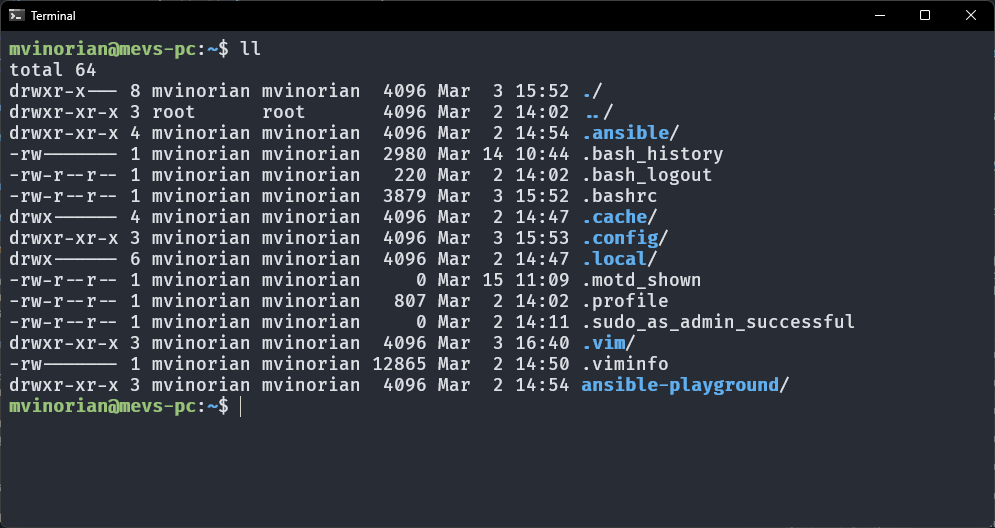

  Penjelasan untuk direktori `./`

  - `d`: menunjukkan bahwa ini adalah direktori
  - `rwx`: pemilik direktori memiliki hak baca, tulis, dan eksekusi
  - `r-x`: grup pengguna memiliki hak baca dan eksekusi
  - `---`: pengguna lain tidak memiliki hak akses

- `chmod` untuk mengubah hak akses file atau direktori

  Penggunaan perintah `chmod` adalah sebagai berikut.

  ```sh
  chmod <mode> <file/direktori>
  ```

  Mode terdiri dari 3 digit yang masing-masing mewakili hak akses untuk pemilik, grup pengguna, dan pengguna lain. Setiap digit merupakan representasi desimal dari hak akses yang diinginkan.

  Contoh untuk mengubah hak akses file `file.txt` menjadi `rwxr-xr--` adalah sebagai berikut.

  | Tipe    | Hak Akses | Representasi Biner | Representasi Desimal |
  | ------- | :-------: | :----------------: | :------------------: |
  | Pemilik |   `rwx`   |        111         |          7           |
  | Grup    |   `r-x`   |        101         |          5           |
  | Lainnya |   `r--`   |        100         |          4           |

  ```sh
  chmod 754 file.txt
  ```

- `chown` untuk mengubah kepemilikan file atau direktori

  Penggunaan perintah `chown` adalah sebagai berikut.

  ```sh
  chown <user>:<group> <file/direktori>
  ```

  Contoh untuk mengubah kepemilikan file `file.txt` menjadi `user1` dan `group1` adalah sebagai berikut.

  ```sh
  chown user1:group1 file.txt
  ```

  Contoh untuk mengubah kepemilikan file `file.txt` menjadi `user1` adalah sebagai berikut.

  ```sh
  chown user1 file.txt
  ```

- sudo untuk menjalankan perintah lain dengan hak akses super user

  Penggunaan perintah `sudo` adalah sebagai berikut.

  ```sh
  sudo <perintah>
  ```

  Contoh untuk menjalankan perintah `apt-get update` dengan super user adalah sebagai berikut.

  ```sh
  sudo apt-get update
  ```

### Pengenalan Teks Editor

Dalam sistem operasi Linux, text editor yang sering digunakan adalah nano dan vim. Dua text editor tersebut dapat berjalan pada command line interface (CLI).

#### **Nano**

Nano merupakan teks editor yang termasuk mudah dipahami karena terdapat shortcut pada bagian bawah layar. Untuk membuka file menggunakan nano, dapat menggunakan perintah berikut.

```sh
nano <nama-file>
```

Jika tidak bisa menggunakan perintah tersebut, berarti `nano` belum terinstall. Untuk melakukan instalasi `nano` dapat menggunakan perintah berikut.

```sh
sudo apt update
sudo apt install nano -y
```

Pada contoh kali ini akan digunakan untuk mengedit file `contoh.txt`.

```sh
nano contoh.txt
```

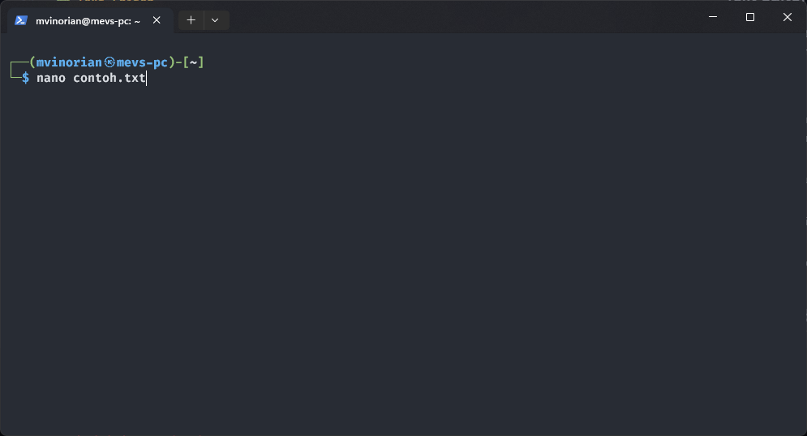

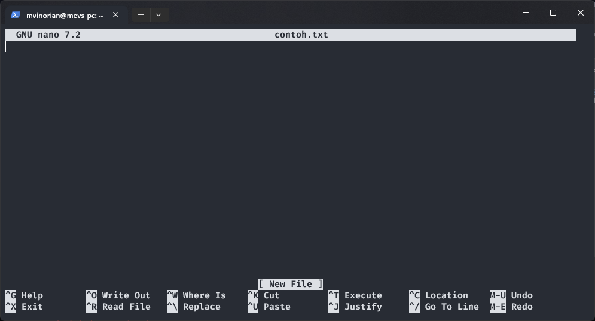

Pada interface tampilan shortcut, simbol `^` sama dengan tombol `Ctrl` dan simbol `M-` sama dengan tombol `Alt`. Contoh penggunaannya adalah untuk melihat daftar shortcut yang dapat digunakan pada nano menggunakan shortcut `Ctrl + G`.


Untuk keluar dari tampilan bantuan, dapat menggunakan tombol `Q`. Setelah mengubah isi dari file yang ingin diubah, file dapat disimpan menggunakan shortcut `Ctrl + O`.

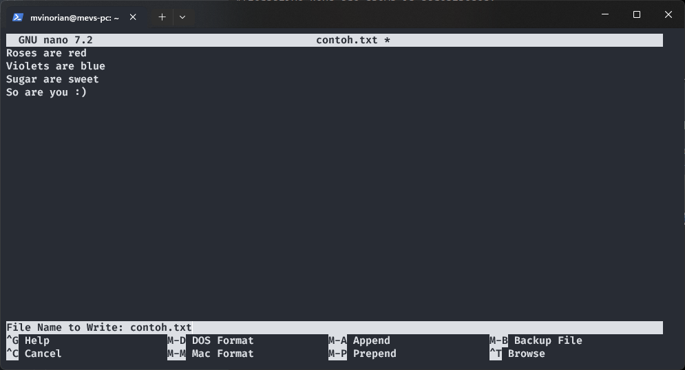

Kemudian akan muncul pertanyaan `File Name to Write: ` yang dapat diisi nama hasil file yang ingin disimpan. Setelah itu dapat ditekan `Enter`.

Ketika ingin keluar dari text editor secara langsung tanpa menyimpan file, dapat menggunakan shortcut `Ctrl + X`. Tekan `N` jika tidak ingin menyimpan perubahan atau `Y` untuk menyimpan perubahannya.

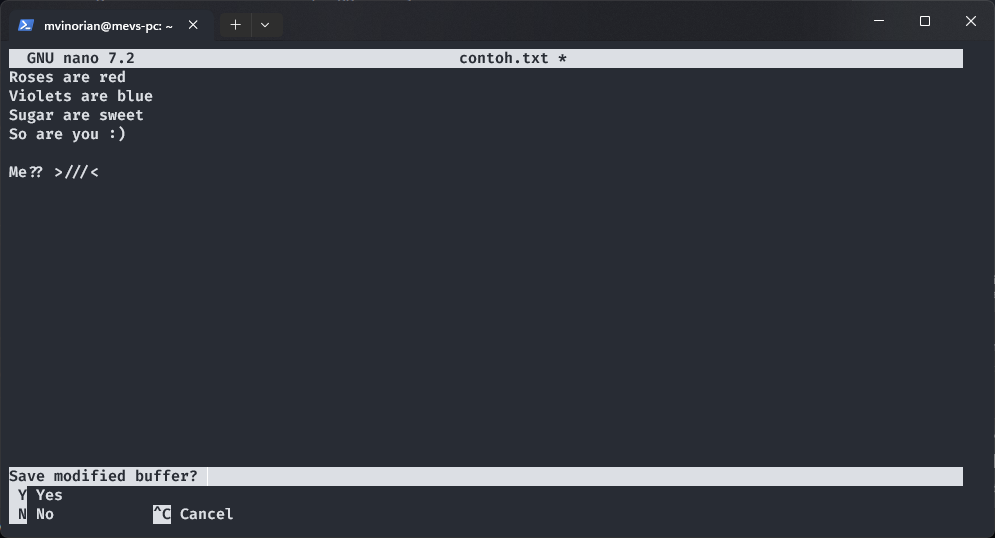

#### **Vim**

Vim merupakan salah satu text editor yang mempunyai fitur lengkap untuk melakukan pengeditan pada file. Namun, text editor ini memiliki tampilan dan shortcut yang cukup rumit untuk dimengerti bagi pemula.

Untuk membuka file menggunakan vim, dapat menggunakan perintah berikut.

```sh
vim <nama-file>
```

Jika tidak bisa menggunakan perintah tersebut, berarti `vim` belum terinstall. Untuk melakukan instalasi `vim` dapat menggunakan perintah berikut.

```sh
sudo apt update
sudo apt install vim -y
```

Pada contoh kali ini akan digunakan untuk mengedit file `contoh.py`.

```sh
vim contoh.py
```

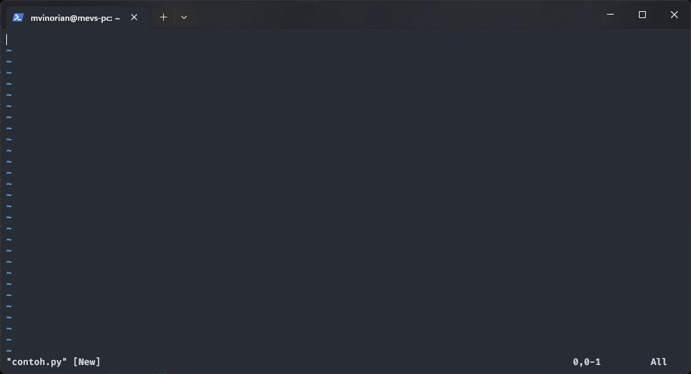

Pada tampilan awal, vim akan memasuki mode `normal`. Untuk masuk ke mode `insert`, dapat dilakukan dengan menekan tombol `i`. Dalam mode `insert`, dapat dilakukan penulisan karakter atau teks. Untuk kembali ke mode `normal`, dapat dilakukan dengan menekan tombol `Esc`.

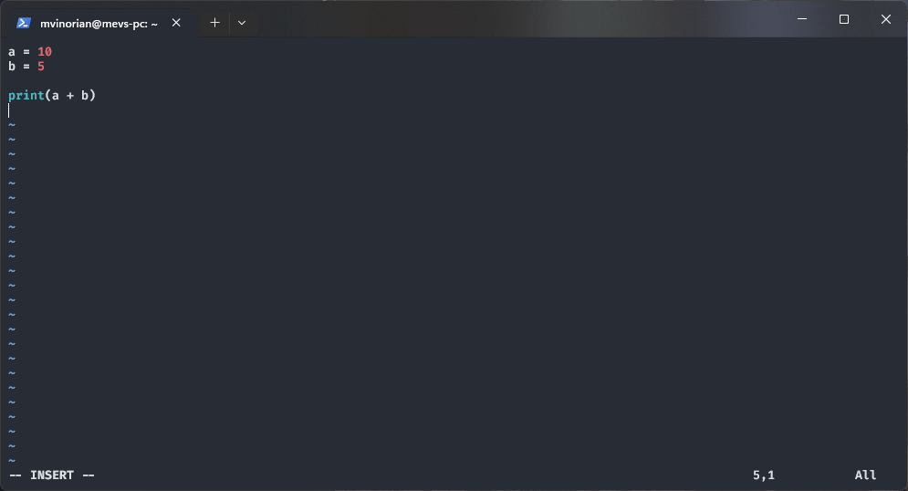

Dalam mode `normal`, kursor dapat digerakkan menggunakan tombol `h` untuk ke kiri, `j` untuk ke bawah, `k` untuk ke atas, dan `l` untuk ke kanan.

Untuk melakukan undo dapat dilakukan dengan menekan `u` pada mode `normal` atau `Alt + U` pada mode `insert`. Sedangkan untuk melakukan redo dapat dilakukan dengan menekan `Ctrl + R` pada mode `normal`.

Untuk menyimpan file yang telah diedit, dapat mengetikkan `:w` pada mode `normal`. Atau jika ingin keluar setelah menyimpan file, dapat mengetikkan `:wq` pada mode `normal`. Namun jika ingin keluar tanpa menyimpan perubahan, dapat dilakukan dengan mengetikkan `:q!` pada mode `normal`.

Eksplorasi lebih lanjut dari text editor vim dapat dilakukan dengan mengakses tutorial vim dari terminal dengan perintah berikut.

```sh
vimtutor
```

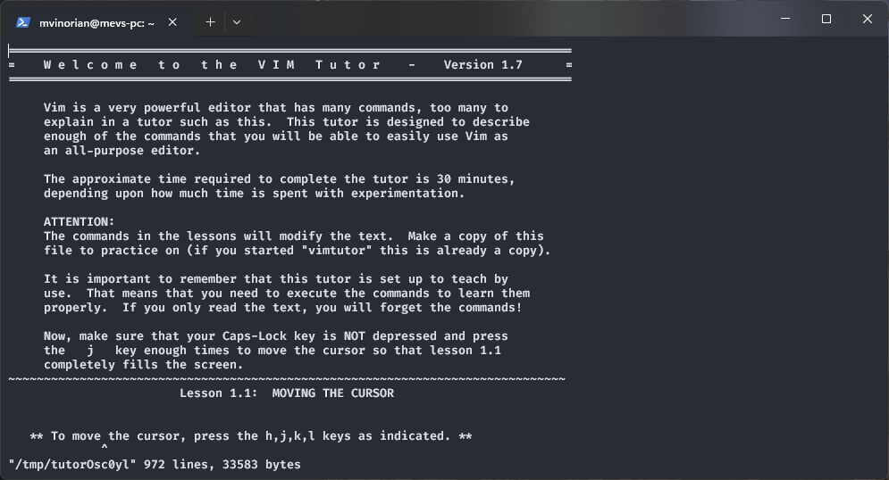

## Shell Scripting

### Pengertian Shell

Sistem operasi dibagi menjadi tiga komponen penting, yaitu Kernel, Shell, dan Program Utility yang dapat ditunjukkan seperti ilustrasi berikut.


- **Kernel** adalah inti dari komputer. Komponen ini memungkinkan terjadinya komunikasi antara software dan hardware. Jika Kernel adalah bagian terdalam dari sebuah sistem operasi, maka Shell adalah bagian terluarnya.

- **Shell** adalah program penerjemah perintah yang menjembatani user dengan Kernel. Umumnya, Shell menyediakan prompt sebagai user interface tempat user menginputkan perintah-perintah yang diinginkan, baik berupa perintah internal maupun eksternal. Setelah menerima input dari user dan menjalankan program atau perintah berdasarkan input tersebut, Shell akan mengeluarkan output. Shell dapat diakses melalui Terminal.

- **Program Utility** adalah system software yang menjalankan tugas-tugas maintenance. Program utility ini dibuat secara khusus untuk melakukan fungsi tertentu pada suatu area komputasi secara spesifik, seperti melakukan format harddisk, melakukan pengecekan konektivitas jaringan, dan lainnya.

### Pemrograman Shell

Shell scripting atau pemrograman shell adalah penyusunan beberapa perintah shell menjadi satu file yang melakukan serangkaian tugas tertentu. Pemrograman shell pada linux mirip dengan bahasa pemrograman yang berbasis intrepeter lainnya seperti python dan javascript.

### Operasi Dasar Shell

Berikut adalah beberapa operasi dasar pada shell.

#### **Redirection**

Terdapat beberapa macam redirection pada shell sebagai berikut.

- Isi dari file b akan diganti dengan output perintah a dengan operasi `a > b`

  ```sh
  ls -l > dir.txt
  # hasil output ls -l akan dikirim ke file dir.txt
  # akan membuat file dir.txt jika belum ada
  ```

- Output dari perintah a ditambahkan ke file b dengan operasi `a >> b`

  ```sh
  ls -la >> dir.txt
  # hasil output dari ls -la akan ditambahkan pada akhir file dir.txt
  ```

- Input dari perintah a adalah file b dengan operasi `a < b`

  ```sh
  sort < dir.txt
  # input dari sort merupakan file dir.txt
  ```

- Isi dari file b akan diganti dengan error dari perintah a dengan operasi `a 2> b`

  ```sh
  rm testfile.txt 2> error.log
  # error dari perintah tersebut akan dikirim ke file error.log
  # akan membuat file error.log jika belum ada
  ```

- Error dari perintah a ditambahkan ke file b dengan operasi `a 2>> b`

  ```sh
  rm anotherfile.txt 2>> error.log
  # error dari perintah tersebut akan ditambahkan pada akhir file error.log
  ```

#### **Pipe**

Output dari perintah a dapat dijadikan input perintah b menggunakan operator pipe `a | b`.

```sh
ls -l | sort | head -5
# output dari ls -l akan dijadikan input dari sort
# output dari sort akan dijadikan input dari head -5
# output dari head -5 akan dikeluarakan di terminal
```


#### **Wildcard**

Perintah dalam shell juga dapat menggunakan wildcard atau karakter sembarang yang dapat mengisi string. Berikut adalah jenis-jenis dari wildcard yang bisa digunakan dalam shell.

- Untuk menggantikan semua string dapat menggunakan `*`

  ```sh
  ls *.txt
  # akan menampilkan list file dengan ekstensi .txt
  ```

- Untuk menggantikan satu huruf saja dapat menggunakan `?`

  ```sh
  ls a?a.txt
  # akan menampilkan list file dengan nama file awal a
  # kemudian huruf sembarang dan selanjutnya huruf a
  ```

- Untuk menggantikan satu huruf dengan huruf tertentu saja dapat menggunakan `[]`

  ```sh
  ls a[dp]a.txt
  # akan menampilkan list file dengan nama file awal a
  # kemudian huruf d atau p dan selanjutnya huruf a
  ```

  ```sh
  ls a[p-s].txt
  # akan menampilkan list file dengan nama file awal a
  # kemudian huruf antara p hingga s selanjutnya huruf a
  ```

Berikut adalah hasil dari perintah dengan wildcard di atas.

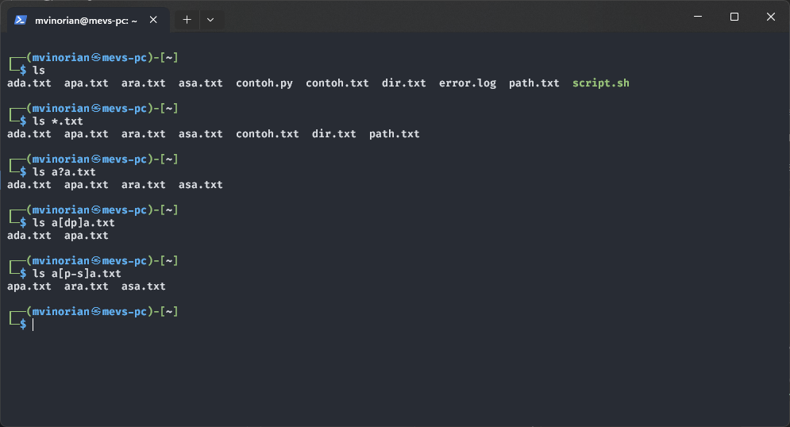

### Shell Script Sederhana

Untuk membuat shell script sederhana, dapat dilakukan dengan membuat file dengan ekstensi `.sh`.

```sh
nano hello.sh
```

Di dalam script `hello.sh` dapat dituliskan beberapa perintah shell. Namun sebelum itu, pada baris paling awal ditulis shebang `#!/bin/bash`.

Shebang berguna agar sistem mengetahui bahwa file `hello.sh` harus dijalankan oleh `/bin/bash` atau program bash. Karena file yang dibuat memiliki ekstensi `.sh`, jadi penggunaan shebang tidak terlalu berpengaruh. Jika file yang dibuat tidak memiliki ekstension apapun, maka perlu ditambahkan shebang pada baris paling awal.

```sh
#!/bin/bash

echo "Hello, world!"
```

Simpan perubahan pada file dan ubah permission dari file tersebut agar bisa dieksekusi.

```sh
chmod +x hello.sh
```

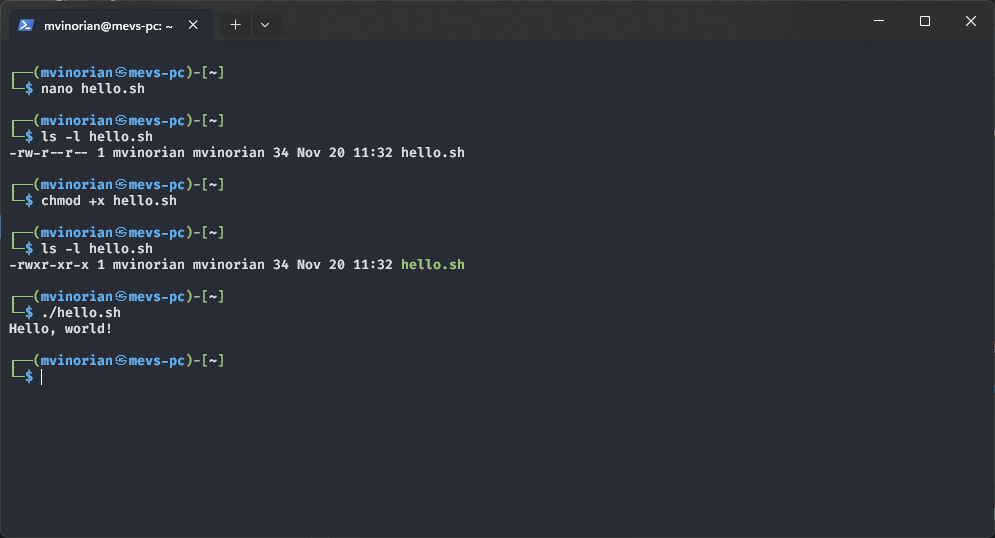

### Variabel

Sama seperti bahasa pemrograman lainnya, pada shell juga terdapat variabel. Terdapat beberapa hal yang perlu diperhatikan ketika mendefinisikan variabel.

- Nama variabel hanya boleh berisi dari karakter berikut
  - Huruf (a-z dan A-Z)
  - Angka (0-9)
  - Karakter underscore (-)
- Nama variabel dimulai dengan huruf atau underscore
- Bersifat case sensitive (huruf besar dan huruf kecil beda)

Mendeklarasikan variabel dapat dilakukan dengan operator `=`.

```sh
nama_var=nilai
```

Perlu diperhatikan bahwa tidak boleh terdapat spasi di antara `nama_var` dengan `=` dan juga `=` dengan `nilai`. Karena pada shell karakter spasi tidak diabaikan seperti bahasa pemrograman lainnya.

Untuk mengakses variabel dapat menggunakan simbol `$` sebelum nama variabel seperti berikut.

```sh
$nama_var
```

Variabel dalam shell tidak strongly typed, artinya tidak perlu dispesifikasikan tipe data variabel-nya. Berikut adalah beberapa deklarasi variabel dengan tipe datanya.

- String

  ```sh
  str1="ini string"
  str2='ini juga string'
  ```

- Number

  ```sh
  num1=19
  num2=12.5
  ```

- Array

  ```sh
  arr1=('satu' 'dua' 'tiga')
  arr2=(1 2 3)
  arr3=('satu' 2 'tiga')
  ```

  Akses variabel array dapat dilakukan dengan menggunakan sintaks berikut.

  ```sh
  ${arr1[0]} # mengakses arr1 indeks ke 0
  ${arr2[*]} # menampilkan semua elemen dari arr2
  ${#arr3[*]} # mengakses jumlah elemen dari arr3
  ```

Berikut adalah contoh penggunaan variabel dan juga keluarannya.

```sh
#!/bin/bash

str1="ini string"
str2='ini juga string'

echo $str1
echo $str2

num1=19
num2=12.5

echo $num1
echo $num2

arr1=('satu' 'dua' 'tiga')
arr2=(1 2 3)
arr3=('satu' 2 'tiga')

echo ${arr1[0]}
echo ${arr2[*]}
echo ${#arr3[*]}
```

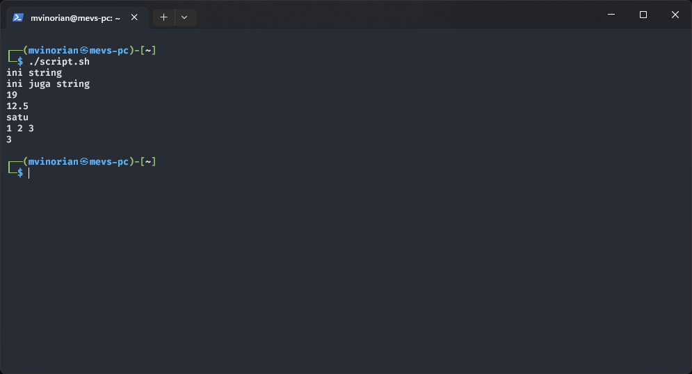

Terdapat variabel spesial dalam shell. Variabel berikut dapat diakses tanpa perlu dideklarasikan terlebih dahulu.

| Variabel | Deskripsi                                          |
| :------: | :------------------------------------------------- |
|    $0    | Berisi nama file yang sedang dijalankan            |
|    $n    | Berisi argumen ke-n dari pemanggilan script        |
|    $#    | Jumlah argumen dari pemanggilan script             |
|   $\*    | Berisi semua argumen dari pemanggilan script       |
|    $?    | Status exit dari perintah terakhir yang dijalankan |
|    $$    | Proses ID (PID) dari shell saat ini                |

Berikut adalah contoh penggunaan variabel tersebut dan juga keluarannya.

```sh
#!/bin/bash

echo "Nama script : $0"
echo "Argumen ke-1 : $1"
echo "Argumen ke-2 : $2"
echo "Hai $1, selamat datang di kelas $2!"
echo "Total argumen : $#"
echo "Semua argumen : $*"
echo "PID : $$"
```

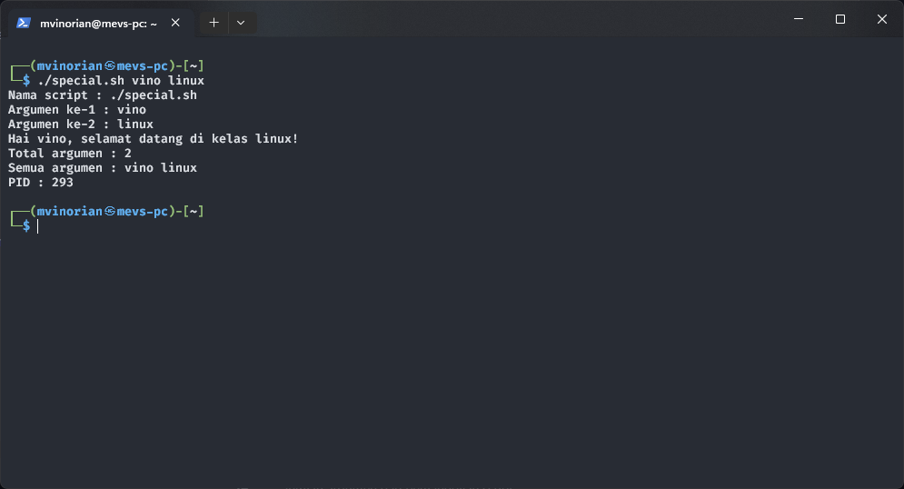

### Input dan Output

Untuk melakukan input dapat menggunakan perintah `read` dengan sintaks berikut.

```sh
read nama_var
```

Untuk melakukan output dapat menggunakan perintah `echo` dengan sintaks berikut.

```sh
echo $nama_var
```

Berikut adalah contoh penggunaan `read` dan `echo` beserta keluarannya.

```sh
#!/bin/bash

kelas='linux'

echo 'Siapa namamu?'
read nama
echo -e "Halo $nama!\nSelamat datang di kelas $kelas!\n"
```

Agar echo dapat merender `\n` sebagai karakter new line, perlu ditambahkan argumen `-e`.

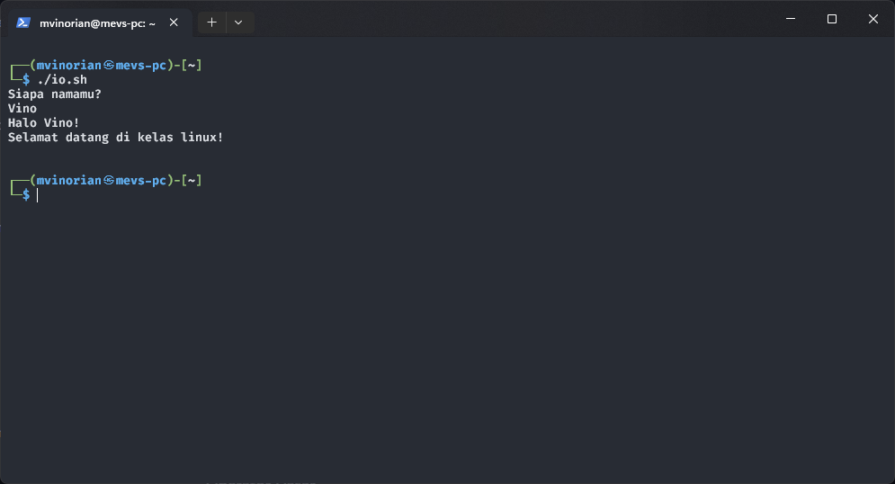

Selain menggunakan `echo`, output dalam shell juga dapat menggunakan `printf` seperti pada bahasa C.

```sh
#!/bin/bash

str='Ini string'
num1=12.956
num2=512

printf "str: %s\n" "$str"
printf "num1: %.2f\n" $num1
printf "num2: %d\n" $num2
```

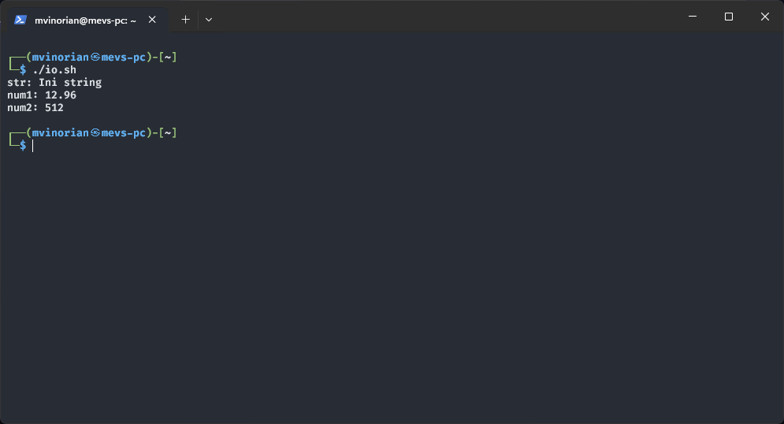

### Quoting

Terdapat beberapa metode quoting dan escaping dalam shell sebagai berikut.

| Quoting            | Deskripsi                                                                                        |
| ------------------ | ------------------------------------------------------------------------------------------------ |
| Single quote (`'`) | Semua karakter di dalam single quote akan dianggap sebagai string                                |
| Double quote (`"`) | Karakter `$`, `` ` ``, dan `\` dalam double quote dapat digunakan sebagaimana fungsinya di shell |
| Backslash (`\`)    | Karakter yang didahului backslash akan dianggap sebagai string                                   |
| Backtick (`` ` ``) | Perintah yang diletakkan dalam backtick akan dijalankan                                          |

Berikut adalah contoh penggunaan quoting dan juga keluarannya.

```sh
str='ini string'

echo '$str = "$str"'
echo "\$str = $str"
echo "pwd = `pwd`"
```

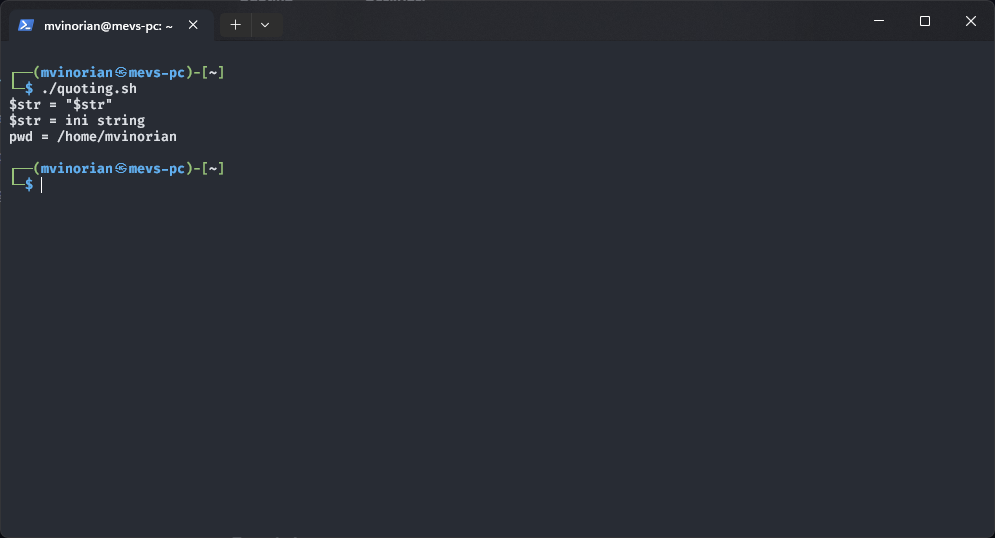

### Operator

Beberapa operator yang dapat digunakan dalam shell sebagai berikut.

1. Operator Aritmatika
2. Operator Relasional
3. Operator Logika
4. Operator Bitwise
5. Operator File Test

Namun yang akan dibahas lebih jauh hanyalah operator **arimatika** dan **relasional**.

#### **Operator Aritmatika**

| Operator | Deskripsi      |
| -------- | -------------- |
| +        | Penjumlahan    |
| -        | Pengurangan    |
| \*       | Perkalian      |
| /        | Pembagian      |
| %        | Sisa pembagian |
| ++       | Increment      |
| --       | Decrement      |

Untuk melakukan operasi aritmatika dapat menggunakan sintaks `$((10 + 2))` atau dengan perintah `expr`.

```sh
a=10
b=4

echo "a + b = $(($a + $b))"
echo "a - b = $(($a - $b))"
echo "a * b = $(($a * $b))"
echo "a / b = $(($a / $b))"
echo "a % b = $(($a % $b))"
echo "++a = $((++a))"
echo "a++ = $((a++))"
echo "--b = $((--b))"
echo "b-- = $((b--))"
```

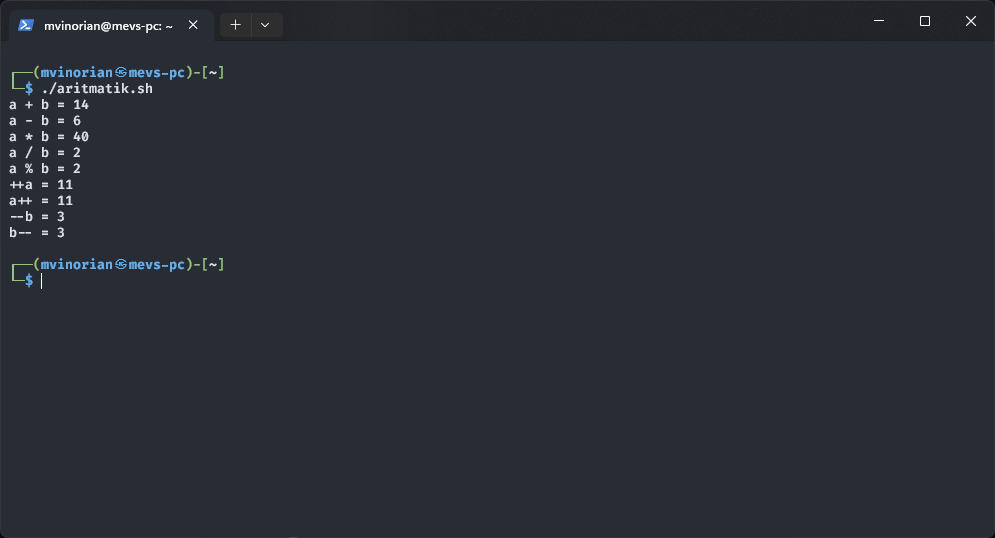

#### **Operator Relasional**

| Operator | Flag Ekuivalen | Deskripsi               |
| :------: | :------------: | ----------------------- |
|    ==    |      -eq       | Sama dengan             |
|    !=    |      -ne       | Tidak sama dengan       |
|    <     |      -lt       | Kurang dari             |
|    <=    |      -le       | Kurang dari sama dengan |
|    >     |      -gt       | Lebih dari              |
|    >=    |      -ge       | Lebih dari sama dengan  |

Operator relasional dapat digunakan dengan sintaks `$(( $a > $b ))` atau menggunakan sintaks `` `[[ $a -gt $b ]]` `` jika dengan flag.

```sh
#!/bin/bash

a=10
b=4

echo "a == b : $(($a == $b))"
echo "a != b : `[[ $a -ne $b ]] && echo '1' || echo '0'`"
echo "a < b : $(($a < $b))"
echo "a <= b : `[[ $a -le $b ]] && echo '1' || echo '0'`"
echo "a > b : $(($a > $b))"
echo "a >= b : `[[ $a -ge $b ]] && echo '1' || echo '0'`"
```

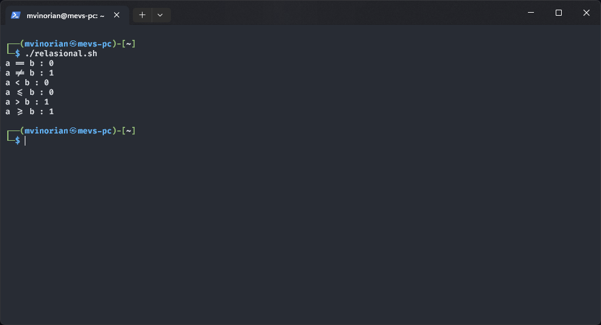

#### **Operator Logika**

| Operator | Deskripsi  |
| -------- | ---------- |
| &&       | Logika AND |
| \|\|     | Logika OR  |
| !        | Logika NOT |

#### **Operator Bitwise**

| Operator | Deskripsi           |
| -------- | ------------------- |
| &        | Bitwise AND         |
| \|       | Bitwise OR          |
| ^        | Bitwise XOR         |
| ~        | Bitwise NOT         |
| <<       | Bitwise Shift kiri  |
| >>       | Bitwise Shift kanan |

#### **Operator File Test**

| Operator | Deskripsi                      |
| -------- | ------------------------------ |
| -e       | Mengecek file ada              |
| -f       | Mengecek tipe file             |
| -d       | Mengecek tipe direktori        |
| -s       | Mengecek file tidak kosong     |
| -r       | Mengecek file dapat dibaca     |
| -w       | Mengecek file dapat ditulis    |
| -x       | Mengecek file dapat dieksekusi |

### Percabangan

Dalam shell juga terdapat percabangan seperti pada bahasa pemrograman lainnya.

Berikut adalah contoh percabangan dalam shell dan keluarannya.

```sh
#!/bin/bash

a=10
b=10

if [[ $a -gt $b ]]
then
  echo 'a > b'
elif [[ $a -lt $b ]]
then
  echo 'a < b'
else
  echo 'a == b'
fi
```

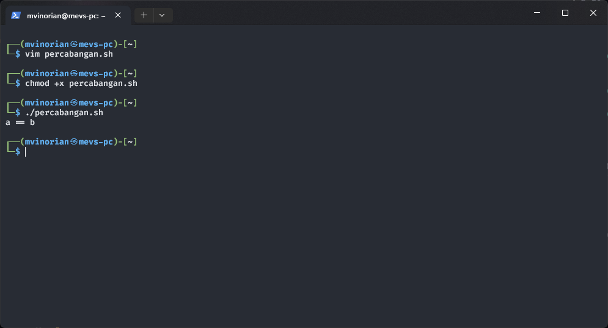

### Perulangan

Berikut adalah beberapa macam perulangan yang dapat digunakan dalam shell.

#### **Perulangan While**

Untuk menggunakan perulangan while dalam shell, dapat menggunakan contoh sintaks berikut.

```sh
#!/bin/bash

i=0

while [[ $i -lt 5 ]]
do
  echo $((i++))
done
```

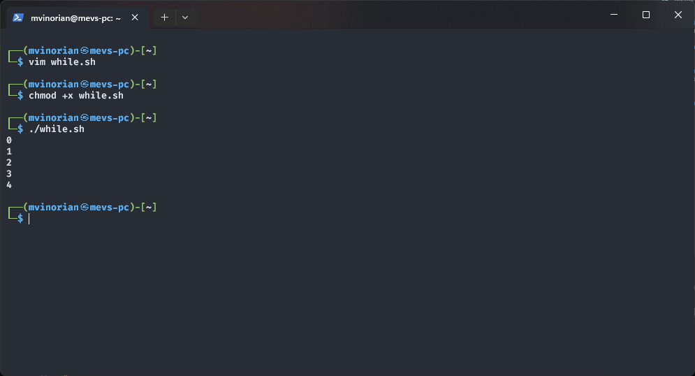

#### **Perulangan For**

Untuk menggunakan perulangan for dalam shell, dapat menggunakan beberapa contoh sintaks berikut.

```sh
#!/bin/bash

for i in 1 2 3 4 5
do
  echo $i
done
```

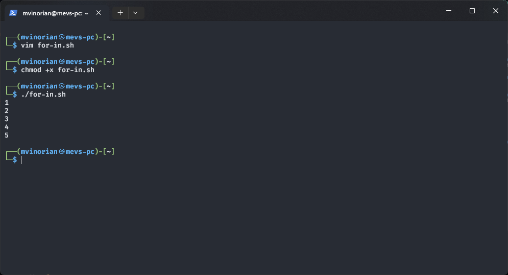

```sh
#!/bin/bash

for (( i = 0; i < 5; i++ ))
do
  echo $i
done
```

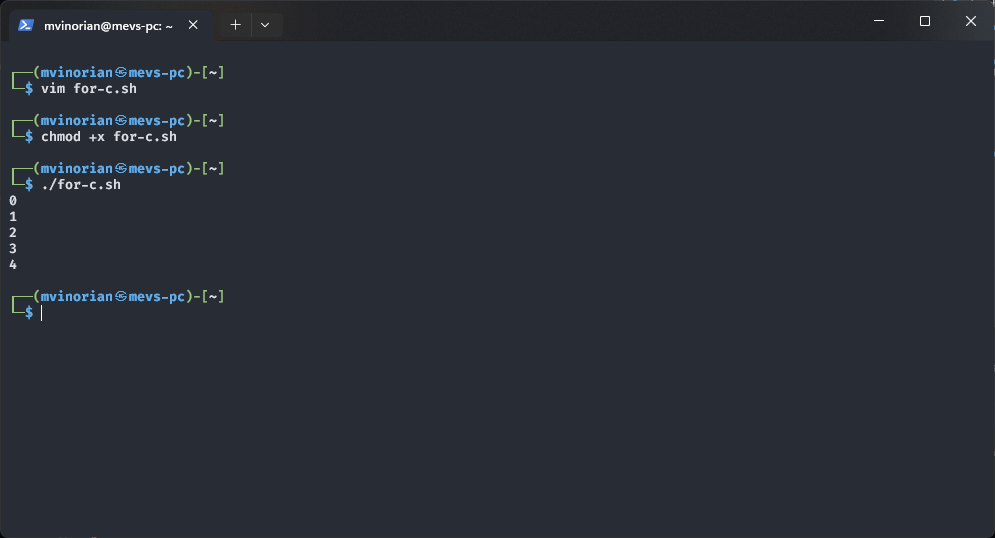

### Fungsi

Fungsi digunakan untuk memecah fungsionalitas keseluruhan script menjadi sub-bagian yang lebih kecil. Sub-bagian itu dapat dipanggil untuk melakukan tugas masing-masing apabila diperlukan. Berikut adalah contoh penggunaan fungsi dalam shell.

```sh
#!/bin/bash

# deklarasi fungsi
function ask_name() {
  echo "Siapa namamu?"
}

say_hello() {
  read nama
  echo "Hai $nama, selamat datang di praktikum sistem operasi!"
}

# pemanggilan fungsi
ask_name
say_hello
```

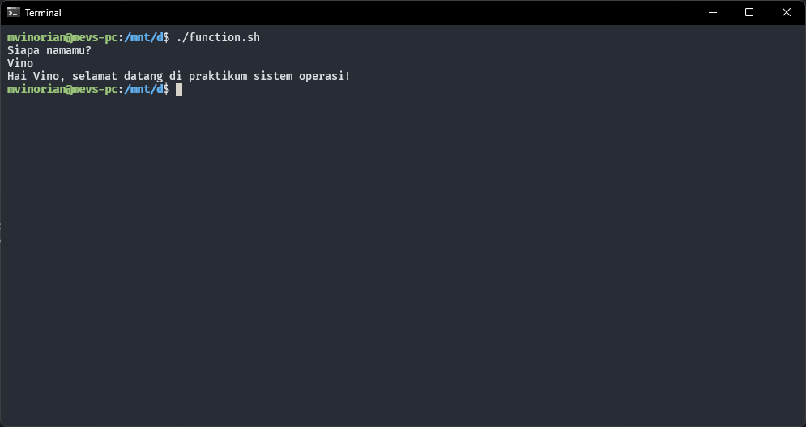

## Cron Jobs

### Pengertian Cron

Cron jobs adalah sebuah proses yang dilaksanakan dalam background yang memungkinkan user dari Linux untuk menjalankan perintah atau shell script pada waktu tertentu secara otomatis. Perintah atau script yang dijalankan oleh cron merupakan cron jobs.

Untuk mengelola cron jobs dapat menggunakan perintah crontab berikut.

```sh
crontab [-u user] [-l | -r | -e] [-i]
```

Keterangan:

- `-u` untuk membuat crontab pada user tertentu
- `-l` untuk menampilkan isi file crontab
- `-r` untuk menghapus file crontab
- `-e` untuk mengubah atau membuat file crontab jika belum ada
- `-i` untuk memberikan konfirmasi sebelum menghapus file crontab

### Pembuatan Cron Jobs

Untuk membuat atau mengubah cron jobs dapat dilakukan dengan membuka crontab menggunakan perintah berikut.

```sh
crontab -e
```

Berkut adalah isi dari crontab.

```
* * * * * perintah yang akan dijalankan
- - - - -
| | | | |
| | | | +- Hari    [0 -  6] (0 = Minggu)
| | | +--- Bulan   [1 - 12]
| | +----- Tanggal [1 - 31]
| +------- Jam     [0 - 23]
+--------- Menit   [0 - 59]
```

Untuk melihat daftar cron jobs pada crontab dapat menggunakan perintah berikut.

```sh
crontab -l
```

Berikut adalah contoh hasil crontab.

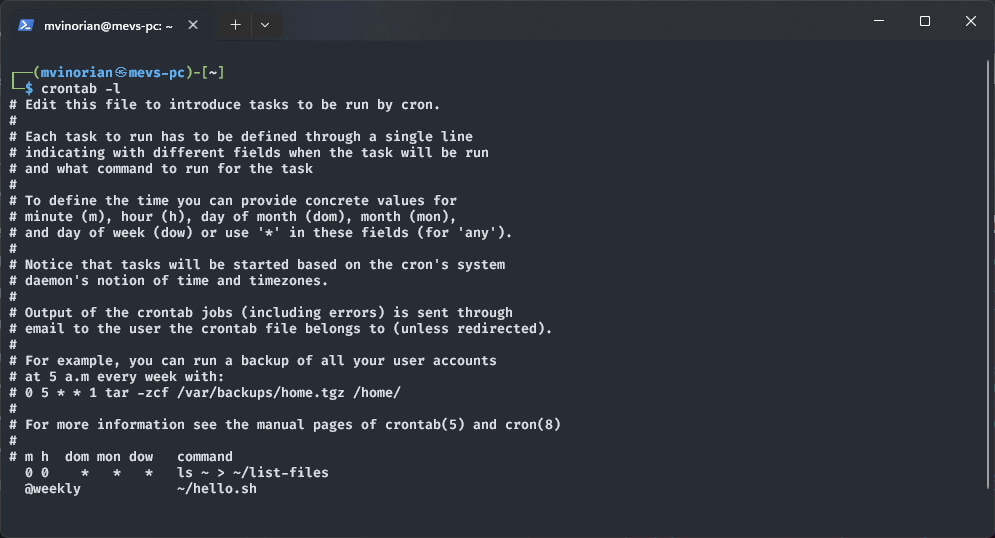

Cron job yang dimasukkan ke dalam crontab tersebut adalah untuk menjalankan perintah berikut.

- Setiap jam 0 dan menit 0 akan memasukkan hasil dari `ls ~` ke `~/list-files`
- Setiap minggu menjalankan `~/hello.sh`

Untuk referensi lebih lanjut mengenai perintah crontab dapat mengakses situs [crontab.guru](https://crontab.guru).

## AWK

### Pengertian AWK

AWK merupakan sebuah program yang bisa digunakan untuk mengambil catatan/record tertentu dalam sebuah file dan melakukan sebuah/beberapa operasi terhadap catatan/record tersebut.

Fungsi dasar AWK adalah memeriksa sebuah file per barisnya (atau satuan teks lain) yang mengandung pola tertentu. Ketika sebuah baris cocok dengan salah satu pola, AWK akan melakukan action tertentu pada baris tersebut. AWK melanjutkan proses sampai menemui end of file pada file yang menjadi masukan tadi.

AWK adalah bahasa scripting yang digunakan untuk memanipulasi data dan menghasilkan laporan. Bahasa pemrograman perintah AWK tidak memerlukan kompilasi, dan memungkinkan pengguna untuk menggunakan variabel, fungsi numerik, fungsi string, dan operator logika. AWK sebagian besar digunakan untuk pemindaian dan pemrosesan pola.

### Menjalankan Program AWK

Berikut adalah sintaks penggunaan AWK.

```sh
awk options 'pattern { actions }' input-file > output-file
```

- `options` adalah opsi yang dapat digunakan dalam AWK
  - `-f` untuk menggunakan file `.awk` sebagai input program
  - `-F` untuk mendefinisikan separator
  - `-v` untuk mendefinisikan variabel
- `pattern` adalah kriteria yang digunakan untuk memilih baris yang akan dioperasikan
- `actions` adalah operasi yang akan dilakukan pada baris yang dipilih

Misalkan terdapat file `kerajaan.txt` dengan isi sebagai berikut.

```
mataram sanjaya 732 760
kutai mulawarman  400 446
singasari ken 1222 1227
majapahit gajahmada 1334 1364
tarumanegara sanjaya 732 754
sriwijaya balaputradewa 792 835
```

Secara default, AWK akan melakukan output semua bari pada file masukan.

```sh
awk '{print}' kerajaan.txt
```

Untuk melakukan output baris yang mengandung pola tertentu, dapat menggunakan perintah berikut.

```sh
awk '/sanjaya/ {print}' kerajaan.txt
```

Maka akan menghasilkan output sebagai berikut.

```
mataram sanjaya 732 760
tarumanegara sanjaya 732 754
```

Dalam setiap baris, AWK akan membagi setiap kata yang dipisahkan oleh spasi (atau separator yang didefinisikan dengan option `-F`) dan menyimpannya pada variabel `$n`. Jika terdapat 4 kata pada satu baris, maka kata pertama akan disimpan pada variabel `$1`, kata kedua pada variabel `$2`, dan seterusnya. `$0` merepresentasikan semua kata yang ada pada satu baris.

Berikut adalah contoh penggunaan variabel pada AWK.

```sh
awk '/ken/ {print $1,$2}' kerajaan.txt
```

Maka akan menghasilkan output sebagai berikut.

```
singasari ken
```

> Dalam rule program AWK boleh menghilangkan hanya salah satu di antara action atau pola. Jika pola dihilangkan, maka action akan diberlakukan ke semua baris. Sedangkan jika action dihilangkan, maka setiap baris yang mengandung pola tersebut akan secara default ditampilkan secara penuh.

### BEGIN dan END

BEGIN dan END merupakan aturan khusus dalam AWK. Aturan BEGIN akan dieksekusi sebelum input dibaca, sedangkan aturan END akan dieksekusi setelah input selesai dibaca. Berikut adalah contoh penggunaan BEGIN dan END dalam AWK.

```sh
awk '
BEGIN { print "Ada berapa \"732\"?" }
/732/  { ++n }
END   { print "\"732\" muncul", n, "kali." }' kerajaan.txt
```

Maka akan menghasilkan output sebagai berikut.

```
Ada berapa "732"?
"732" muncul 3 kali.
```

> Pada contoh di atas, rule kedua hanya memiliki action untuk melakukan perhitungan berapa jumlah baris yang mengandung "732", namun tidak ada action untuk menampilkan (print).
