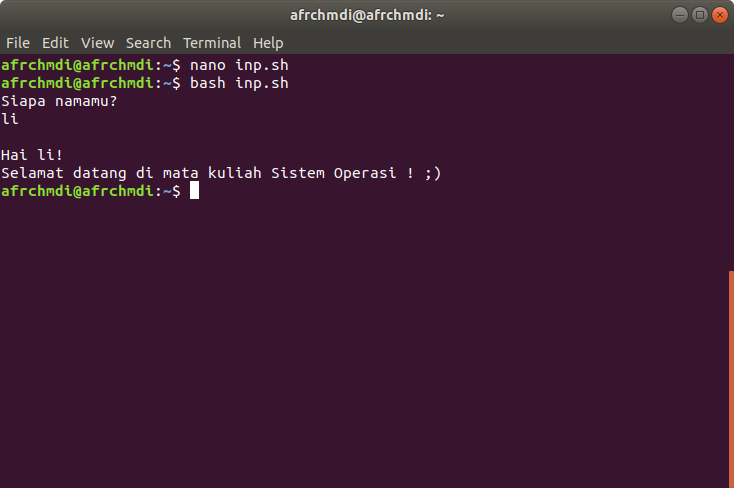

## Modul 1 Sistem Operasi 
# Shell Scripting, Cron, dan AWK
# Prasyarat

1. Melakukan instalasi OS Linux.
2. Mengenal OS Linux secara umum, termasuk juga mengenai ragam distro yang ada saat ini serta struktur direktorinya pada [Modul Pengenalan OS Linux](https://github.com/arsitektur-jaringan-komputer/lbe-ajk-2022/tree/master/Modul%201).
3. Memahami CLI (_Command Line Interface_) pada [Modul Pengenalan CLI](https://github.com/AZakyH/Modul-Pelatihan-Linux-2018/tree/master/CLI).

</br>

# Daftar Isi

- [Shell Scripting, Cron, dan AWK](#shell-scripting-cron-dan-awk)
- [Prasyarat](#prasyarat)
- [Daftar Isi](#daftar-isi)
- [Intermezzo](#intermezzo)
  - [Perintah dan Navigasi di Linux](#perintah-dan-navigasi-di-linux)
  - [Konsep *User* dan *Permission* di Linux](#konsep-user-dan-permission-di-linux)
    - [User (Pengguna)](#user-pengguna)
    - [Permission (Izin)](#permission-izin)
    - [Pengaturan Berkaitan dengan User dan Permission](#pengaturan-berkaitan-dengan-user-dan-permission)
  - [Pengenalan Teks Editor (Nano dan Vim)](#pengenalan-teks-editor-nano-dan-vim)
    - [1. Nano](#1-nano)
    - [2. Vim](#2-vim)
      - [Install Vim Teks Editor](#install-vim-teks-editor)
      - [Membuat dan Melakukan Insert Teks](#membuat-dan-melakukan-insert-teks)
      - [Keluar dari Teks Editor Vim](#keluar-dari-teks-editor-vim)
- [1. Shell *Scripting*](#1-shell-scripting)
  - [1.1 Apa itu Shell?](#11-apa-itu-shell)
  - [1.2 Pemrograman Shell](#12-pemrograman-shell)
  - [1.3 Perintah Dasar Shell](#13-perintah-dasar-shell)
  - [1.4 Simple Shell Script](#14-simple-shell-script)
  - [1.5 Variabel](#15-variabel)
    - [1.5.1 Special Variable](#151-special-variable)
  - [1.6 Input dan Output](#16-input-dan-output)
  - [1.7 Quoting](#17-quoting)
  - [1.8 Operator Dasar](#18-operator-dasar)
    - [1.8.1 Operator Aritmatika](#181-operator-aritmatika)
    - [1.8.2 Operator Relasional](#182-operator-relasional)
  - [1.9 Conditional Statements](#19-conditional-statements)
    - [1.9.1 If Else](#191-if-else)
    - [1.9.2 Switch Case](#192-switch-case)
  - [1.10 Loop](#110-loop)
    - [1.10.1 While loop](#1101-while-loop)
    - [1.10.2 For loop](#1102-for-loop)
    - [1.10.3 Until loop](#1103-until-loop)
    - [1.10.4 Select loop](#1104-select-loop)
    - [1.10.5 Nesting Loops](#1105-nesting-loops)
  - [1.11 Function](#111-function)
    - [1.11.1 Nested Function](#1111-nested-function)
    - [1.11.2 Konsep Local dan Global Variabel](#1112-konsep-local-dan-global-variabel)
- [2. Cron Jobs](#2-cron-jobs)
  - [2.1 Apa itu Cron Jobs?](#21-apa-itu-cron-jobs)
  - [2.2 Membuat atau Mengubah Cron Jobs](#22-membuat-atau-mengubah-cron-jobs)
- [3. AWK](#3-awk)
  - [3.1 Apa itu AWK?](#31-apa-itu-awk)
  - [3.2 Menjalankan Program AWK](#32-menjalankan-program-awk)
    - [Cara Kerja AWK](#cara-kerja-awk)
  - [3.2 Special Rules](#32-special-rules)
- [Extras (Bacaan Santai)](#extras-bacaan-santai)
  - [Ranger](#ranger)
    - [How to Install](#how-to-install)
    - [How to Use](#how-to-use)
  - [Referensi](#referensi)
  - [Latihan](#latihan)

</br>

# Intermezzo
## Perintah dan Navigasi di Linux

Pada Linux, terdapat beberapa perintah (command) dan juga navigasi yang umum digunakan sebagai berikut.

**Command Navigasi File dan Direktori:**

| Command      | Deskripsi |
| ----------- | ----------- |
| cd | untuk masuk ke direktori |
| ls | untuk melihat direktori |
| ll | untuk melihat direktori dengan detail |
| pwd | untuk melihat direktori aktif |
| find `<nama file>` | untuk mencari file |
| locate | untuk mencari file |

**Command Operasi File (Hapus, Buat, Edit File):**

| Command      | Deskripsi |
| ----------- | ----------- |
| cp `<asal> <tujuan>` | untuk menyalin file |
| mv `<asal> <tujuan>` | untuk memindahkan folder |
| rm `<file>` | untuk menghapus file |
| mkdir `<nama folder>` | untuk membuat folder |
| cat | untuk melihat isi file |
| echo | untuk menampilkan baris teks |
| sed | untuk melakukan filter teks |
| awk | untuk memindahkan teks |

**Command Untuk User dan Permission:**

| Command      | Deskripsi |
| ----------- | ----------- |
| sudo | untuk super user |
| su | untuk mengganti user id |
| passwd | untuk mengganti password |
| who | untuk menampilkan user |
| chmod | untuk mengganti hak akses |
| chown | mengganti hak milik |
| chgrp | untuk mengganti hak grup |

**Command Advance Lain:**

| Command      | Deskripsi |
| ----------- | ----------- |
| history | untuk melihat riwayat |
| grep | untuk mencari kata |
| sort | untuk mengurutkan |
| ps | untuk menampilkan snapshot |
| kill | untuk menghentikan program |
| tar | untuk mengumpulkan file |
| zip | untuk mengkompres file |
| unzip | untuk mengekstrak file |
| ssh | untuk akses jarak jauh |
| fdisk | untuk menampilkan partisi |
| mount | untuk melampirkan file |
| umount | untuk melakukan unmount |
| du | untuk menampilkan ukuran file |
| df | untuk menampilkan disk space |
| quota | menampilkan sisa disk space |
| jobs `<id program>` | menampilkan identitas proses |
| ifconfig | untuk melihat ip |
| date | untuk menampilkan tanggal |
| top | melihat proses secara urut |
| clear | membersihkan terminal |
| dpkg -i `<namapackage>.deb` | instalasi paket |
| uname | melihat versi kernel |

## Konsep *User* dan *Permission* di Linux

Di Linux, konsep user dan permission sangat penting untuk keamanan sistem dan untuk memungkinkan pengguna untuk mengakses dan memanipulasi berbagai file dan direktori pada sistem.

### User (Pengguna)

Di Linux, setiap aksi dijalankan oleh pengguna tertentu. Setiap pengguna diberikan sebuah username dan ID pengguna (UID) yang unik. Pengguna dapat memiliki password, dan mereka dapat dikonfigurasi untuk memiliki hak akses tertentu terhadap file dan direktori di sistem.

Ketika pengguna masuk ke sistem, mereka harus memasukkan nama pengguna dan kata sandi mereka untuk mengautentikasi diri mereka. Setelah pengguna berhasil masuk, mereka akan masuk ke sesi shell atau antarmuka grafis yang sesuai dengan hak akses yang telah ditentukan untuk akun pengguna tersebut.

### Permission (Izin)

Setiap file dan direktori di Linux memiliki tiga jenis izin: read (baca), write (tulis), dan execute (jalankan). Izin ini dapat dikonfigurasi untuk setiap pengguna dan grup pengguna yang ada di sistem.

Ketika suatu aksi dilakukan pada file atau direktori, sistem operasi akan mengecek izin pengguna dan grup pengguna yang terkait dengan file atau direktori tersebut. Jika pengguna atau grup pengguna tidak memiliki izin yang sesuai, maka sistem akan menolak aksi tersebut.

Beberapa contoh tindakan yang memerlukan izin adalah:

- Read: membaca isi file atau direktori
- Write: menulis atau membuat perubahan pada file atau direktori
- Execute: menjalankan atau memulai sebuah file atau direktori

Izin juga dapat diberikan pada level sistem, seperti pada kernel atau modul, dan dapat dikonfigurasi menggunakan perintah-perintah tertentu di terminal.

Dalam Linux, administrator sistem (atau root) memiliki hak akses penuh ke semua file dan direktori di sistem. Ini memungkinkan administrator untuk mengelola pengguna dan grup pengguna, serta mengkonfigurasi hak akses untuk setiap file dan direktori di sistem.

### Pengaturan Berkaitan dengan User dan Permission

**chmod**

`chmod` adalah singkatan dari "change mode" dan merupakan perintah di Linux yang digunakan untuk mengubah izin (permission) file atau direktori. Perintah ini memungkinkan pengguna untuk menetapkan hak akses untuk owner (pemilik file), group, dan other (pengguna lain) pada file atau direktori.

Format dari perintah chmod adalah sebagai berikut:

``` bash
chmod [mode] [file/directory]
```

Di mana mode merupakan kombinasi dari tiga digit yang mewakili izin baca, tulis, dan eksekusi. Digit pertama mewakili izin untuk owner, digit kedua untuk group, dan digit ketiga untuk other.

Untuk memberikan hak akses pada file atau direktori, Anda dapat menambahkan digit 4, 2, dan/atau 1 pada mode, masing-masing mewakili izin read (baca), write (tulis), dan execute (jalankan). Contohnya, chmod 755 file.txt akan memberikan hak baca, tulis, dan eksekusi untuk owner dan read serta execute untuk group dan other.

**chown**

`chown` adalah perintah di Linux yang digunakan untuk mengubah pemilik (owner) file atau direktori. Ketika Anda ingin mengubah hak akses file atau direktori, Anda harus mengetahui siapa pemiliknya, sehingga perintah chown sangat penting.

Format dari perintah chown adalah sebagai berikut:

``` bash
chown [owner]:[group] [file/directory]
```

Di mana owner adalah username pemilik yang baru dan group adalah grup pemilik yang baru. Jika Anda tidak ingin mengubah grup pemilik, cukup abaikan bagian ini. Contohnya, chown john:staff file.txt akan mengubah pemilik file.txt menjadi john dan grup pemiliknya menjadi staff.

**su dan sudo**

su (singkatan dari "switch user") dan sudo (singkatan dari "superuser do") adalah perintah Linux yang digunakan untuk beralih ke user lain dengan hak akses tertentu.

Perintah su digunakan untuk beralih ke user lain dengan hak akses root. Ketika perintah ini dijalankan, pengguna akan diminta memasukkan password root. Setelah berhasil memasukkan password, pengguna akan beralih ke user root.

Perintah sudo digunakan untuk menjalankan perintah sebagai superuser (root) dengan hak akses tertentu. Pengguna harus memasukkan password mereka sendiri (bukan password root) untuk menjalankan perintah ini. Contohnya, sudo apt-get update akan menjalankan perintah apt-get update dengan hak akses root.

## Pengenalan Teks Editor (Nano dan Vim)

### 1. Nano
Nano atau *Nano's ANOther editor* merupakan teks editor yang dikembangkan mirip dengan teks editor *Pico* yang menjadi editor default dari Pine. Nano termasuk teks editor yang *user-friendly* karena adanya *shortcut* pada bagian bawah editor sehingga memudahkan pengguna dalam menggunakan teks editor ini.

Syntax yang biasa digunakan adalah sebagai berikut.

```sh
$ nano [nama-file]
```  


Command tersebut akan memunculkan default nano-screen.


Untuk melihat list dari shortcut-shortcut yang ada tekan `Ctrl+G`.


Ketika `Ctrl+X` ditekan untuk keluar dari editor, pada bagian bawah di baris ketiga dari bawah akan muncul pertanyaan *Save modified buffer?* Tekan `Y` untuk menyimpan perubahan dari file, dan `N` untuk keluar dari teks editor nano tanpa menyimpan perubahan. 

Selain itu sebelum benar-benar keluar dari teks editor nano, kita juga dapat merubah nama file yang baru saja kita buat tadi. Cukup dengan mengganti nama file sebelumnya yang tertera pada bagian bawah teks editor dimana terdapat tulisan *File name to write: ...* lalu tekan Enter.   


### 2. Vim
Vim merupakan singkatan dari "Vi IMprovised" dan merupakan salah satu teks editor pada OS Linux yang dapat digunakan untuk mengedit jenis teks apapun, termasuk suatu program komputer. Vim diupgrade dari teks editor vi, yang memiliki beberapa peningkatan dari vi, beberapa diantaranya adalah syntax highlighting, on-line help, multi-windows dan buffers, dll. Untuk lebih jelas perbedaan antara vim dan vi  https://github.com/vim/vim/blob/master/runtime/doc/vi_diff.txt.
#### Install Vim Teks Editor
```sh
$ sudo apt update
```
```sh
$ sudo apt install -y vim
```
#### Membuat dan Melakukan Insert Teks 
Syntax yang biasa digunakan adalah `vim [nama-file]`. Setelah command tersebut dijalankan akan terlihat lambang `~` pada tiap baris yang kosong. 

```sh
$ vim nyoba.txt
```


Vim sekarang dalam *mode normal*. Untuk menginsertkan teks, maka ketik `i` untuk masuk ke *mode insert* dan diikuti dengan mengetikkan teks yang diinginkan.

Ketika kita menekan `i` untuk menginsertkan teks, karakter yang kita inputkan akan terketik sesuai dengan posisi kursor saat itu. Agar karakter yang kita inputkan terketik pada sebelah kanan posisi kursor, maka kembalikan vim pada mode normal, dan tekan `a`. Maka karakter yang kita inputkan akan terketik pada sebelah kanan posisi kursor saat itu.

Jika sudah selesai menginputkan teks, tekan `esc` dan vim akan kembali ke mode normal. Dalam mode normal, tekan `h` untuk bergerak ke kiri, `l` untuk ke kanan, `j` untuk bergerak ke atas dan `k` untuk ke bawah.  


#### Keluar dari Teks Editor Vim
1. Keluar ketika dalam mode insert tanpa menyimpan perubahan apa-apa dengan mengetikkan `:q!`
2. Keluar ketika dalam mode insert dengan menyimpan perubahan yang dilakukan `:wq`
3. Keluar dan menyimpan perubahan dilakukan pada mode normal dengan mengetikkan `ZZ`

Untuk mengeksplorasi lebih lanjut mengenai teks editor vim, terdapat tutorial vim yang bisa diakses melalui terminal.

```sh
$ vimtutor
```


</br>

# 1. Shell *Scripting*
## 1.1 Apa itu Shell?

Sistem operasi dibagi menjadi tiga komponen penting, yaitu Kernel, Shell, dan *Program Utility* yang dapat ditunjukkan seperti ilustrasi berikut.


- **Kernel** adalah inti dari komputer. Komponen ini memungkinkan terjadinya komunikasi antara *software* dan *hardware*. Jika Kernel adalah bagian terdalam dari sebuah sistem operasi, maka Shell adalah bagian terluarnya.
- **Shell** adalah program penerjemah perintah yang menjembatani *user* dengan Kernel. Umumnya, Shell menyediakan *prompt* sebagai *user* *interface* tempat *user* menginputkan perintah-perintah yang diinginkan, baik berupa perintah internal maupun eksternal. Setelah menerima input dari *user* dan menjalankan program atau perintah berdasarkan input tersebut, Shell akan mengeluarkan *output*. Shell dapat diakses melalui Terminal.
- ***Program Utility*** adalah *system* *software* yang menjalankan tugas-tugas *maintenance*. *Program* *utility* ini dibuat secara khusus untuk melakukan fungsi tertentu pada suatu area komputasi secara spesifik, seperti melakukan *format* harddisk, melakukan pengecekan konektivitas jaringan, dan lainnya.
  

> Catatan: Coba buka terminal di Linux, maka kamu akan menemukan *prompt* Shell (biasanya `$`). Di situ, kamu dapat mengetik *input* berupa perintah, kemudian mengeksekusinya dengan menekan tombol "Enter". *Output* akan ditampilkan di Terminal.

Ada 2 tipe Shell utama di Unix atau Linux, yaitu:

1. Bourne Shell - *Prompt* untuk Shell ini adalah `$`. 
    - Bourne Shell (sh)
    - POSIX Shell (sh)
    - Korn Shell (ksh)
    - Bourne Again Shell (bash)
2. C Shell - Prompt untuk Shell ini adalah `%`.
    - C Shell (csh)
    - TENEX/TOPS C Shell (tcsh)
## 1.2 Pemrograman Shell
Pemrograman Shell adalah menyusun beberapa perintah Shell (internal maupun eksternal) menjadi serangkaian perintah untuk melakukan tugas tertentu.
Kelebihan Shell di Linux adalah memungkinkan *user* untuk menyusun serangkaian perintah seperti halnya bahasa pemrograman interpreter, yakni melakukan proses input output, menyeleksi kondisi (*decision* *making*), *looping*, membuat fungsi, dan sebagainya.

Pemrograman Shell di Unix atau Linux juga disebut dengan Shell *scripting*. Untuk memudahkan, Shell *script* dapat disimpan ke dalam sebuah *file* yang dapat dieksekusi kapanpun kita inginkan.
    
Manfaat belajar Shell *scripting*:

- Dapat bekerja secara efektif dan efisien karena tidak perlu mengetik serangkaian perintah secara berulang-ulang, cukup menulis dan mengeksekusi satu file saja.

- Dapat menjalankan beberapa perintah sebagai satu perintah.

- Dapat menjalankan perintah secara otomatis.
## 1.3 Perintah Dasar Shell
Pada modul ini, jenis Shell yang digunakan adalah Bash (_Bourne Again Shell_) karena Bash paling banyak digunakan dalam distro Linux. Untuk mengecek Shell apa yang sedang kalian gunakan, bisa dengan menggunakan *script* berikut ini.

```bash
$ echo $SHELL
```

Shell memiliki perintah internal (*built*-*in* Shell) dan perintah eksternal. Untuk lebih jelasnya yaitu:
- Perintah internal (*built-in* Shell), yaitu perintah yang dibangun di dalam Shell. Eksekusi tidak harus mencari perintah dari variabel `PATH` yang di ada di Shell. Contoh perintah internal adalah `cd`, `pwd`, `times`, `alias`, `umask`, `exit`, `logout`, `fg`, `bg`, `ls`, `mkdir`, `rmdir`, `mv`, `cp`, `rm`, `clear`, dan lain sebagainya.
- Perintah eksternal, yaitu perintah yang tidak ada di dalam Shell. Ketika perintah dijalankan, Shell akan mencari perintah tersebut dalam variable `PATH` seperti `/usr/bin` dan `/bin`. Contoh perintah eksternal adalah `cat`, `cut`, `paste`, `chmod`, `lpr`, dan lain sebagainya.

Untuk mengecek apakah sebuah perintah termasuk internal atau eksternal, gunakan perintah *type* sebagai berikut.

```bash
$ type cd
cd is a Shell builtin
$ type bash
bash is /bin/bash
$ type read
read is a Shell builtin 
$ type chmod
chmod is /bin/chmod
```

Selain itu, terdapat beberapa karakter yang cukup penting untuk digunakan dalam Shell:

- __Redirection__ (mengirim *output* ke *file* atau menerima *input* dari *file*) menggunakan operator *redirect* `>`, `>>`, `<`, `2>>` . Implementasinya sebagai berikut.

```bash
ls /home/Documents > test.txt
#hasil output ls dari directori /home/Documents dikirim ke file test.txt. jika file belum ada akan dibuat, tetapi jika sudah ada, isinya akan ditimpa

ls /home/Documents >> test.txt
#hampir sama, bedanya jika file sudah ada maka isinya akan ditambah di akhir file

sort < test.txt
#file test.txt dijadikan input oleh perintah sort

bash script.sh 2>> error.log
#Jika terdapat error saat menjalankan script.sh, pesan error akan masuk ke error.log
```

- __Pipe__ (*output* suatu perintah menjadi *input* perintah lain) menggunakan operator `|`. Implementasinya sebagai berikut.
  
```bash
ls -l | sort -s
#ouput perintah ls -l menjadi input perintah sort -s (urutkan secara descending)
```
- __Wildcard__ menggunakan karakter `*`, `?`, `[ ]`. Implementasinya sebagai berikut.
  
```bash
ls a*
#tampilkan semua file yang dimulai dengan a

ls a?a
#tampilkan file yang dimulai dengan a, kemudian sembarang karakter tunggal, dan diakhiri dengan a

ls [re]*
#tampilkan file yang dimulai dengan salah satu karakter r atau e
```

Untuk melihat informasi selengkapnya tentang Bash Shell, silahkan membuka manual bash dengan cara sebagai berikut.

```bash
$ man bash
```

## 1.4 Simple Shell Script
Buatlah sebuah *file* berekstensi `.sh` menggunakan editor apapun, misalnya Nano, Vi, atau Gedit.

```bash
$ nano nama_file.sh
```
Misalnya:

```
$ nano hello.sh
```

Tulis beberapa baris perintah disana, diawali dengan shebang `#!/bin/bash`. 

Shebang berfungsi untuk memberitahu sistem bahwa perintah-perintah yg ada di dalam *file* tersebut harus dijalankan oleh Bash.

```bash
#!/bin/bash
echo "Hello, world!"
```

Simpan dan ubah *permission* *file* *script* agar dapat dieksekusi.

```bash
$ chmod +x hello.sh
```

Eksekusi *file script* dengan cara `./nama_file.sh` atau `bash nama_file.sh`.


## 1.5 Variabel
- Beberapa hal yang perlu diperhatikan dalam mendefinisikan variabel adalah sebagai berikut.

    i. Nama variabel hanya boleh terdiri dari:
    - Huruf (a-z dan A-Z).
    - Angka (0-9).
    - Karakter *underscore* (_).
    
    ii.  Nama variabel dimulai dengan huruf atau *underscore*.
    
    iii. Tidak boleh menggunakan karakter spesial seperti !, *, $, #, -, dll karena karakter tersebut punya makna khusus untuk Shell.

    iv. Bersifat *case* *sensitive* (membedakan huruf besar dan kecil).

- *Syntax*

    - Mendefinisikan variabel
  
    ```
    nama_var=nilai
    ```

    - Mengakses variabel
  
    ```
    $nama_var
    ```

- Tipe-Tipe Variabel
    - String
    ```
    nama_var="string"
    ```
    - Integer
    ```
    nama_var=nilai
    ```
    - Array
        
        #Jika isi array berupa string
    
        nama_var=("string0" "string1" "string2" ... "stringN")

        #Jika isi array berupa integer
        
        nama_var=(nilai0 nilai1 nilai2 ... nilaiN)    

Contoh:
```bash
#!/bin/bash

mata_kuliah="Sistem Operasi"
semester=12
mahasiswa=("Jamal" "Taufik" "Dobleh" "Kabur")

echo "Variabel string:" $mata_kuliah
echo "Variabel integer:" $semester
echo "Variabel array ke-1:" ${mahasiswa[2]}
```
Output:


### 1.5.1 Special Variable
Beberapa special variable yang sering dipakai:

| Variable                                        | Deskripsi                                                                            |
| --------------------------------------------------------- |:--------------------------------------------------------------------------------------- |
|   $0   | Berisi nama file script yang sedang dijalankan
|   $n   | n disini adalah angka desimal positif yang sesuai dengan posisi argumen (argumen pertama adalah $1, argumen kedua adalah $2, dst)
|   $#   | Jumlah argumen yang diinput pada script
|   $*   | Semua argumen $n
|   $?   | Status exit dari perintah terakhir yang dijalankan
|   $$   | Proses ID (PID) Shell saat ini


Contoh:
```bash
#!/bin/bash

echo "Nama script : $0"
echo "Argumen ke-1 : $1"
echo "Argumen ke-2 : $2"
echo "Hai $1, selamat datang di kelas $2!"
echo "Total argumen : $#"
echo "Semua argumen : $*"
echo "PID : $$" 
```
Output:


## 1.6 Input dan Output
- `read` digunakan untuk mengambil input dari keyboard dengan syntax sebagai berikut.

    `read nama_var`

- `echo` digunakan untuk menampilkan output dengan syntax sebagai berikut.

    #Menampilkan teks biasa

    `echo "teks"`

    #Menampilkan isi dari sebuah variabel

    `echo $nama_var`

> Catatan:
>
> Jika ingin menggunakan new line character (\n) pada echo, gunakan `echo -e "teks\n teks"`

Contoh:
```bash
#!/bin/bash

matakuliah="Sistem Operasi"

echo "Siapa namamu?"
read nama
echo -e "\nHai $nama!\nSelamat datang di mata kuliah $matakuliah ! ;)"
```
Output:



Selain echo, bash juga menyediakan perintah builtin printf untuk menampilkan output dengan format tertentu, mirip bahasa C. Contoh:
```bash
#!/bin/bash

matkul="Sistem Operasi";
angka=12;

printf "Ini enter\n\tdi bash\n";
printf "Matakuliah apa? %s\n" $matkul;
printf "%d decimal dalam float = %.2f\n" $angka $angka
```
Output:


## 1.7 Quoting
Shell Unix/Linux memiliki beberapa karakter spesial yang disebut dengan **metakarakter**. Karakter tersebut punya makna khusus jika digunakan di dalam Shell script. Beberapa macam metakarakter:
```bash
* ? [ ] ' " \ $ ; & ( ) | ^ < > new-line space tab
```

Ada 4 jenis **quoting**, yaitu:

| No | Quoting | Deskripsi|
|---|---|---|
| 1 | Single Quote (') | Semua metakarakter di antara single quote akan kehilangan makna khusus |
| 2 | Double Quote (") | Sebagian besar metakarakter di antara double quote akan kehilangan makna khusus, kecuali `$, backquote, \$, \', \", \\` |
| 3 | Backslash (\\) | Karakter apa pun setelah backslash akan kehilangan makna khusus |
| 4 | Backquote (`) | Apa pun di antara back quote akan diperlakukan sebagai perintah dan akan dieksekusi |

Contoh:   
```bash
#!/bin/bash

single=3

#Single quote
echo '$single'

#Double quote
echo "$single"

#Backslash
echo \<-\$1500.\*\*\>\; \(update\?\) \[y\|n\]

#Backquote
dmn=`pwd`
echo "Dimana kita? " $dmn
```

Output:   


Lebih banyak dapat dilihat sendiri di `man bash`

## 1.8 Operator Dasar
Ada beberapa jenis operator yang didukung oleh Shell, yaitu:
  1. Operator Aritmatika
  2. Operator Relasional
  3. Operator Boolean
  4. Operator String
  5. Operator File Test

Namun yang akan dibahas lebih jauh hanyalah operator **aritmatika** dan **relasional**.

### 1.8.1 Operator Aritmatika

| No | Operator | Deskripsi |
|---|---|---|
| 1 | + | Penjumlahan |
| 2 | - | Pengurangan |
| 3 | * | Perkalian |
| 4 | / | Pembagian |
| 5 | % | Modulus (sisa pembagian) |
| 6 | = | Menempatkan nilai di sisi kanan ke variabel di sisi kiri |
| 7 | == | Membandingkan 2 nilai yang sama |
| 8 | != | Membandingkan 2 nilai yang tidak sama |

Ada 3 cara yang dapat digunakan untuk melakukan operasi matematika, yaitu:
1. Menggunakan perintah built-in **let**.
2. Menggunakan perintah eksternal **expr** .
3. Menggunakan perintah subtitusi ` $((ekspresi))`.

Contoh:   
```bash
#!/bin/bash

a=15
b=7

#memakai let
let jumlah=$a+$b
let kurang=$a-$b
let kali=$a*$b

#memakai expr
bagi=`expr $a / $b`

#memakai perintah subtitusi $((ekspresi))
mod=$(($a % $b)) 

echo "a + b = $jumlah"
echo "a - b = $kurang"
echo "a * b = $kali"
echo "a / b = $bagi"
echo "a % b = $mod"

b=$a

echo "a = $a"
echo "b = $b"
```

Output:


### 1.8.2 Operator Relasional

| No | Operator | Deskripsi | 
|---|---|---|
| 1 | -eq | Memeriksa apakah nilai kedua operan sama (==) |
| 2 | -ne | Memeriksa apakah nilai kedua operan tidak sama (!=) |
| 3 | -gt | Memeriksa apakah nilai operan kiri lebih besar daripada operan kanan (>) |
| 4 | -lt | Memeriksa apakah nilai operan kiri lebih kecil daripada operan kanan (<)  |
| 5 | -ge | Memeriksa apakah nilai operan kiri lebih besar atau sama dengan operan kanan (>=) |
| 6 | -le | Memeriksa apakah nilai operan kiri lebih kecil atau sama dengan operan kanan (<=) |

Operator relasional biasanya digunakan bersama dengan conditional statements, contoh:   
```bash
#!/bin/bash

a=15
b=7

if [ $a -eq $b ]
then
  echo "$a -eq $b: a sama dengan b"
else
  echo "$a -eq $b: a tidak sama dengan b"
fi
```
Output:   
```bash
15 -eq 7: a tidak sama dengan b
```

## 1.9 Conditional Statements
**Conditional statements** digunakan untuk memungkinkan program dapat membuat keputusan yang benar dengan memilih tindakan tertentu berdasarkan syarat/kondisi tertentu. Ada 2 jenis conditional statements dalam Unix Shell, yaitu **If else** dan **Switch case**.
  
### 1.9.1 If Else
Syntax:
```bash
if [ kondisi1 ]
then 
  perintah1 
elif [ kondisi2 ]
then
  perintah2 
else
  alternatif_perintah
fi
```
Contoh:
```bash
#!/bin/bash

cintaku=100
cintanya=88

if [ $cintaku == $cintanya ]
then
  echo "cintaku sama dengan cintanya"
elif [ $cintaku -gt $cintanya ]
then
  echo "cintaku lebih besar dari cintanya"
elif [ $a -lt $cintanya ]
then
  echo "cintaku lebih kecil dari cintanya"
else
  echo "Tidak ada kondisi yang memenuhi"
fi
```
Output:
```bash
cintaku lebih besar dari cintanya
```

### 1.9.2 Switch Case
Syntax:
```bash
case var in
  pola1)
    perintah1 
    ;;
  pola2)
    perintah2 
    ;;
  *)
    alternatif_perintah
    ;;
esac
```
Contoh:
```bash
#!/bin/bash

echo "Aku udah suka sama kamu dari lama, kamu mau ga jadi pacar aku?"
echo "1. Ya"
echo "2. Tidak"
echo "3. Aku gak bisa jawab sekarang"
echo -n "jawab: "
read jawaban

case "$jawaban" in
  "1")
    echo "Ga ada hal yang lebih aku tunggu dari ini, terimakasih!!!"
    ;;
  "2")
    echo "Oke, maaf ya udah ganggu waktu kamu"
    ;;
  "3")
    echo "Gantung aja aku, gantung aja!!!"
    ;;
  *)
    echo "Apa apa? Gimana??"
    ;;
esac
```
Output:   


## 1.10 Loop
**Loop** digunakan untuk mengeksekusi serangkaian perintah berulang kali. Ada beberapa macam Shell loops:
  1. While loop
  2. For loop
  3. Until loop
  4. Select loop

### 1.10.1 While loop
**While loop** digunakan untuk mengeksekusi serangkaian perintah berulang kali **selama** suatu kondisi terpenuhi. While digunakan jika kita ingin memanipulasi suatu variabel secara berulang-ulang.
Syntax:
```bash
while kondisi
do
  perintah 
done
```
Contoh:
```bash
#!/bin/bash

a=0

while [ $a -lt 10 ]
do
echo $a
  a=$((a + 2))
done
```
Output:
```bash
0
2
4
6
8
```
### 1.10.2 For loop
**For loop** digunakan untuk mengulang serangkaian perintah untuk setiap item pada daftar.
Syntax:
```bash
for var in daftar_item
do
  perintah 
done
```
Contoh:
```bash
#!/bin/bash

for num in 1 2 3 4 5
do
  echo $num
done
```
Selain itu, bisa ditulis seperti ini:
```bash
#!/bin/bash

for ((num=1; num<=5; num=num+1))
do
  echo $num
done
```
Output:
```bash
1
2
3
4
5
```

### 1.10.3 Until loop
Berbeda dengan while, **until loop** digunakan untuk mengeksekusi serangkaian perintah berulang kali **sampai** suatu kondisi terpenuhi.
Syntax:
```bash
until kondisi
do
  perintah
done
```
Contoh:
```bash
#!/bin/bash

a=0

until [ ! $a -lt 10 ]
do
  echo $a
  a=$((a + 2))
done
```
Output:
```bash
0
2
4
6
8
```

### 1.10.4 Select loop
**Select loop** digunakan ketika kita ingin membuat sebuah program dengan beberapa daftar pilihan yang bisa dipilih oleh user, misalnya daftar menu.
Syntax:
```bash
select var in daftar_item
do
  perintah
done
```
Contoh:
```bash
#!/bin/bash

select minuman in teh kopi air jus susu semua gaada
do
  case $minuman in
    teh|kopi|air|semua)
      echo "Maaf, habis"
      ;;
    jus|susu)
      echo "Tersedia"
    ;;
    gaada)
      break
    ;;
    *) echo "Tidak ada di daftar menu"
    ;;
  esac
done
```
Output:   


### 1.10.5 Nesting Loops
Semua jenis loop di atas mendukung konsep nesting, artinya kita dapat menempatkan satu loop ke dalam loop lain, baik loop yang sejenis maupun berbeda jenis
Contoh:
```bash
#!/bin/sh

a=0

while [ "$a" -lt 10 ]  #loop1
do
  b="$a"
  while [ "$b" -ge 0 ]  #loop2
  do
    echo -n "$b "
    b=`expr $b - 1`
  done
  echo ""
  a=`expr $a + 1`
done
```
Output:
```bash
0
1 0
2 1 0
3 2 1 0
4 3 2 1 0
5 4 3 2 1 0
6 5 4 3 2 1 0
7 6 5 4 3 2 1 0
8 7 6 5 4 3 2 1 0
9 8 7 6 5 4 3 2 1 0
```
## 1.11 Function
**Fungsi** digunakan untuk memecah fungsionalitas keseluruhan script menjadi sub-bagian yang lebih kecil. Sub-bagian itu dapat dipanggil untuk melakukan tugas masing-masing apabila diperlukan.
Syntax:
```bash
nama_fungsi () { 
  perintah1
  perintah2
  ...
  perintahN
}
```
Contoh:
```bash
#!/bin/bash
#define functions
ask_name() {
  echo "Siapa namamu?"
}
reply() {
  read nama
  echo "Hai $nama, selamat datang di praktikum sistem operasi!"  
}

#call functions
ask_name
reply
```
Output:   


### 1.11.1 Nested Function
Sama halnya dengan loop, function juga bisa menerapkan konsep nested. Dimana kita bisa memanggil sebuah fungsi di dalam fungsi.
```bash
#!/bin/bash

#define functions
ask_name() {
  echo "Siapa namamu?"
  reply   #call reply function inside ask_name function
}
reply() {
  read nama
  echo "Hai $nama, selamat datang di praktikum sistem operasi!"
}

#call functions
ask_name
```
Output:   


### 1.11.2 Konsep Local dan Global Variabel
Ketika menggunakan bash, variabel akan otomatis menjadi variabel global jika di-assign secara langsung seperti `bulan=6`. Tetapi kita bisa membuat variabel lokal untuk fungsi di bash dengan menggunakan keyword `local`. Variabel lokal yang terbuat tidak akan menjadi variabel global.

Contoh:

```bash
#!/bin/bash

fac_func() {
    angka=2
    local tmp=10
    echo "Global Variable di Dalam Fungsi : $angka"
    echo "Local Variable di Dalam Fungsi : $tmp"
}

fac_func

echo "Global Variable di Luar Fungsi : $angka"
echo "Local Variable di Luar Fungsi : $tmp"
```

Output:


Dari gambar terlihat bahwa ketika kita mencoba melakukan print local variable ke terminal tidak bisa keluar.


</br>


# 2. Cron Jobs

## 2.1 Apa itu Cron Jobs?
Cron jobs adalah sebuah service daemon yang memungkinkan user Linux dan Unix untuk menjalankan perintah atau _script_ pada waktu tertentu secara otomatis. Perintah-perintah dan/atau script-script yang dijalankan cron disebut cron jobs.
Syntax crontab adalah sebagai berikut.
```bash
crontab [-u user] [-l | -r | -e] [-i]
```

Penjelasan:
* `-l` untuk menampilkan isi file crontab.
* `-r` untuk menghapus file crontab.
* `-e` untuk mengubah atau membuat file crontab jika belum ada.
* `-i` untuk memberikan pertanyaan konfirmasi terlebih dahulu sebelum menghapus file crontab.

## 2.2 Membuat atau Mengubah Cron Jobs
1. Ketikkan `crontab -e`
2. Ketikkan perintah crontab sesuai aturan parameter crontab   
   
3. Untuk melihat daftar cron jobs ketikkan `crontab -l`

Contoh perintah yang dijalankan crontab   
   
Penjelasan :
* setiap jam 00.00 memasukkan hasil `ls /home/tamtama` ke file `/home/tamtama/list_files`
* setiap minggu menjalankan file `script.sh` pada folder `/home/tamtama`

Untuk belajar lebih lanjut perintah-perintah crontab bisa mengakses website [crontab guru](https://crontab.guru/).   


</br>

# 3. AWK

## 3.1 Apa itu AWK?
__Awk__ merupakan sebuah program yang bisa digunakan untuk mengambil catatan/record tertentu dalam sebuah file dan melakukan sebuah/beberapa operasi terhadap catatan/record tersebut.

Fungsi dasar awk adalah memeriksa sebuah file per barisnya (atau satuan teks lain) yang mengandung pola tertentu. Ketika sebuah baris cocok dengan salah satu pola, awk akan melakukan action tertentu pada baris tersebut. awk melanjutkan proses sampai menemui end of file pada file yang menjadi masukan tadi.

> FYI: awk versi baru dinamakan gawk, tapi biasanya tetap disebut awk.

Awk adalah bahasa scripting yang digunakan untuk memanipulasi data dan menghasilkan laporan. Bahasa pemrograman perintah awk tidak memerlukan kompilasi, dan memungkinkan pengguna untuk menggunakan variabel, fungsi numerik, fungsi string, dan operator logika. Awk sebagian besar digunakan untuk pemindaian dan pemrosesan pola.

## 3.2 Menjalankan Program AWK
Syntax:
```bash
awk options 'selection _criteria {action }' input-file > output-file
```
### Cara Kerja AWK
- Awk membaca baris dalam sebuah file.

- Untuk beberapa baris, ini dicocokkan dengan pola yang dibuat. Jika polanya cocok maka keputusan selanjutnya bisa dilakukan, seperti print misalnya.

- Jika tidak ada pola yang cocok, maka tidak ada action/keputusan yang akan diambil.

- Memberikan pola atau action tidak diharuskan.

- Jika tidak ada pola yang dibuat, maka output default nya adalah setiap baris dari file yang anda pakai.

- Jika tidak ada action/keputusan yang dibuat, maka output default nya adalah memunculkan hasil pencarian pada layar anda.

- Kurung kurawal tanpa action itu artinya tidak ada keputusan, tapi tidak akan memunculkan output default tadi.

- Setiap statemen dalam action harus di pisahkan dengan tanda titik koma (;)

Misalnya kita memiliki data kerajaan sebagai berikut:
```
mataram sanjaya 732 760
kutai mulawarman  400 446
singasari ken 1222 1227
majapahit gajahmada 1334 1364
tarumanegara sanjaya 732 754
sriwijaya balaputradewa 792 835
```
Secara default awk akan print semua baris pada file masukan:  
`awk '{print}' kerajaan.txt`  

Print baris yang mengandung pola yang dimasukkan:
`awk '/sanjaya/ {print}' kerajaan.txt`  
Maka hasilnya adalah sebagai berikut:

```
mataram sanjaya 732 760
tarumanegara sanjaya 732 754
```

Dalam setiap baris, awk akan membagi setiap kata yang dipisahkan oleh spasi dan menyimpannya pada variabel $n. Jika terdapat 4 kata pada satu baris, maka kata pertama akan disimpan pada variabel $1, kata kedua pada variabel $2, dan seterusnya. $0 merepresentasikan semua kata yang ada pada satu baris.

`awk '/ken/ {print $1,$2}' kerajaan.txt`  
Maka hasilnya adalah sebagai berikut:
```
singasari ken
```
Catatan: Dalam rule program awk boleh menghilangkan hanya salah satu di antara action atau pola. Jika pola dihilangkan, maka action akan diberlakukan ke semua baris. Sedangkan jika action dihilangkan, maka setiap baris yang mengandung pola tersebut akan secara default ditampilkan secara penuh.

## 3.2 Special Rules
Program awk memiliki rule yang memiliki kelakuan khusus. Di antaranya adalah BEGIN dan END. Rule BEGIN hanya dieksekusi satu kali, yaitu sebelum input dibaca. Rule END pun juga dieksekusi satu kali, hanya setelah semua input selesai dibaca. Contoh:

```bash
awk '
BEGIN { print "Ada berapa \"732\"?" }
/732/  { ++n }
END   { print "\"732\" muncul", n, "kali." }' kerajaan.txt
```

Maka hasilnya adalah sebagai berikut:

```
Ada berapa "732"?

"732" muncul 2 kali.
```

Pada contoh di atas, rule kedua hanya memiliki action untuk melakukan perhitungan berapa jumlah baris yang mengandung "732", namun tidak ada action untuk menampilkan (print).


</br>

# Extras (Bacaan Santai)
## Ranger


Ranger merupakan file manager di terminal yang menggunakan key-key dari VI. Ranger menyediakan user interface yang minimalis dan bagus dengan menampilkan hierarki dari directory. Ranger sendiri bisa secara otomatis mencari program yang sesuai untuk mengeksekusi suatu file berdasarkan tipe-nya.

### How to Install
Cara menginstal Ranger sendiri cukup sederhana:
- Dengan perintah `sudo apt-get install ranger` 
- Dengan menggunakan PyPI, menggunakan command `pip install ranger-fm`.

### How to Use
- Buka terminal.
- Ketik `ranger`.
- Maka interface untuk Ranger akan langsung terbuka.
- Gunakan key `h` untuk pergi ke directory sebelumnya.
- Gunakan key `l` untuk pergi ke directory selanjutnya dan membuka file.
- Gunakan key `j` untuk mengarahkan cursor ke bawah.
- Gunakan key `k` untuk mengarahkan cursor ke atas.
- Gunakan key `q` untuk keluar.
- Gunakan key `!` atau `s` untuk mengeksekusi command Shell, contoh `! touch my_text.txt`, lalu tambahakan `-w` sebelum command untuk melihat output dari command tersebut.

</br>

## Referensi
* [https://www.tutorialspoint.com/unix/shell_scripting.htm](https://www.tutorialspoint.com/unix/shell_scripting.htm)
* [https://pemula.linux.or.id/programming/bash-Shell.html](https://pemula.linux.or.id/programming/bash-Shell.html)
* [https://www.computerhope.com/unix/ucrontab.htm](https://www.computerhope.com/unix/ucrontab.htm)
* [https://www.codepolitan.com/memahami-perintah-perintah-crontab-paling-lengkap-59f69445130a0](https://www.codepolitan.com/memahami-perintah-perintah-crontab-paling-lengkap-59f69445130a0)
* [https://vpswp.blogspot.com/2015/06/definisi-dan-6-contoh-fungsi-perintah-awk-linux.html](https://vpswp.blogspot.com/2015/06/definisi-dan-6-contoh-fungsi-perintah-awk-linux.html)
* [https://www.codepolitan.com/belajar-bash-mencoba-bash-untuk-pertama-kali-57bbca3c28e54-17341](https://www.codepolitan.com/belajar-bash-mencoba-bash-untuk-pertama-kali-57bbca3c28e54-17341)
* [https://pemula.linux.or.id/programming/bash-Shell.html](https://pemula.linux.or.id/programming/bash-Shell.html)
* [https://github.com/ranger/ranger](https://github.com/ranger/ranger)
* [https://www.geeksforgeeks.org/internal-and-external-commands-in-linux/#:~:text=The%20UNIX%20system%20is%20command,are%20built%20into%20the%20shell.&text=External%20Commands%20%3A%20Commands%20which%20aren't%20built%20into%20the%20shell](https://www.geeksforgeeks.org/internal-and-external-commands-in-linux/#:~:text=The%20UNIX%20system%20is%20command,are%20built%20into%20the%20shell.&text=External%20Commands%20%3A%20Commands%20which%20aren't%20built%20into%20the%20shell)
* [https://tldp.org/LDP/abs/html/localvar.html](https://tldp.org/LDP/abs/html/localvar.html)


</br>

## Latihan


Fredryn Samba uhuk uhuk sangat tertarik sekali dengan pengaturan server. Cita-citanya adalah menjadi Security Engineer di JhonOjol. Suatu hari, dia diterima menjadi salah satu Security Engineer di JhonOjol. Dalam masa probation-nya, dia diberikan beberapa tasks. Tetapi Fredryn Samba masih proses dalam pengerjaan Tugas Akhir. Sehingga Fredryn Samba meminta kamu untuk menjadi joki dari tasknya. Berikut task yang diberikan ke Fredryn Samba.

1. Server JhonOjol sering diakses rekan se-divisinya, sehingga ia diminta oleh atasannya untuk mencatat setiap user yang melakukan login ke server beserta command atau perintah yang diinputkan.
    Konfigurasi yang digunakan adalah:
    - file script diletakan di direktori `root’
    - File log disimpan di /var/log
    - file log disimpan dengan ektensi `.txt`, nama file harus unique dengan kombinasi `date +%Y%m%d_%H. Contoh:
      20230222_110401_log.txt.
    - Untuk file lognya hanya menyimpan 50 command yang dinputkan.

2. Jhon LBF (pemilik JhonOjol), mentornya meminta Fredryn Samba untuk membuat user baru yang nantinya digunakan oleh rekan-rekannya dengan username Admin dan passwordnya bebas, dimana user ini memiliki akes yang mirip dengan dengan superuser atau root namun tidak bisa menggunakan command `su`, `rm`, dan `rmdir`. Login lah dengan user Admin dan lakukan beberapa pengujian.
