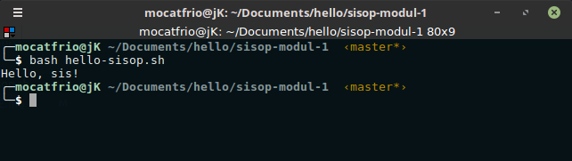
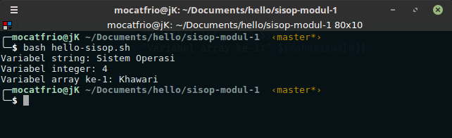
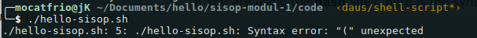
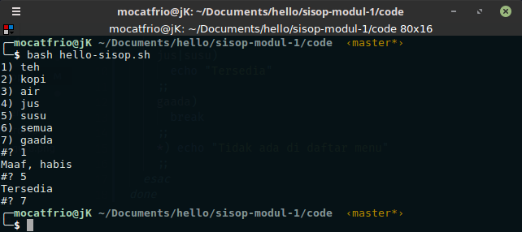
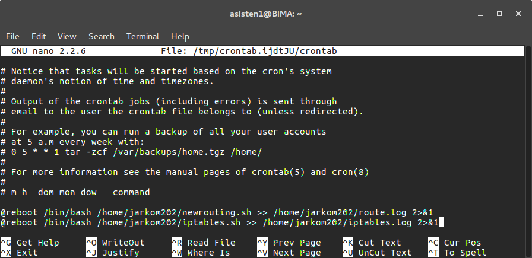

## Modul 1 Sistem Operasi
# Shell Scripting, Cron, dan AWK

## Prasayarat
1. Menginstall Sistem Operasi **Linux** 
2. Paham **CLI (Command Line Interface)** - [Modul Pengenalan CLI](https://github.com/raldokusuma/modul-pengenalan-CLI)
   
## Daftar Isi
  - [1. Shell Scripting](#1-shell-scripting)
    - [1.1 Shell](#11-shell)
    - [1.2 Pemrograman Shell](#12-pemrograman-shell)
    - [1.3 Perintah Dasar Shell](#13-perintah-dasar-shell)
    - [1.4 Simple Shell Script](#14-simple-shell-script)
    - [1.5 Variabel](#15-variabel)
      - [1.5.1 Special Variable](#151-special-variable)
    - [1.6 Input Output](#16-input-output)
    - [1.7 Quoting](#17-quoting)
    - [1.8 Operator Dasar](#18-operator-dasar)
      - [1.8.1 Operator Aritmatika](#181-operator-aritmatika)
      - [1.8.2 Operator Relasional](#182-operator-relasional)
    - [1.9 Conditional Statements](#19-conditional-statements)
      - [1.9.1 If...Else](#191-ifelse)
      - [1.9.2 Case...Esac](#192-caseesac)
    - [1.10 Loop](#110-loop)
      - [1.10.1 While loop](#1101-while-loop)
      - [1.10.2 For loop](#1102-for-loop)
      - [1.10.3 Until loop](#1103-until-loop)
      - [1.10.4 Select loop](#1104-select-loop)
      - [1.10.5 Nesting Loops](#1105-nesting-loops)
    - [1.11 Function](#111-function)
      - [1.11.1 Nested Functions](#1111-nested-functions)
    - [1.12 Referensi](#112-referensi)
  - [2. Cron](#2-cron)
    - [2.1 Menambahkan atau mengubah cron job](#21-menambahkan-atau-mengubah-cron-job)
    - [2.2 Referensi](#22-referensi)
  - [3. AWK](#3-awk)
    - [3.1 Menjalankan program awk](#31-menjalankan-program-awk)
    - [3.2 Special Rules](#32-special-rules)
    - [3.3 Referensi](#33-referensi)
  - [4. Latihan](#4-latihan)

## 1. Shell Scripting
### 1.1 Shell
Sebuah sistem operasi terdiri dari dua komponen utama, yaitu **Kernel** dan **Shell**.


* **Kernel** adalah inti dari komputer. Komponen ini memungkinkan terjadinya komunikasi antara software dan hardware. Jika kernel adalah bagian terdalam dari sebuah sistem operasi, maka **shell** adalah bagian terluarnya.
* **Shell** adalah program penerjemah perintah yang menjembatani user dengan kernel. Umumnya, shell menyediakan **prompt** sebagai user interface tempat user menginputkan perintah-perintah yang diinginkan, baik berupa perintah internal maupun eksternal. Setelah menerima input dari user dan menjalankan program/perintah berdasarkan input tersebut, shell akan mengeluarkan output. Shell dapat diakses melalui **Terminal**.

> Catatan: Coba buka terminal di Linux, maka kamu akan menemukan **prompt** shell (biasanya **$**). Disitu, kamu dapat mengetik input berupa perintah, kemudian mengeksekusinya dengan menekan tombol "Enter". Output akan ditampilkan di terminal.

Ada 2 tipe shell utama di Unix/Linux, yaitu:
1. **Bourne Shell** - Prompt untuk shell ini adalah **$**
   * Bourne Shell (sh)
   * POSIX Shell (sh)
   * Korn Shell (ksh)
   * Bourne Again SHell (bash) 
2. **C Shell** - Prompt untuk shell ini adalah **%**
   * C Shell (csh)
   * TENEX/TOPS C Shell (tcsh)

### 1.2 Pemrograman Shell
* **Pemrograman shell** adalah menyusun beberapa perintah shell (internal maupun eksternal) menjadi serangkaian perintah untuk melakukan tugas tertentu.
* Kelebihan shell di Linux adalah memungkinkan user untuk menyusun serangkaian perintah seperti halnya bahasa pemrograman interpreter, yakni melakukan proses input output, menyeleksi kondisi (decision making), looping, membuat fungsi, dsb. 
* Pemrograman shell di Unix/Linux juga disebut dengan **shell scripting**. Untuk memudahkan, shell script dapat disimpan ke dalam sebuah **file** yang dapat dieksekusi kapanpun kita inginkan.
* Manfaat belajar shell scripting:
  * Dapat bekerja secara efektif dan efisien karena tidak perlu mengetik serangkaian perintah secara berulang-ulang, cukup menulis dan mengeksekusi satu file saja
  * Dapat menjalankan beberapa perintah sebagai satu perintah
  * Dapat menjalankan perintah secara otomatis

### 1.3 Perintah Dasar Shell
* Shell yang digunakan dalam modul ini adalah **Bash** karena paling banyak digunakan pada distro Linux. Untuk memastikan shell apa yang kalian gunakan, coba lakukan:
  ```bash
  $ echo $SHELL
  ```
* Shell memiliki perintah **internal** (built-in shell) dan perintah **eksternal**. Untuk mengecek apakah sebuah perintah termasuk internal atau eksternal, gunakan perintah `type`
  ```bash
  $ type cd
  cd is a shell builtin
  $ type bash
  bash is /bin/bash
  $ type read
  read is a shell builtin 
  $ type chmod
  chmod is /bin/chmod
  ```
  * Contoh perintah **internal**: `cd, pwd, times, alias, umask, exit, logout, fg, bg, ls, mkdir, rmdir, mv, cp, rm, clear, ...`
  * Contoh perintah **eksternal**: `cat, cut, paste, chmod, lpr,...`. Beberapa perintah eksternal dapat dilihat di [Modul Pengenalan CLI](https://github.com/raldokusuma/modul-pengenalan-CLI)

* Selain itu, ada beberapa karakter yang cukup penting untuk digunakan dalam shell:
  * **Redirection** (mengirim output ke file atau menerima input dari file) menggunakan operator redirect `>, >>, <`, contoh:
      ```bash
      ls > data.txt
      #hasil output ls dikirim ke file data. jika file belum ada akan dibuat, tetapi jika sudah ada, isinya akan ditimpa

      ls >> data.txt
      #hampir sama, bedanya jika file sudah ada maka isinya akan ditambah di akhir file

      sort < data.txt
      #file data dijadikan input oleh perintah sort
      ```
  * **Pipe** (output suatu perintah menjadi input perintah lain) menggunakan operator `|`, contoh:
      ```bash
      ls -l | sort -s
      #ouput perintah ls -l menjadi input perintah sort -s (urutkan secara descending)
      ```
  * **Wildcard** menggunakan karakter `*, ?, [ ]`, contoh:
      ```bash
      ls i*
      #tampilkan semua file yang dimulai dengan i

      ls i?i
      #tampilkan file yang dimulai dengan i, kemudian sembarang karakter tunggal, dan diakhiri dengan i

      ls [ab]*
      #tampilkan file yang dimulai dengan salah satu karakter a atau b
      ```
* Untuk melihat informasi selengkapnya tentang bash shell, silahkan membuka manual bash dengan cara:
  ```bash
  man bash
  ```

### 1.4 Simple Shell Script
1. Buatlah sebuah file berekstensi **.sh** menggunakan editor apapun, misalnya `nano`, `vi`, atau `gedit`.
    ```bash 
    nano nama_file.sh
    ```
    Misalnya:
    ```bash 
    nano hello-sisop.sh
    ```
2. Tulis beberapa baris perintah disana, diawali dengan **shebang** `#!/bin/bash`. Shebang berfungsi untuk memberitahu sistem bahwa perintah-perintah yg ada di dalam file tersebut harus dijalankan oleh Bash.
     ```bash 
    #!/bin/bash

    echo "Hello, sis!"
    ```

3. Simpan dan ubah permission file script agar dapat dieksekusi.
    ```bash
    chmod +x hello-sisop.sh
    ```
4. Eksekusi file script dengan cara `./nama_file.sh` atau `bash nama_file.sh`.

    

### 1.5 Variabel
* Beberapa hal yang perlu diperhatikan dalam mendefinisikan variabel:
   1. Nama variabel hanya boleh terdiri dari:
        * **Huruf** (a-z dan A-Z)
        * **Angka** (0-9)
        * Karakter **underscore** (_)
   2. Nama variabel dimulai dengan huruf atau underscore
   3. Tidak boleh menggunakan karakter spesial seperti `!, *, $, #, -`, dll karena karakter tersebut punya makna khusus untuk shell
   4. Bersifat case sensitive (membedakan huruf besar dan kecil)

* Syntax 
  * Mendefinisikan variabel
    ```bash
    nama_var=nilai
    ```
  * Mengakses variabel
    ```bash
    $nama_var
    ```
* Tipe-Tipe Variabel
  * String
    ```bash
    nama_var="string"
    ```
  * Integer
    ```bash
    nama_var=nilai
    ```
  * Array
    ```bash
    #Jika isi array berupa string
    nama_var=("string0" "string1" "string2" ... "stringN")
    
    #Jika isi array berupa integer
    nama_var=(nilai0 nilai1 nilai2 ... nilaiN)    
    ```

* Contoh:

  ```bash
  #!/bin/bash

  mata_kuliah="Sistem Operasi"
  semester=4
  mahasiswa=("Khawari" "Raldo" "Aguel" "Tamtam")

  echo "Variabel string:" $mata_kuliah
  echo "Variabel integer:" $semester
  echo "Variabel array ke-1:" ${mahasiswa[0]}
  ```
  Output:

  
    
  Catatan:
  * Syntax array diatas hanya dapat dieksekusi oleh **bash**, sehingga harus dieksekusi dengan cara `bash nama_file.sh` atau `bash ./nama_file.sh`. Jika menggunakan `./nama_file.sh` saja akan muncul error:
    
    

#### 1.5.1 Special Variable
* Beberapa special variable yang sering dipakai:

  | Variabel | Deskripsi |
  |---|---|
  | $0 | Berisi nama file script yang sedang dijalankan |
  | $n | n disini adalah angka desimal positif yang sesuai dengan posisi argumen (argumen pertama adalah `$1`, argumen kedua adalah `$2`, dst) |
  | $# | Jumlah argumen yang diinput pada script |
  | $* | Semua argumen $n |
  | $? | Status exit dari perintah terakhir yang dijalankan |
  | $$ | Proses ID (PID) shell saat ini |

* Contoh:

  ```bash
  #!/bin/bash

  echo "Nama script : $0"
  echo "Argumen ke-1 : $1"
  echo "Argumen ke-2 : $2"
  echo "Hai $1, selamat datang di kelas $2!"
  echo "Total argumen : $#"
  echo "Semua argumen : $*"
  echo "PID : $$" 
  ```
  Output:

  

### 1.6 Input Output

* **read** digunakan untuk mengambil input dari keyboard dengan syntax sebagai berikut:
  ```bash
  read nama_var
  ```  
* **echo** digunakan untuk menampilkan output dengan syntax sebagai berikut:
  ```bash
  #Menampilkan teks biasa
  echo "teks"

  #Menampilkan isi dari sebuah variabel
  echo $nama_var
  ```
  Catatan:
  * Jika ingin menggunakan **new line character** (\n) pada echo, gunakan `echo -e "teks\n teks"`

* Contoh:
  ```bash
  #!/bin/bash

  matakuliah="Sistem Operasi"

  echo "Siapa namamu?"
  read nama
  echo -e "\nHai $nama!\nSelamat datang di praktikum $matakuliah:))))"
  ```
  Output:

  

* Selain echo, bash juga menyediakan perintah builtin **printf** untuk menampilkan output dengan format tertentu, mirip bahasa C. Contoh:
  ```bash
  #!/bin/bash

  matkul="Sisop";
  angka=32;

  printf "Coba enter\n\tdi bash\n";
  printf "Matakuliah %s\n" $matkul;
  printf "%d decimal dalam float = %.2f\n" $angka $angka
  ```
  Output:

  


### 1.7 Quoting 
* Shell Unix/Linux memiliki beberapa karakter spesial yang disebut dengan **metakarakter**. Karakter tersebut punya makna khusus jika digunakan di dalam shell script. Beberapa macam metakarakter:
  ```bash
  * ? [ ] ' " \ $ ; & ( ) | ^ < > new-line space tab
  ```

* Ada 4 jenis **quoting**, yaitu:
  
  | No | Quoting | Deskripsi|
  |---|---|---|
  | 1 | Single Quote (') | Semua metakarakter di antara single quote akan kehilangan makna khusus |
  | 2 | Double Quote (") | Sebagian besar metakarakter di antara double quote akan kehilangan makna khusus, kecuali `$, backquote, \$, \', \", \\` |
  | 3 | Backslash (\\) | Karakter apa pun setelah backslash akan kehilangan makna khusus |
  | 4 | Backquote (`) | Apa pun di antara back quote akan diperlakukan sebagai perintah dan akan dieksekusi |

* Contoh:
  ```bash
  #!/bin/bash

  single=3

  #Single quote
  echo '$single'

  #Double quote
  echo "$single"

  #Backslash
  echo \<-\$1500.\*\*\>\; \(update\?\) \[y\|n\]

  #Backquote
  date=`date`
  echo "Hari ini:" $date
  ```

  Output:

  


* **Backslash Character**

  | Karakter | Deskripsi |
  |---|---|
  | \n | New line (baris baru) |
  | \a | Alert bell |
  | \b | Backspace |

  Lebih banyak dapat dilihat sendiri di `man bash`

### 1.8 Operator Dasar
* Ada beberapa jenis operator yang didukung oleh shell, yaitu:
  1. Operator Aritmatika
  2. Operator Relasional
  3. Operator Boolean
  4. Operator String
  5. Operator File Test

  Namun yang akan dibahas lebih jauh hanyalah operator **aritmatika** dan **relasional**.

#### 1.8.1 Operator Aritmatika

| No | Operator | Deskripsi | 
|---|---|---|
| 1 | + | Penjumlahan | 
| 2 | - | Pengurangan | 
| 3 | * | Perkalian |
| 4 | / | Pembagian |
| 5 | % | Modulus (sisa pembagian) | 
| 6 | = | Menempatkan nilai di sisi kanan ke variabel di sisi kiri |
| 7 | == | Membandingkan 2 nilai yang sama |
| 8 | != | Membandingkan 2 nilai yang tidak sama |

* Ada 3 cara yang dapat digunakan untuk melakukan operasi matematika, yaitu:
  1. Menggunakan perintah built-in **let**
  2. Menggunakan perintah eksternal **expr** atau **awk** 
  3. Menggunakan perintah subtitusi ` $((ekspresi))`

* Contoh:
  ```bash
  #!/bin/bash

  a=15
  b=7

  #memakai let
  let jumlah=$a+$b
  let kurang=$a-$b
  let kali=$a*$b

  #memakai expr
  bagi=`expr $a / $b`

  #memakai perintah subtitusi $((ekspresi))
  mod=$(($a % $b)) 
  
  echo "a + b = $jumlah"
  echo "a - b = $kurang"
  echo "a * b = $kali"
  echo "a / b = $bagi"
  echo "a % b = $mod"

  b=$a

  echo "a = $a"
  echo "b = $b"
  ```
  
  Output:

  

#### 1.8.2 Operator Relasional

| No | Operator | Deskripsi | 
|---|---|---|
| 1 | -eq | Memeriksa apakah nilai kedua operan sama (==) |
| 2 | -ne | Memeriksa apakah nilai kedua operan tidak sama (!=) |
| 3 | -gt | Memeriksa apakah nilai operan kiri lebih besar daripada operan kanan (>) |
| 4 | -lt | Memeriksa apakah nilai operan kiri lebih kecil daripada operan kanan (<)  |
| 5 | -ge | Memeriksa apakah nilai operan kiri lebih besar atau sama dengan operan kanan (>=) |
| 6 | -le | Memeriksa apakah nilai operan kiri lebih kecil atau sama dengan operan kanan (<=) |

* Operator relasional biasanya digunakan bersama dengan conditional statements, contoh:
  ```bash
  #!/bin/bash

  a=15
  b=7

  if [ $a -eq $b ]
  then
    echo "$a -eq $b: a sama dengan b"
  else
    echo "$a -eq $b: a tidak sama dengan b"
  fi
  ```
  Output:
  ```bash
  15 -eq 7: a tidak sama dengan b
  ```
  

### 1.9 Conditional Statements
* **Conditional statements** digunakan untuk memungkinkan program dapat membuat keputusan yang benar dengan memilih tindakan tertentu berdasarkan syarat/kondisi tertentu.
* Ada 2 jenis conditional statements dalam Unix shell, yaitu:
  1. **if...else**
  2. **case...esac**
   
#### 1.9.1 If...Else
* Syntax
  ```bash
  if [ kondisi1 ]
  then 
    perintah1 
  elif [ kondisi2 ]
  then
    perintah2 
  else
    alternatif_perintah
  fi
  ```
* Contoh:
  ```bash
  #!/bin/bash

  a=15
  b=7

  if [ $a == $b ]
  then
    echo "a sama dengan b"
  elif [ $a -gt $b ]
  then
    echo "a lebih besar dari b"
  elif [ $a -lt $b ]
  then
    echo "a lebih kecil dari b"
  else
    echo "Tidak ada kondisi yang memenuhi"
  fi
  ```
  Output:
  ```bash
  a lebih besar dari b
  ```

#### 1.9.2 Case...Esac
* Syntax
  ```bash
  case var in
    pola1)
      perintah1 
      ;;
    pola2)
      perintah2 
      ;;
    *)
      alternatif_perintah
      ;;
  esac
  ```
* Contoh:
  ```bash
  #!/bin/bash

  echo -n "Apa makanan yang kamu suka?"
  read makanan

  case "$makanan" in
    "pentol") 
      echo "Pentol raja depan wardug the best!" 
      ;;
    "pisang")
      echo "Pocky rasa pisang enak bed" 
      ;;
    "indomie")
      echo "Indomie telor unch" 
      ;;
    *)
      echo "Makanan yang kamu suka gaenak hehe" 
      ;;
  esac
  ```
  Output:

  

### 1.10 Loop
* **Loop** digunakan untuk mengeksekusi serangkaian perintah berulang kali. Ada beberapa macam shell loops:
  1. While loop
  2. For loop
  3. Until loop
  4. Select loop

#### 1.10.1 While loop
* **While loop** digunakan untuk mengeksekusi serangkaian perintah berulang kali **selama** suatu kondisi terpenuhi.
* While digunakan jika kita ingin memanipulasi suatu variabel secara berulang-ulang.
*  Syntax
    ```bash
    while kondisi
    do
      perintah 
    done
    ```
* Contoh:
  ```bash
  #!/bin/bash
  
  a=0

  while [ $a -lt 10 ]
  do
    echo $a
    a=$((a + 2))
  done
  ```
  Output:
  ```bash
  0
  2
  4
  6
  8
  ```
#### 1.10.2 For loop
* **For loop** digunakan untuk mengulang serangkaian perintah untuk setiap item pada daftar.
* Syntax
    ```bash
    for var in daftar_item
    do
      perintah 
    done
    ```
* Contoh:
    ```bash
    #!/bin/bash

    for num in 1 2 3 4 5
    do
      echo $num
    done
    ```
    Selain itu, bisa ditulis seperti ini:
    ```bash
    #!/bin/bash

    for ((num=1; num<=5; num=num+1))
    do
      echo $num
    done
    ```
    Output:
    ```bash
    1
    2
    3
    4
    5
    ```

#### 1.10.3 Until loop
* Berbeda dengan while, **until loop** digunakan untuk mengeksekusi serangkaian perintah berulang kali **sampai** suatu kondisi terpenuhi.
*  Syntax
    ```bash
    until kondisi
    do
      perintah
    done
    ```
* Contoh:
    ```bash
    #!/bin/bash

    a=0

    until [ ! $a -lt 10 ]
    do
      echo $a
      a=$((a + 2))
    done
    ```
    Output:
    ```bash
    0
    2
    4
    6
    8
    ```

#### 1.10.4 Select loop
* **Select loop** digunakan ketika kita ingin membuat sebuah program dengan beberapa daftar pilihan yang bisa dipilih oleh user, misalnya daftar menu.
*  Syntax
    ```bash
    select var in daftar_item
    do
      perintah
    done
    ```
* Contoh:
    ```bash
    #!/bin/bash

    select minuman in teh kopi air jus susu semua gaada
    do
      case $minuman in
        teh|kopi|air|semua) 
          echo "Maaf, habis"
          ;;
        jus|susu)
          echo "Tersedia"
        ;;
        gaada) 
          break 
        ;;
        *) echo "Tidak ada di daftar menu" 
        ;;
      esac
    done
    ```
    Output:

    

#### 1.10.5 Nesting Loops
* Semua jenis loop di atas mendukung konsep nesting, artinya kita dapat menempatkan satu loop ke dalam loop lain, baik loop yang sejenis maupun berbeda jenis
* Contoh:
  ```bash
  #!/bin/sh

  a=0

  while [ "$a" -lt 10 ]    #loop1
  do
    b="$a"
    while [ "$b" -ge 0 ]  #loop2
    do
        echo -n "$b "
        b=`expr $b - 1`
    done
    echo
    a=`expr $a + 1`
  done
  ```
  Output:
  ```bash
  0 
  1 0 
  2 1 0 
  3 2 1 0 
  4 3 2 1 0 
  5 4 3 2 1 0 
  6 5 4 3 2 1 0 
  7 6 5 4 3 2 1 0 
  8 7 6 5 4 3 2 1 0 
  9 8 7 6 5 4 3 2 1 0 
  ```
### 1.11 Function
* **Fungsi** digunakan untuk memecah fungsionalitas keseluruhan script menjadi sub-bagian yang lebih kecil. Sub-bagian itu dapat dipanggil untuk melakukan tugas masing-masing apabila diperlukan.
* Syntax
  ```bash
  nama_fungsi () { 
    perintah1
    perintah2
    ...
    perintahN
  }
  ```
* Contoh:
  ```bash
  #!/bin/bash

  #define functions
  ask_name() {
    echo "Siapa namamu?"
  }
  reply() {
    read nama
    echo "Hai $nama, selamat datang di praktikum sistem operasi!"  
  }

  #call functions
  ask_name
  reply
  ```
  Output:

  

#### 1.11.1 Nested Functions
```bash
#!/bin/bash

#define functions
ask_name() {
  echo "Siapa namamu?"
  reply                 #call reply function inside ask_name function
}
reply() {
  read nama
  echo "Hai $nama, selamat datang di praktikum sistem operasi!"
}

#call functions
ask_name
```

### 1.12 Referensi 
* https://www.tutorialspoint.com/unix/shell_scripting.htm
* https://pemula.linux.or.id/programming/bash-shell.html
* https://www.lifewire.com/redirection-operator-2625979
  
## 2. Cron
Cron memungkinkan user Linux dan Unix untuk menjalankan perintah atau script pada waktu tertentu secara otomatis. Cron service (daemon) secara konstan memeriksa _/etc/crontab_ file dan _/etc/cron.*/_ direktori juga _/var/spool/cron_ direktori. Setiap user memiliki crontab file masing-masing.

### 2.1 Menambahkan atau mengubah cron job
* Ketikkan `crontab -e`
* Ketikkan syntax crontab sesuai command yang diinginkan
* Untuk melihat entri crontab, jalankan command `crontab -l`
* Syntax crontab<br>
  <br>
* Contoh perintah yang dijalankan dengan cron<br>
  <br>
  1. Menjalankan script routing setiap kali PC dinyalakan dan mencatatnya pada _route.log_
  2. Menjalankan script firewall setiap kali PC dinyalakan dan mencatatnya pada _iptables.log_<br>
- Untuk lebih memahami crontab dapat mengakses website [crontab-guru](https://crontab.guru).
    <br>

### 2.2 Referensi
* https://www.cyberciti.biz/faq/how-do-i-add-jobs-to-cron-under-Linux-or-unix-oses/

## 3. AWK
`awk` merupakan sebuah program yang bisa digunakan untuk mengambil catatan/record tertentu dalam sebuah file dan melakukan sebuah/beberapa operasi terhadap catatan/record tersebut.
<br>
Fungsi dasar `awk` adalah memeriksa sebuah file per barisnya (atau satuan teks lain) yang mengandung pola tertentu. Ketika sebuah baris cocok dengan salah satu pola, `awk` akan melakukan action tertentu pada baris tersebut. `awk` melanjutkan proses sampai menemui _end of file_ pada file yang menjadi masukan tadi.
<br>
__FYI__: `awk` versi baru dinamakan `gawk`, tapi biasanya tetap disebut `awk`.

### 3.1 Menjalankan program awk
__Syntax__:
```shell
awk options 'selection _criteria {action }' input-file > output-file
```

Misalnya kita memiliki data mahasiswa sebagai berikut:
```
hafara sidoarjo 1998 2015
satria bali 1996 2015
raldo cepu 1998 2016
awan sidoarjo 1996 2015
khawari semarang 1998 2016
aguel semarang 1998 2016
didin mojokerto 1997 2015
tamtam rembang 1997 2016
```

1. Secara default `awk` akan print semua baris pada file masukan:
    ```shell
    awk '{print}' mahasiswa.txt
    ```

2. Print baris yang mengandung pola yang dimasukkan:
    ```shell
    awk '/sidoarjo/ {print}' mahasiswa.txt
    ```

    Maka hasilnya adalah sebagai berikut:
    ```
    hafara sidoarjo 1998 2015
    awan sidoarjo 1996 2015
    ```

3. Dalam setiap baris, `awk` akan membagi setiap kata yang dipisahkan oleh spasi dan menyimpannya pada variabel `$n`. Jika terdapat 4 kata pada satu baris, maka kata pertama akan disimpan pada variabel `$1`, kata kedua pada variabel `$2`, dan seterusnya. `$0` merepresentasikan semua kata yang ada pada satu baris.
    ```shell
    awk '/semarang/ {print $1,$2}' mahasiswa.txt
    ```

    Maka hasilnya adalah sebagai berikut:
    ```
    khawari semarang
    aguel semarang
    ```

__Catatan__:
Dalam rule program `awk` boleh menghilangkan hanya salah satu di antara action atau pola. Jika pola dihilangkan, maka action akan diberlakukan ke semua baris. Sedangkan jika action dihilangkan, maka setiap baris yang mengandung pola tersebut akan secara default ditampilkan secara penuh.

### 3.2 Special Rules
Program `awk` memiliki rule yang memiliki kelakuan khusus. Di antaranya adalah `BEGIN` dan `END`. Rule `BEGIN` hanya dieksekusi satu kali, yaitu sebelum input dibaca. Rule `END` pun juga dieksekusi satu kali, hanya setelah semua input selesai dibaca. Contoh:
```shell
awk '
BEGIN { print "Jumlah baris yang terdapat \"2015\"" }
/2015/  { ++n }
END   { print "\"2015\" muncul", n, "kali." }' mahasiswa.txt
```

Maka hasilnya adalah sebagai berikut:
```
Jumlah baris yang terdapat "2015"
"2015" muncul 4 kali.
```

Pada contoh di atas, rule kedua hanya memiliki action untuk melakukan perhitungan berapa jumlah baris yang mengandung "2015", namun tidak ada action untuk menampilkan (print).


### 3.3 Referensi
* https://www.gnu.org/software/gawk/manual/gawk.html
* https://www.geeksforgeeks.org/awk-command-unixLinux-examples/

## 4. Latihan
1. Buatlah sebuah program menggunakan bash script untuk menentukan apakah sebuah string yang
Anda diinputkan merupakan palindrom atau bukan.
Contoh: malam = palindrom, makan != palindrom.
2. Buatlah sebuah task scheduling menggunakan crontab dan sebuah bash script untuk memindahkan
semua file mp3 ke /home/\<user>/Music, semua file mp4 ke /home/\<user>/Videos, dan semua file
jpg ke /home/\<user>/Pictures setiap satu menit. Awalnya, semua file mp3, mp4, dan jpg tersebut
terletak di /home/\<user>/Documents.
3. Buatlah sebuah program awk yang bisa menampilkan user yang melakukan proses. Tapi karena
kemungkinan besar jumlah barisnya akan sangat banyak, maka tampilkan secara distinct (tidak ada
user yang sama muncul lebih dari satu kali). Jika sudah bisa, coba masukkan hasilnya ke dalam file
user.log (Hint: menggunakan pipe dan command ps)
