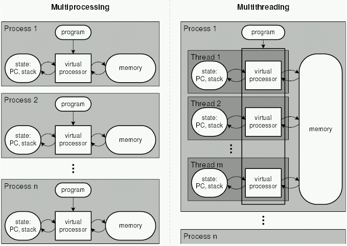

# Module II - Proses, Thread, dan IPC

## Learning Outcomes

1. Understanding what processes, threads, and IPC are
2. Able to distinguish the differences between processes and threads
3. Able to create programs with multiprocessing and multithreading

## Module Content

- [i. Learning Outcomes](#learning-outcomes)
- [ii. Module Content](#module-content)
- [1. Introduction](#introduction)
  - [1.1 Definition of Process](#definition-of-process)
  - [1.2 Definition of Thread](#definition-of-thread)
  - [1.3 Definition of Multiprocess and Multithread](#definition-of-multiprocess-and-multithread)
- [2. Process](#process)
  - [2.1 Types of PID](#types-of-pid)
  - [2.2 See Running Process](#see-the-running-process)
  - [2.3 Stopping a Process](#stop-the-process)
  - [2.4 Making a Process](#making-a-process)
  - [2.5 Running Process in The Background](#running-processes-in-the-background)
  - [2.6 Running Programs Concurrently](#running-programs-concurrently)
  - [2.7 Types of Processes](#types-of-processes)
  - [2.8 Daemon Process](#daemon-process)
- [3. Thread](#thread)
  - [3.1 Perbedaan Multithread dan Multiprocess](#multiprocess-vs-multithread)
  - [3.2 Creating Threads](#creating-threads)
  - [3.3 Join Thread](#join-thread)
  - [3.4 Mutual Exclusion](#mutual-exclusion)
- [4. IPC](#ipc-interprocess-communication)
  - [4.1 Pengertian IPC](#ipc)
  - [4.2 Piping](#pipes)
  - [4.3 Shared Memory](#shared-memory)

</br></br>

## Introduction

### Definition of Process

Have you ever opened multiple applications on your laptop? If yes, then you have implemented `process`. Even though we're actively using one application, other applications still exist in the background as processes waiting for their turn.


A process can be defined as a program being executed by the operating system. When a program is executed by the OS, it is assigned a Process ID (PID), which serves as the identifier of that process. In UNIX-based systems, you can view the processes being executed by the OS by invoking the `ps` shell command. For further information on the `ps` command, you can refer to the `man ps` command.

### Definition of Thread

Threads are the basic units of execution that can perform specific tasks within a process. These threads work together within a process to accomplish tasks simultaneously. They share resources and the same context as the main process in which they are running.


An example of a thread is when we open a web browser, typically we open multiple tabs simultaneously. Each tab or window may be running as a different thread within a single main process of the web browser application.

### Definition of Multiprocess and Multithread


1. Multiprocess
   Multiprocess is an approach where the operating system can run multiple processes concurrently.

Characteristics:

- It has separate memory and isolated resources.
- These processes do not share memory or variables among each other, unless there is a special mechanism such as shared memory.
- If one process encounters a failure or crash, the other processes are usually unaffected.

Example scenario:
When opening several applications simultaneously, if one application encounters a problem/crash, the other applications will not be affected.

2. Multithread
   Multithreading is an approach where a process can have multiple threads running concurrently within it.

Characteristics:

- Threads within a process share memory and resources. They can easily communicate with each other and share variables.
- Threads can perform different tasks simultaneously within a single process, improving efficiency and responsiveness.
- If one thread encounters a failure or crash, it can affect the entire process and other threads.

Example scenario:
For instance, a web server needs to be able to handle multiple HTTP requests from clients simultaneously without impeding performance or response time. Multithreading is required to handle each client request separately. Each time the server receives a new request, it creates a new thread to handle that request.

</br></br>

## Process

### Types of PID

#### User ID (UID)

It is an identifier of a process that displays the user running a program. In a C program, you can call the function `uid_t getuid(void);`.

#### Process ID (PID)

A unique number of a running process to identify a process. In a C program, you can call the function `pid_t getpid(void);`.

#### Parent PID (PPID)

Every process has its own identifier, and also after the process creates another process. This newly formed process has an identifier which is the ID of its creator (parent). In a C program, you can call the function `pid_t getppid(void);`.

### See the Running Process

To see the processes currently running on the OS, you can use `ps -ef` to see the details.


Alternatively, for a clearer and more detailed view, you can use the command `ps aux`.


The difference is that when using just `ps`, you will only see processes from the current user, whereas with `ps aux`, you will see all running processes, even those from other users.

Explanation:

- **UID**: the user who runs the program
- **PID**: process ID
- **PPID**: parent PID, if there is no parent, it will be 0
- **C**: CPU Util. (%)
- **STIME**: Time when the process started
- **TTY**: Terminal associated with the process. If there is none, it means it's a background process
- **TIME**: the length of the process running
- **CMD**: command that executes the process

We can also view running processes in a tree-like structure, making it easy to identify which ones are child processes and their respective parent processes. This can be done using the `pstree` command.


### Stop the Process

To stop (_terminate_) a running process, run the shell command `kill [options] <pid>`. Usually to force stop a process you can use the command `kill -9 <pid>`. The number _9_ is the Signal code to terminate a process.

In addition to using the `kill` command, we can also use the `pkill` command. The difference in usage is that when using pkill, you include the name of the process directly after it, like so: `pkill [options] <process name>`.

You can view the PID and process name using `jobs -l` or `ps aux`.

#### Types of Signal

| Signal name | Signal value | Effect                  |
| ----------- | :----------: | ----------------------- |
| SIGHUP      |      1       | Hangup                  |
| SIGINT      |      2       | Interrupt from keyboard |
| SIGKILL     |      9       | Kill signal             |
| SIGTERM     |      15      | Termination signal      |
| SIGSTOP     |   17,19,23   | Stop the process        |

By default when using the `kill <pid>` shell command, it will use `SIGSTOP` which will terminate the process but still can be resumed.

When using `Ctrl + C` to terminate a program, it sends the `SIGINT` signal, which causes the process to be permanently stopped by the system.

However, when using `Ctrl + Z` to suspend a program, the system sends the `SIGTSTP` signal, which means pausing the process, and it can be resumed using the `fg` or `bg` command.

### Making a Process

#### **fork**

`fork` is a _system call_ function in C to perform _spawning process_. After calling the function, there will be a new process which is the _child process_, the function will return a value of 0 in the _child process_ but return the _PID_ of the newly spawned _child process_ in the _parent process_

Try the program below by compiling it with `gcc try.c -o try` and executing it with `./try`

Code example without `fork()`

```c
#include <stdio.h>
#include <stdlib.h>

int main() {
    printf("Hello World!\n");
    return 0;
}
```

Code example with `fork()`

```c
#include <stdio.h>
#include <sys/types.h>
#include <unistd.h>

int main(){
  pid_t child_id;

  child_id = fork();

  printf("This will be called twice\n");

  if(child_id != 0){
    printf("\nParent process.\nPID: %d, Child's PID: %d\n", (int)getpid(), (int)child_id);
  }else {
    printf("\nChild process.\nPID: %d, Parent's PID: %d\n", (int)getpid(), (int)getppid());
  }

  return 0;
}
```

Result:

```c
This will be called twice

Parent process.
PID: 13101, Child's PID: 13102
This will be called twice

Child process.
PID: 13102, Parent's PID: 1
```

"Hello World" is invoked twice because it is called again in a new process with a different PID.

Visualization:

```c
+-------------------------+
|   Parent Process        |
+-------------------------+
|   int main() {          |
|     pid_t child_id;     |
|                         |
|     pid = getpid();     |
|     ppid = getppid();   |
|                         |
|-->  child_id = fork();  |
+-------------------------+
|    pid = 20             |
|    child_id = undefined |
|    ppid = 10            |
+-------------------------+
         |\
         | \----------------------------------\
         |                                     |
         V                                     V
+-------------------------+        +-------------------------+
|   Parent Process        |        |     Child Process       |
+-------------------------+        +-------------------------+
|-->                      |        |-->                      |
|     pid = getpid();     |        |     pid = getpid();     |
|     ppid = getppid();   |        |     ppid = getppid();   |
|   }                     |        |   }                     |
+-------------------------+        +-------------------------+
|    pid = 20             |        |    pid = 23             |
|    child_id = 23        |        |    child_id = 0         |
|    ppid = 10            |        |    ppid = 20            |
+-------------------------+        +-------------------------+
```

#### **exec**

`exec` is a function to run a new program and replaces the currently running program. There are variations of the `exec` function such as `execvp`, `execlp`, dan `execv`.

The example below will use `execv`

```c
#include <stdio.h>
#include <unistd.h>

int main () {

  // argv[n] = { {your-program-name}, {argument[1]}, {argument[2]},.....,{argument[n-2]}, NULL }
  char *argv[4] = {"list", "-l", "/home/", NULL};

  execv("/bin/ls", argv);

  printf("This line will not be executed\n");

  return 0;

}
```

### Running Processes in the Background

By using `&` at the end of a command, we can run a program in the background, allowing us to do other things while other processes are running.

An example implementation is with the wget command below:


This way, we don't have to wait and can still use the terminal for other purposes. If you want to check the progress of the process, you can use the `jobs` command.

And this is if we run it in the foreground:


In this scenario, the process will execute in the foreground, making it visible on your screen.

### Running Programs Concurrently

By combining `fork` and ``exec`, we can run 2 or more _tasks_ concurrently. An example is backing up different logs at the same time.

```c
#include <stdlib.h>
#include <sys/types.h>
#include <unistd.h>
#include <stdio.h>

int main() {
  pid_t child_id;

  child_id = fork();
  char *username = getenv("USER");
  char destination[100];
  sprintf(destination, "/home/%s/", username);

  if (child_id < 0) {
    exit(EXIT_FAILURE);
  }

  if (child_id == 0) {
    // this is child

    char *argv[] = {"cp", "/var/log/apt/history.log", destination, NULL};
    execv("/bin/cp", argv);
  } else {
    // this is parent

    char *argv[] = {"cp", "/var/log/dpkg.log", destination, NULL};
    execv("/bin/cp", argv);
  }
}
```

Visualization:

```c
+--------+
| pid=7  |
| ppid=4 |
| bash   |
+--------+
    |
    | calls fork
    V
+--------+                     +--------+
| pid=7  |    forks            | pid=22 |
| ppid=4 | ------------------> | ppid=7 |
| bash   |                     | bash   |
+--------+                     +--------+
    |                              |
    | calls exec to run touch      | calls exec to run mkdir
    |                              |
    V                              V
```

If you want to do multiple tasks simultaneously disregarding the order, you can use `fork` and `exec`.

#### **wait** x **fork** x **exec**

We can run two processes in one program. An example of its use is to create a folder and fill the folder with a file. First, create a folder. Then, create a file with the shell command `touch` in that folder. However, in reality, to do two things simultaneously requires a moment's pause.

To create files that are in a folder, the folder itself must first exist. To _delay_ a process can use the `wait` _system call_.

```c
#include <stdio.h>
#include <stdlib.h>
#include <unistd.h>
#include <sys/wait.h>

int main() {
    pid_t pid = fork();

    if (pid < 0) {
        printf("Error: Fork Failed\n");
        exit(1);
    }
    else if (pid == 0) {
        printf("Hello World from child process!\n");
        exit(0);
    }
    else {
        printf("Hello World from parent process!\n");
        int status;
        wait(&status);
        if (WIFEXITED(status)) {
            printf("Child process terminated normally with exit status: %d\n", WEXITSTATUS(status));
        }
        else {
            printf("Child process terminated abnormally\n");
        }
        exit(0);
    }
}
```

In the above example, the parent process will wait for the child process to finish execution using `wait()`, and then it will output a message according to the exit status of the child process using `WIFEXITED()` and `WEXITSTATUS()`. If the exit status = 0, it indicates that the program has finished executing correctly.

Output Program

```
Hello from parent process!
Hello from child process!
Child process terminated normally with exit status: 0

```

Other example:

```c
#include <stdlib.h>
#include <sys/types.h>
#include <unistd.h>
#include <sys/wait.h>

int main() {
  pid_t child_id;
  int status;

  child_id = fork();

  if (child_id < 0) {
    exit(EXIT_FAILURE);
  }

  if (child_id == 0) {
    // this is child

    char *argv[] = {"mkdir", "-p", "folderku", NULL};
    execv("/bin/mkdir", argv);
  } else {
    // this is parent
    while ((wait(&status)) > 0);
    char *argv[] = {"touch", "folderku/fileku.txt", NULL};
    execv("/usr/bin/touch", argv);
  }
}
```

In the example above, the `wait` function is used to wait for the child process to finish its task, which is creating a folder. After it is terminated, the parent process will resume its execution to create the `fileku` file within the `folderku` folder.

#### **system**

`system` is a function to call shell commands directly from a C program. For example, when you want to call a script in a C program.` system (ls)` will produce the same output when calling it in a shell script with `ls`.

File examplebash.sh:

```sh
#!/bin/bash

echo "Shell script ran"
```

File system.c:

```c
#include <stdlib.h>

int main() {
  int return_value;
  return_value = system("bash examplebash.sh");
  return return_value;
}

```

Output:

```
Shell script ran
```

### Types of Processes

#### **Zombie Process**

The Zombie process occurs because there is a child process that is exited but the parent process does not know that the child process has ended, for example due to a network break. So that the parent process does not releases processes that are still used by the child processes even though the process is dead.

#### **Orphan Process**

Orphan Process is a process on the computer where the parent process has finished or has stopped working, but the child process itself is still running.

#### **Daemon Process**

Daemon Process is a process that runs in the background because it does not have a controlling terminal. In the Windows operating system it is usually better known as a service. Daemon is a process that is designed so that the process does not get intervention from a user.

### Definition of Daemon

Daemon is a program that runs in the background continuously without direct interaction with an active user.

### Daemon Creation Steps

There are several steps to creating a daemon:

#### Fork the Parent Process and turn off the Parent Process

The first step is to create a parent process and generate the child process by `fork()`, then kill the parent process so that the operating system thinks the process is complete.

```c
pid_t pid;        // Variable to store pid

pid = fork();     // Store the pid of the child process

/* Exit when fork failed
 * (pid value < 0) */
if (pid < 0) {
  exit(EXIT_FAILURE);
}

/* Exit when fork succeed
 * (the value of pid is the child process's pid) */
if (pid > 0) {
  exit(EXIT_SUCCESS);
}
```

#### Changing File Mode with `umask`

Each file and directory has a _permissions_ that regulate who can read, write, and delete on the file or the directory.

Using `umask` we can set a _permission_ from a file when it is created. Here we use `umask(0)` so that we get full access of a file when a daemon created it.

```c
umask(0);
```

#### Creating Unique Session ID (SID)

A Child Process must have an SID in order to run. Without an SID, the Child Process whose Parent has been `kill`-ed will become an Orphan Process.

To get an SID we can use the command `setsid()`. This command has the same _return type_ as `fork()`.

```c
sid = setsid();
if (sid < 0) {
  exit(EXIT_FAILURE);
}
```

#### Changing Working Directory

A working directory must be changed to a directory that is sure to exist. To be safe, we will change it to the root (/) directory because it is a guaranteed directory on all Linux distributions.

To change the Working Directory, we can use the command `chdir()`.

```c
if ((chdir("/")) < 0) {
  exit(EXIT_FAILURE);
}
```

#### Closing the Standard File Descriptor

A daemon cannot use the terminal. Therefore we must close the standard file descriptors (STDIN, STDOUT, STDERR).

```c
close(STDIN_FILENO);
close(STDOUT_FILENO);
close(STDERR_FILENO);
```

#### Creating the Main Loop

This is the main loop where we write the gist of our program. Don't forget to give the command `sleep()` so that the loop runs at an interval.

```c
while (1) {
  // Write your program here

  sleep(30);
}
```

</br></br>

## Thread

### Multiprocess Vs Multithread



The differences between multiprocess and multithread
No | Multiprocess | Multithread
--- | --- | ---
1 | multiple process executed concurently | multiple thread in 1 process executed concurently
2 | using more CPU to improve computation power | making multiple thread in a process to improve computation power
3 | the creation process used a lot of time and resources | the thread creation used less time and resources
4 | dependency on other object in the memory to send data to other process| no dependency to other object
5 | most child process is interruptible / killable | multithreading is not interruptible / killable

- An example of using Multi Processing is in the Chrome browser system. When we open or create a new tab, the system also creates a new process for the needs of that new tab. Meanwhile, an example implementation of Multi Threading is in a game system where a process can handle various needs simultaneously. For instance, a game can render multiple objects simultaneously, speeding up the process.

### Creating Threads

Threads can be created using functions in a C program as follows.

```c
#include <pthread.h> //library thread

int pthread_create(pthread_t *restrict tidp,
                   const pthread_attr_t *restrict attr,
                   void *(*start_rtn)(void *),
                   void *restrict arg);
```

Explanation of the syntax:

- The pointer `tidp` is used to point to the memory address with the thread ID of the new thread.
- The argument `attr` is used to customize the attributes used by the thread. The value of `attr` is set to `NULL` when the thread uses default attributes.
- The newly created thread will start running from the `start_rtn` function within the thread function.
- The pointer `arg` is used to pass an argument to the `start_rtn` function. If no argument is needed, then `arg` will be set to `NULL`.

Example of a Programn using Thread

> compile using `gcc -pthread -o [output] input.c`

```c
#include <stdio.h>
#include <stdlib.h>
#include <unistd.h>
#include <pthread.h>

void *run(void *args) {
	int angka;
	angka = *((int *)args);

	if (angka == 1) {
		printf("%d bukan prima\n", angka);
		return NULL;
	}

	for (int i=2; i<angka; i++){
		if (angka % i == 0){
			printf("%d bukan prima\n", angka);
			return NULL;
		}
	}
	printf("%d prima\n", angka);
        return NULL;
}

void main() {
	int angka;
	printf("Masukkan angka: ");
	scanf("%d", &angka);

	pthread_t t_id[angka];
	printf("Thread berhasil dibuat\n");

	for (int i=0 ; i<angka; i++) {
		int *num_to_check = (int *)malloc(sizeof(int));
		*num_to_check = i+1 ;
		pthread_create(&t_id[i], NULL, &run, (void *)num_to_check);
	}

	for (int i=0 ; i<angka; i++) {
		pthread_join(t_id[i], NULL);
	}
	printf("Thread telah selesai\n");

}
```

A comparative program in the absence of utilizing Threads.

```c
#include <stdio.h>
#include <stdlib.h>

int is_prime(int angka) {
    if (angka == 1) {
        printf("%d bukan prima\n", angka);
        return 0;
    }

    for (int i=2; i<angka; i++){
        if (angka % i == 0){
            printf("%d bukan prima\n", angka);
            return 0;
        }
    }
    printf("%d prima\n", angka);
    return 1;
}

int main() {
    int jumlah;
    printf("Masukkan jumlah angka: ");
    scanf("%d", &jumlah);

    printf("Hasil pengujian bilangan:\n");
    for (int i=0; i<jumlah; i++) {
        is_prime(i);
    }

    return 0;
}
```

Comparison between Thread with Fork.

The example of creating a program without utilizing thread:

```c
#include<stdio.h>
#include<unistd.h>
#include<stdlib.h>
#include<sys/types.h>
#include<sys/wait.h>

int main()
{
	pid_t child;
	int i, stat;
	char *argv1[] = {"clear", NULL};
	char *argv2[] = {"xlogo", NULL};
	child = fork();
	if (child==0) {
		execv("/usr/bin/clear", argv1);
	}
	else
	{
		for(i=0;i<6;i++)
		{
			printf("%d\n",i);
			fflush(stdout);
			sleep(1);
		}
		execv("/usr/bin/xlogo", argv2);
	}

}
```

Example of creating a program that utilizes thread.

> compile using `gcc -pthread -o [output] input.c`

```c
#include<stdio.h>
#include<string.h>
#include<pthread.h>
#include<stdlib.h>
#include<unistd.h>
#include<sys/types.h>
#include<sys/wait.h>

pthread_t tid[3];
pid_t child;

int length=5;
void* playandcount(void *arg)
{
	char *argv1[] = {"clear", NULL};
	char *argv2[] = {"xlogo", NULL};
	unsigned long i=0;
	pthread_t id=pthread_self();
	int iter;
	if(pthread_equal(id,tid[0]))
	{
		child = fork();
		if (child==0) {
		    execv("/usr/bin/clear", argv1);
	    	}
	}
	else if(pthread_equal(id,tid[1]))
	{
        for(iter=0;iter<6;iter++)
		{
			printf("%d\n",iter);
			fflush(stdout);
			sleep(1);
		}
	}
	else if(pthread_equal(id,tid[2]))
	{
        child = fork();
        if (child==0) {
		    execv("/usr/bin/xlogo", argv2);
	    }
	}

	return NULL;
}

int main(void)
{
	int i=0;
	int err;
	while(i<3)
	{
		err=pthread_create(&(tid[i]),NULL,&playandcount,NULL);
		if(err!=0)
		{
			printf("\n can't create thread : [%s]",strerror(err));
		}
		else
		{
			printf("\n create thread success\n");
		}
		i++;
	}
	pthread_join(tid[0],NULL);
	pthread_join(tid[1],NULL);
	exit(0);
	return 0;
}
```

**Conclusion**:
It is evident that when a program utilizes threads, it can execute two tasks simultaneously and consume less CPU compared to creating a new process.

### Join Thread

Join thread is a function to join other threads that have stopped (_terminated_). If the thread that you want to join has not been stopped, this function will wait until the desired thread has a status of **`Terminated`**. The `pthread_join ()` function can be said to be the `wait ()` function of the process, because the main program (_task_) will wait for the thread to be joined in the main program. We do not know wether the

Example C program Join_Thread:

```c
#include <stdio.h>
#include <stdlib.h>
#include <pthread.h>

void *print_message_function( void *ptr );

int main()
{
    pthread_t thread1, thread2;

    const char *message1 = "Thread 1";
    const char *message2 = "Thread 2";
    int  iret1, iret2;

    iret1 = pthread_create( &thread1, NULL, print_message_function, (void*) message1);
    if(iret1)
    {
        fprintf(stderr,"Error - pthread_create() return code: %d\n",iret1);
        exit(EXIT_FAILURE);
    }


    iret2 = pthread_create( &thread2, NULL, print_message_function, (void*) message2);
    if(iret2)
    {
        fprintf(stderr,"Error - pthread_create() return code: %d\n",iret2);
        exit(EXIT_FAILURE);
    }

    printf("pthread_create() for thread 1 returns: %d\n",iret1);
    printf("pthread_create() for thread 2 returns: %d\n",iret2);

    // pthread_join( thread1, NULL);
    // pthread_join( thread2, NULL);

    exit(EXIT_SUCCESS);
}

void *print_message_function( void *ptr )
{
    char *message;
    message = (char *) ptr;
    printf("%s \n", message);

    for(int i=0;i<10;i++){
        printf("%s %d \n", message, i);
    }
}

```

Explanation :

- In the above program, if we _comment_ the line `pthread_join`, the result will not show the words **Thread 1** and **Thread 2**.
- If the `pthread_join` function call is uncommented, then the program we create will display the words **Thread 1** and **Thread 2**.

**Conclusion** :
The first program does not run the `print_message_function` function because before the second thread is scheduled, the main program (possibly) has finished executing so it doesn't run the default function on the thread. In the second experiment, the `pthread_join ()` function is used to make the main program wait for the thread to _join_ until the target thread has finished executing, with this function the main program is suspended until the target thread has finished executing.

- Function for thread termination

  ```c
  #include <pthread.h>
  void pthread_exit(void *rval_ptr);
  ```

  The `rval_ptr` argument is a pointer that can be accessed by the `pthread_join ()` function in order to know the status of the thread

- Function to join thread
  ```c
  int pthread_join(pthread_t thread, void **rval_ptr);
  /* If successful returns value 0, if error returns value 1 */
  ```
  The function will pause the job until the `rval_ptr` pointer state of the`pthread_exit ()`function returns its value.

### Mutual Exclusion

Also known as ** Mutex **, which is a way to ensure that if a job that uses variables or files is also used by another job, the other job will output the value of the previous job.

Example of Simple Mutual_Exclusion program:

```c
#include<stdio.h>
#include<string.h>
#include<pthread.h>
#include<stdlib.h>
#include<unistd.h>

pthread_t tid1, tid2;
int status;

int number;

void* write(void *arg)
{
    status = 0;

    printf("Input number : ");
    scanf("%d", &number);

    status = 1;

    return NULL;
}

void* read(void *arg)
{
    while(status != 1)
    {

    }

    printf("Number %d\n", number);

}

int main(void)
{
    pthread_create(&(tid1), NULL, write, NULL);
    pthread_create(&(tid2), NULL, read, NULL);

    pthread_join(tid1, NULL);
    pthread_join(tid2, NULL);

    return 0;
}

```

Explanation :

- There are 2 threads running with different functions.
- The resources (variables) that both threads use to execute their jobs **are the same**.
- The `status` variable is a simple example of controlling the running of a thread.

Additionally, we also have the `pthread_mutex` function provided by the `pthread.h` library. Here is an example program:

```c
#include <pthread.h>
#include <stdio.h>
#include <stdlib.h>
#include <string.h>
#include <unistd.h>
pthread_t tid[2];
int counter;
pthread_mutex_t lock;
void* trythis(void* arg)
{
    pthread_mutex_lock(&lock);
    unsigned long i = 0;
    counter += 1;
    printf("\n Job %d has started\n", counter);
    for (i = 0; i < (0xFFFFFFFF); i++)
        ;
    printf("\n Job %d has finished\n", counter);
    pthread_mutex_unlock(&lock);
    return NULL;
}
int main(void)
{
    int i = 0;
    int error;
    if (pthread_mutex_init(&lock, NULL) != 0) {
        printf("\n mutex init has failed\n");
        return 1;
    }
    while (i < 2) {
        error = pthread_create(&(tid[i]),
        NULL,
        &trythis, NULL);
        if (error != 0)
            printf("\nThread can't be created :[%s]",
            strerror(error));
        i++;
    }
    pthread_join(tid[0], NULL);
    pthread_join(tid[1], NULL);
    pthread_mutex_destroy(&lock);
    return 0;
}
```

Output :

```
Job 1 has started
Job 1 has finished
Job 2 has started
Job 2 has finished
```

**Conclusion** :
Since we don't know which _thread_ executes a variable or resource in the program first, the purpose of **Mutex** is to keep the resources of a thread from being used by other threads before it finishes its work.

</br></br>

## IPC (Interprocess Communication)

### IPC

IPC (_Interprocess Communication_) is a method to exchange data between one process and another, either on the same computer or remote computers connected through a network.

### Pipes

Pipes are a sequential method of communication between interrelated processes. The weakness of pipes is that they are only for interconnected, sequential processes.
There are two types of pipes:

- unnamed pipe: Communication between parent and child processes.
- named pipes: Commonly referred to as FIFO, used for communication that runs independently. **Can only be used if both processes are using the same _filesystem_**

```
$ ls | less
```

Diagram :


The `pseudocode` for using a `pipe` without `fork` can be demonstrated as follows:

```pascal
int pipe(int fds[2]);

Parameters :
fd[0] will be the fd(file descriptor) for the
read end of pipe.
fd[1] will be the fd for the write end of pipe.
Returns : 0 on Success.
-1 on error.
```

Example of code using C (without _fork_) can be found at:

```c
// C program to illustrate
// pipe system call in C
#include <stdio.h>
#include <unistd.h>
#include <stdlib.h>

#define MSGSIZE 16
char* msg1 = "hello, world #1";
char* msg2 = "hello, world #2";
char* msg3 = "hello, world #3";

int main()
{
	char inbuf[MSGSIZE];
	int p[2], i;

	if (pipe(p) < 0)
		exit(1);


	write(p[1], msg1, MSGSIZE);
	write(p[1], msg2, MSGSIZE);
	write(p[1], msg3, MSGSIZE);

	for (i = 0; i < 3; i++) {
		read(p[0], inbuf, MSGSIZE);
		printf("%s\n", inbuf);
	}
	return 0;
}

```

Output :

```
hello, world #1
hello, world #2
hello, world #3
```

Pipe with fork

Diagram :  


Example :

```c
// C program to demonstrate use of fork() and pipe()
#include<stdio.h>
#include<stdlib.h>
#include<unistd.h>
#include<sys/types.h>
#include<string.h>
#include<sys/wait.h>

int main()
{
	// We use two pipes
	// First pipe to send input string from parent
	// Second pipe to send concatenated string from child

	int fd1[2]; // Used to store two ends of first pipe
	int fd2[2]; // Used to store two ends of second pipe

	char fixed_str[] = "forgeeks.org";
	char input_str[100];
	pid_t p;

	if (pipe(fd1)==-1)
	{
		fprintf(stderr, "Pipe Failed" );
		return 1;
	}
	if (pipe(fd2)==-1)
	{
		fprintf(stderr, "Pipe Failed" );
		return 1;
	}

	scanf("%s", input_str);
	p = fork();

	if (p < 0)
	{
		fprintf(stderr, "fork Failed" );
		return 1;
	}

	// Parent process
	else if (p > 0)
	{
		char concat_str[100];

		close(fd1[0]); // Close reading end of first pipe

		// Write input string and close writing end of first
		// pipe.
		write(fd1[1], input_str, strlen(input_str)+1);
		close(fd1[1]);

		// Wait for child to send a string
		wait(NULL);

		close(fd2[1]); // Close writing end of second pipe

		// Read string from child, print it and close
		// reading end.
		read(fd2[0], concat_str, 100);
		printf("Concatenated string %s\n", concat_str);
		close(fd2[0]);
	}

	// child process
	else
	{
		close(fd1[1]); // Close writing end of first pipe

		// Read a string using first pipe
		char concat_str[100];
		read(fd1[0], concat_str, 100);

		// Concatenate a fixed string with it
		int k = strlen(concat_str);
		int i;
		for (i=0; i<strlen(fixed_str); i++)
			concat_str[k++] = fixed_str[i];

		concat_str[k] = '\0'; // string ends with '\0'

		// Close both reading ends
		close(fd1[0]);
		close(fd2[0]);

		// Write concatenated string and close writing end
		write(fd2[1], concat_str, strlen(concat_str)+1);
		close(fd2[1]);

		exit(0);
	}
}

```

### Message Queues

Is a communication between processes where the process creates an internal linked-list at the address of the Operating System kernel. The message is referred to as _queue_ while the identifier is called _queue_ ID. _Queue_ ID is used as a _key_ to indicate which message will be sent and the destination of the message.

Illustration:


A message queue that follows the FIFO (First In First Out) principle is unbounded and cannot be accessed by two different threads simultaneously. When writing messages, multiple tasks can write messages to the queue, but only one task can read messages at a time from a queue. The reader will wait for message queues until there are messages to be processed.

Example of program can be accessed at [sender](playground/sender.c) and [receiver](playground/receiver.c).

Code example for sender:

```c
// C Program for Message Queue (Writer Process)
#include <stdio.h>
#include <sys/ipc.h>
#include <sys/msg.h>
#define MAX 10

// structure for message queue
struct mesg_buffer {
	long mesg_type;
	char mesg_text[100];
} message;

int main()
{
	key_t key;
	int msgid;

	// ftok to generate unique key
	key = ftok("progfile", 65);

	// msgget creates a message queue
	// and returns identifier
	msgid = msgget(key, 0666 | IPC_CREAT);
	message.mesg_type = 1;

	printf("Write Data : ");
	fgets(message.mesg_text,MAX,stdin);

	// msgsnd to send message
	msgsnd(msgid, &message, sizeof(message), 0);

	// display the message
	printf("Data send is : %s \n", message.mesg_text);

	return 0;
}
```

Code example for receiver:

```c
// C Program for Message Queue (Reader Process)
#include <stdio.h>
#include <sys/ipc.h>
#include <sys/msg.h>

// structure for message queue
struct mesg_buffer {
	long mesg_type;
	char mesg_text[100];
} message;

int main()
{
	key_t key;
	int msgid;

	// ftok to generate unique key
	key = ftok("progfile", 65);

	// msgget creates a message queue
	// and returns identifier
	msgid = msgget(key, 0666 | IPC_CREAT);

	// msgrcv to receive message
	msgrcv(msgid, &message, sizeof(message), 1, 0);

	// display the message
	printf("Data Received is : %s \n",
					message.mesg_text);

	// to destroy the message queue
	msgctl(msgid, IPC_RMID, NULL);

	return 0;
}
```

### Shared Memory

Shared memory is a mechanism for mapping a memory block's area (segments) for use by multiple processes. A process creates a memory segment, and then other processes that are granted permission can access that memory. Shared memory is an effective way to exchange data between programs. In this case, if one process makes changes, other processes can see them.


Shared memory is the fastest IPC mechanism. An operating system maps a memory segment to an address space of several processes to perform read and write operations in that memory segment without calling functions from the operating system. Shared memory is a superior mechanism for exchanging data of very large sizes.

Steps for using shared memory:

1. Request a memory segment from the operating system that can be used simultaneously by a process.
2. Associate some or all of the memory with the address space of the intended process.

Illustration


- Note that the memory address of a shared memory in each process may not be the same. In this case, we can use semaphores for synchronization.

Example: [Proses 1](playground/shared-memory-1.c) [Proses 2](playground/shared-memory-2.c)

**Process 1**

```c
#include <stdio.h>
#include <sys/ipc.h>
#include <sys/shm.h>
#include <unistd.h>

void main()
{
        key_t key = 1234;
        int *value;

        int shmid = shmget(key, sizeof(int), IPC_CREAT | 0666);
        value = shmat(shmid, NULL, 0);

        *value = 10;

        printf("Program 1 : %d\n", *value);

        sleep(5);

        printf("Program 1: %d\n", *value);
        shmdt(value);
        shmctl(shmid, IPC_RMID, NULL);
}
```

**Process 2**

```c
#include <stdio.h>
#include <sys/ipc.h>
#include <sys/shm.h>
#include <unistd.h>

void main()
{
        key_t key = 1234;
        int *value;

        int shmid = shmget(key, sizeof(int), IPC_CREAT | 0666);
        value = shmat(shmid, NULL, 0);

        printf("Program 1 : %d\n", *value);
	*value = 30;

        sleep(5);

        printf("Program 1: %d\n", *value);
        shmdt(value);
        shmctl(shmid, IPC_RMID, NULL);
}
```

Run process 1 first, then process 2. The result is as follows.

**Proses 1**

```
Program 1 : 10
Program 1 : 30
```

**Proses 2**

```
Program 1 : 10
Program 1 : 30
```

</br></br>
