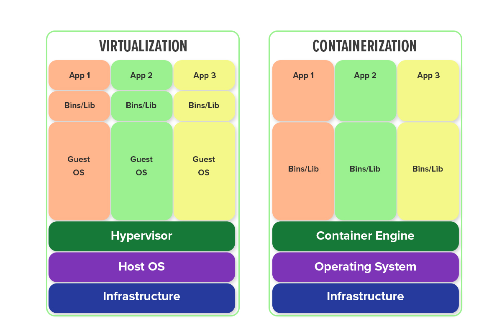
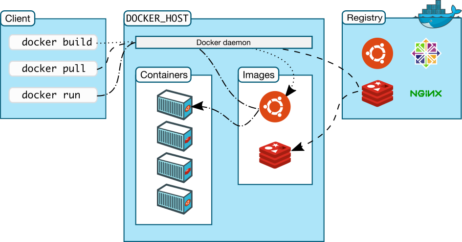
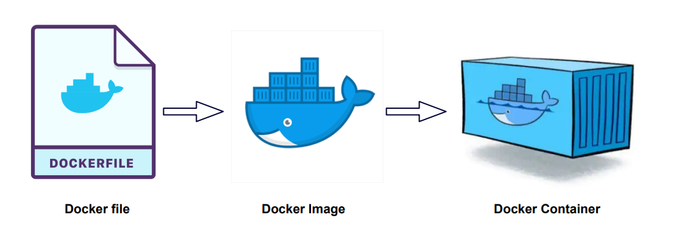
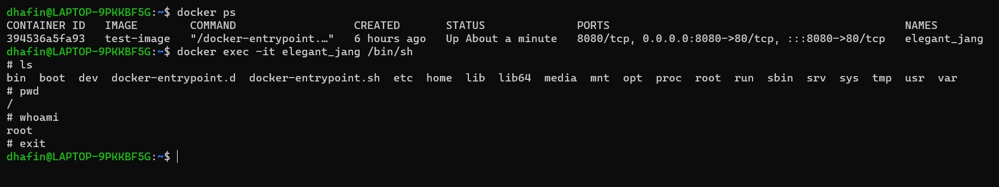
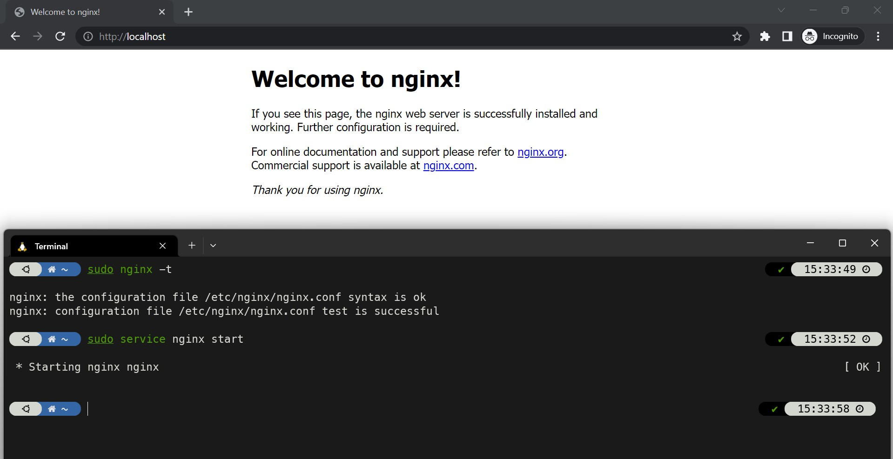
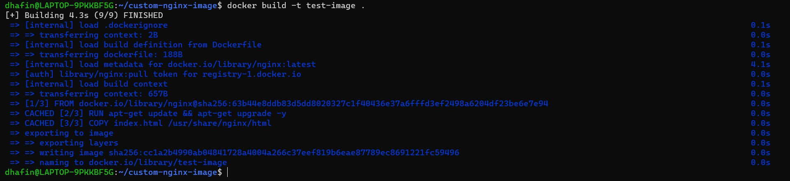
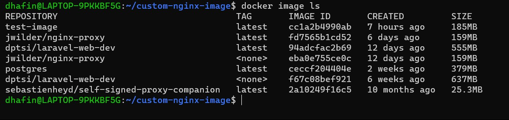
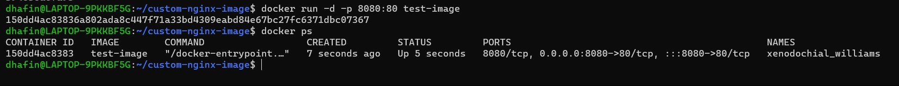

# Modul 3 - Docker

## Capaian

1. Memahami kontainerisasi dan perbedaannya dengan virtualisasi
2. Memahami arsitektur dasar docker
3. Dapat melakukan bind file system dengan docker

## Prasyarat

1. Melakukan instalasi docker, bisa mengikuti modul [ini](https://github.com/arsitektur-jaringan-komputer/Pelatihan-Docker/tree/master/0.%20Prasyarat)

## Daftar Isi

- [i. Capaian](#capaian)
- [ii. Prasyarat](#prasyarat)
- [iii. Daftar Isi](#daftar-isi)
- [1. Pendahuluan](#pendahuluan)
  - [1.1. Mengapa Perlu Isolasi Proses?](#mengapa-perlu-isolasi-proses)
  - [1.2. Perbedaan Kontainerisasi dan Virtualisasi](#perbedaan-kontainerisasi-dan-virtualisasi)
  - [1.3. Pengertian Docker](#pengertian-docker)
- [2. Arsitektur Docker](#arsitektur-docker)
  - [2.1. Docker Daemon](#docker-daemon)
  - [2.2. Docker Client](#docker-client)
  - [2.3. Docker Objects](#docker-objects)
  - [2.4. Docker Registry](#docker-registry)
- [3. Docker Service Dasar](#docker-service-dasar)
  - [3.1. Dockerfile](#dockerfile)
  - [3.2. Docker Image](#docker-image) 
  - [3.3. Docker Container](#docker-container)
  - [3.4. Contoh Dockerfile](#contoh-dockerfile)
  - [3.5. Docker Hub](#docker-hub)
- [4. Docker Service Lanjutan](#docker-service-lanjutan)
  - [4.1. Docker Compose](#docker-compose)
  - [4.2. Docker Storage Management](#docker-storage-management)
  - [4.3. Docker Mount](#docker-mount)
- [iv. Referensi](#referensi)

## Pendahuluan

### Mengapa Perlu Isolasi Proses

Pernahkah kamu mengompilasi program sambil mendengarkan musik MP3 di laptopmu? Kamu mungkin berasumsi programmu dan pemutar MP3 tidak akan berinteraksi. Namun, pada kenyataannya, keduanya mungkin berjalan pada prosesor yang persis sama. Jadi, bagaimana sistem memastikan bahwa program yang kamu kompilasi tidak pernah menimpa program pemutar MP3-mu? Mengapa program-program ini tidak saling memengaruhi?

Program-program tersebut berjalan di dalam proses yang berbeda, dimana setiap proses memiliki address space-nya sendiri. Address space inilah yang menyediakan isolasi proses.

Konsep dari isolasi proses yaitu apa pun yang dilakukan suatu proses tidak boleh memengaruhi atau mengganggu proses lainnya, kecuali jika proses tersebut setuju untuk berkomunikasi (misalnya, lewat pipe, mengacu kepada modul 2). 

Bayangkan jika satu proses gagal. Tanpa isolasi proses, kegagalan satu proses ini dapat merusak proses lainnya, bahkan dapat menyebabkan kegagalan seluruh sistem. Sangat berbahaya, bukan? Karena itulah sangat penting untuk melakukan isolasi proses.

### Perbedaan Kontainerisasi dan Virtualisasi

Sekarang kita akan berkenalan dengan kontainerisasi dan virtualisasi. 

Kontainerisasi adalah metode untuk mengemas aplikasi dan dependensinya ke dalam sebuah wadah (kontainer) yang dapat dijalankan secara konsisten di berbagai lingkungan komputasi, tanpa perlu mengubah kode atau konfigurasi aplikasi itu sendiri. Kontainer merupakan unit yang portabel, ringan, dan dapat diisolasi, yang mengemas aplikasi, library, dan konfigurasi menjadi satu entitas yang dapat dijalankan di lingkungan yang berbeda, seperti lokal, cloud, atau pusat data. 

Sedangkan virtualisasi adalah teknologi yang memungkinkan pembuatan mesin virtual di dalam satu fisik server. Dengan menggunakan hypervisor, virtualisasi memungkinkan pengelolaan beberapa sistem operasi atau aplikasi yang berjalan secara mandiri. Konsep dasar virtualisasi melibatkan isolasi sumber daya antara mesin virtual, sehingga setiap mesin virtual dapat beroperasi seolah-olah menjadi mesin fisik yang terpisah.



Baik virtualisasi dan kontainerisasi menggunakan isolasi sistem untuk menjalankan beberapa sistem operasi atau aplikasi secara terpisah pada satu perangkat keras yang sama. Namun, virtualisasi dan kontainerisasi memiliki perbedaan utama. Virtualisasi membuat salinan virtual dari seluruh komputer fisik, yang dapat memakan banyak sumber daya. Kontainerisasi hanya mengemas aplikasi dan dependensi mereka dalam kontainer di dalam host yang sama, berbagi kernel OS yang sama, sehingga lebih ringan dan lebih efisien daripada virtualisasi.

### Pengertian Docker


Salah satu teknologi untuk membuat kontainer yang berbagi sistem operasi host adalah Docker. Dengan Docker, pengembang dapat membuat kontainer yang konsisten dan portabel, yang dapat dijalankan di berbagai lingkungan komputasi, termasuk mesin lokal, server cloud, atau lingkungan pengembangan dan produksi yang berbeda. Docker memungkinkan aplikasi dan dependensinya diisolasi, sehingga aplikasi dapat dijalankan secara konsisten di berbagai lingkungan tanpa mengganggu host operating system atau aplikasi lainnya.

Bayangkan kita memiliki sebuah aplikasi Node. Kita akan membutuhkan server yang menggunakan versi Node yang sama dengan aplikasi kita. Kita juga harus menginstall dependensi-dependensi yang digunakan aplikasi tersebut. Dengan demikian, aplikasi ini akan bisa berjalan di komputer kita. Namun, bayangkan jika orang lain dengan komputer yang berbeda menjalankan aplikasi kita dengan versi Node yang berbeda, bisa saja terjadi error. Dengan menggunakan Docker, kita bisa mengkontainerisasi aplikasi dan dependensinya untuk dapat dijalankan di berbagai lingkungan tanpa perlu konfigurasi ulang, sehingga dapat menghindari kasus ini terjadi.

## Arsitektur Docker



### Docker Daemon

Docker Daemon adalah komponen yang berjalan di latar belakang (background) pada host dan bertanggung jawab untuk menjalankan dan mengelola Docker Object seperti images, container, network, dan lain-lain. Docker Daemon adalah proses yang berjalan di dalam sistem operasi host dan menerima perintah dari Docker Client untuk membuat, menjalankan, menghentikan, dan mengelola Docker Object. Docker Daemon juga bertanggung jawab untuk mengelola sumber daya host seperti CPU, memori, dan jaringan yang digunakan oleh Docker Object.

### Docker Client

Docker Client adalah antarmuka pengguna berbasis command-line atau GUI yang digunakan untuk berinteraksi dengan Docker. Docker Client memungkinkan pengguna untuk menjalankan perintah-perintah Docker untuk membuat, mengelola, dan mengontrol layanan pada Docker. Docker Client berkomunikasi dengan Docker Daemon untuk mengirimkan perintah-perintah Docker dan menerima output layanan Docker yang sedang berjalan.

### Docker Objects

Docker Objects adalah komponen dasar yang terdapat di Docker. Beberapa contoh Docker Objects meliputi image, container, volume, dan network yang akan dijelaskan pada modul selanjutnya.

### Docker Registry

Docker Registry adalah repositori yang digunakan untuk menyimpan dan berbagi Docker Image. Docker Registry berfungsi sebagai tempat penyimpanan untuk Docker Image yang dapat diakses oleh pengguna Docker dari berbagai lokasi. Docker Hub, yang merupakan Docker public registry, adalah salah satu contoh Docker Registry yang sering digunakan untuk menyimpan dan berbagi Docker Image secara publik. Selain Docker Hub, pengguna juga dapat membuat Docker Registry pribadi untuk menyimpan Docker Image.

## Docker Service Dasar



### Dockerfile

Dockerfile adalah file teks yang berisi instruksi untuk membangun sebuah Docker Image. Berbagai komponen dan konfigurasi yang diperlukan untuk membuat sebuah image, seperti base image yang digunakan, perintah-perintah yang harus dijalankan, file yang harus di-copy, serta variabel lingkungan yang perlu di-set, dapat ditentukan dengan Dockerfile. 

Keuntungan menggunakan Dockerfile antara lain memungkinkan pengguna untuk membuat image dengan cara yang konsisten dan terdokumentasi dengan baik, dapat mereplikasi pengaturan dan konfigurasi yang sama setiap kali membangun sebuah image meskipun lingkungannya berbeda-beda, dan memungkinkan penggunaan konsep modularitas dalam membangun image sehingga komponen-komponen image dapat diganti tanpa perlu membangun ulang seluruh image.

Untuk mem-build Dockerfile menjadi Docker Image, kalian bisa menggunakan command berikut di direktori berisi Dockerfile.

```shell
docker build -t <nama-image>
```

#### Perintah Dockerfile

Berikut adalah beberapa perintah penting beserta penjelasannya yang bisa diimplementasikan pada Dockerfile.

| Perintah | Deskripsi |
| ------------ | ------------ |
| `FROM` | Menentukan base image yang akan digunakan untuk build. |
| `COPY` | Menyalin file atau folder dari host ke dalam image. |
| `ADD` | Menyalin file atau folder dari host ke dalam image, bisa juga digunakan untuk men-download file dari URL dan mengekstraknya ke dalam image. |
| `RUN` | Menjalankan perintah pada layer yang sedang dibangun dan membuat image baru. |
| `CMD` | Menentukan perintah default yang akan dijalankan saat container di-start. |
| `ENTRYPOINT` | Menentukan perintah yang akan dijalankan saat container di-start, dapat juga di-overwrite oleh perintah saat container di-run. |
| `ENV` | Menentukan environment variable di dalam container. |
| `EXPOSE` | Menentukan port yang akan di-expose dari container ke host. |
| `VOLUME` | Menentukan direktori yang akan di-mount sebagai volume di dalam container. |

### Docker Image

Docker image adalah template untuk menjalankan docker container. Image ini berisi sistem operasi dan aplikasi yang sudah dikonfigurasi dengan baik serta siap digunakan. Image dapat dibangun secara manual dengan membuat Dockerfile atau dapat diunduh dari Docker Hub, yaitu repositori publik yang menyediakan banyak image yang sudah siap digunakan. 

Docker Image bersifat immutables, artinya setelah dibuat, image tidak bisa diubah secara langsung. Namun, image dapat dibuat baru dengan melakukan modifikasi pada image sebelumnya dan memberikan nama yang berbeda. Setiap image memiliki nama dan tag untuk mengidentifikasinya secara unik. Dalam Docker Hub, nama image biasanya terdiri dari beberapa bagian, seperti nama pengguna (username), nama image, dan tag, seperti contoh username/nama_image:tag. Setelah image dibuat, bisa menggunakan perintah berikut untuk membuat instance dari image tersebut dalam bentuk container.

```shell
docker run [OPTIONS] IMAGE[:TAG|@DIGEST] [COMMAND] [ARG...]
```

OPTIONS biasa digunakan untuk konfigurasi tambahan untuk kontainer, misalnya memberi nama kontainer dengan `--name`. IMAGE adalah nama Image yang akan dijadikan kontainer. TAG adalah versi dari Image, dan memiliki default latest jika tidak didefinisikan. COMMAND dan ARG... digunakan untuk menentukan perintah dan argumen yang akan dijalankan kontainer saat baru di-start.

#### Perintah Docker Image

Berikut adalah beberapa perintah penting beserta penjelasannya yang tersedia pada **`docker image <COMMAND>`**.

| <COMMAND>  | Deskripsi |
| --------- | --------- |
| `build` |  Perintah ini digunakan untuk membuat sebuah image Docker dari Dockerfile. |
| `history` | Menampilkan riwayat perubahan pada sebuah image. |
| `import` | Mengimpor sebuah image dari sebuah file. File tersebut harus berisi image yang telah diekspor sebelumnya dengan perintah **`docker save`** |
| `inspect` | Melihat detail dari sebuah image. |
| `load` | Memuat sebuah image dari sebuah arsip yang telah disimpan. |
| `ls` | Menampilkan daftar image yang telah terunduh. |
| `prune` | Menghapus image yang tidak terpakai. |
| `pull` | Mengunduh sebuah image dari Docker Hub atau registry lainnya. |
| `push` | Mengunggah sebuah image ke Docker Hub atau registry lainnya. |
| `rename` | Mengubah nama dari sebuah image yang telah terunduh. |
| `rm` | Menghapus sebuah image yang telah terunduh. |
| `save` | Menyimpan sebuah image ke dalam sebuah arsip yang dapat diunduh dengan menggunakan perintah **`docker load`** |
| `tag` | Memberikan sebuah tag pada sebuah image. |

### Docker Container


Docker Container bisa diibaratkan seperti kotak berisi program dan semua bahan yang dibutuhkan agar program tersebut bisa berjalan dengan baik. Kotak ini dijalankan secara terpisah dari komputer aslinya, sehingga program dalam kotak ini dapat berjalan dengan konsisten pada berbagai lingkungan tanpa terpengaruh oleh konfigurasi dan infrastruktur yang ada pada komputer aslinya. 

#### Perintah Docker Container

Berikut adalah beberapa perintah penting beserta penjelasannya yang tersedia untuk memanage container pada Docker.

| Perintah  | Deskripsi |
| --------- | --------- |
| `attach` | Menjalankan perintah pada container yang sedang berjalan. Perintah ini akan memasukkan pengguna ke dalam sesi terminal container. |
| `commit` | Membuat sebuah image baru dari perubahan yang dilakukan pada container yang sedang berjalan. |
| `cp` | Menyalin file atau direktori antara file sistem host dan file sistem dalam container. |
| `create` | Membuat sebuah container baru, tetapi tidak menjalankannya. |
| `diff` | Menunjukkan perubahan pada file sistem container yang sedang berjalan. |
| `exec` | Menjalankan sebuah perintah pada container yang sedang berjalan. |
| `export` | Mengekspor sebuah container ke dalam file tar. |
| `inspect` | Melihat detail dari sebuah container. |
| `kill` | Menghentikan sebuah container yang sedang berjalan secara paksa. |
| `logs` | Melihat log dari sebuah container. |
| `ls` | Menampilkan daftar container yang sedang berjalan. |
| `pause` | Menjeda sebuah container yang sedang berjalan. |
| `port` | Menampilkan port yang dibuka oleh sebuah container. |
| `prune` | Menghapus container yang tidak sedang berjalan. |
| `rename` | Mengubah nama dari sebuah container yang sedang berjalan. |
| `restart` | Menghidupkan kembali sebuah container yang sedang berjalan. |
| `rm` | Menghapus sebuah container yang sedang berjalan. |
| `run` | Membuat sebuah container baru dan menjalankannya. |
| `start` | Menjalankan sebuah container yang telah dibuat. |
| `stats` | Menampilkan informasi CPU, memori, dan jaringan dari sebuah container yang sedang berjalan. |
| `stop` | Menghentikan sebuah container yang sedang berjalan. |
| `top` | Menampilkan proses yang sedang berjalan di dalam sebuah container. |
| `unpause` | Meneruskan sebuah container yang telah dijeda. |
| `update` | Memperbarui sebuah container dengan konfigurasi baru. |
| `wait` | Menunggu container selesai menjalankan sebuah perintah sebelum melanjutkan. |

#### Shell di Docker Container

Karena lingkungan di container terpisah dengan lingkungan host, maka tidak mungkin untuk menjalankan perintah di dalam container menggunakan shell host. Untuk menggunakan shell di Docker Container, dapat menggunakan perintah berikut.

```shell
docker exec [OPTIONS] <CONTAINER> <COMMAND>
```

- docker exec digunakan untuk mengeksekusi perintah pada container yang sudah berjalan.
- `<CONTAINER>` adalah nama atau ID container yang akan diakses.
- Jika ingin mengeksekusi perintah di dalam container tanpa membuka shell container, maka dapat menambahkan `<COMMAND>` untuk command yang akan dijalankan.
- `[OPTIONS]` adalah opsi yang dapat dipakai.

| [OPTIONS] | Deskripsi |
| -------- | -------- |
| `-d`,`--detach` | Menjalankan perintah di dalam container dalam (detached mode), sehingga container berjalan di latar belakang. |
| `-e`,`--env list` | Mengatur variabel lingkungan (environment variables) pada container. |
| `-i`,`--interactive` | Menjalankan perintah dalam mode interaktif pada container. |
| `-t`,`--tty` | Mengalokasikan pseudo-TTY (TeleTYpewriter) pada container. |
| `-u`,`--user string` | Menentukan pengguna atau UID (user ID) yang akan digunakan untuk menjalankan perintah di dalam container. |
| `-w`,`--workdir string` | Mengatur direktori kerja di dalam container |



#### Contoh Dockerfile

Pada sub materi ini, akan diberikan contoh implementasi Dockerfile untuk sebuah web server Nginx. Nginx adalah sebuah web server yang dapat digunakan sebagai reverse proxy, load balancer, mail proxy, dan HTTP cache, yang bekerja dengan cara memproses request yang masuk dari client dan mengirimkan response berupa file HTML atau data lainnya.

Berikut adalah isi dari Dockerfile. Dockerfile ini akan membuat sebuah image untuk mendeploy aplikasi **`index.html`** dengan menggunakan Nginx.

```docker
FROM nginx

RUN apt-get update && apt-get upgrade -y

COPY index.html /usr/share/nginx/html

EXPOSE 8080

CMD ["nginx", "-g", "daemon off;"]
```

Dalam Dockerfile di atas, langkah-langkah yang dilakukan adalah sebagai berikut:

- **`FROM nginx`**: Mengambil image nginx sebagai base image untuk membangun image baru. Base image ini akan menjadi dasar atau fondasi bagi image yang dibuat.
- **`RUN apt-get update && apt-get upgrade -y`**: Menjalankan perintah **`update`** dan **`upgrade`** pada container menggunakan package manager **`apt-get`**. Perintah ini akan melakukan update pada package list dan melakukan upgrade terhadap package yang ada.
- **`COPY index.html /usr/share/nginx/html`**: Menyalin file **`index.html`** dari direktori build context (di mana Dockerfile berada) ke dalam direktori **`/usr/share/nginx/html`** di dalam container. File **`index.html`** ini akan digunakan oleh web server Nginx untuk ditampilkan pada halaman web.
- **`EXPOSE 8080`**: Mengizinkan port 8080 untuk digunakan oleh container. Meskipun port ini diizinkan, kita masih perlu melakukan binding port pada saat menjalankan container.
- **`CMD ["nginx", "-g", "daemon off;"]`**: Menjalankan perintah nginx di dalam container, dengan argumen **`-g "daemon off;"`**. Argumen ini akan menyalakan Nginx pada mode foreground sehingga kita dapat melihat log Nginx pada console. Perintah ini akan menjadi perintah default yang dijalankan ketika container berjalan jika tidak diberikan perintah lain pada saat menjalankan container.

Untuk menjalankan Dockerfile ini hingga menjadi kontainer, lakukan langkah-langkah berikut.

1. Untuk dapat menjalankan Nginx di local, install dan start nginx dengan perintah berikut:

```shell
sudo apt install nginx
sudo systemctl start nginx
```


2. Buat direktori baru , dalam direktori tersebut buat Dockerfile dan **`index.html`** dengan struktur folder sesuaikan dengan [ini](./playground/nginx-app/). 

3. Dalam direktori tersebut, jalankan command **`docker build -t <nama image>`** untuk membuat image baru dari Dockerfile yang sudah ada. Isi nama image sesuai dengan yang diinginkan.



4. Lalu cek pada **`docker image ls`** , apakah image yang dibuild sudah tersedia.


5. Selanjutnya image yang sudah ada dapat digunakan, dengan command **`docker run -d -p 8080:80 <nama image>`** untuk menjalankan sebuah container dari image tersebut. Cek dengan **`docker ps`** apakah container sudah berjalan.


6. Kunjungi hasil running container pada **`localhost:8080`** maka akan muncul tampilan website 'Welcome to Nginx'.

### Docker Hub

Docker Hub adalah sebuah platform cloud yang menyediakan repository untuk Docker Image. Docker Hub memungkinkan pengguna untuk mengambil, menyimpan, dan mendistribusikan Docker Image dengan mudah. 

Di Docker Hub, pengguna dapat mencari Docker Image yang dibuat oleh komunitas atau membuat image mereka sendiri dan membagikannya ke orang lain. Docker Hub juga memungkinkan pengguna untuk melakukan otomatisasi build dan testing image dengan menggunakan Dockerfile. Dengan Docker Hub, pengguna dapat dengan mudah mengelola Docker Image yang mereka gunakan dalam aplikasi mereka dan mengurangi waktu dan upaya dalam pengembangan, distribusi, dan deployment aplikasi.

## Docker Service Lanjutan

### Docker Compose

Docker Compose adalah sebuah alat atau tool untuk mengelola dan menjalankan aplikasi yang terdiri dari satu atau beberapa container. Berikut adalah beberapa hal yang dapat dilakukan Docker Compose:

- Mendefinisikan, mengkonfigurasi, dan menjalankan beberapa Docker Container sekaligus dengan menggunakan file konfigurasi YAML yang sederhana.
- Menentukan Docker Image untuk setiap Docker Container, mengatur pengaturan jaringan, menentukan volume yang dibutuhkan, dan melakukan konfigurasi lainnya dalam satu file konfigurasi.
- Memudahkan proses pengaturan dan penyebaran aplikasi pada lingkungan produksi atau development yang berbeda dengan cara yang konsisten.

Beberapa perintah penting untuk mengelola Docker Compose beserta penjelasannya yang tersedia pada `docker compose <COMMAND>`.

| <COMMAND> | Deskripsi |
| --- | --- |
| up |	Membuat dan memulai container sesuai dengan konfigurasi di dalam file Docker Compose.	|
| up -d | 	Sama seperti docker-compose up, tetapi menjalankan container di background (detached mode). Sehingga proses docker compose tidak ditampilkan di terminal.	|
| down	| Menghentikan dan menghapus container yang dihasilkan oleh docker-compose up.	|
| build	| Membuat image untuk service yang didefinisikan di dalam konfigurasi Docker Compose.	|
| start	| Menjalankan container yang sudah dibuat.	|
| stop	| Menghentikan container yang sedang berjalan.	|
| restart	| Menghentikan dan menjalankan kembali container.	|
| ps	| Menampilkan status dari container yang dijalankan oleh Docker Compose.	|
| logs	| Menampilkan log dari service yang dijalankan oleh Docker Compose.	|
| exec	| Menjalankan perintah di dalam container.	|
| config	| Memvalidasi dan menampilkan konfigurasi dari Docker Compose.	|
| kill	| Memaksa menghentikan container yang sedang berjalan.	| 

Berikut adalah contoh penerapan Docker Compose untuk membuat sebuah aplikasi web yang terdiri dari tiga service, yaitu frontend, backend, dan database.

```YAML
version: '3'
services:
  backend:
    build: ./backend
    ports:
      - "8080:8080"
    environment:
      DB_HOST: database
  frontend:
    build: ./frontend
    ports:
      - "3000:3000"
    environment:
      REACT_APP_BACKEND_URL: http://backend:8080
  database:
    image: postgres
    environment:
      POSTGRES_USER: myuser
      POSTGRES_PASSWORD: mypassword
      POSTGRES_DB: mydb
```

Berikut adalah penjelasan dari konfigurasi diatas:

| Properti | Deskripsi |
| --- | --- |
| `version: '3'` | Versi dari Docker Compose yang digunakan dalam konfigurasi tersebut. |
| `services` | Komponen utama yang mendefinisikan service yang akan dijalankan. Dalam konfigurasi diatas, terdapat 3 service, yaitu frontend, backend, dan database. |
| `backend` | Nama service yang akan dijalankan. |
| `build: ./backend` | Menentukan direktori dimana Docker akan melakukan build image untuk service backend. |
| `ports: - "8080:8080"` | Mendefinisikan port mapping, dimana `port 8080` pada container akan di-forward ke `port 8080` pada host. |
| `environment: DB_HOST: database` | Mendefinisikan environment variable pada service backend, dimana `DB_HOST` akan di-set sebagai database. |
| `frontend` | Nama service yang akan dijalankan. |
| `build: ./frontend` | Menentukan direktori dimana Docker akan melakukan build image untuk service frontend. |
| `ports: - "3000:3000"` | Mendefinisikan port mapping, dimana `port 3000` pada container akan di-forward ke `port 3000` pada host. |
| `environment: REACT_APP_BACKEND_URL: http://backend:8080` | Mendefinisikan environment variable pada service frontend, dimana `REACT_APP_BACKEND_URL` akan di-set sebagai `http://backend:8080`. |
| `database` | Nama service yang akan dijalankan. |
| image: postgres | Mendefinisikan image yang akan digunakan untuk service database. |
| `environment: POSTGRES_USER: myuser POSTGRES_PASSWORD: mypassword POSTGRES_DB: mydb` | Mendefinisikan environment variable pada service database, dimana `POSTGRES_USER` akan di-set sebagai `myuser`, `POSTGRES_PASSWORD` akan di-set sebagai `mypassword`, dan `POSTGRES_DB` akan di-set sebagai `mydb`. |

### Docker Data Management

Docker Data Management adalah sebuah konsep untuk mengelola data atau file yang ada di Docker. Ketika menjalankan sebuah aplikasi atau layanan di dalam Docker Container, data yang dihasilkan oleh aplikasi tersebut dapat disimpan dalam container itu sendiri atau dalam sebuah volume yang terpisah dari container.

Dalam Docker, terdapat beberapa jenis mount atau penghubung yang digunakan untuk mengelola data, seperti volume, bind mount, dan tmpfs mount. Seorang developer dapat memilih jenis mount yang tepat sesuai dengan kebutuhan aplikasi yang dijalankan di dalam container. Selain itu, Docker juga menyediakan beberapa perintah untuk mengelola data pada Docker Volume, seperti menampilkan informasi volume, menghapus volume, dan mengatur volume driver options. Dengan menggunakan perintah-perintah ini, developer dapat mengelola data di Docker dengan mudah dan efisien.

Pemahaman tentang Docker Data Management sangat penting untuk memastikan data yang dihasilkan oleh aplikasi yang dijalankan di dalam container tetap terjaga dan tidak hilang saat container dihapus atau dimatikan.

### Docker Mount


Terdapat beberapa jenis Docker Mount sebagai berikut:

- **Volume**
  Docker Volume adalah fitur pada Docker yang memungkinkan developer untuk mengelola data yang dibutuhkan oleh container secara terpisah dari container itu sendiri. Docker Volume memungkinkan container untuk berbagi data dengan host, container lain, atau dengan layanan penyimpanan data yang disediakan oleh penyedia layanan cloud.
- **Bind Mount**
  Bind mount adalah tipe mount di Docker yang memungkinkan suatu file atau direktori di mesin host digunakan oleh Docker Container.
- **tmpfs Mount**
  tmpfs mount adalah salah satu jenis mount pada Docker yang memungkinkan untuk menyimpan data secara sementara di dalam memory RAM pada host.

## Referensi

[Modul Pelatihan Docker](https://github.com/arsitektur-jaringan-komputer/Pelatihan-Docker)