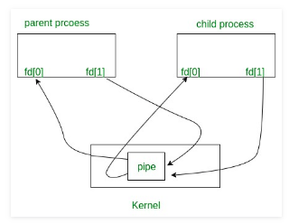

# Thread dan IPC

## Objectives

1. Peserta memahami IPC sebagai bagian dari bahasan process sebelumnya
2. Peserta mengetahui apa itu thread
3. Peserta memahami bagaimana thread bekerja
4. Peserta memahami bagaimana cara membuat thread

- [Thread dan IPC](#thread-dan-ipc)
  - [Objectives](#objectives)
  - [1. Thread](#1-thread)
    - [1.1 Thread](#11-thread)
    - [1.2 Multiprocess Vs Multithread](#12-multiprocess-vs-multithread)
    - [1.3 Pembuatan Thread](#13-pembuatan-thread)
    - [1.4 Join Thread](#14-join-thread)
    - [1.4 Mutual Exclusion](#14-mutual-exclusion)
  - [2. IPC (Interprocess Communication)](#2-ipc-interprocess-communication)
    - [2.1 IPC](#21-ipc)
    - [2.2 Pipes](#22-pipes)
    - [2.3 Sockets](#23-sockets)
    - [2.4 Message Queues](#24-message-queues)
    - [2.5 Semaphores](#25-semaphores)
    - [2.6 Shared Memory](#26-shared-memory)
  - [3. Asynchronous Programming](#3-asynchronous-programming)
    - [3.1 select](#31-select)
    - [3.2 poll](#32-poll)
    - [3.3 epoll](#33-epoll)
  - [Appendix](#appendix)
    - [Libraries documentation (and functions)](#libraries-documentation-and-functions)
  - [Soal Latihan](#soal-latihan)
    - [References](#references)

## 1. Thread

### 1.1 Thread

Thread merupakan unit terkecil dalam suatu proses yang dapat dijadwalkan oleh sistem operasi. Thread juga sering disebut sebagai Lightweight Processes. Thread biasanya secara tidak langsung terbentuk karena adanya suatu proses , dimana setiap proses pasti memiliki thread didalamnya (dalam sistem operasi modern).

Dalam suatu proses, minimal terdapat sebuah thread yang berjalan, walau biasanya terdapat lebih dari satu thread dalam proses tersebut. Thread akan berbagi memori dan menggunakan informasi (nilai) dari variabel-variabel pada suatu proses tersebut. Penggambaran thread pada sebuah proses dapat dilihat sebagai berikut.


Untuk melihat thread yang sedang berjalan, gunakan perintah sebagai berikut.

```bash
top -H
```


### 1.2 Multiprocess Vs Multithread


Perbedaan multiprocess dan multithread
Nomor | Multiprocess | Multithread
--- | --- | ---
1 | banyak proses dieksekusi secara konkuren | banyak thread dalam 1 proses dieksekusi secara konkuren
2 | menambah CPU untuk menigkatkan kekuatan komputasi | membuat banyak thread dalam 1 proses untuk meningkatkan kekuatan komputasi
3 | pembuatan proses membutuhkan waktu dan resource yang besar | pembuatan thread lebih ekonomis dalam segi waktu dan resource
4 | bergantung pada object di memori untuk mengirim data ke proses lain | tidak bergantung pada object lain
5 |process sebagian besar bersifat interruptible / killable | threading lebih susah untuk dikill atau diinterrup karena sebuah thread ada dalam sebuah proses sehingga jika ingin menginterrup thread harus melalui prosesnya (yang dikill prosesnya , otomatis thread akan juga terinterrup)

- Contoh Penggunaan `Multi Processing` adalah pada sistem browser chrome, ketika kita membuka atau membuat tab baru maka sistem juga akan membuat process baru untuk kebutuhan tab baru tersebut sedangkan contoh implementasi `Multi Threading` adalah pada sistem sebuah game dimana sebuah proses dapat menangani berbagai kebutuhan secara bersamaan contohnya sebuah game dapat melakukan rendering beberapa objek bersamaan sehingga proses akan lebih cepat.

### 1.3 Pembuatan Thread

Thread dapat dibuat menggunakan fungsi pada program berbahasa C :

```c
#include <pthread.h> //library thread

int pthread_create(pthread_t *restrict tidp,
                   const pthread_attr_t *restrict attr,
                   void *(*start_rtn)(void *),
                   void *restrict arg);

/* Jika berhasil mengembalikan nilai 0, jika error mengembalikan nilai 1 */
```

Penjelasan Syntax:

- Pointer `tidp` digunakan untuk menunjukkan alamat memori dengan thread ID dari thread baru.
- Argumen `attr` digunakan untuk menyesuaikan atribut yang digunakan oleh thread. nilai `attr` di-set `NULL` ketika thread menggunakan atribut _default_.
- Thread yang baru dibuat akan berjalan dimulai dari fungsi `start_rtn` dalam fungsi thread.
- Pointer `arg` digunakan untuk memberikan sebuah argumen ke fungsi `start_rtn`, jika tidak diperlukan argumen, maka `arg` akan di-set `NULL`.

Contoh Program menggunakan Thread

> compile dengan cara `gcc -pthread -o [output] input.c`

```c
#include <stdio.h>
#include <stdlib.h>
#include <unistd.h>
#include <pthread.h>

void *run(void *args) {
	int angka;
	angka = *((int *)args);

	if (angka == 1) {
		printf("%d bukan prima\n", angka);
		return NULL;
	}

	for (int i=2; i<angka; i++){
		if (angka % i == 0){
			printf("%d bukan prima\n", angka);
			return NULL;
		}
	}
	printf("%d prima\n", angka);
        return NULL;
}

void main() {
	int angka;
	printf("Masukkan angka: ");
	scanf("%d", &angka);

	pthread_t t_id[angka];
	printf("Thread berhasil dibuat\n");

	for (int i=0 ; i<angka; i++) {
		int *num_to_check = (int *)malloc(sizeof(int));
		*num_to_check = i+1 ;
		pthread_create(&t_id[i], NULL, &run, (void *)num_to_check);
	}

	for (int i=0 ; i<angka; i++) {
		pthread_join(t_id[i], NULL);
	}
	printf("Thread telah selesai\n");

}
```

Program Pembanding jika tidak menggunakan Thread

```c
#include <stdio.h>
#include <stdlib.h>

int is_prime(int angka) {
    if (angka == 1) {
        printf("%d bukan prima\n", angka);
        return 0;
    }

    for (int i=2; i<angka; i++){
        if (angka % i == 0){
            printf("%d bukan prima\n", angka);
            return 0;
        }
    }
    printf("%d prima\n", angka);
    return 1;
}

int main() {
    int jumlah;
    printf("Masukkan jumlah angka: ");
    scanf("%d", &jumlah);

    printf("Hasil pengujian bilangan:\n");
    for (int i=0; i<jumlah; i++) {
        is_prime(i);
    }

    return 0;
}
```

Perbandingan antara Thread dengan Fork

Contoh membuat program tanpa menggunakan thread [playtanpathread.c](playtanpathread.c):

```c
#include<stdio.h>
#include<unistd.h>
#include<stdlib.h>
#include<sys/types.h>
#include<sys/wait.h>

int main()
{
	pid_t child;
	int i, stat;
	char *argv1[] = {"clear", NULL};
	char *argv2[] = {"xlogo", NULL};
	child = fork();
	if (child==0) {
		execv("/usr/bin/clear", argv1);
	}
	else
	{
		for(i=0;i<6;i++)
		{
			printf("%d\n",i);
			fflush(stdout);
			sleep(1);
		}
		execv("/usr/bin/xlogo", argv2);
	}

}
```

Contoh membuat program menggunakan thread [playthread.c](playthread.c) :

> compile dengan cara `gcc -pthread -o [output] input.c`

```c
#include<stdio.h>
#include<string.h>
#include<pthread.h>
#include<stdlib.h>
#include<unistd.h>
#include<sys/types.h>
#include<sys/wait.h>

pthread_t tid[3]; //inisialisasi array untuk menampung thread dalam kasus ini ada 2 thread
pid_t child;

int length=5; //inisialisasi jumlah untuk looping
void* playandcount(void *arg)
{
	char *argv1[] = {"clear", NULL};
	char *argv2[] = {"xlogo", NULL};
	unsigned long i=0;
	pthread_t id=pthread_self();
	int iter;
	if(pthread_equal(id,tid[0])) //thread untuk clear layar
	{
		child = fork();
		if (child==0) {
		    execv("/usr/bin/clear", argv1);
	    	}
	}
	else if(pthread_equal(id,tid[1])) // thread menampilkan counter
	{
        for(iter=0;iter<6;iter++)
		{
			printf("%d\n",iter);
			fflush(stdout);
			sleep(1);
		}
	}
	else if(pthread_equal(id,tid[2])) // thread menampilkan gambar
	{
        child = fork();
        if (child==0) {
		    execv("/usr/bin/xlogo", argv2);
	    }
	}

	return NULL;
}

int main(void)
{
	int i=0;
	int err;
	while(i<3) // loop sejumlah thread
	{
		err=pthread_create(&(tid[i]),NULL,&playandcount,NULL); //membuat thread
		if(err!=0) //cek error
		{
			printf("\n can't create thread : [%s]",strerror(err));
		}
		else
		{
			printf("\n create thread success\n");
		}
		i++;
	}
	pthread_join(tid[0],NULL);
	pthread_join(tid[1],NULL);
	exit(0);
	return 0;
}
```

**Kesimpulan** :
Terlihat ketika program menggunakan thread dapat menjalankan dua task secara bersamaan dan konsumsi cpu lebih kecil jika dibanding dengan create suaru proses baru.

### 1.4 Join Thread

Join thread adalah fungsi untuk melakukan penggabungan dengan thread lain yang telah berhenti (_terminated_). Bila thread yang ingin di-join belum dihentikan, maka fungsi ini akan menunggu hingga thread yang diinginkan berstatus **`Terminated`**. Fungsi `pthread_join()` ini dapat dikatakan sebagai fungsi `wait()` pada proses, karena program (_task_) utama akan menunggu thread yang di-join-kan pada program utama tersebut. Kita tidak mengetahui program utama atau thread yang lebih dahulu menyelesaikan pekerjaannya.

Contoh program C Join_Thread [thread_join.c](thread_join.c):

```c
#include <stdio.h>
#include <stdlib.h>
#include <pthread.h> //library thread

void *print_message_function( void *ptr );

int main()
{
    pthread_t thread1, thread2;//inisialisasi awal
    const char *message1 = "Thread 1";
    const char *message2 = "Thread 2";
    int  iret1, iret2;

    iret1 = pthread_create( &thread1, NULL, print_message_function, (void*) message1); //membuat thread pertama
    if(iret1) //jika eror
    {
        fprintf(stderr,"Error - pthread_create() return code: %d\n",iret1);
        exit(EXIT_FAILURE);
    }

    iret2 = pthread_create( &thread2, NULL, print_message_function, (void*) message2);//membuat thread kedua
    if(iret2)//jika gagal
    {
        fprintf(stderr,"Error - pthread_create() return code: %d\n",iret2);
        exit(EXIT_FAILURE);
    }

    printf("pthread_create() for thread 1 returns: %d\n",iret1);
    printf("pthread_create() for thread 2 returns: %d\n",iret2);

    // pthread_join( thread1, NULL);
    // pthread_join( thread2, NULL);

    exit(EXIT_SUCCESS);
}

void *print_message_function( void *ptr )
{
    char *message;
    message = (char *) ptr;
    printf("%s \n", message);

    for(int i=0;i<10;i++){
        printf("%s %d \n", message, i);
    }
}

```

<!-- SECTION DI BAWAH INI DIBUAT HIDDEN DEFAULTNYA, BIAR MEREKA COBA DULU -->

Keterangan :

- Pada program di atas, jika kita _comment_ baris `pthread_join`, maka hasil yang didapat tidak akan memunculkan tulisan **Thread 1** dan **Thread 2**.
- Jika pemanggilan fungsi `pthread_join` di-uncomment, maka program yang kita buat akan memunculkan tulisan **Thread 1** dan **Thread 2**.

**Kesimpulan** :
Pada program pertama tidak menjalankan fungsi `print_message_function` karena sebelum kedua thread dijadwalkan, program utama (kemungkinan) telah selesai dieksekusi sehingga tidak menjalankan fungsi bawaan pada thread. Pada percobaan kedua, fungsi `pthread_join()` digunakan untuk membuat program utama menunggu thread yang _join_ hingga target thread selesai dieksekusi, dengan fungsi ini program utama di-suspend hingga target thread selesai dieksekusi.

- Fungsi untuk terminasi thread

  ```c
  #include <pthread.h>
  void pthread_exit(void *rval_ptr);
  ```

  Argumen `rval_ptr` adalah pointer yang digunakan yang dapat diakses oleh fungsi `pthread_join()` agar dapat mengetahui status thread tersebut

- Fungsi untuk melakukan join thread
  ```c
  int pthread_join(pthread_t thread, void **rval_ptr);
  /* Jika berhasil mengembalikan nilai 0, jika error mengembalikan nilai 1 */
  ```
  Fungsi akan menunda pekerjaan sampai status pointer `rval_ptr` dari fungsi `pthread_exit()` mengembalikan nilainya.

<!-- SAMPE SINI BATAS AKHIRNYA -->

### 1.4 Mutual Exclusion

Disebut juga sebagai **Mutex**, yaitu suatu cara yang menjamin jika ada pekerjaan yang menggunakan variabel atau berkas digunakan juga oleh pekerjaan yang lain, maka pekerjaan lain tersebut akan mengeluarkan nilai dari pekerjaan sebelumnya.

<!-- TAMBAH KETERANGAN KALAU INI PENGGAMBARAN MUTEX SEDERHANA DENGAN MENGGUNAKAN FLAG BERUPA VARIABEL STATUS. PENGGUNAAN STL BISA MENGGUNAKAN pthread_mutex_... -->

Contoh program Simple Mutual_Exclusion [threadmutex.c](threadmutex.c):

```c
#include<stdio.h>
#include<string.h>
#include<pthread.h>
#include<stdlib.h>
#include<unistd.h>

pthread_t tid1, tid2;
int status;
int nomor;

void* tulis(void *arg)
{
    status = 0;

    printf("Masukan nomor : ");
    scanf("%d", &nomor);

    status = 1;

    return NULL;
}

void* baca(void *arg)
{
    while(status != 1)
    {

    }

    printf("Nomor %d\n", nomor);
}

int main(void)
{

    pthread_create(&(tid1), NULL, tulis, NULL);
    pthread_create(&(tid2), NULL, baca, NULL);

    pthread_join(tid1, NULL);
    pthread_join(tid2, NULL);

    return 0;
}

```

Keterangan :

- Terdapat 2 buah thread yang berjalan dengan fungsi yang berbeda.
- Sumber daya (variabel) yang digunakan kedua thread untuk mengeksekusi pekerjaannya **sama**.
- Variabel `status` adalah contoh simple untuk mengendalikan jalannya thread.

**Kesimpulan** :
Karena kita tidak mengetahui _thread_ mana yang lebih dahulu mengeksekusi sebuah variable atau sumber daya pada program, kegunaan dari **Mutex** adalah untuk menjaga sumber daya suatu thread agar tidak digunakan oleh thread lain sebelum ia menyelesaikan pekerjaannya.

## 2. IPC (Interprocess Communication)

### 2.1 IPC

IPC (_Interprocess Communication_) adalah cara atau mekanisme pertukaran data antara satu proses dengan proses lain, baik pada komputer yang sama atau komputer jarak jauh yang terhubung melalui suatu jaringan.

<!-- TAMBAHKAN PENGERTIAN LEBIH LENGKAP -->

### 2.2 Pipes

Pipe merupakan komunikasi sequensial antar proses yang saling terelasi. Kelemahannya, hanya dapat digunakan untuk proses yang saling berhubungan dan secara sequensial.
Terdapat dua jenis pipe:

- unnamed pipe : Komunikasi antara parent dan child proses.
- named pipe : Biasa disebut sebagai FIFO, digunakan untuk komunikasi yang berjalan secara independen. **Hanya bisa digunakan jika kedua proses menggunakan _filesystem_ yang sama.**

```
$ ls | less
```

Diagram :


<!-- TAMBAHKAN PENJELASAN TENTANG FDS (FILE DESCRIPTOR). SAMA KAYA PID, TAPI BUAT PIPING -->

Syntax in C languange :

```
int pipe(int fds[2]);

Parameters :
fd[0] will be the fd(file descriptor) for the
read end of pipe.
fd[1] will be the fd for the write end of pipe.
Returns : 0 on Success.
-1 on error.
```

Example :  
[pipe1.c](pipe1.c)

```c
// C program to illustrate
// pipe system call in C
#include <stdio.h>
#include <unistd.h>
#include <stdlib.h>

#define MSGSIZE 16
char* msg1 = "hello, world #1";
char* msg2 = "hello, world #2";
char* msg3 = "hello, world #3";

int main()
{
	char inbuf[MSGSIZE];
	int p[2], i;

	if (pipe(p) < 0)
		exit(1);

	/* continued */
	/* write pipe */

	write(p[1], msg1, MSGSIZE);
	write(p[1], msg2, MSGSIZE);
	write(p[1], msg3, MSGSIZE);

	for (i = 0; i < 3; i++) {
		/* read pipe */
		read(p[0], inbuf, MSGSIZE);
		printf("%s\n", inbuf);
	}
	return 0;
}

```

Output :

```
hello, world #1
hello, world #2
hello, world #3
```

Pipe dengan fork  
Diagram :  


Example :  
[pipe-fork](pipe-fork.c)

```c
// C program to demonstrate use of fork() and pipe()
#include<stdio.h>
#include<stdlib.h>
#include<unistd.h>
#include<sys/types.h>
#include<string.h>
#include<sys/wait.h>

int main()
{
	// We use two pipes
	// First pipe to send input string from parent
	// Second pipe to send concatenated string from child

	int fd1[2]; // Used to store two ends of first pipe
	int fd2[2]; // Used to store two ends of second pipe

	char fixed_str[] = "forgeeks.org";
	char input_str[100];
	pid_t p;

	if (pipe(fd1)==-1)
	{
		fprintf(stderr, "Pipe Failed" );
		return 1;
	}
	if (pipe(fd2)==-1)
	{
		fprintf(stderr, "Pipe Failed" );
		return 1;
	}

	scanf("%s", input_str);
	p = fork();

	if (p < 0)
	{
		fprintf(stderr, "fork Failed" );
		return 1;
	}

	// Parent process
	else if (p > 0)
	{
		char concat_str[100];

		close(fd1[0]); // Close reading end of first pipe

		// Write input string and close writing end of first
		// pipe.
		write(fd1[1], input_str, strlen(input_str)+1);
		close(fd1[1]);

		// Wait for child to send a string
		wait(NULL);

		close(fd2[1]); // Close writing end of second pipe

		// Read string from child, print it and close
		// reading end.
		read(fd2[0], concat_str, 100);
		printf("Concatenated string %s\n", concat_str);
		close(fd2[0]);
	}

	// child process
	else
	{
		close(fd1[1]); // Close writing end of first pipe

		// Read a string using first pipe
		char concat_str[100];
		read(fd1[0], concat_str, 100);

		// Concatenate a fixed string with it
		int k = strlen(concat_str);
		int i;
		for (i=0; i<strlen(fixed_str); i++)
			concat_str[k++] = fixed_str[i];

		concat_str[k] = '\0'; // string ends with '\0'

		// Close both reading ends
		close(fd1[0]);
		close(fd2[0]);

		// Write concatenated string and close writing end
		write(fd2[1], concat_str, strlen(concat_str)+1);
		close(fd2[1]);

		exit(0);
	}
}

```

<!-- SOCKET  JADIIN EXTRAS (BAHAN BACAAN TAMBAHAN) SAMA KAYA ASYNCRONUS (DI BAWAH) -->

### 2.3 Sockets

_Socket_ merupakan sebuah _end-point_ dalam sebuah proses yang saling berkomunikasi. Biasanya _socket_ digunakan untuk komunikasi antar proses pada komputer yang berbeda, namun dapat juga digunakan dalam komputer yang sama.

Diagram :  


Example : [socket-server.c](socket-server.c) [socket-client.c](socket-client.c)

Server

```c
#include <stdio.h>
#include <sys/socket.h>
#include <stdlib.h>
#include <netinet/in.h>
#include <string.h>
#include <unistd.h>
#define PORT 8080

int main(int argc, char const *argv[]) {
    int server_fd, new_socket, valread;
    struct sockaddr_in address;
    int opt = 1;
    int addrlen = sizeof(address);
    char buffer[1024] = {0};
    char *hello = "Hello from server";

    if ((server_fd = socket(AF_INET, SOCK_STREAM, 0)) == 0) {
        perror("socket failed");
        exit(EXIT_FAILURE);
    }

    if (setsockopt(server_fd, SOL_SOCKET, SO_REUSEADDR | SO_REUSEPORT, &opt, sizeof(opt))) {
        perror("setsockopt");
        exit(EXIT_FAILURE);
    }

    address.sin_family = AF_INET;
    address.sin_addr.s_addr = INADDR_ANY;
    address.sin_port = htons( PORT );

    if (bind(server_fd, (struct sockaddr *)&address, sizeof(address))<0) {
        perror("bind failed");
        exit(EXIT_FAILURE);
    }

    if (listen(server_fd, 3) < 0) {
        perror("listen");
        exit(EXIT_FAILURE);
    }

    if ((new_socket = accept(server_fd, (struct sockaddr *)&address, (socklen_t*)&addrlen))<0) {
        perror("accept");
        exit(EXIT_FAILURE);
    }

    valread = read( new_socket , buffer, 1024);
    printf("%s\n",buffer );
    send(new_socket , hello , strlen(hello) , 0 );
    printf("Hello message sent\n");
    return 0;
}
```

Client

```c
#include <stdio.h>
#include <sys/socket.h>
#include <stdlib.h>
#include <netinet/in.h>
#include <string.h>
#include <unistd.h>
#include <arpa/inet.h>
#define PORT 8080

int main(int argc, char const *argv[]) {
    struct sockaddr_in address;
    int sock = 0, valread;
    struct sockaddr_in serv_addr;
    char *hello = "Hello from client";
    char buffer[1024] = {0};
    if ((sock = socket(AF_INET, SOCK_STREAM, 0)) < 0) {
        printf("\n Socket creation error \n");
        return -1;
    }

    memset(&serv_addr, '0', sizeof(serv_addr));

    serv_addr.sin_family = AF_INET;
    serv_addr.sin_port = htons(PORT);

    if(inet_pton(AF_INET, "127.0.0.1", &serv_addr.sin_addr)<=0) {
        printf("\nInvalid address/ Address not supported \n");
        return -1;
    }

    if (connect(sock, (struct sockaddr *)&serv_addr, sizeof(serv_addr)) < 0) {
        printf("\nConnection Failed \n");
        return -1;
    }

    send(sock , hello , strlen(hello) , 0 );
    printf("Hello message sent\n");
    valread = read( sock , buffer, 1024);
    printf("%s\n",buffer );
    return 0;
}
```

Jalankan proses server dulu, kemudian jalankan clientnya. Dan amati apa yang terjadi.

<!-- TAMBAH KETERANGAN LEBIH DALAM BUAT MESSAGE QUEUES -->

### 2.4 Message Queues

Merupakan komunikasi antar proses dimana proses tersebut menciptakan internal linked-list pada alamat kernel Sistem Operasi. Pesannya disebut sebagai _queue_ sedangkan pengenalnya disebut _queue_ ID. _Queue_ ID berguna sebagai _key_ untuk menandai pesan mana yang akan dikirim dan tujuan pengiriman pesannya.

<!-- TAMBAH KETERANGAN LEBIH DALAM BUAT SEMAPHORES -->

### 2.5 Semaphores

Semaphore berbeda dengan jenis-jenis IPC yang lain. Pada pengaplikasiannya, semaphore merupakan sebuah counter yang digunakan untuk controlling resource oleh beberapa proses secara bersamaan.

- Jika suatu counter block memory memiliki nilai positif, semaphore dapat menggunakan resource untuk prosesnya, dan mengurangi nilai counter block dengan 1 untuk menandai bahwa suatu block memory tengah digunakan.
- Sebaliknya, jika semaphore bernilai 0, proses akan masuk pada mode sleep sampai semaphore bernilai lebih besar dari 0.

<!-- TAMBAH KETERANGAN LEBIH DALAM BUAT SHARED MEMORY -->

### 2.6 Shared Memory

Sebuah mekanisme _mapping area(segments)_ dari suatu blok _memory_ untuk digunakan bersama oleh beberapa proses. Sebuah proses akan menciptakan _segment memory_, kemudian proses lain yang diijinkan dapat mengakses _memory_ tersebut. _Shared memory_ merupakan cara yang efektif untuk melakukan pertukaran data antar program.

Example: [Proses 1](proses1.c) [Proses 2](proses2.c)

Proses 1

```c
#include <stdio.h>
#include <sys/ipc.h>
#include <sys/shm.h>
#include <unistd.h>

void main()
{
        key_t key = 1234;
        int *value;

        int shmid = shmget(key, sizeof(int), IPC_CREAT | 0666);
        value = shmat(shmid, NULL, 0);

        *value = 10;

        printf("Program 1 : %d\n", *value);

        sleep(5);

        printf("Program 1: %d\n", *value);
        shmdt(value);
        shmctl(shmid, IPC_RMID, NULL);
}
```

Proses 2

```c
#include <stdio.h>
#include <sys/ipc.h>
#include <sys/shm.h>
#include <unistd.h>

void main()
{
        key_t key = 1234;
        int *value;

        int shmid = shmget(key, sizeof(int), IPC_CREAT | 0666);
        value = shmat(shmid, NULL, 0);

        printf("Program 1 : %d\n", *value);
	*value = 30;

        sleep(5);

        printf("Program 1: %d\n", *value);
        shmdt(value);
        shmctl(shmid, IPC_RMID, NULL);
}
```

Jalankan proses 1 terlebih dahulu, lalu proses 2.
Hasilnya
Proses 1

```
Program 1 : 10
Program 1 : 30
```

Proses 2

```
Program 1 : 10
Program 1 : 30
```

<!-- JADIIN EXTRAS (BAHAN BACAAN TAMBAHAN) -->

## 3. Asynchronous Programming

Kita sudah mengenal bagaimana cara menggunakan thread dan memproses perintah secara terpisah-pisah dan bersamaan. Di tingkatan selanjutnya, kita akan belajar bagaimana suatu proses menerima suatu perintah tanpa terblok oleh proses yang lain. Disinilah kita akan belajar tentang Asynchronous Programming dimana kita tidak perlu menunggu sesuatu terlalu lama dan kita membiarkan tugas lainnya dikerjakan oleh core processor yang lain. Berikut adalah beberapa perintah yang bisa digunakan untuk menerapkan Asynchronous Programming di C.

### 3.1 select

Select memberikan kita kemampuan untuk memonitor jumlah socket yang cukup besar, dan tiap socket tidak terblok oleh socket yang lain. Mungkin kita bisa mengakali menggunakan thread, hanya saja jika jumlah socket sangat besar seperti 1024, memiliki 1024 thread bukanlah solusi yang tepat dan penggunaan select akan lebih memudahkan pekerjaan.

Fungsi select()

```c
int select(int nfds, fd_set *readfds, fd_set *writefds, fd_set *exceptfds, struct timeval *timeout);

struct timeval {
    long int tv_sec;    /* Value in seconds */
    long int tv_usec;   /* Value in milli-seconds */
};
```

Penjelasan untuk parameter yang digunakan :

- nfds : Jumlah file descriptor tertinggi + 1, bisa menggunakan `FD_SETSIZE` yang berisi angka 1024
- readfds : File descriptor untuk pembacaan
- writefds : File descriptor untuk penulisan
- exceptfds : File descriptor untuk exception
- timeout : Timeout jika aplikasi menginginkan ada timeout

Contoh penggunaan dapat dilihat pada [file server](select-server.c) dan [file client](select-client.c) yang ada pada modul. Lakukan seperti di [Subbab 2.3 Sockets](#23-sockets) untuk testing.

### 3.2 poll

`poll()` sendiri melakukan sesuatu yang sama dengan `select()` yaitu menunggu salah satu dari file descriptor untuk siap melakukan operasi. Tetapi `poll()` sendiri diciptakan untuk mengatasi permasalahan pending yang dimiliki oleh `select()`

Fungsi `poll()`

```c
#include <poll.h>

int poll(struct pollfd *fds, int nfds, int timeout);

struct pollfd {
    int   fd;         /* file descriptor */
    short events;     /* requested events */
    short revents;    /* returned events */
};
```

Penjelasan Parameter :

- fds : Array dari file descriptor
- nfds : Jumlah file descriptor
- timeout : Timeout untuk program
- events & revents : Bisa membaca sumber yang ada di referensi karena cukup banyak dan beragam

Contoh penggunaan dapat dilihat pada [file server](poll-server.c) dan [file client](poll-client.c) yang ada pada modul. Lakukan seperti di [Subbab 2.3 Sockets](#23-sockets) untuk testing.

### 3.3 epoll

`epoll` adalah varian dari `poll()` yang bisa memperbesar skala dengan baik untuk jumlah file descriptor yang besar. 3 system call disediakan untuk set up dan mengkontrol epoll set : `epoll_create()`, `epoll_ctl()`, `epoll_wait()`.

Fungsi-fungsi untuk `epoll`

```c
int epoll_create(int size); // creates an epoll() instance

int epoll_ctl(int epfd, int op, int fd, struct epoll_event *event); // performs control operations on the epoll() instance referred to by the file descriptor epfd.

int epoll_wait(int epfd, struct epoll_event *events,int maxevents, int timeout); // waits for events on the epoll() instance referred to by the file descriptor epfd

typedef union epoll_data {
    void        *ptr;
    int          fd;
    uint32_t     u32;
    uint64_t     u64;
} epoll_data_t;

struct epoll_event {
    uint32_t     events;      /* Epoll events */
    epoll_data_t data;        /* User data variable */
};
```

Contoh penggunaan dapat dilihat pada [file server](epoll-server.c) dan [file client](epoll-client.c) yang ada pada modul. Lakukan seperti di [Subbab 2.3 Sockets](#23-sockets) untuk testing.

## Appendix

### Libraries documentation (and functions)

```
$ man {anything-you-want-to-know}
$ man mkfifo
$ man fcntl
```

## Soal Latihan

1. Mentor Clemongs sangat senang memberi tugas tambahan pada Clemongs. Karena sudah lelah mengerjakannya, Clemongs meminta bantuan kamu untuk mengerjakan tugas-tugas yang diberikan oleh mentornya.
   Ia diminta membuat program multithreading untuk mengecek apakah suatu angka merupakan bilangan prima atau bukan.
   Contoh:

```bash
## input
./prime 12 43 49
```

```bash
### output
12 bukan prima
43 prima
49 bukan prima
```

2. Clemongs juga diminta membuat sebuah program untuk menampilkan path directory yang sedang aktif saat program dijalankan dan print 3 file pertama dari directory tersebut. Program harus memanfaatkan fork dan pipe!

3. Terakhir, Clemongs harus membuat program client dan server menggunakan socket pada bahasa C. Server bisa menerima 2 perintah yaitu GET dan POST. Saat melakukan perintah POST, client memberikan satu angka tambahan untuk disimpan di server. Sedangkan perintah GET akan meminta server untuk mengirim semua angka yang sudah tersimpan dan hasilnya akan diprint di client. Cukup gunakan array saja untuk menyimpan angka di server. Server juga bisa memberikan peringatan "Bad request" jika command yang digunakan client tidak sesuai.

Contoh:

```bash
## input
POST
5
POST
3
GET
```

```bash
### output
Penambahan angka berhasil
Penambahan angka berhasil
5 3
```

### References

- https://notes.shichao.io/apue/
- https://www.gta.ufrj.br/ensino/eel878/sockets/index.html
- http://advancedlinuxprogramming.com/alp-folder/alp-ch05-ipc.pdf
- https://www.geeksforgeeks.org/socket-programming-cc/
- https://www.geeksforgeeks.org/pipe-system-call/
- https://developer.mozilla.org/en-US/docs/Learn/JavaScript/Asynchronous/Concepts
- http://codingbison.com/c/c-sockets-select.html
- https://www.tutorialspoint.com/unix_system_calls/poll.htm
- https://pubs.opengroup.org/onlinepubs/009696799/functions/poll.html
- https://linux.die.net/man/4/epoll
- https://programmer.ink/think/epoll-for-linux-programming.html
