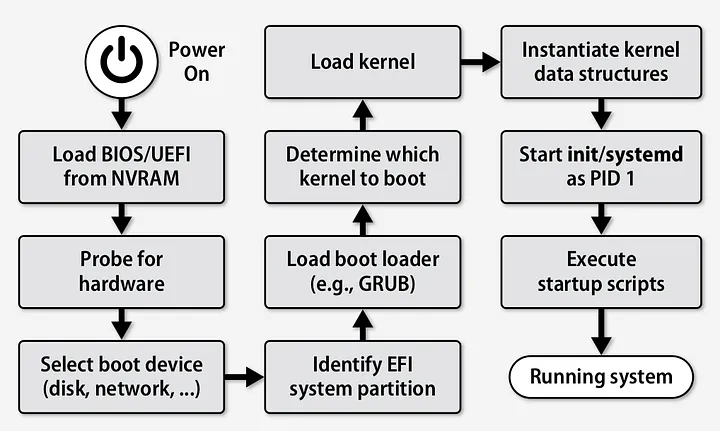
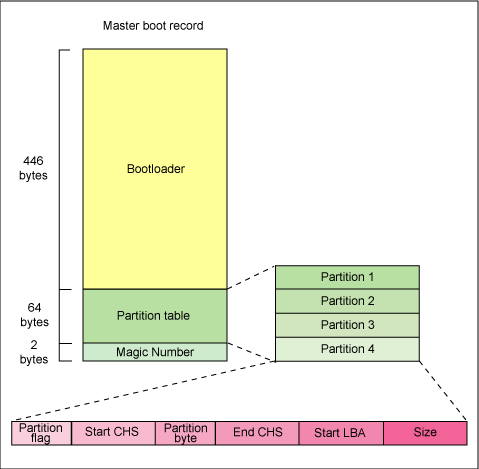
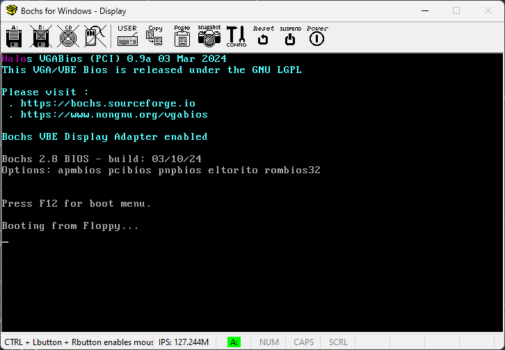

# Modul 4 - FUSE dan Pembuatan Sistem Operasi Sederhana

## Capaian

1. Memahami file system pada sistem operasi
2. Dapat membuat program FUSE sederhana
3. Memahami langkah pembuatan sistem operasi

## Daftar Isi

- [i. Capaian](#capaian)
- [ii. Daftar Isi](#daftar-isi)
- [1. File System](#file-system)
  - [1.1. Tipe File System](#tipe-file-system)
  - [1.2. Virtual File System](#virtual-file-system)
  - [1.3. Dentry](#dentry)
  - [1.4. Superblock](#superblock)
  - [1.5. Inode](#inode)
- [2. File System in Userspace](#file-system-in-userspace)
  - [2.1. Pengertian FUSE](#pengertian-fuse)
  - [2.2. Instalasi Library FUSE](#instalasi-library-fuse)
  - [2.3. Cara Kerja FUSE](#cara-kerja-fuse)
  - [2.4. Membuat Program FUSE](#membuat-program-fuse)
  - [2.5. Unmount FUSE](#unmount-fuse)
- [3. Sistem Operasi](#sistem-operasi)
  - [3.1. Pengertian Sistem Operasi](#pengertian-sistem-operasi)
  - [3.2. Pengertian Kernel](#pengertian-kernel)
  - [3.3. Pengertian Shell](#pengertian-shell)
  - [3.4. Proses Booting Sistem Operasi](#proses-booting-sistem-operasi)
  - [3.5. Pengertian Interrupts](#pengertian-interrupts)
- [4. Pembuatan Sistem Operasi Sederhana](#pembuatan-sistem-operasi-sederhana)
  - [4.1. Instalasi Tools](#instalasi-tools)
  - [4.2. Persiapan Disk Image](#persiapan-disk-image)
  - [4.3. Bootloader Sederhana](#bootloader-sederhana)
  - [4.4. Menjalankan Bootloader Sederhana](#menjalankan-bootloader-sederhana)
  - [4.5. Membuat Kernel Assembly](#membuat-kernel-assembly)
  - [4.6. Membuat Kernel C](#membuat-kernel-c)
  - [4.7. Menggabungkan Kernel](#menggabungkan-kernel-assembly-dan-kernel-c)
  - [4.8. Mengubah Bootloader](#mengubah-bootloader)
  - [4.9. Menggabungkan Bootloader dan Kernel](#menggabungkan-bootloader-dan-kernel)
  - [4.10. Menjalankan Sistem Operasi](#menjalankan-sistem-operasi-sederhana)
  - [4.11. Otomatisasi Proses Kompilasi](#otomatisasi-proses-kompilasi)

## File System

_File system_ adalah struktur logika yang digunakan untuk mengendalikan akses data seperti bagaimana dia disimpan maupun diambil. _File system_ sendiri memiliki banyak jenis dengan penggunaan algoritma yang tentu berbeda. Setiap Sistem Operasi (OS) memiliki support file system yang berbeda-beda. File system digunakan untuk mengorganisir dan menyimpan file pada storage device.

_File system_ menyediakan cara untuk memisah-misahkan data pada drive menjadi bentuk tunggal yaitu file. _File system_ juga menyediakan cara untuk menyimpan data pada file, contohnya **filename**, **permission**, dan atribut lainnya. Pada File System, disediakan juga sebuah **index** yang berisi daftar file yang terletak pada suatu lokasi penyimpanan, sehingga Sistem Operasi dapat melihat ada apa saja pada lokasi penyimpanan tersebut.


### Tipe File System

**1. File System Disk**

_File system disk_ adalah _file system_ yang didesain untuk menyimpan data pada sebuah media penyimpan data. Contohnya: FAT (FAT 12, FAT 16, FAT 320), NTFS, HFS, HFS+, ext2, ext3, ext4, ISO 9660, ODS-5 dan UDF.

- FAT32 dan NTFS adalah File System di Windows.


- Ext2, Ext3, Ext4 adalah File Sytem di Linux.


- APFS, HFS dan HFS+ adalah File System dari MacOS


**2. File System Flash**

_File system flash_ adalah _file system_ yang didesain untuk menyimpan data pada media _flash memory_. Hal ini menjadi lazim ketika jumlah perangkat mobile semakin banyak dan kapasitas _memory flash_ yang semakin besar. Contohnya pada linux flash filesystems yaitu JFFS, JFFS2, YAFFS, UBIFS, LogFS, F2FS.

**3. File System Database**

Konsep baru untuk manajemen _file_ adalah konsep _file system_ berbasis _database_. Sebagai perbaikan bagi Manajemen terstruktur hirarkis, file diidentifikasi oleh karakteristiknya, seperti tipe _file_, topik, pembuat, atau metadata yang sama.


**4. File System Transaksional**

Beberapa program terkadang membutuhkan perubahan pada beberapa file. Jika pada proses perubahan tadi mengalami kegagalan, maka file akan kembali seperti semula (tidak ada perubahan). Contohnya adalah saat menginstall sebuah software, dimana menjalankan proses writing beberapa file, jika terjadi error selama proses writing, dan software tersebut dibiarkan menjadi **setengah terinstall**, maka software tersebut akan rusak atau tidak stabil.

Pada File System Transaksional, tidak akan membiarkan hal tersebut terjadi. File System ini menjamin bahwa jika ada suatu proses yang error, maka proses tersebut akan dibatalkan, dan file-file yang telah terbentuk selama proses tadi akan di roll back seperti semula. Contoh dari File System ini pada UNIX adalah Valor File System, Amino, LFS dan TFFS,

**5. File System Jaringan**

_File system_ jaringan adalah _file system_ yang bertindak sebagai klien untuk protokol akses file jarak jauh, memberikan akses ke _file_ pada sebuah _server_. Contoh dari _file system_ jaringan ini adalah klien protokol NFS, AFS, SMB, dan klien FTP dan WebDAV.

**6. File System Journaling**

_File system_ yang mencatat setiap perubahan yang terjadi pada storage device ke dalam jurnal (biasanya berupa log sirkular dalam area tertentu) sebelum melakukan perubahan ke _file system_. File sistem seperti ini memiliki kemungkinan yang lebih kecil mengalami kerusakan saat terjadi _power failure_ atau _system crash_.

### Virtual File System

Virtual file system (VFS) adalah suatu lapisan perangkat lunak dalam kernel yang menyediakan _interface file system_ untuk program _user space_. _Virtual file system_ berfungsi agar berbagai jenis _file system_ dapat diakses oleh aplikasi komputer dengan cara yang seragam. VFS menyediakan antarmuka antara _system call_ dengan sistem yang sesungguhnya.

### Dentry

Dentry atau **Directory Entry** merupakan sebuah struktur data yang memiliki tugas sebagai penerjemah nama berkas ke inode-nya. Contoh informasi yang disimpan dalam dentry adalah _name_, _pointer to inode_, _pointer to parent dentry_, _use count_, dan lainnya. Adapula command dalam VFS dentry adalah D_compare, D_delete, D_release.


### Superblock

Setiap _file system_ yang di-_mount_ akan direpresentasikan oleh sebuah VFS Superblock. _Superblock_ digunakan untuk menyimpan informasi mengenai partisi tersebut. _Superblock_ menyimpan informasi sebagai berikut:

- _Device_: Merupakan _device identifier_, contohnya **/dev/hda1** adalah _harddisk_ pertama yang terdapat pada sistem memiliki device identifier **0×300**.

- _Inode Pointer_: Merupakan suatu _pointer_ yang menunjuk ke inode pertama pada sistem berkas.

- _Blocksize_: Menunjukkan ukuran suatu _block_ dari sistem berkas, contohnya **1024** _**bytes**_.

- _Superblock Operation_: Merupakan suatu pointer ke sekumpulan _superblock routine_ (fungsi) dari _file system_, contohnya _**read**_, _**write**_, dan sebagainya.

- _File System Type_: Menunjukkan tipe dari _file system_, contoh: EXT2, FAT, NTFS.

- _File System Specific_: Merupakan suatu pointer ke informasi yang dibutuhkan oleh \_file system.


### Inode

Inode adalah abstraksi VFS untuk berkas. Setiap berkas, directory, dan data lainnya pada VFS direpresentasikan oleh satu dan hanya satu VFS inode. VFS inode hanya terdapat di memori kernel dan disimpan di inode chace selama masih dibutuhkan oleh sistem. Informasi yang disimpan oleh VFS Inode diantaranya:

- _Device_: Menunjukan device identifier dari suatu device yang menyimpan berkas ataupun _directory_.

- _Inode Number_: Merupakan nomor inode yang unik dalam _file system_.

- Mode: Menggambarkan apa yang direpresentasikan oleh VFS inode.

- _User_ ID: Merupakan identifier bagi pemilik berkas.

- _Time_: Menunjukkan kapan pembuatan, modifikasi, dan penulisan suatu berkas.

- _Blocksize_: Menunjukkan ukuran dari _block_ yang digunakan oleh berkas.

- _Inode Operations_: Merupakan _pointer_ ke suatu _routine_ yang melakukan berbagai operasi pada inode.

- _Count_: Menunjukkan berapa kali suatu sistem telah menggunakan suatu inode.

- _Lock_: Digunakan untuk mengunci VFS inode.

- _File System Specific Information_: Menunjukkan informasi khusus yang dibutuhkan oleh suatu inode.


Berikut adalah hubungan antara dentry, superblock, dan inode pada Virtual File System.


## File System in Userspace

### Pengertian FUSE

FUSE (Filesystem in Userspace) adalah sebuah _interface_ dimana kita dapat membuat _file system_ sendiri pada _userspace_ pada linux.

Keuntungan menggunakan FUSE ialah kita dapat menggunakan _library_ apapun yang tersedia untuk membuat _file system_ sendiri tanpa perlu mengenali secara mendalam apa yang _file system_ sebenarnya lakukan di _kernel space_. Hal ini dilakukan karena modul FUSE yang dapat menjembatani antara kode _file system_ yang berada pada _userspace_ dengan _file system_ yang berada pada _kernel space_. Beberapa manfaat yang lain dari FUSE adalah sebagai berikut:

- Dapat dimuat dan dipasang oleh pengguna biasa. Untuk akses jaringan, untuk mendapatkan file arsip, untuk removable media, dll.
- Jika driver sistem FUSE mengalami crash, tidak akan mempengaruhi kernel.
- FUSE dapat dideploy dengan cepat, baik karena tidak perlu intervensi administrator untuk menginstalnya dan karena dapat dengan mudah diakses oleh OS yang didukung.
- Tidak ada masalah lisensi terkait dengan hubungan statis dengan kernel.


Salah satu contoh yang menarik dari FUSE adalah [GDFS][7bb7b7cc] (Google Drive File System), dimana GDFS ini memungkinkan kita untuk me-_mount Google Drive_ kita ke sistem linux dan menggunakannya seperti file linux biasa.

[7bb7b7cc]: https://github.com/robin-thomas/GDFS "GDFS"


Untuk mengimplementasikan FUSE ini, kita harus membuat sebuah program yang terhubung dengan _library_ `libfuse`. Tujuan dari program yang dibuat ini adalah menspesifikkan bagaimana _file system_ merespon _read/write/stat_ dari sebuah _request_ dan untuk me-_(mount)_ _file system_ asli _(kernel space)_ ke _file system_ yang baru _(userspace)_. Jadi di saat _user_ berurusan dengan _read/write/stat request_ di _file system (userspace)_, kernel akan meneruskan _input output request_ tersebut ke program FUSE dan program tersebut akan merespon kembali ke _user_.

Untuk lebih jelasnya mari kita coba membuat program FUSE.

### Instalasi Library FUSE

Pertama-tama kita harus memstikan bahwa FUSE sudah ter-install di perangkat anda

```

$ sudo apt update

$ sudo apt install libfuse*

```

### Cara Kerja FUSE

- `fuse_main()` (lib/helper.c) = sebagai fungsi main (userspace), program user memanggil fungsi fuse_main() kemudian fungsi fuse_mount() dipanggil.

- `fuse_mount()` (lib/mount.c) = menciptakan UNIX domain socket, kemudian di fork dan menciptakan child process yang menjalankan fusermount

- `fusermount()` (util/fusermount.c) = untuk mengecek apakah modul FUSE sudah di load. Kemudian membuka /dev/fuse dan mengirim file handle melalu UNIX domain socket kembali ke fungsi fuse_mount()

- `fuse_new()` (lib/fuse.c) = menciptakan struktur data yang berisi ruang yang digukanan untuk menyimpan data file system

- `fuse_loop()` (lib/fuse.c) = membaca file system calls dari /dev/fuse

Ini adalah beberapa fungsi yang disediakan oleh **FUSE**:

```c

int (*getattr) (const char *, struct stat *);

//Get file attributes.


int (*readlink) (const char *, char *, size_t);

//Read the target of a symbolic link

int (*mknod) (const char *, mode_t, dev_t);

//Create a file node.


int (*mkdir) (const char *, mode_t);

//Create a directory.


int (*unlink) (const char *);

//Remove a file


int (*rmdir) (const char *);

//Remove a directory


int (*rename) (const char *, const char *);

//Rename a file


int (*chmod) (const char *, mode_t);

//Change the permission bits of a file


int (*chown) (const char *, uid_t, gid_t);

//Change the owner and group of a file


int (*truncate) (const char *, off_t);

//Change the size of a file


int (*open) (const char *, struct fuse_file_info *);

//File open operation.


int (*readdir) (const char *, void *, fuse_fill_dir_t, off_t, struct fuse_file_info *);

//Read directory


int (*read) (const char *, char *, size_t, off_t, struct fuse_file_info *);

//Read data from an open file


int (*write) (const char *, const char *, size_t, off_t, struct fuse_file_info *);

//Write data to an open file

```

### Membuat Program FUSE

Fuse memiliki `struct` yang dinamakan `fuse_operations` yang didefinisikan seperti dibawah ini:

```c

static  struct fuse_operations xmp_oper = {
    .getattr = xmp_getattr,
    .access = xmp_access,
    .readlink = xmp_readlink,
    .readdir = xmp_readdir,
    .mknod = xmp_mknod,
    .mkdir = xmp_mkdir,
    .symlink = xmp_symlink,
    .unlink = xmp_unlink,
    .rmdir = xmp_rmdir,
    .rename = xmp_rename,
    .link = xmp_link,
    .chmod = xmp_chmod,
    .chown = xmp_chown,
    .truncate = xmp_truncate,
    .utimens = xmp_utimens,
    .open = xmp_open,
    .read = xmp_read,
    .write = xmp_write,
    .statfs = xmp_statfs,
    .create = xmp_create,
    .release = xmp_release,
    .fsync = xmp_fsync,
    .setxattr = xmp_setxattr,
    .getxattr = xmp_getxattr,
    .listxattr = xmp_listxattr,
    .removexattr = xmp_removexattr,
};

```

Semua atribut pada `struct` tersebut adalah _pointer_ yang menuju ke fungsi. Setiap fungsi tersebut disebut FUSE saat suatu kejadian yang spesifik terjadi di _file system_. Sebagai contoh saat _user_ menulis di sebuah file, sebuah fungsi yang ditunjuk oleh atribut "write" di `struct` akan terpanggil.

Selain itu, atribut pada `struct` tersebut tertulis seperti fungsi yang biasa digunakan di linux. Contohnya ialah saat kita membuat _directory_ di FUSE maka fungsi mkdir akan dipanggil.

**Untuk mengimplementasikan FUSE**, kita harus menggunakan `struct` ini dan harus mendefinisikan fungsi yang ada di dalam `struct` tersebut. Setelahnya, kita mengisi `struct` tersebut dengan pointer dari fungsi yang ingin diimplementasikan.

Kebanyakan fungsi-fungsi yang tersedia adalah **opsional**, kita tidak perlu mengimplementasikan semuanya. Beberapa fungsi memang harus diimplementasikan dalam _file system_. Fungsi-fungsi tersebut antara lain:

- Fungsi `getattr` yang dipanggil saat sistem mencoba untuk mendapatkan atribut dari sebuah file.

- Fungsi `readdir` yang dipanggil saat user mencoba untuk menampilkan file dan direktori yang berada pada suatu direktori yang spesifik.

- Fungsi `read` yang dipanggil saat sistem mencoba untuk membaca potongan demi potongan data dari suatu file.

Untuk melihat fungsi-fungsi yang tersedia pada **FUSE** yang lain, buka link berikut: [https://libfuse.github.io/doxygen/structfuse\_\_operations.html](https://libfuse.github.io/doxygen/structfuse__operations.html)

Contoh program FUSE sederhana yang hanya menggunakan 3 fungsi tersebut.

```c
#define FUSE_USE_VERSION 28
#include <fuse.h>
#include <stdio.h>
#include <string.h>
#include <unistd.h>
#include <fcntl.h>
#include <dirent.h>
#include <errno.h>
#include <sys/time.h>

static  int  xmp_getattr(const char *path, struct stat *stbuf)
{
    int res;
    res = lstat(path, stbuf);

    if (res == -1) return -errno;
    return 0;
}


static int xmp_readdir(const char *path, void *buf, fuse_fill_dir_t filler, off_t offset, struct fuse_file_info *fi)
{
    DIR *dp;
    struct dirent *de;
    (void) offset;
    (void) fi;

    dp = opendir(path);

    if (dp == NULL) return -errno;

    while ((de = readdir(dp)) != NULL) {
        struct stat st;

        memset(&st, 0, sizeof(st));

        st.st_ino = de->d_ino;
        st.st_mode = de->d_type << 12;

        if(filler(buf, de->d_name, &st, 0)) break;
    }
    closedir(dp);
    return 0;
}


static int xmp_read(const char *path, char *buf, size_t size, off_t offset, struct fuse_file_info *fi)
{
    int fd;
    int res;
    (void) fi;

    fd = open(path, O_RDONLY);

    if (fd == -1) return -errno;

    res = pread(fd, buf, size, offset);

    if (res == -1) res = -errno;

    close(fd);

    return res;
}


static struct fuse_operations xmp_oper = {
    .getattr = xmp_getattr,
    .readdir = xmp_readdir,
    .read = xmp_read,
};


int  main(int  argc, char *argv[])
{
    umask(0);
    return fuse_main(argc, argv, &xmp_oper, NULL);
}
```

Setelah itu kode dapat di-_compile_ dengan cara

```

gcc -Wall `pkg-config fuse --cflags` [fuse.c] -o [output] `pkg-config fuse --libs`

```

Lalu buat sebuah direktori sebagai tujuan pembuatan FUSE dan menjalankan FUSE pada direktori tersebut.

```

$ mkdir [direktori tujuan]

$ ./[output] [direktori tujuan]

```

Setelah program dijalankan, masuklah kedalam direktori tujuan tersebut. Isi dari direktori tersebut adalah list folder yang sama seperti yang ada di dalam `root` atau `/`.

### Unmount FUSE

Unmount command digunakan untuk "unmount" sebuah filesystem yang telah ter-mount, lalu juga menginformasikan ke sistem untuk menyelesaikan semua operasi read dan write yang masih tertunda agar bisa di-detach (dilepaskan) dengan aman.

Untuk melakukan **unmount** FUSE, jalankan command di bawah ini:

```
sudo umount [direktori tujuan]
atau
fusermount -u [direktori tujuan]
```

### Tips

1. Debugging Fuse
   
Salah satu cara debugging yang bisa dilakukan saat memprogram fuse adalah dengan menggunakan `printf` dan menjalankan program dengan cara `./[output] -f [direktori tujuan]`. Dimana `-f` disini berarti menjaga program agar tetap berjalan di foreground sehingga bisa menggunakan `printf`.

2. Modifying Parameters value
   
Sesuai dengan penjelasan di awal di mana FUSE dapat memodifikasi _file system_ di _userspace_ tanpa perlu mengubah kode yang ada pada kernel, di sini kita coba memodifikasi kode FUSE tadi agar folder yang di mount hanya berisi `/home/[user]/Documents` sebagai root folder.

Ubah kode FUSE tadi seperti yang ada dibawah ini:

```c
#define FUSE_USE_VERSION 28
#include <fuse.h>
#include <stdio.h>
#include <string.h>
#include <unistd.h>
#include <fcntl.h>
#include <dirent.h>
#include <errno.h>
#include <sys/time.h>

static  const  char *dirpath = "/home/[user]/Documents";

static  int  xmp_getattr(const char *path, struct stat *stbuf)
{
    int res;
    char fpath[1000];

    sprintf(fpath,"%s%s",dirpath,path);

    res = lstat(fpath, stbuf);

    if (res == -1) return -errno;

    return 0;
}


static int xmp_readdir(const char *path, void *buf, fuse_fill_dir_t filler, off_t offset, struct fuse_file_info *fi)
{
    char fpath[1000];

    if(strcmp(path,"/") == 0)
    {
        path=dirpath;
        sprintf(fpath,"%s",path);
    } else sprintf(fpath, "%s%s",dirpath,path);

    int res = 0;

    DIR *dp;
    struct dirent *de;
    (void) offset;
    (void) fi;

    dp = opendir(fpath);

    if (dp == NULL) return -errno;

    while ((de = readdir(dp)) != NULL) {
        struct stat st;

        memset(&st, 0, sizeof(st));

        st.st_ino = de->d_ino;
        st.st_mode = de->d_type << 12;
        res = (filler(buf, de->d_name, &st, 0));

        if(res!=0) break;
    }

    closedir(dp);

    return 0;
}


static int xmp_read(const char *path, char *buf, size_t size, off_t offset, struct fuse_file_info *fi)
{
    char fpath[1000];
    if(strcmp(path,"/") == 0)
    {
        path=dirpath;

        sprintf(fpath,"%s",path);
    }
    else sprintf(fpath, "%s%s",dirpath,path);

    int res = 0;
    int fd = 0 ;

    (void) fi;

    fd = open(fpath, O_RDONLY);

    if (fd == -1) return -errno;

    res = pread(fd, buf, size, offset);

    if (res == -1) res = -errno;

    close(fd);

    return res;
}


static struct fuse_operations xmp_oper = {
    .getattr = xmp_getattr,
    .readdir = xmp_readdir,
    .read = xmp_read,
};


int  main(int  argc, char *argv[])
{
    umask(0);

    return fuse_main(argc, argv, &xmp_oper, NULL);
}
```

Hal ini terjadi karena parameter `const char *path` merupakan pointer variable yang menunjuk ke value path yang digunakan user, sehingga ketika kita mengubah value dari path, maka posisi user akan berubah juga.

3. PERINGATAN

Berbeda dengan Docker container, file yang berada di dalam folder mount fuse merupakan file yang sama pada filesystem host, jika kita mengubah/menghapus/menambahkan file/folder pada fuse hal itu juga terjadi pada host.

## Sistem Operasi

### Pengertian Sistem Operasi

Sistem operasi adalah satu kesatuan perangkat yang melakukan kontrol pada perangkat komputer dan sumber daya yang dimilikinya. Komponen dari sistem operasi dapat diilustrasikan pada diagram berikut.


- **Hardware**: Merupakan perangkat keras yang digunakan oleh sistem operasi untuk menjalankan program.
- **Kernel**: Merupakan inti dari sistem operasi yang mengatur sumber daya dan menjalankan program.
- **Shell**: Merupakan antarmuka yang digunakan oleh pengguna untuk berinteraksi dengan sistem operasi.
- **Application**: Merupakan program yang dijalankan oleh sistem operasi melalui shell yang terhubung dengan kernel.

### Pengertian Kernel

Kernel adalah bagian dari sistem operasi yang tidak terlihat secara langsung, baik dalam perangkat keras maupun perangkat lunak komputer. Kernel menangani _event_ yang datang dari perangkat keras (_interrupts_) dan dari perangkat lunak (_system calls_), serta mengatur akses ke sumber daya komputer.

Contoh manajemen _event_ dari perangkat keras (_interrupt handlers_) adalah penekanan tombol pada keyboard yang kemudian akan diterjemahkan ke dalam simbol karakter bersesuaian pada buffer input. Kemudian program akan dapat mengambil karakter tersebut dari buffer input.

Sedangkan _system calls_ akan diakses oleh program, seperti membuka file, menjalankan program lain, dan sebagainya. Setiap _system call handler_ akan melakukan pengecekan kevalidan argumen yang diberikan dan kemudian melanjutkan perintah yang diberikan.

Program pada umumnya tidak akan langsung memanggil _system calls_ secara langsung, melainkan menggunakan _standard library_ untuk pemanggilannya. _Standard library_ tersebut yang nantinya akan menerjemahkan fungsi yang telah diberikan menjadi bentuk _system calls_ yang sesuai dengan apa yang dibutuhkan oleh kernel. Contohnya adalah fungsi `fopen()` pada bahasa C yang akan melakukan pemanggilan _system calls_ untuk membuka file.

Kernel bertugas untuk mengabstraksi perintah berkaitan seperti file, proses, socket, direktori, memory, dan lainnya.

### Pengertian Shell

Shell merupakan program yang biasanya terintegrasi dengan distribusi dari sistem operasi. Shell berguna sebagai antarmuka antara pengguna dengan sistem operasi. Bentuk dari shell dapat berbeda dari satu sistem operasi ke sistem operasi lainnya. Shell dapat berupa _command line interface_ (CLI) atau _graphical user interface_ (GUI).

Konsep utama dari shell adalah sebagai berikut.

- User dapat membuka program untuk dijalankan dan dapat juga memberikan argumen pada program tersebut.
- Mengizinkan user untuk melakukan operasi pada penyimpanan lokal, seperti melakukan _copy_, _move_, _delete_, dan lainnya.

Untuk melakukan tugas tersebut, shell akan memanggil beberapa _system calls_ yang akan dilanjutkan pada kernel.

### Proses Booting Sistem Operasi

Proses booting sistem operasi adalah proses dimana sistem operasi dijalankan dari keadaan mati hingga siap digunakan oleh pengguna. Secara sederhana, berikut adalah proses booting sistem operasi.



#### Basic Input Output System (BIOS)

BIOS terdiri dari beberapa intruksi yang ditulis dalam bahasa pemrograman yang sangat _low level_. BIOS adalah program pertama yang diinstall pada komputer, bahkan sebelum sistem operasi. Ketika komputer dinyalakan, CPU akan memerintahkan BIOS untuk melakukan pengecekan pada perangkat keras dasar komputer apakah telah siap untuk digunakan atau tidak. Proses ini dinamakan **Power of Self Test** (POST). Beberapa komponen yang dicek pada POST adalah sebagai berikut.

- Perangkat keras, seperti prosesor, penyimpanan, dan juga memory.
- Perangkat input/output, seperti keyboard, mouse, dan monitor.
- Register dari CPU.
- Interrupt Controller

Setelah POST selesai dijalankan, akan dilanjutkan dengan proses booting sistem operasi. Proses booting dari storage dengan memuat sektor pertama ke memory disebut dengan **Master Boot Record** (MBR).

#### Master Boot Record (MBR)

MBR adalah sektor pertama dari sistem penyimpanan (disk/storage). Tempat fisik dari MBR terdapat pada _cylinder_ 0, _head_ 0, dan _sector_ 1. MBR menyimpan informasi tabel partisi dan juga bootloader. Bootloader adalah program yang bertugas untuk memuat sistem operasi ke dalam memory. Ukuran dari MBR adalah 512 bytes. Pada 466 bytes pertama berisi bootloader, 64 bytes berikutnya berisi tabel partisi yang terdiri dari 4 partisi masing-masing 16 bytes. Kemudian pada 2 bytes terakhir, MBR berisi _magic number_ (`0xAA55`). _Magic number_ ini digunakan untuk menandakan bahwa MBR tersebut valid.



Tugas dari MBR adalah mencari bootloader kedua pada tabel partisi. Setelah menemukan bootloader kedua, MBR akan memuat bootloader kedua tersebut ke dalam memory dan akan dieksekusi.

#### Kernel Loader

Bootloader kedua yang dimuat oleh MBR adalah kernel loader. Kernel loader bertugas untuk memuat kernel dari sistem operasi ke dalam memory. Kernel loader akan memuat kernel ke dalam memory dan akan menjalankan kernel tersebut.

Pada linux, kernel loader yang digunakan adalah GRUB (Grand Unified Bootloader). GRUB adalah bootloader yang bersifat open source dan dapat digunakan pada berbagai sistem operasi. GRUB memiliki beberapa fitur yang berguna, seperti _multiboot_, _multiboot2_, dan _chainloading_.

Hal tersebut dilakukan karena pada kernel loader modern seperti GRUB, tidak cukup jika dimasukkan kedalam 466 bytes di MBR. Sehingga MBR perlu mencari bootloader kedua yang akan memuat kernel ke dalam memory.

Berikut adalah ilustrasi dari proses booting sistem operasi linux.


### Pengertian Interrupts

Interrupts adalah mekanisme yang digunakan oleh CPU untuk memberitahu bahwa ada _event_ yang terjadi. Interrupts digunakan untuk menghentikan eksekusi program yang sedang berjalan dan menjalankan _interrupt handler_ yang sesuai dengan _event_ yang terjadi.

_Interrupt handler_ atau _Interrupt Service Routine_ (ISR) dapat dianalogikan dengan _event listener_ pada _event-driven programming_ yang umumnya digunakan pada bahasa pemrograman _high-level_ seperti javascript. ISR adalah _event handler_ untuk interrupts yang terjadi. Setiap interrupt memiliki kode terkait yang menandakan _event_ yang terjadi. Kode ini disebut dengan _interrupt vector_. Instruksi untuk interrupt pada x86 adalah `int n` dimana `n` adalah vector dari interrupt. Vector interrupt dapat dituliskan dalam notasi heksadesimal (0x00 - 0xFF) atau notasi vector (00h - FFh).

Penjelasan lebih lanjut mengenai interrupts dapat dilihat [di sini](https://en.wikipedia.org/wiki/BIOS_interrupt_call).

Impelementasi interrupts yang akan digunakan pada praktikum adalah service `int 21h` yang digunakan untuk melakukan _interrupt_ pada kernel DOS. Dengan melakukan pemanggilan `int 21h` menggunakan parameter tertentu (seperti AH dan AL), kita dapat melakukan berbagai akses input output pada sistem operasi DOS.

## Pembuatan Sistem Operasi Sederhana

### Instalasi Tools

Untuk membuat sistem operasi sederhana, kita memerlukan beberapa tools yang akan digunakan. Berikut adalah tools yang diperlukan.

- **Bochs**: Bochs adalah emulator x86 yang digunakan untuk menjalankan sistem operasi yang dibuat. Bochs dapat dijalankan pada berbagai sistem operasi, seperti Windows, MacOS, dan Linux.

  Bochs dapat diunduh pada [web resmi bochs](https://bochs.sourceforge.io/) atau pada rilis github [berikut](https://github.com/bochs-emu/Bochs/releases/tag/REL_2_8_FINAL). Sesuaikan dengan sistem operasi yang kalian gunakan. **Sangat disarankan mengunduh bochs versi terbaru melalui website, bukan menggunakan apt.**

- **NASM**: NASM adalah assembler yang digunakan untuk mengubah kode assembly menjadi kode biner. NASM dapat diunduh pada [web resmi NASM](https://www.nasm.us/) atau dapat menggunakan perintah berikut.

  ```bash
  sudo apt install nasm
  ```

- **BCC**: BCC adalah compiler C yang digunakan untuk melakukan kompilasi kode C menjadi 16 bit (GCC tidak dapat digunakan karena GCC menghasilkan kode 32 bit). Dokumentasi BCC dapat diakses [di sini](https://linux.die.net/man/1/bcc) dan dapat diunduh menggunakan perintah berikut.

  ```bash
  sudo apt install bcc
  ```

- **ld86**: ld86 adalah linker yang digunakan untuk menggabungkan _object kode_ dari kode assembly dan kode C menjadi sebuah _executable_.

  ```bash
  sudo apt install bin86
  ```

- **make**: Make adalah _build automation tool_ yang digunakan untuk mempermudah proses kompilasi kode. Make dapat diunduh menggunakan perintah berikut.

  ```bash
  sudo apt install make
  ```

### Persiapan Disk Image

Sistem operasi akan disimpan pada sebuah disk image. Disk image adalah file yang berisi data yang akan digunakan oleh sistem operasi. Disk image akan digunakan oleh emulator untuk menyimpan sistem operasi yang akan dijalankan. Kali ini, akan digunakan disk image dengan ukuran 1.44 MB (ukuran floppy disk). Disk image dapat dibuat menggunakan perintah berikut.

```bash
dd if=/dev/zero of=floppy.img bs=512 count=2880
```

- `if=/dev/zero` `(input file = /dev/zero)`: Membaca dari `/dev/zero` yang berisi byte 0.
- `of=floppy.img` `(output file = floppy.img)`: Menulis ke `floppy.img`.
- `bs=512` `(block size = 512)`: Mengatur ukuran blok sebesar 512 byte.
- `count=2880`: Mengatur jumlah blok sebanyak 2880 blok (ukuran floppy disk).

### Bootloader Sederhana

Sebelum masuk ke pembuatan bootloader yang memanggil kernel, kita akan membuat bootloader sederhana yang hanya menampilkan layar hitam. Berikut adalah kode bootloader sederhana.

```asm
; simple-bootloader.asm
bits 16

times 510 - ($-$$) db 0x00
dw 0xAA55
```

- `bits 16`: Menandakan bahwa kode ini adalah kode 16 bit.

- `times 510 - ($-$$) db 0x00`: Mengisi bagian yang kosong pada MBR dengan 0x00

  510 bytes dikurangi dengan ukuran kode `($-$$)` diisi dengan 0x00

- `dw 0xAA55`: Menandakan bahwa MBR yang dibuat adalah valid.

  2 bytes terakhir diisi dengan 0xAA55

Setelah itu, kode di atas dapat dicompile menggunakan perintah berikut.

```bash
nasm -f bin simple-bootloader.asm -o simple-bootloader.bin
```

- `-f bin` `(format binary)`: Mengubah kode assembly menjadi kode biner.

Selanjutnya, kode binary yang dihasilkan akan digabungkan dengan disk image yang telah dibuat sebelumnya menggunakan perintah berikut.

```bash
dd if=simple-bootloader.bin of=floppy.img bs=512 count=1 conv=notrunc
```

- `count=1`: Menulis sebanyak 1 blok (sesuai ukuran MBR 512 bytes).
- `conv=notrunc` `(convert = notruncate)`: Menulis ke `floppy.img` tanpa menghapus data yang sudah ada.

### Menjalankan Bootloader Sederhana

Setelah membuat bootloader sederhana, kita akan menjalankan bootloader tersebut menggunakan emulator Bochs. Dapat digunakan konfigurasi pada playground [`bochsrc.txt`](./playground/bochsrc.txt). Kemudian dapat dijalankan menggunakan perintah berikut.

```bash
bochs -f bochsrc.txt
```

atau jika sedang berada pada direktori playground, dapat menggunakan perintah berikut.

```bash
bochs
```

Setelah dijalankan akan muncul tampilan seperti berikut.


### Membuat Kernel Assembly

Setelah membuat bootloader, kita akan membuat kernel yang nanti akan dipanggil oleh bootloader. Berikut adalah kode kernel.

```asm
; kernel.asm
global _putInMemory

; void putInMemory(int segment, int address, char character)
_putInMemory:
	push bp
	mov bp,sp
	push ds
	mov ax,[bp+4]
	mov si,[bp+6]
	mov cl,[bp+8]
	mov ds,ax
	mov [si],cl
	pop ds
	pop bp
	ret
```

- `global _putInMemory`: Mendeklarasikan fungsi `_putInMemory` sebagai fungsi global yang nantinya akan bisa dipanggil melalui kode C.

- `_putInMemory`: Implementasi fungsi `_putInMemory`.

  Inti dari fungsi ini adalah untuk memasukkan karakter ke dalam memory. Fungsi ini akan menerima 3 argumen, yaitu segment, address, dan character. Segment dan address digunakan untuk menentukan alamat memory yang akan diisi dengan karakter yang diberikan.

  Fungsi ini dibuat karena alamat memory yang akan diisi dapat melebihi 16 bit. Sedangkan register pada x86 hanya memiliki 16 bit. Sehingga kita memerlukan segment dan address untuk menentukan alamat memory yang akan diisi.

Setelah itu, kode di atas dapat dicompile menggunakan perintah berikut.

```bash
nasm -f as86 kernel.asm -o kernel-asm.o
```

- `-f as86` `(format as86)`: Mengubah kode assembly menjadi kode objek.

### Membuat Kernel C

Setelah membuat kernel assembly, kita akan membuat kernel C yang akan memanggil fungsi `_putInMemory` yang telah dibuat sebelumnya. Berikut adalah kode kernel C.

```c
// kernel.c
void main() {
  char* str = "Halo";
  int i = 0;

  for (i = 0; i < 4; i++) {
    char warna = 0x5;
    putInMemory(0xB000, 0x8000 + i * 2, str[i]);
    putInMemory(0xB000, 0x8001 + i * 2, warna);
  }

  while (1);
}
```

- `void main()`: Fungsi utama dari kernel.

- `0xB8000` adalah alamat memory untuk video memory pada VGA. Alamat ini digunakan untuk menampilkan karakter pada kiri atas layar pada posisi `(0, 0)`.

- Karena `0xB8000` tidak dapat ditampung dalam 16 bit (2 bytes), maka kita membagi alamat tersebut menjadi 2 bagian, yaitu segment dan address. Segment adalah `0xB000` dan address adalah `0x8000`. Operasi yang akan dilakukan fungsi `_putInMemory` pada assembly adalah menggabungkan kedua alamat tersebut menjadi alamat memory yang valid.

- Offset untuk karakter adalah `0x8000 + i * 2` dan offset untuk warna adalah `0x8001 + i * 2`. Offset ini digunakan untuk menampilkan karakter dan warna pada layar.

- Pada umumnya, offset karakter pada `(x,y)` adalah `0x8000 + (y * 80 + x) * 2`.

- Sedangkan, offset warna pada `(x,y)` adalah `0x8001 + (y * 80 + x) * 2`.

- `while (1)`: _Infinite loop_ agar program tidak berhenti setelah menampilkan karakter.

Setelah itu, kode di atas dapat dicompile menggunakan perintah berikut.

```bash
bcc -ansi -c kernel.c -o kernel.o
```

- `-ansi`: Menggunakan standar ANSI C.
- `-c`: Menghasilkan _object file_.
- `-o kernel.o`: Menyimpan hasil kompilasi ke dalam file `kernel.o`.

### Menggabungkan Kernel Assembly dan Kernel C

Setelah membuat kernel assembly dan kernel C, kita akan menggabungkan kedua _object file_ tersebut menjadi sebuah _executable_. Berikut adalah perintah yang digunakan.

```bash
ld86 -o kernel.bin -d kernel.o kernel-asm.o
```

- `-o kernel`: Menyimpan hasil _linking_ ke dalam file `kernel`.

- `-d`: Menghapus header dari _output file_ yang mengharuskan urutan deklarasi fungsi harus urut.

- `kernel.o kernel-asm.o`: _Object file_ yang akan digabungkan.

### Mengubah Bootloader

Setelah membuat kernel, kita akan mengubah bootloader yang telah dibuat sebelumnya agar dapat memanggil kernel yang telah dibuat. Berikut adalah kode bootloader yang telah diubah.

```asm
; bootloader.asm
bits 16

KERNEL_SEGMENT equ 0x1000 ; kernel will be loaded at 0x1000:0x0000
KERNEL_SECTORS equ 15     ; kernel will be loaded in 15 sectors maximum
KERNEL_START   equ 1      ; kernel will be loaded in sector 1

; bootloader code
bootloader:
  ; load kernel to memory
  mov ax, KERNEL_SEGMENT    ; load address of kernel
  mov es, ax                ; buffer address are in ES:BX
  mov bx, 0x0000            ; set buffer address to KERNEL_SEGMENT:0x0000

  mov ah, 0x02              ; read disk sectors
  mov al, KERNEL_SECTORS    ; number of sectors to read

  mov ch, 0x00              ; cylinder number
  mov cl, KERNEL_START + 1  ; sector number
  mov dh, 0x00              ; head number
  mov dl, 0x00              ; read from drive A

  int 0x13                  ; call BIOS interrupts

  ; set up segment registers
  mov ax, KERNEL_SEGMENT
  mov ds, ax
  mov es, ax
  mov ss, ax

  ; set up stack pointer
  mov ax, 0xFFF0
  mov sp, ax
  mov bp, ax

  ; jump to kernel
  jmp KERNEL_SEGMENT:0x0000

  ; padding to make bootloader 512 bytes
  times 510-($-$$) db 0
  dw 0xAA55
```

Kode assembly di atas akan memuat kernel ke dalam memory dan akan menjalankan kernel tersebut. Kernel akan dijalankan pada alamat memory `0x1000:0x0000`. Setelah itu, kode di atas dapat dicompile menggunakan perintah berikut.

```bash
nasm -f bin bootloader.asm -o bootloader.bin
```

### Menggabungkan Bootloader dan Kernel

Setelah membuat bootloader dan kernel, kita akan menggabungkan kedua binary tersebut menjadi sebuah disk image. Berikut adalah perintah yang digunakan.

```bash
dd if=/dev/zero of=floppy.img bs=512 count=2880
dd if=bootloader.bin of=floppy.img bs=512 count=1 conv=notrunc
dd if=kernel.bin of=floppy.img bs=512 seek=1 count=15 conv=notrunc
```

- `seek=1`: Menulis pada blok ke-1 (setelah MBR).

### Menjalankan Sistem Operasi Sederhana

Setelah membuat disk image yang berisi bootloader dan kernel, kita akan menjalankan sistem operasi sederhana yang telah dibuat menggunakan emulator Bochs. Dapat digunakan konfigurasi pada playground [`bochsrc.txt`](./playground/bochsrc.txt). Kemudian dapat dijalankan menggunakan perintah berikut.

```bash
bochs -f bochsrc.txt
```

atau jika sedang berada pada direktori playground, dapat menggunakan perintah berikut.

```bash
bochs
```

Setelah dijalankan akan muncul tampilan seperti berikut.



Dapat dilihat bahwa terdapat tulisan `Halo` pada layar. Tulisan tersebut berasal dari kode kernel yang telah dibuat sebelumnya.

### Otomatisasi Proses Kompilasi

Untuk mempermudah proses kompilasi, kita dapat menggunakan _build automation tool_ seperti `make`. Berikut adalah contoh `Makefile` yang dapat digunakan.

```makefile
prepare:
	dd if=/dev/zero of=floppy.img bs=512 count=2880

bootloader:
	nasm -f bin bootloader.asm -o bootloader.bin
	dd if=bootloader.bin of=floppy.img bs=512 count=1 conv=notrunc

kernel:
	nasm -f as86 kernel.asm -o kernel-asm.o
	bcc -ansi -c kernel.c -o kernel.o
	ld86 -o kernel.bin -d kernel.o kernel-asm.o
	dd if=kernel.bin of=floppy.img bs=512 seek=1 conv=notrunc

build: prepare bootloader kernel
```

Sehingga untuk melakukan proses kompilasi, kita hanya perlu menjalankan perintah berikut.

```bash
make build
```

# Soal Latihan

1. Clemong adalah orang yang suka membalikkan ~fakta~ kata sehingga ia ingin memiliki file system bernama ClemOS yang membalikkan nama-nama file yang ada dalam direktori /home/[user]/Documents. Namun file system tersebut hanya membalikkan nama file saja (tidak termasuk extension/format file) jika berada di dalam folder Clem\_[nama folder]. Untuk memudahkannya, anggap bahwa semua string setelah titik terakhir adalah extension. Perhatikan contoh agar lebih jelas:

```

/
│
└───Clem_SisopEZ
│ │ Cheatsheet.sisop.zip
| | Daftar_Gebetan.xlsx
│ │ index.html
│ └───modul 4 ez
│ | bocoransoal.pdf
|
└───Probstat
│ Praktikum.r.zip
│ kata-penyemangat.txt

```

Menjadi:

```

/
│
└───Clem_SisopEZ
│ │ posis.teehstaehC.zip
| | natebeG_ratfaD.xlsx
│ │ xedni.html
│ └───ze 4 ludom
│ | laosnarocob.pdf
|
└───Probstat
│ Praktikum.r.zip
│ kata-penyemangat.txt

```

Catatan:

- Root pada ClemOS adalah folder /home/[user]/Documents, sehingga yang ditampillkan adalah semua file dan folder di folder Documents.
- Nama file yang dibalik hanya jika terdapat di dalam folder Clem\_[nama folder], berapapun kedalamannya.
- Cobalah buat folder Clem\_[nama folder] untuk menguji.

2. Buat sebuah file system yang mengarah ke /home/[user]/Downloads. File system ini memiliki fitur pencatatan, dimana ketika folder pada file system tersebut diakses, pengaksesan tersebut akan ditulis pada file log.log dengan format `"%.3s %.3s%3d %.2d:%.2d:%.2d %d: %s\n", hari, bulan, tanggal, jam, menit, detik, tahun, folder`. Misalnya: `Mon Apr 11 20:12:47 2022: /sample`.

Catatan:

- Gunakan dan modifikasi fungsi `ctime` agar sesuai dengan format.
- Bisa digabung dengan latihan soal nomor 1 (mengakses folder Documents/Downloads saja).
- Folder yang dicatat pada log adalah path dari file system.

# References

1. https://www.cs.hmc.edu/~geoff/classes/hmc.cs135.201109/homework/fuse/fuse_doc.html
2. http://www.maastaar.net/fuse/linux/filesystem/c/2016/05/21/writing-a-simple-filesystem-using-fuse/
3. https://github.com/asayler/CU-CS3753-PA5
4. http://amazingharry.blogspot.co.id/2015/01/filesystem-in-userspace-fuse-in-linux_5.html
5. [https://docs.oracle.com/database/121/ADLOB/adlob_fs.htm#ADLOB45989](https://docs.oracle.com/database/121/ADLOB/adlob_fs.htm#ADLOB45989)
6. [http://www.fieldses.org/~bfields/kernel/vfs.txt](http://www.fieldses.org/~bfields/kernel/vfs.txt)
7. [https://developer.ibm.com/technologies/linux/tutorials/l-virtual-filesystem-switch/](https://developer.ibm.com/technologies/linux/tutorials/l-virtual-filesystem-switch/)
8. [https://wiki.osdev.org/Introduction](https://wiki.osdev.org/Introduction)
9. [https://medium.com/@ibshafique/the-linux-boot-process-180fb07af452](https://medium.com/@ibshafique/the-linux-boot-process-180fb07af452)
10. [https://en.wikipedia.org/wiki/BIOS_interrupt_call](https://en.wikipedia.org/wiki/BIOS_interrupt_call)
11. [https://en.wikipedia.org/wiki/DOS_API](https://en.wikipedia.org/wiki/DOS_API)
12. [https://wiki.osdev.org/Text_mode](https://wiki.osdev.org/Text_mode)
