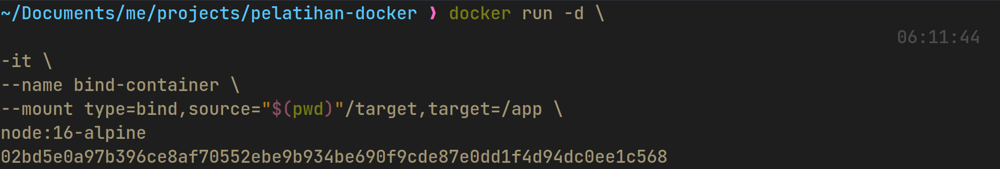
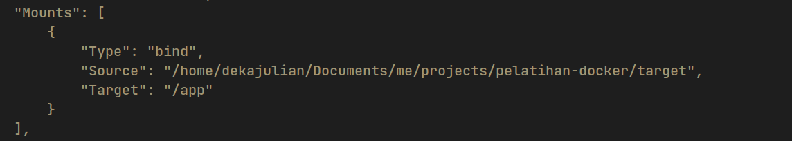

# File System dan FUSE

## Objectives

1. Peserta mengetahui _file system_

2. Peserta mengetahui dan mampu mengimplementasikan FUSE
   
3. Peserta mampu mengintegrasikan FUSE dengan Docker


## Daftar Isi

- [File System dan FUSE](#file-system-dan-fuse)
  - [Objectives](#objectives)
  - [Daftar Isi](#daftar-isi)
- [File System](#file-system)
  - [1. Tipe File System](#1-tipe-file-system)
  - [2. Virtual File System](#2-virtual-file-system)
  - [3. Dentry](#3-dentry)
  - [4. Superblock](#4-superblock)
  - [5. Inode](#5-inode)
- [File System in Userspace (FUSE)](#file-system-in-userspace-fuse)
  - [1. Instalasi FUSE](#1-instalasi-fuse)
  - [2. Cara Kerja FUSE](#2-cara-kerja-fuse)
  - [3. Membuat Program FUSE](#3-membuat-program-fuse)
    - [Tips](#tips)
  - [4. Unmount FUSE](#4-unmount-fuse)
- [Docker Dasar](#docker-dasar)
  - [Virtualization vs Containerization](#virtualization-vs-containerization)
  - [Pengenalan Docker](#pengenalan-docker)
    - [Docker Daemon](#docker-daemon)
    - [Docker Client](#docker-client)
    - [Docker Objects](#docker-objects)
    - [Docker Registry](#docker-registry)
  - [Dockerfile, Docker Image, dan Docker Container](#dockerfile-docker-image-dan-docker-container)
  - [Docker Compose](#docker-compose)
  - [Docker Data Management](#docker-data-management)
    - [Jenis-Jenis Docker Mount](#jenis-jenis-docker-mount)
  - [Integrasi FUSE dengan Docker](#integrasi-fuse-dengan-docker)
- [Soal Latihan](#soal-latihan)
- [References](#references)

# File System

_File system_ adalah struktur logika yang digunakan untuk mengendalikan akses data seperti bagaimana dia disimpan maupun diambil. _File system_ sendiri memiliki banyak jenis dengan penggunaan algoritma yang tentu berbeda. Setiap Sistem Operasi (OS) memiliki support file system yang berbeda-beda. File system digunakan untuk mengorganisir dan menyimpan file pada storage device.

_File system_ menyediakan cara untuk memisah-misahkan data pada drive menjadi bentuk tunggal yaitu file. _File system_ juga menyediakan cara untuk menyimpan data pada file, contohnya **filename**, **permission**, dan atribut lainnya. Pada File System, disediakan juga sebuah **index** yang berisi daftar file yang terletak pada suatu lokasi penyimpanan, sehingga Sistem Operasi dapat melihat ada apa saja pada lokasi penyimpanan tersebut.


## 1. Tipe File System

**1. File System Disk**

_File system disk_ adalah _file system_ yang didesain untuk menyimpan data pada sebuah media penyimpan data. Contohnya: FAT (FAT 12, FAT 16, FAT 320), NTFS, HFS, HFS+, ext2, ext3, ext4, ISO 9660, ODS-5 dan UDF.

 - FAT32 dan NTFS adalah File System di Windows.


 - Ext2, Ext3, Ext4 adalah File Sytem di Linux.


- APFS, HFS dan HFS+ adalah File System dari MacOS


**2. File System Flash**


_File system flash_ adalah _file system_ yang didesain untuk menyimpan data pada media _flash memory_. Hal ini menjadi lazim ketika jumlah perangkat mobile semakin banyak dan kapasitas _memory flash_ yang semakin besar. Contohnya pada linux flash filesystems yaitu JFFS, JFFS2, YAFFS, UBIFS, LogFS, F2FS.


**3. File System Database**

Konsep baru untuk manajemen _file_ adalah konsep _file system_ berbasis _database_. Sebagai perbaikan bagi Manajemen terstruktur hirarkis, file diidentifikasi oleh karakteristiknya, seperti tipe _file_, topik, pembuat, atau metadata yang sama.


**4. File System Transaksional**

Beberapa program terkadang membutuhkan perubahan pada beberapa file. Jika pada proses perubahan tadi mengalami kegagalan, maka file akan kembali seperti semula (tidak ada perubahan). Contohnya adalah saat menginstall sebuah software, dimana menjalankan proses writing beberapa file, jika terjadi error selama proses writing, dan software tersebut dibiarkan menjadi **setengah terinstall**, maka software tersebut akan rusak atau tidak stabil.

Pada File System Transaksional, tidak akan membiarkan hal tersebut terjadi. File System ini menjamin bahwa jika ada suatu proses yang error, maka proses tersebut akan dibatalkan, dan file-file yang telah terbentuk selama proses tadi akan di roll back seperti semula. Contoh dari File System ini pada UNIX adalah Valor File System, Amino, LFS dan TFFS,


**5. File System Jaringan**


_File system_ jaringan adalah _file system_ yang bertindak sebagai klien untuk protokol akses file jarak jauh, memberikan akses ke _file_ pada sebuah _server_. Contoh dari _file system_ jaringan ini adalah klien protokol NFS, AFS, SMB, dan klien FTP dan WebDAV.


**6. File System Journaling**

_File system_ yang mencatat setiap perubahan yang terjadi pada storage device ke dalam jurnal (biasanya berupa log sirkular dalam area tertentu) sebelum melakukan perubahan ke _file system_. File sistem seperti ini memiliki kemungkinan yang lebih kecil mengalami kerusakan saat terjadi _power failure_ atau _system crash_.


## 2. Virtual File System

Virtual file system (VFS) adalah suatu lapisan perangkat lunak dalam kernel yang menyediakan _interface file system_ untuk program _user space_. _Virtual file system_ berfungsi agar berbagai jenis _file system_ dapat diakses oleh aplikasi komputer dengan cara yang seragam. VFS menyediakan antarmuka antara _system call_ dengan sistem yang sesungguhnya.


## 3. Dentry

Dentry atau **Directory Entry** merupakan sebuah struktur data yang memiliki tugas sebagai penerjemah nama berkas ke inode-nya. Contoh informasi yang disimpan dalam dentry adalah _name_, _pointer to inode_, _pointer to parent dentry_, _use count_, dan lainnya. Adapula command dalam VFS dentry adalah D_compare, D_delete, D_release.


## 4. Superblock

Setiap _file system_ yang di-_mount_ akan direpresentasikan oleh sebuah VFS Superblock. _Superblock_ digunakan untuk menyimpan informasi mengenai partisi tersebut. _Superblock_ menyimpan informasi sebagai berikut:

-  _Device_: Merupakan _device identifier_, contohnya **/dev/hda1** adalah _harddisk_ pertama yang terdapat pada sistem memiliki device identifier **0×300**.

-  _Inode Pointer_: Merupakan suatu _pointer_ yang menunjuk ke inode pertama pada sistem berkas.

-  _Blocksize_: Menunjukkan ukuran suatu _block_ dari sistem berkas, contohnya **1024** _**bytes**_.

-  _Superblock Operation_: Merupakan suatu pointer ke sekumpulan _superblock routine_ (fungsi) dari _file system_, contohnya _**read**_, _**write**_, dan sebagainya.

-  _File System Type_: Menunjukkan tipe dari _file system_, contoh: EXT2, FAT, NTFS.

-  _File System Specific_: Merupakan suatu pointer ke informasi yang dibutuhkan oleh _file system.

  


## 5. Inode

Inode adalah abstraksi VFS untuk berkas. Setiap berkas, directory, dan data lainnya pada VFS direpresentasikan oleh satu dan hanya satu VFS inode. VFS inode hanya terdapat di memori kernel dan disimpan di inode chace selama masih dibutuhkan oleh sistem. Informasi yang disimpan oleh VFS Inode diantaranya:

-  _Device_: Menunjukan device identifier dari suatu device yang menyimpan berkas ataupun _directory_.

-  _Inode Number_: Merupakan nomor inode yang unik dalam _file system_.

- Mode: Menggambarkan apa yang direpresentasikan oleh VFS inode.

-  _User_ ID: Merupakan identifier bagi pemilik berkas.

-  _Time_: Menunjukkan kapan pembuatan, modifikasi, dan penulisan suatu berkas.

-  _Blocksize_: Menunjukkan ukuran dari _block_ yang digunakan oleh berkas.

-  _Inode Operations_: Merupakan _pointer_ ke suatu _routine_ yang melakukan berbagai operasi pada inode.

-  _Count_: Menunjukkan berapa kali suatu sistem telah menggunakan suatu inode.

-  _Lock_: Digunakan untuk mengunci VFS inode.

-  _File System Specific Information_: Menunjukkan informasi khusus yang dibutuhkan oleh suatu inode.


Berikut adalah hubungan antara dentry, superblock, dan inode pada Virtual File System.


# File System in Userspace (FUSE)

FUSE (Filesystem in Userspace) adalah sebuah _interface_ dimana kita dapat membuat _file system_ sendiri pada _userspace_ pada linux.


Keuntungan menggunakan FUSE ialah kita dapat menggunakan _library_ apapun yang tersedia untuk membuat _file system_ sendiri tanpa perlu mengenali secara mendalam apa yang _file system_ sebenarnya lakukan di _kernel space_. Hal ini dilakukan karena modul FUSE yang dapat menjembatani antara kode _file system_ yang berada pada _userspace_ dengan _file system_ yang berada pada _kernel space_. Beberapa manfaat yang lain dari FUSE adalah sebagai berikut:

- Dapat dimuat dan dipasang oleh pengguna biasa. Untuk akses jaringan, untuk mendapatkan file arsip, untuk removable media, dll.
- Jika driver sistem FUSE mengalami crash, tidak akan mempengaruhi kernel.
- FUSE dapat dideploy dengan cepat, baik karena tidak perlu intervensi administrator untuk menginstalnya dan karena dapat dengan mudah diakses oleh OS yang didukung.
- Tidak ada masalah lisensi terkait dengan hubungan statis dengan kernel.


Salah satu contoh yang menarik dari FUSE adalah [GDFS][7bb7b7cc] (Google Drive File System), dimana GDFS ini memungkinkan kita untuk me-_mount Google Drive_ kita ke sistem linux dan menggunakannya seperti file linux biasa.


[7bb7b7cc]: https://github.com/robin-thomas/GDFS  "GDFS"


Untuk mengimplementasikan FUSE ini, kita harus membuat sebuah program yang terhubung dengan *library*  ```libfuse```. Tujuan dari program yang dibuat ini adalah menspesifikkan bagaimana *file system* merespon *read/write/stat* dari sebuah *request* dan untuk me-*(mount)*  *file system* asli *(kernel space)* ke *file system* yang baru *(userspace)*. Jadi di saat *user* berurusan dengan *read/write/stat request* di *file system (userspace)*, kernel akan meneruskan *input output request* tersebut ke program FUSE dan program tersebut akan merespon kembali ke *user*.


Untuk lebih jelasnya mari kita coba membuat program FUSE.


## 1. Instalasi FUSE

Pertama-tama kita harus memstikan bahwa FUSE sudah ter-install di perangkat anda

```

$ sudo apt update

$ sudo apt install libfuse*

```


## 2. Cara Kerja FUSE


-  ```fuse_main()``` (lib/helper.c) = sebagai fungsi main (userspace), program user memanggil fungsi fuse_main() kemudian fungsi fuse_mount() dipanggil.

-  ```fuse_mount()``` (lib/mount.c) = menciptakan UNIX domain socket, kemudian di fork dan menciptakan child process yang menjalankan fusermount

-  ```fusermount()``` (util/fusermount.c) = untuk mengecek apakah modul FUSE sudah di load. Kemudian membuka /dev/fuse dan mengirim file handle melalu UNIX domain socket kembali ke fungsi fuse_mount()

-  ```fuse_new()``` (lib/fuse.c) = menciptakan struktur data yang berisi ruang yang digukanan untuk menyimpan data file system

-  ```fuse_loop()``` (lib/fuse.c) = membaca file system calls dari /dev/fuse


Ini adalah beberapa fungsi yang disediakan oleh **FUSE**:

```c

int (*getattr) (const char *, struct stat *);

//Get file attributes.


int (*readlink) (const char *, char *, size_t);

//Read the target of a symbolic link

int (*mknod) (const char *, mode_t, dev_t);

//Create a file node.


int (*mkdir) (const char *, mode_t);

//Create a directory.


int (*unlink) (const char *);

//Remove a file


int (*rmdir) (const char *);

//Remove a directory


int (*rename) (const char *, const char *);

//Rename a file


int (*chmod) (const char *, mode_t);

//Change the permission bits of a file


int (*chown) (const char *, uid_t, gid_t);

//Change the owner and group of a file


int (*truncate) (const char *, off_t);

//Change the size of a file


int (*open) (const char *, struct fuse_file_info *);

//File open operation.


int (*readdir) (const char *, void *, fuse_fill_dir_t, off_t, struct fuse_file_info *);

//Read directory


int (*read) (const char *, char *, size_t, off_t, struct fuse_file_info *);

//Read data from an open file


int (*write) (const char *, const char *, size_t, off_t, struct fuse_file_info *);

//Write data to an open file

```


## 3. Membuat Program FUSE

Fuse memiliki ```struct``` yang dinamakan ```fuse_operations``` yang didefinisikan seperti dibawah ini:

```c

static  struct fuse_operations xmp_oper = {
    .getattr = xmp_getattr,
    .access = xmp_access,
    .readlink = xmp_readlink,
    .readdir = xmp_readdir,
    .mknod = xmp_mknod,
    .mkdir = xmp_mkdir,
    .symlink = xmp_symlink,
    .unlink = xmp_unlink,
    .rmdir = xmp_rmdir,
    .rename = xmp_rename,
    .link = xmp_link,
    .chmod = xmp_chmod,
    .chown = xmp_chown,
    .truncate = xmp_truncate,
    .utimens = xmp_utimens,
    .open = xmp_open,
    .read = xmp_read,
    .write = xmp_write,
    .statfs = xmp_statfs,
    .create = xmp_create,
    .release = xmp_release,
    .fsync = xmp_fsync,
    .setxattr = xmp_setxattr,
    .getxattr = xmp_getxattr,
    .listxattr = xmp_listxattr,
    .removexattr = xmp_removexattr,
};

```

Semua atribut pada ```struct``` tersebut adalah _pointer_ yang menuju ke fungsi. Setiap fungsi tersebut disebut FUSE saat suatu kejadian yang spesifik terjadi di *file system*. Sebagai contoh saat _user_ menulis di sebuah file, sebuah fungsi yang ditunjuk oleh atribut "write" di ```struct``` akan terpanggil.


Selain itu, atribut pada ```struct``` tersebut tertulis seperti fungsi yang biasa digunakan di linux. Contohnya ialah saat kita membuat _directory_ di FUSE maka fungsi mkdir akan dipanggil.


**Untuk mengimplementasikan FUSE**, kita harus menggunakan ```struct``` ini dan harus mendefinisikan fungsi yang ada di dalam ```struct``` tersebut. Setelahnya, kita mengisi ```struct``` tersebut dengan pointer dari fungsi yang ingin diimplementasikan.


Kebanyakan fungsi-fungsi yang tersedia adalah **opsional**, kita tidak perlu mengimplementasikan semuanya. Beberapa fungsi memang harus diimplementasikan dalam _file system_. Fungsi-fungsi tersebut antara lain:

- Fungsi ```getattr``` yang dipanggil saat sistem mencoba untuk mendapatkan atribut dari sebuah file.

- Fungsi ```readdir``` yang dipanggil saat user mencoba untuk menampilkan file dan direktori yang berada pada suatu direktori yang spesifik.

- Fungsi ```read``` yang dipanggil saat sistem mencoba untuk membaca potongan demi potongan data dari suatu file.

Untuk melihat fungsi-fungsi yang tersedia pada **FUSE** yang lain, buka link berikut: [https://libfuse.github.io/doxygen/structfuse__operations.html](https://libfuse.github.io/doxygen/structfuse__operations.html)

Contoh program FUSE sederhana yang hanya menggunakan 3 fungsi tersebut.

```c
#define FUSE_USE_VERSION 28
#include <fuse.h>
#include <stdio.h>
#include <string.h>
#include <unistd.h>
#include <fcntl.h>
#include <dirent.h>
#include <errno.h>
#include <sys/time.h>

static  int  xmp_getattr(const char *path, struct stat *stbuf)
{
    int res;
    res = lstat(path, stbuf);

    if (res == -1) return -errno;
    return 0;
}


static int xmp_readdir(const char *path, void *buf, fuse_fill_dir_t filler, off_t offset, struct fuse_file_info *fi)
{
    DIR *dp;
    struct dirent *de;
    (void) offset;
    (void) fi;

    dp = opendir(path);

    if (dp == NULL) return -errno;

    while ((de = readdir(dp)) != NULL) {
        struct stat st;

        memset(&st, 0, sizeof(st));

        st.st_ino = de->d_ino;
        st.st_mode = de->d_type << 12;

        if(filler(buf, de->d_name, &st, 0)) break;
    }
    closedir(dp);
    return 0;
}


static int xmp_read(const char *path, char *buf, size_t size, off_t offset, struct fuse_file_info *fi)
{
    int fd;
    int res;
    (void) fi;

    fd = open(path, O_RDONLY);

    if (fd == -1) return -errno;

    res = pread(fd, buf, size, offset);

    if (res == -1) res = -errno;

    close(fd);

    return res;
}


static struct fuse_operations xmp_oper = {
    .getattr = xmp_getattr,
    .readdir = xmp_readdir,
    .read = xmp_read,
};


int  main(int  argc, char *argv[])
{
    umask(0);
    return fuse_main(argc, argv, &xmp_oper, NULL);
}
```


Setelah itu kode dapat di-_compile_ dengan cara


```

gcc -Wall `pkg-config fuse --cflags` [file.c] -o [output] `pkg-config fuse --libs`

```


Lalu buat sebuah direktori sebagai tujuan pembuatan FUSE dan menjalankan FUSE pada direktori tersebut.

```

$ mkdir [direktori tujuan]

$ ./[output] [direktori tujuan]

```

Setelah program dijalankan, masuklah kedalam direktori tujuan tersebut. Isi dari direktori tersebut adalah list folder yang sama seperti yang ada di dalam ```root``` atau ```/```.


### Tips
Salah satu cara debugging yang bisa dilakukan saat memprogram fuse adalah dengan menggunakan `printf` dan menjalankan program dengan cara `./[output] -f [direktori tujuan]`. Dimana `-f` disini berarti menjaga program agar tetap berjalan di foreground sehingga bisa menggunakan `printf`.


Sesuai dengan penjelasan di awal di mana FUSE dapat memodifikasi _file system_ di _userspace_ tanpa perlu mengubah kode yang ada pada kernel, di sini kita coba memodifikasi kode FUSE tadi agar FUSE tersebut menampilkan apa yang ada di dalam folder ```/home/[user]/Documents```.

Ubah kode FUSE tadi seperti yang ada dibawah ini:


```c
#define FUSE_USE_VERSION 28
#include <fuse.h>
#include <stdio.h>
#include <string.h>
#include <unistd.h>
#include <fcntl.h>
#include <dirent.h>
#include <errno.h>
#include <sys/time.h>

static  const  char *dirpath = "/home/[user]/Documents";

static  int  xmp_getattr(const char *path, struct stat *stbuf)
{
    int res;
    char fpath[1000];

    sprintf(fpath,"%s%s",dirpath,path);

    res = lstat(fpath, stbuf);

    if (res == -1) return -errno;

    return 0;
}


static int xmp_readdir(const char *path, void *buf, fuse_fill_dir_t filler, off_t offset, struct fuse_file_info *fi)
{
    char fpath[1000];

    if(strcmp(path,"/") == 0)
    {
        path=dirpath;
        sprintf(fpath,"%s",path);
    } else sprintf(fpath, "%s%s",dirpath,path);

    int res = 0;

    DIR *dp;
    struct dirent *de;
    (void) offset;
    (void) fi;

    dp = opendir(fpath);

    if (dp == NULL) return -errno;

    while ((de = readdir(dp)) != NULL) {
        struct stat st;

        memset(&st, 0, sizeof(st));

        st.st_ino = de->d_ino;
        st.st_mode = de->d_type << 12;
        res = (filler(buf, de->d_name, &st, 0));

        if(res!=0) break;
    }

    closedir(dp);

    return 0;
}


static int xmp_read(const char *path, char *buf, size_t size, off_t offset, struct fuse_file_info *fi)
{
    char fpath[1000];
    if(strcmp(path,"/") == 0)
    {
        path=dirpath;

        sprintf(fpath,"%s",path);
    }
    else sprintf(fpath, "%s%s",dirpath,path);

    int res = 0;
    int fd = 0 ;

    (void) fi;

    fd = open(fpath, O_RDONLY);

    if (fd == -1) return -errno;

    res = pread(fd, buf, size, offset);

    if (res == -1) res = -errno;

    close(fd);

    return res;
}


static struct fuse_operations xmp_oper = {
    .getattr = xmp_getattr,
    .readdir = xmp_readdir,
    .read = xmp_read,
};


int  main(int  argc, char *argv[])
{
    umask(0);

    return fuse_main(argc, argv, &xmp_oper, NULL);
}
```

## 4. Unmount FUSE
Unmount command digunakan untuk "unmount" sebuah filesystem yang telah ter-mount, lalu juga menginformasikan ke sistem untuk menyelesaikan semua operasi read dan write yang masih tertunda agar bisa di-detach (dilepaskan) dengan aman.

Untuk melakukan **unmount** FUSE, jalankan command di bawah ini:
```
sudo umount [direktori tujuan]
atau
fusermount -u [direktori tujuan]
```

# Docker Dasar

Sebelum memasuki materi ketiga, peserta wajib membaca dan melakukan intruksi sesuai yang ada pada [Modul Prasyarat Pelatihan Docker](https://github.com/arsitektur-jaringan-komputer/Pelatihan-Docker/tree/master/0.%20Prasyarat).

## Virtualization vs Containerization

Virtualization adalah teknologi yang memungkinkan pembuatan mesin virtual di dalam satu fisik server. Dengan menggunakan hypervisor, virtualisasi memungkinkan pengelolaan beberapa sistem operasi atau aplikasi yang berjalan secara mandiri. Konsep dasar virtualisasi melibatkan isolasi sumber daya antara mesin virtual, sehingga setiap mesin virtual dapat beroperasi seolah-olah menjadi mesin fisik yang terpisah.

Sedangkan Containerization adalah teknologi yang memungkinkan pengemasan aplikasi dan dependensinya ke dalam sebuah wadah (container) yang dapat dijalankan secara konsisten di berbagai lingkungan komputasi, tanpa perlu mengubah kode atau konfigurasi aplikasi itu sendiri. Container merupakan unit yang portabel, ringan, dan dapat diisolasi, yang mengemas aplikasi, library, dan konfigurasi menjadi satu entitas yang dapat dijalankan di lingkungan yang berbeda, seperti lokal, cloud, atau pusat data.


- Virtualisasi menggunakan hypervisor untuk membuat mesin virtual yang memerlukan sistem operasi penuh dan isolasi sumber daya seperti CPU, RAM, dan storage untuk setiap mesin virtual. Sementara itu, containerization menggunakan teknologi seperti Docker untuk membuat wadah (container) yang berbagi sistem operasi host.

- Virtualisasi memungkinkan menjalankan sistem operasi dan aplikasi yang berbeda secara simultan dalam mesin virtual yang terisolasi. Sementara itu, containerization memungkinkan menjalankan aplikasi yang dikemas dalam container di dalam host yang sama, berbagi kernel OS yang sama.

- Virtualisasi cenderung lebih cocok untuk aplikasi yang membutuhkan isolasi penuh, konfigurasi yang kompleks, dan dukungan untuk berbagai sistem operasi. Di sisi lain, containerization lebih cocok untuk aplikasi yang bersifat ringan, portabel, dan bisa dijalankan di berbagai lingkungan komputasi.

- Proses start-up pada virtualisasi memerlukan waktu yang lebih lama, karena melibatkan booting sistem operasi dan konfigurasi tambahan pada setiap mesin virtual. Containerization, di sisi lain, memungkinkan proses deploy dan start-up yang lebih cepat, karena hanya perlu menjalankan container yang sudah dikemas dan siap dijalankan.

## Pengenalan Docker


Docker adalah sebuah platform yang memungkinkan pengembang perangkat lunak untuk membuat, mengemas, dan menjalankan aplikasi dalam wadah yang dapat diisolasi secara mandiri, disebut container. Container dalam Docker berfungsi seperti lingkungan eksekusi yang terisolasi untuk menjalankan aplikasi, termasuk kode sumber, runtime, dan dependensi yang diperlukan.

Dengan Docker, pengembang dapat membuat wadah yang konsisten dan portabel, yang dapat dijalankan di berbagai lingkungan komputasi, termasuk mesin lokal, server cloud, atau lingkungan pengembangan dan produksi yang berbeda. Docker memungkinkan aplikasi dan dependensinya diisolasi, sehingga aplikasi dapat dijalankan secara konsisten di berbagai lingkungan tanpa mengganggu host operating system atau aplikasi lainnya.

Docker sendiri memiliki arsitektur dengan bagian-bagian sebagai berikut.


### Docker Daemon
Docker Daemon adalah komponen yang berjalan di latar belakang (background) pada host dan bertanggung jawab untuk menjalankan dan mengelola Docker Object seperti images, container, network, dan lain-lain. Docker Daemon adalah proses yang berjalan di dalam sistem operasi host dan menerima perintah dari Docker Client untuk membuat, menjalankan, menghentikan, dan mengelola Docker Object. Docker Daemon juga bertanggung jawab untuk mengelola sumber daya host seperti CPU, memori, dan jaringan yang digunakan oleh Docker Object.

### Docker Client
Docker Client adalah antarmuka pengguna berbasis command-line atau GUI yang digunakan untuk berinteraksi dengan Docker. Docker Client memungkinkan pengguna untuk menjalankan perintah-perintah Docker untuk membuat, mengelola, dan mengontrol layanan pada Docker. Docker Client berkomunikasi dengan Docker Daemon untuk mengirimkan perintah-perintah Docker dan menerima output layanan Docker yang sedang berjalan.

### Docker Objects
Docker Objects adalah komponen dasar yang terdapat di Docker. Beberapa contoh Docker Objects meliputi image, container, volume, dan network yang akan dijelaskan pada modul selanjutnya. 

### Docker Registry 
Docker Registry adalah repositori yang digunakan untuk menyimpan dan berbagi Docker Image. Docker Registry berfungsi sebagai tempat penyimpanan untuk Docker Image yang dapat diakses oleh pengguna Docker dari berbagai lokasi. Docker Hub, yang merupakan Docker's public registry, adalah salah satu contoh Docker Registry yang sering digunakan untuk menyimpan dan berbagi Docker Image secara publik. Selain Docker Hub, pengguna juga dapat membuat Docker Registry pribadi untuk menyimpan Docker Image.

## Dockerfile, Docker Image, dan Docker Container


Dockerfile adalah file teks yang berisi instruksi untuk membangun sebuah Docker Image. Dalam Dockerfile, dapat menentukan berbagai komponen dan konfigurasi yang diperlukan untuk membuat sebuah image, seperti base image yang digunakan, perintah-perintah yang harus dijalankan, file yang harus di-copy, serta variabel lingkungan yang perlu di-set. Dockerfile sangat penting dalam membangun sebuah image karena memungkinkan pengguna untuk membuat image dengan cara yang konsisten dan terdokumentasi dengan baik. Dengan Dockerfile, seorang developer dapat mereplikasi pengaturan dan konfigurasi yang sama setiap kali membangun sebuah image, bahkan pada lingkungan yang berbeda-beda. Selain itu, Dockerfile juga memungkinkan seorang developer untuk menggunakan konsep modularitas dalam membangun image dengan memisahkan komponen-komponen image menjadi layer-layer yang berbeda dalam Dockerfile. Sehingga memungkinkan untuk memperbarui atau mengganti komponen tertentu tanpa harus membangun ulang seluruh image.

Docker Image adalah template atau blueprints yang digunakan untuk membuat Docker Container. Image ini berisi sistem operasi dan aplikasi yang sudah dikonfigurasi dengan baik serta siap digunakan. Image dapat dibangun secara manual dengan membuat Dockerfile atau dapat diunduh dari Docker Hub, yaitu repositori publik yang menyediakan banyak image yang sudah siap digunakan. Docker Image bersifat immutables, artinya setelah dibuat, image tidak bisa diubah secara langsung. Namun, image dapat dibuat baru dengan melakukan modifikasi pada image sebelumnya dan memberikan nama yang berbeda. Setiap image memiliki nama dan tag untuk mengidentifikasinya secara unik. Dalam Docker Hub, nama image biasanya terdiri dari beberapa bagian, seperti nama pengguna (username), nama image, dan tag, seperti contoh **`username/nama_image:tag`**. Setelah image dibuat, bisa menggunakan perintah **`docker run`** untuk membuat instance dari image tersebut dalam bentuk container.

Docker Container adalah sebuah unit terisolasi yang berisi perangkat lunak dan semua dependensinya, yang dijalankan pada lingkungan yang terpisah dari host dan container lainnya. Dalam container, aplikasi dapat berjalan dengan konsisten di berbagai lingkungan meskipun terdapat perbedaan dalam konfigurasi dan infrastruktur. Docker Container bisa diibaratkan seperti kotak berisi program dan semua bahan yang dibutuhkan agar program tersebut bisa berjalan dengan baik. Kotak ini dijalankan secara terpisah dari komputer aslinya, sehingga program dalam kotak ini dapat berjalan dengan konsisten pada berbagai lingkungan tanpa terpengaruh oleh konfigurasi dan infrastruktur yang ada pada komputer aslinya. Dengan Docker Container, developer bisa dengan mudah mengelola dan menjalankan aplikasi di berbagai lingkungan tanpa harus khawatir dengan masalah konfigurasi dan dependensi.

Bahasan ini dapat dipelajari secara lebih detail pada [Pelatihan Docker - Modul 2 (Docker Service Dasar)](https://github.com/arsitektur-jaringan-komputer/Pelatihan-Docker/tree/master/2.%20Docker%20Service%20Dasar).

## Docker Compose

Docker Compose adalah sebuah alat atau tool untuk mengelola dan menjalankan aplikasi yang terdiri dari satu atau beberapa container. Docker Compose memungkinkan untuk mendefinisikan, mengonfigurasi, dan menjalankan beberapa Docker Container sekaligus dengan menggunakan file konfigurasi YAML yang sederhana. Docker Compose juga dapat menentukan Docker Image untuk setiap Docker Container, mengatur pengaturan jaringan, menentukan volume yang dibutuhkan, dan melakukan konfigurasi lainnya dalam satu file konfigurasi. Selain itu, Docker Compose juga memudahkan proses pengaturan dan penyebaran aplikasi pada lingkungan produksi atau development yang berbeda dengan cara yang konsisten.

> Baca juga: [**A Docker Analogy**](https://davidtruxall.com/a-docker-analogy/)

Dalam pengembangan perangkat lunak modern, aplikasi terdiri dari banyak komponen yang dapat dijalankan secara terpisah dan berinteraksi satu sama lain melalui jaringan. Dalam hal ini, Docker Compose menjadi alat yang sangat berguna untuk mengatur aplikasi tersebut dengan menggunakan Docker Container, sehingga memudahkan proses pengembangan, pengujian, dan penyebaran aplikasi yang kompleks.

Berikut adalah contoh penerapan Docker Compose untuk membuat sebuah aplikasi web yang terdiri dari tiga service, yaitu frontend, backend, dan database.

```YAML
version: '3'
services:
  backend:
    build: ./backend
    ports:
      - "8080:8080"
    environment:
      DB_HOST: database
  frontend:
    build: ./frontend
    ports:
      - "3000:3000"
    environment:
      REACT_APP_BACKEND_URL: http://backend:8080
  database:
    image: postgres
    environment:
      POSTGRES_USER: myuser
      POSTGRES_PASSWORD: mypassword
      POSTGRES_DB: mydb
```

Berikut adalah penjelasan dari konfigurasi diatas:

| Properti | Deskripsi |
| --- | --- |
| `version: '3'` | Versi dari Docker Compose yang digunakan dalam konfigurasi tersebut. |
| `services` | Komponen utama yang mendefinisikan service yang akan dijalankan. Dalam konfigurasi diatas, terdapat 3 service, yaitu frontend, backend, dan database. |
| `backend` | Nama service yang akan dijalankan. |
| `build: ./backend` | Menentukan direktori dimana Docker akan melakukan build image untuk service backend. |
| `ports: - "8080:8080"` | Mendefinisikan port mapping, dimana `port 8080` pada container akan di-forward ke `port 8080` pada host. |
| `environment: DB_HOST: database` | Mendefinisikan environment variable pada service backend, dimana `DB_HOST` akan di-set sebagai database. |
| `frontend` | Nama service yang akan dijalankan. |
| `build: ./frontend` | Menentukan direktori dimana Docker akan melakukan build image untuk service frontend. |
| `ports: - "3000:3000"` | Mendefinisikan port mapping, dimana `port 3000` pada container akan di-forward ke `port 3000` pada host. |
| `environment: REACT_APP_BACKEND_URL: http://backend:8080` | Mendefinisikan environment variable pada service frontend, dimana `REACT_APP_BACKEND_URL` akan di-set sebagai `http://backend:8080`. |
| `database` | Nama service yang akan dijalankan. |
| image: postgres | Mendefinisikan image yang akan digunakan untuk service database. |
| `environment: POSTGRES_USER: myuser POSTGRES_PASSWORD: mypassword POSTGRES_DB: mydb` | Mendefinisikan environment variable pada service database, dimana `POSTGRES_USER` akan di-set sebagai `myuser`, `POSTGRES_PASSWORD` akan di-set sebagai `mypassword`, dan `POSTGRES_DB` akan di-set sebagai `mydb`. |

## Docker Data Management 

Docker Data Management adalah sebuah konsep untuk mengelola data atau file yang ada di Docker. Ketika menjalankan sebuah aplikasi atau layanan di dalam Docker Container, data yang dihasilkan oleh aplikasi tersebut dapat disimpan dalam container itu sendiri atau dalam sebuah volume yang terpisah dari container.

Dalam Docker, terdapat beberapa jenis mount atau penghubung yang digunakan untuk mengelola data, seperti volume, bind mount, dan tmpfs mount. Seorang developer dapat memilih jenis mount yang tepat sesuai dengan kebutuhan aplikasi yang dijalankan di dalam container. Selain itu, Docker juga menyediakan beberapa perintah untuk mengelola data pada Docker Volume, seperti menampilkan informasi volume, menghapus volume, dan mengatur volume driver options. Dengan menggunakan perintah-perintah ini, developer dapat mengelola data di Docker dengan mudah dan efisien.

Pemahaman tentang Docker Data Management sangat penting untuk memastikan data yang dihasilkan oleh aplikasi yang dijalankan di dalam container tetap terjaga dan tidak hilang saat container dihapus atau dimatikan.

### Jenis-Jenis Docker Mount


Terdapat beberapa jenis Docker Mount sebagai berikut.

- ##### Volume
    Docker Volume adalah fitur pada Docker yang memungkinkan developer untuk mengelola data yang dibutuhkan oleh container secara terpisah dari container itu sendiri. Docker Volume memungkinkan container untuk berbagi data dengan host, container lain, atau dengan layanan penyimpanan data yang disediakan oleh penyedia layanan cloud.

    Dalam Docker, setiap container memiliki file system sendiri yang terisolasi dari host dan container lainnya. Dalam beberapa kasus, data yang diperlukan oleh container perlu disimpan secara persisten, sehingga tidak hilang saat container dihapus atau dihentikan. Docker Volume memungkinkan untuk membuat penyimpanan data persisten untuk container tersebut, dan memungkinkan container lain atau host untuk mengakses data tersebut.

    Berikut adalah contoh menerapkan Docker Volume pada konfigurasi Docker Compose **`docker-compose.yml`** sebelumnya.

    ```YAML
    version: '3'
    services:
    backend:
        build: ./backend
        ports:
        - "8080:8080"
        environment:
        DB_HOST: database
    frontend:
        build: ./frontend
        ports:
        - "3000:3000"
        environment:
        REACT_APP_BACKEND_URL: http://backend:8080
    database:
        image: postgres
        volumes:
        - ./data:/var/lib/postgresql/data
        environment:
        POSTGRES_USER: myuser
        POSTGRES_PASSWORD: mypassword
        POSTGRES_DB: mydb
    ```
    Pada konfigurasi di atas, ditambahakan sebuah volume dengan nama **`./data`** yang akan diikatkan (bind) ke direktori **`/var/lib/postgresql/data`** di dalam container. Artinya, data yang dibuat atau dimodifikasi oleh service database akan disimpan dalam direktori **`./data`** di host. Dengan menambahkan konfigurasi volumes pada Docker Compose, maka data dari database akan tersimpan dan tidak hilang meskipun container dimatikan.

- ##### Bind Mount
    Bind mount adalah tipe mount di Docker yang memungkinkan suatu file atau direktori di mesin host digunakan oleh Docker Container. Dalam bind mount, container dan mesin host menggunakan file system yang sama, sehingga jika suatu file diubah dalam container, perubahannya juga akan terlihat di mesin host, dan sebaliknya.

    Dalam penggunaannya, bind mount dapat digunakan untuk mengakses file-file atau direktori dari mesin host dan menggunakan data tersebut dalam container. Misalnya, jika ingin menjalankan sebuah aplikasi web di dalam container, tetapi ingin menggunakan file konfigurasi yang ada di mesin host, maka dapat dilakukan bind mount dari direktori yang berisi file konfigurasi tersebut ke dalam direktori di dalam container.

    Berikut adalah contoh implementasi dari bind mount.

    ```bash
    docker run -d \
    -it \
    --name bind-container \
    --mount type=bind,source="$(pwd)"/target,target=/app \
    node:16-alpine
    ``` 
    

    Kode di atas merupakan perintah untuk menjalankan sebuah container dari image **`node:16-alpine`**, dengan beberapa opsi seperti berikut.

    | Opsi          | Keterangan                                                  |
    | ------------- | ------------------------------------------------------------ |
    | `-d`          | menjalankan container di background (detach mode).          |
    | `-it`         | mengalihkan interaksi ke terminal container (interactive mode dan attach to container). |
    | `--name`      | memberikan nama `bind-container` container.                  |
    | `--mount`     | menentukan opsi mount pada container. Pada kasus ini, menggunakan `opsi type=bind` untuk membuat bind mount, di mana direktori lokal pada host `$(pwd)/target` di-mount pada direktori `/app` pada container. |
    | `node:16-alpine` | image yang akan digunakan untuk menjalankan container.        |

    Untuk memastikan proses bind mount berjalan dengan baik dapat menggunakan perintah **`docker inspect nama_container`** dan lihat outputnya pada bagian **`Mounts`**.
    ```bash
    docker inspect bind-container
    ```
    

    Untuk memverifikasi kesesuaian antara isi file di directory host dengan directory target dapat dilakukan dengan masuk ke mode shell dari container itu sendiri.
    

    Keuntungan dari bind mount adalah fleksibilitasnya yang tinggi, karena memungkinkan akses langsung ke file di mesin host. Namun, Bind Mount tidak memberikan isolasi penuh antara mesin host dan container. Jika suatu file atau direktori pada host dihapus atau dimodifikasi, maka akan mempengaruhi container yang menggunakan bind mount tersebut.

- ##### tmpfs Mount
    tmpfs mount adalah salah satu jenis mount pada Docker yang memungkinkan untuk menyimpan data secara sementara di dalam memory RAM pada host. Dengan menggunakan tmpfs mount, data akan cepat diakses karena langsung disimpan di dalam memory RAM, namun data tersebut tidak akan persisten karena hanya disimpan di dalam memory dan tidak disimpan ke dalam disk fisik.

    Cara penggunaannya yaitu dengan menambahkan opsi **`--mount`** pada saat menjalankan container, lalu menentukan tipe mount tmpfs dan ukuran memory yang akan digunakan untuk menyimpan data. Berikut contoh perintah untuk menggunakan tmpfs mount dengan ukuran memory 100 MB pada container:

    ```bash
    docker run -d \
    -it \
    --name tmpfs-container \
    --mount type=tmpfs,destination=/app,tmpfs-size=100M \
    node:16-alpine
    ```

## Integrasi FUSE dengan Docker

Integrasi FUSE dengan Docker memungkinkan pengguna untuk menghubungkan file system kustom yang dibuat dengan FUSE ke dalam container Docker. Dengan menggunakan FUSE dalam Docker, pengguna dapat memperluas kemampuan file system di dalam container dengan mengimplementasikan file system yang lebih kompleks dan kustom. Melalui mekanisme bind mount atau volume Docker, file system FUSE dapat diintegrasikan ke dalam container dengan mudah.

Misalnya, dengan menggunakan FUSE dalam Docker, pengguna dapat membuat file system yang terhubung ke penyimpanan cloud seperti Amazon S3 atau Google Cloud Storage. Dengan begitu, container Docker dapat mengakses dan mengelola file-file di penyimpanan cloud tersebut seolah-olah mereka berada di sistem file lokal. Hal ini memungkinkan pengguna untuk menggunakan layanan penyimpanan cloud tanpa perlu memodifikasi secara signifikan aplikasi yang ada.

Selain itu, integrasi FUSE dengan Docker juga memungkinkan pengguna untuk menerapkan fitur-fitur tambahan seperti enkripsi file secara transparan di dalam container. Dengan mengimplementasikan file system FUSE yang mendukung enkripsi, pengguna dapat menjaga kerahasiaan dan keamanan file dalam lingkungan Docker. Ini memungkinkan pengguna untuk melindungi data sensitif atau rahasia yang disimpan dalam container dengan cara yang lebih fleksibel dan terintegrasi.

Dalam keseluruhan, integrasi FUSE dengan Docker membuka pintu bagi pengguna untuk menggabungkan kekuatan file system kustom yang diimplementasikan dengan FUSE dengan fleksibilitas dan portabilitas yang ditawarkan oleh container Docker. Dengan memanfaatkan integrasi ini, pengguna dapat mengoptimalkan pengelolaan file system dalam container, mengakses sumber daya eksternal, dan menerapkan fitur-fitur kustom sesuai kebutuhan aplikasi yang dikembangkan dalam lingkungan Docker.

Langkah-langkah berikut ini akan membantu dalam mengimplementasikan integrasi FUSE dengan Docker untuk menggunakan file system kustom di dalam container Docker.

- ### Membuat Docker Container dengan File System FUSE

  - Buat file docker-compose.yml dengan konfigurasi berikut:
    ```YAML
      version: "3"
      services:
      myapp:
          image: [nama_image_docker]
          volumes:
          - [path_ke_file_system_fuse]:[path_tujuan_di_dalam_kontainer]
    ```
  - Gantilah [nama_image_docker] dengan nama image Docker yang akan kamu gunakan.
  - Gantilah [path_ke_file_system_fuse] dengan path absolut ke file system FUSE yang ingin dihubungkan ke dalam kontainer.
  - Gantilah [path_tujuan_di_dalam_kontainer] dengan path di dalam kontainer di mana file system FUSE akan tersedia.

- ### Menjalankan Docker Container dengan File System FUSE

  - Buka terminal, lalu arahkan ke direktori yang berisi file docker-compose.yml.
  - Jalankan perintah berikut untuk menjalankan kontainer:
    ```YAML
    docker-compose up -d
    ```
  - Docker akan membuat dan menjalankan kontainer dengan file system FUSE terhubung.

- ### Menggunakan Fitur File System FUSE dalam Docker Container

  - Akses kontainer Docker dengan menjalankan shell interaktif di dalamnya:
    ```YAML
    docker exec -it [nama_kontainer] /bin/bash
    ```
  - Di dalam kontainer, navigasikan ke path yang ditentukan dalam docker-compose.yml untuk mengakses file system FUSE yang terhubung.
  - Anda dapat membaca, menulis, atau melakukan operasi file lainnya seperti yang Anda lakukan dalam sistem file biasa.

Dengan mengikuti langkah-langkah di atas, kamu akan berhasil mengintegrasikan file system FUSE dengan kontainer Docker. Kamu dapat menggunakan file system FUSE untuk mengakses sumber daya eksternal atau menerapkan fitur-fitur kustom sesuai kebutuhan aplikasi yang berjalan di dalam kontainer Docker.

Pastikan untuk mengganti [nama_image_docker], [path_ke_file_system_fuse], dan [path_tujuan_di_dalam_kontainer] sesuai dengan kebutuhan dan konfigurasi spesifik yang kamu miliki.

# Soal Latihan

1. Clemong adalah orang yang suka membalikkan ~fakta~ kata sehingga ia ingin memiliki file system bernama ClemOS yang membalikkan nama-nama file yang ada dalam direktori /home/[user]/Documents. Namun file system tersebut hanya membalikkan nama file saja (tidak termasuk extension/format file) jika berada di dalam folder Clem_[nama folder]. Untuk memudahkannya, anggap bahwa semua string setelah titik terakhir adalah extension. Perhatikan contoh agar lebih jelas:

```
/
│
└───Clem_SisopEZ
│   │   Cheatsheet.sisop.zip
|   |   Daftar_Gebetan.xlsx
│   │   index.html
│   └───modul 4 ez
│       |   bocoransoal.pdf
|
└───Probstat
    │   Praktikum.r.zip
    │   kata-penyemangat.txt
```
Menjadi:
```
/
│
└───Clem_SisopEZ
│   │   posis.teehstaehC.zip
|   |   natebeG_ratfaD.xlsx
│   │   xedni.html
│   └───ze 4 ludom
│       |   laosnarocob.pdf
|
└───Probstat
    │   Praktikum.r.zip
    │   kata-penyemangat.txt
```

Catatan: 
- Root pada ClemOS adalah folder /home/[user]/Documents, sehingga yang ditampillkan adalah semua file dan folder di folder Documents.
- Nama file yang dibalik hanya jika terdapat di dalam folder Clem_[nama folder], berapapun kedalamannya.
- Cobalah buat folder Clem_[nama folder] untuk menguji.


2. Buat sebuah file system yang mengarah ke /home/[user]/Downloads. File system ini memiliki fitur pencatatan, dimana ketika folder pada file system tersebut diakses, pengaksesan tersebut akan ditulis pada file log.log dengan format `"%.3s %.3s%3d %.2d:%.2d:%.2d %d: %s\n", hari, bulan, tanggal, jam, menit, detik, tahun, folder`. Misalnya: `Mon Apr 11 20:12:47 2022: /sample`.

Catatan:
  - Gunakan dan modifikasi fungsi `ctime` agar sesuai dengan format.
  - Bisa digabung dengan latihan soal nomor 1 (mengakses folder Documents/Downloads saja).
  - Folder yang dicatat pada log adalah path dari file system.

# References

1. https://www.cs.hmc.edu/~geoff/classes/hmc.cs135.201109/homework/fuse/fuse_doc.html
2. http://www.maastaar.net/fuse/linux/filesystem/c/2016/05/21/writing-a-simple-filesystem-using-fuse/
3. https://github.com/asayler/CU-CS3753-PA5
4. http://amazingharry.blogspot.co.id/2015/01/filesystem-in-userspace-fuse-in-linux_5.html
5. [https://docs.oracle.com/database/121/ADLOB/adlob_fs.htm#ADLOB45989](https://docs.oracle.com/database/121/ADLOB/adlob_fs.htm#ADLOB45989)
6. [http://www.fieldses.org/~bfields/kernel/vfs.txt](http://www.fieldses.org/~bfields/kernel/vfs.txt)
7. [https://developer.ibm.com/technologies/linux/tutorials/l-virtual-filesystem-switch/](https://developer.ibm.com/technologies/linux/tutorials/l-virtual-filesystem-switch/)
